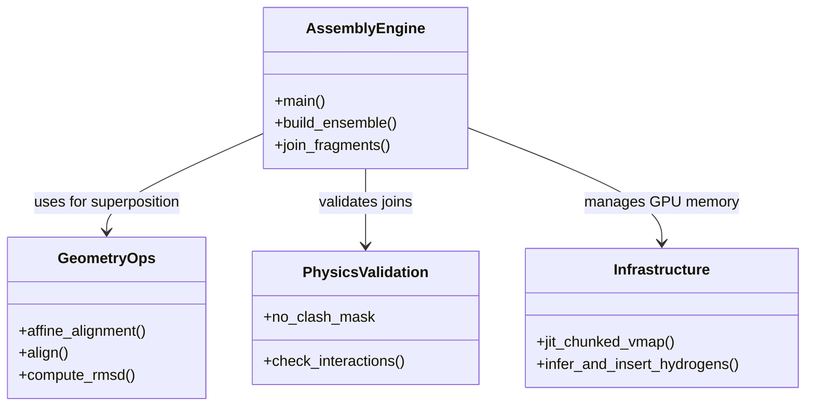

# Fragment Assembly: join\_fragments\.py

> **Relevant source files**
> - [scripts/build\_ensemble\.py](https://github.com/PeptoneLtd/IDP-o/blob/93f72d31/scripts/build_ensemble.py)
> - [scripts/join\_fragments\.py](https://github.com/PeptoneLtd/IDP-o/blob/93f72d31/scripts/join_fragments.py)

 The fragment assembly engine is the final stage of the IDP\-o pipeline\. It takes the individual structural ensembles extracted from the FoldComp database and merges them into a full\-length protein ensemble using a hierarchical power\-of\-two strategy\. The engine utilizes JAX for accelerated affine alignment, steric clash detection, and memory\-efficient batch processing\.

## Overview and Purpose

 The primary goal of `join_fragments.py` is to assemble a coherent ensemble of full\-length structures from overlapping 6\-mer fragments [join\_fragments\.py L1-L13](https://github.com/PeptoneLtd/IDP-o/blob/93f72d31/scripts/join_fragments.py#L1-L13) Because the search space for combinations grows exponentially, the script employs a stochastic sampling approach combined with geometric filtering \(RMSD and steric clashes\) to ensure physical plausibility [join\_fragments\.py L112-L123](https://github.com/PeptoneLtd/IDP-o/blob/93f72d31/scripts/join_fragments.py#L112-L123)

### Key Features

 - **Hierarchical Merging**: Fragments are joined in pairs, then pairs of pairs, reducing the number of assembly steps to $log\_2\(N\)$ [join\_fragments\.py L200-L220](https://github.com/PeptoneLtd/IDP-o/blob/93f72d31/scripts/join_fragments.py#L200-L220)
- **SVD\-based Affine Alignment**: Overlapping residues are aligned using Singular Value Decomposition to find the optimal rotation and translation [join\_fragments\.py L38-L50](https://github.com/PeptoneLtd/IDP-o/blob/93f72d31/scripts/join_fragments.py#L38-L50)
- **JAX Acceleration**: The entire alignment and clash\-detection pipeline is vectorized using `vmap` and `jit` [join\_fragments\.py L121-L179](https://github.com/PeptoneLtd/IDP-o/blob/93f72d31/scripts/join_fragments.py#L121-L179)
- **Steric Filtering**: New joins are rejected if they result in atomic overlaps \(clashes\) or if the overlap RMSD exceeds a threshold [join\_fragments\.py L117-L122](https://github.com/PeptoneLtd/IDP-o/blob/93f72d31/scripts/join_fragments.py#L117-L122)

---

## Assembly Logic and Data Flow

 The assembly follows a "bottom\-up" approach\. Given a set of fragments $F\_1, F\_2, \.\.\., F\_n$, the engine first joins $\(F\_1, F\_2\), \(F\_3, F\_4\)$, etc\., and continues this pattern until a single ensemble remains\.

### Fragment Joining Diagram

 The following diagram illustrates the transition from structural fragments to the final ensemble\.

 "Structural Assembly Data Flow"

  Sources: [join\_fragments\.py L76-L93](https://github.com/PeptoneLtd/IDP-o/blob/93f72d31/scripts/join_fragments.py#L76-L93) [join\_fragments\.py L147-L193](https://github.com/PeptoneLtd/IDP-o/blob/93f72d31/scripts/join_fragments.py#L147-L193) [join\_fragments\.py L200-L220](https://github.com/PeptoneLtd/IDP-o/blob/93f72d31/scripts/join_fragments.py#L200-L220)

---

## Technical Implementation

### 1\. Affine Alignment and Superposition

 When two fragments \(Left and Right\) are joined, they must overlap by exactly 2 residues [join\_fragments\.py L76-L78](https://github.com/PeptoneLtd/IDP-o/blob/93f72d31/scripts/join_fragments.py#L76-L78) The `affine_alignment` function calculates the rotation matrix $R$ and translation vectors to minimize the distance between the overlapping backbone atoms [join\_fragments\.py L38-L50](https://github.com/PeptoneLtd/IDP-o/blob/93f72d31/scripts/join_fragments.py#L38-L50)

 - **Function**: `affine_alignment(geom, ref_geom)` [join\_fragments\.py L38](https://github.com/PeptoneLtd/IDP-o/blob/93f72d31/scripts/join_fragments.py#L38-L38)
- **Logic**: Uses `jnp.linalg.svd` on the covariance matrix of the two geometries\. It includes a check on the determinant of $UV^T$ to handle reflection cases, ensuring a proper rotation matrix [join\_fragments\.py L43-L49](https://github.com/PeptoneLtd/IDP-o/blob/93f72d31/scripts/join_fragments.py#L43-L49)

### 2\. Geometric Filtering

 Each proposed join is subjected to two filters in `_join_fragments`:

 1. **RMSD Filter**: The RMSD of the overlapping residues after alignment must be $< 0\.06$ nm \($0\.6$ Å\) [join\_fragments\.py L122](https://github.com/PeptoneLtd/IDP-o/blob/93f72d31/scripts/join_fragments.py#L122-L122)
2. **Steric Clash Filter**: The `check_interactions` function calculates a distance matrix for all atoms in the new structure\. A clash is defined as any non\-bonded atom pair closer than $0\.1$ nm \($1\.0$ Å\) [join\_fragments\.py L60-L70](https://github.com/PeptoneLtd/IDP-o/blob/93f72d31/scripts/join_fragments.py#L60-L70)

### 3\. Memory Management: Chunked Vmap

 To prevent GPU Out\-of\-Memory \(OOM\) errors when processing thousands of potential joins, the script calculates a dynamic `chunk_size` based on the number of residues [join\_fragments\.py L150-L151](https://github.com/PeptoneLtd/IDP-o/blob/93f72d31/scripts/join_fragments.py#L150-L151)

 - **Function**: `jit_chunked_vmap(f, args, chunk_size)` [join\_fragments\.py L132](https://github.com/PeptoneLtd/IDP-o/blob/93f72d31/scripts/join_fragments.py#L132-L132)
- **Mechanism**: Uses `jax.lax.scan` to iterate through chunks of data, applying the JIT\-compiled assembly function to each chunk sequentially while maintaining vectorization within the chunk [join\_fragments\.py L139-L144](https://github.com/PeptoneLtd/IDP-o/blob/93f72d31/scripts/join_fragments.py#L139-L144)

---

## Component Mapping

 "Code Entity to Assembly Logic Map"

 Sources: [join\_fragments\.py L22-L35](https://github.com/PeptoneLtd/IDP-o/blob/93f72d31/scripts/join_fragments.py#L22-L35) [join\_fragments\.py L38-L73](https://github.com/PeptoneLtd/IDP-o/blob/93f72d31/scripts/join_fragments.py#L38-L73) [join\_fragments\.py L132-L145](https://github.com/PeptoneLtd/IDP-o/blob/93f72d31/scripts/join_fragments.py#L132-L145)

---

## Output Generation

 After the hierarchical assembly is complete, the final ensemble undergoes post\-processing:

 1. **Hydrogen Reconstruction**: Since the FoldComp database primarily stores heavy atoms, `nerfax.reduce_utils.reconstruct_from_mdtraj` is used to place hydrogens [join\_fragments\.py L34](https://github.com/PeptoneLtd/IDP-o/blob/93f72d31/scripts/join_fragments.py#L34-L34) [join\_fragments\.py L245](https://github.com/PeptoneLtd/IDP-o/blob/93f72d31/scripts/join_fragments.py#L245-L245)
2. **RMSD Sorting**: If requested via `--rmsd_sort`, the ensemble is sorted by a distance matrix to group similar structures together, facilitating visualization [build\_ensemble\.py L137-L141](https://github.com/PeptoneLtd/IDP-o/blob/93f72d31/scripts/build_ensemble.py#L137-L141)
3. **Format Conversion**: The internal JAX/NumPy coordinates are converted to an MDTraj `Trajectory` and saved to the user\-specified format \(e\.g\., `.h5`, `.xtc`, `.pdb`\) [join\_fragments\.py L240-L260](https://github.com/PeptoneLtd/IDP-o/blob/93f72d31/scripts/join_fragments.py#L240-L260)

 Sources: [join\_fragments\.py L240-L265](https://github.com/PeptoneLtd/IDP-o/blob/93f72d31/scripts/join_fragments.py#L240-L265) [build\_ensemble\.py L78-L80](https://github.com/PeptoneLtd/IDP-o/blob/93f72d31/scripts/build_ensemble.py#L78-L80)

