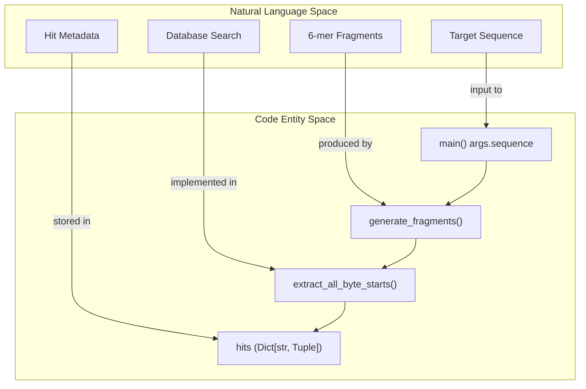
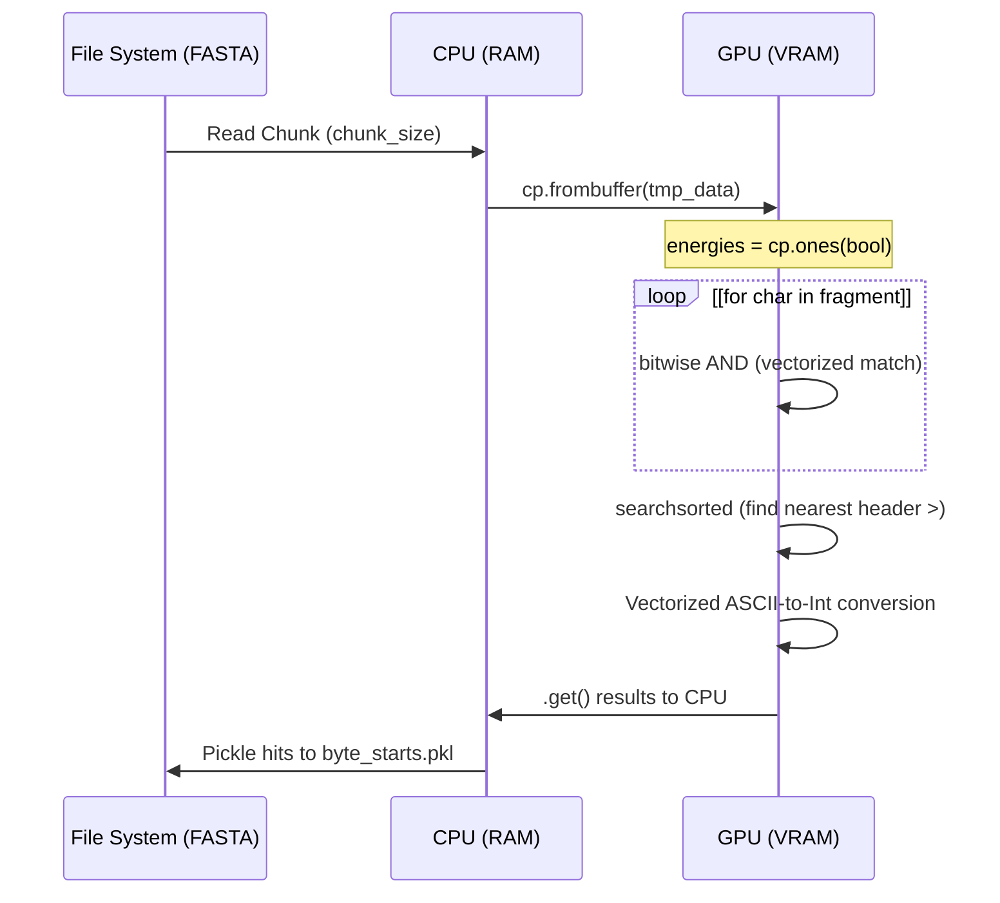

# Fragment Search: fasta\_search\_in\_foldcomp\_database\.py

> **Relevant source files**
> - [scripts/build\_ensemble\.py](https://github.com/PeptoneLtd/IDP-o/blob/93f72d31/scripts/build_ensemble.py)
> - [scripts/fasta\_search\_in\_foldcomp\_database\.py](https://github.com/PeptoneLtd/IDP-o/blob/93f72d31/scripts/fasta_search_in_foldcomp_database.py)

 The `fasta_search_in_foldcomp_database.py` module is a GPU\-accelerated search engine designed to locate structural building blocks within the FoldComp database\. It decomposes a target protein sequence into overlapping k\-mers \(fragments\) and performs a vectorized search across a specialized FASTA file to identify exact matches\. The output is a mapping of fragment sequences to their specific byte offsets within the binary FoldComp database, enabling rapid random\-access extraction of structural coordinates in subsequent pipeline stages\.

### Data Flow and Functional Overview

 The module operates by transforming the search problem into a byte\-stream matching task executed on the GPU via `CuPy`\. It reads the database in large chunks to minimize I/O overhead while maintaining a low memory footprint through a `reduction_factor` subsampling mechanism\.

#### Logical Sequence to Code Entity Mapping

 The following diagram illustrates how the abstract search process is mapped to specific functions and data structures within the script\.

 **Search Logic Mapping**



 **Sources:** `scripts/fasta_search_in_foldcomp_database.py:147-164`

---

### Sequence Fragmentation

 Before searching, the input sequence is divided into overlapping windows\. By default, the system uses a window length \(`seq_len`\) of 6 residues with an `overlap` of 2 residues [fasta\_search\_in\_foldcomp\_database\.py L155](https://github.com/PeptoneLtd/IDP-o/blob/93f72d31/scripts/fasta_search_in_foldcomp_database.py#L155-L155)\.

 - **Function:** `generate_fragments(s, overlap, seq_len)` [fasta\_search\_in\_foldcomp\_database\.py L147-L152](https://github.com/PeptoneLtd/IDP-o/blob/93f72d31/scripts/fasta_search_in_foldcomp_database.py#L147-L152)\.
- **Logic:** It calculates a `shift` \(seq\_len \- overlap\) and iterates through the sequence\. If the final fragment is exactly the length of the overlap, it is discarded to avoid redundant short matches [fasta\_search\_in\_foldcomp\_database\.py L148-L151](https://github.com/PeptoneLtd/IDP-o/blob/93f72d31/scripts/fasta_search_in_foldcomp_database.py#L148-L151)\.

---

### GPU\-Accelerated Search Implementation

 The core search routine, `extract_all_byte_starts`, utilizes `CuPy` to perform parallelized byte comparisons\. This is significantly faster than standard regex or CPU\-based string matching for massive database files like the AFDB\.

#### 1\. Vectorized Byte Matching

 The script encodes fragment sequences into `uint8` arrays [fasta\_search\_in\_foldcomp\_database\.py L26-L27](https://github.com/PeptoneLtd/IDP-o/blob/93f72d31/scripts/fasta_search_in_foldcomp_database.py#L26-L27)\. For every fragment, it initializes a boolean "energy" array \(mask\) on the GPU\. It then iterates through each character position of the fragment, performing a bitwise `AND` across the chunked database bytes to find exact matches [fasta\_search\_in\_foldcomp\_database\.py L92-L95](https://github.com/PeptoneLtd/IDP-o/blob/93f72d31/scripts/fasta_search_in_foldcomp_database.py#L92-L95)\.

#### 2\. Byte\-Start Extraction from Headers

 The FoldComp\-formatted FASTA file contains headers in the format `>ByteOffset\nSequence`\. When a match is found in the sequence portion, the algorithm must "look back" to the nearest `>` character to extract the binary database offset\.

 - **Header Identification:** `cp.flatnonzero(indexs == start_char)` finds all `>` positions [fasta\_search\_in\_foldcomp\_database\.py L85](https://github.com/PeptoneLtd/IDP-o/blob/93f72d31/scripts/fasta_search_in_foldcomp_database.py#L85-L85)\.
- **Offset Parsing:** The script extracts the numeric string following the `>` character\. It converts these byte characters \(ASCII 48\-58\) into a `int64` representation using a vectorized powers\-of\-10 multiplication [fasta\_search\_in\_foldcomp\_database\.py L105-L111](https://github.com/PeptoneLtd/IDP-o/blob/93f72d31/scripts/fasta_search_in_foldcomp_database.py#L105-L111)\.
- **Residue Indexing:** It calculates `aa_start_index`, which is the position of the fragment match relative to the start of that specific protein entry [fasta\_search\_in\_foldcomp\_database\.py L113](https://github.com/PeptoneLtd/IDP-o/blob/93f72d31/scripts/fasta_search_in_foldcomp_database.py#L113-L113)\.

 **Search Execution Flow**



 **Sources:** `scripts/fasta_search_in_foldcomp_database.py:74-121`

---

### Subsampling and Performance

 To handle datasets like the AlphaFold Database \(AFDB\) which contains hundreds of millions of sequences, the module implements a `reduction_factor` [fasta\_search\_in\_foldcomp\_database\.py L44](https://github.com/PeptoneLtd/IDP-o/blob/93f72d31/scripts/fasta_search_in_foldcomp_database.py#L44-L44)\.

| Parameter | Description | Implementation Detail |
| --- | --- | --- |
| chunk\_size | Size of FASTA data loaded into VRAM at once\. | Default: 320,000,000 bytes scripts/fasta\_search\_in\_foldcomp\_database\.py43\. |
| reduction\_factor | Subsampling ratio for the database\. | If set to 100, only 1/100th of the file is read scripts/fasta\_search\_in\_foldcomp\_database\.py65\. |
| nmax\_char\_ints | Max digits in the FoldComp byte offset\. | Used for vectorized integer parsing scripts/fasta\_search\_in\_foldcomp\_database\.py70\. |

---

### Output Format: `byte_starts.pkl`

 The final results are serialized into a Python pickle file\. This file serves as the index for the next stage, `extract_structures_from_foldcomp_database.py`\.

 The dictionary structure is:

```
{    "FRAGMENT_SEQUENCE": (        np.array([hit_idxs]),      # Absolute byte index in FASTA file        np.array([byte_starts]),   # Start byte of entry in FoldComp BINARY file        np.array([aa_start_idx])   # 0-indexed residue position of fragment in entry    )}
```

 **Sources:** `scripts/fasta_search_in_foldcomp_database.py:58-63`, [fasta\_search\_in\_foldcomp\_database\.py L125-L144](https://github.com/PeptoneLtd/IDP-o/blob/93f72d31/scripts/fasta_search_in_foldcomp_database.py#L125-L144)\.

### Integration in Pipeline

 The `main` function of this module is called by the orchestrator `build_ensemble.py` [build\_ensemble\.py L61](https://github.com/PeptoneLtd/IDP-o/blob/93f72d31/scripts/build_ensemble.py#L61-L61)\. It receives the target sequence, the path to the offset\-FASTA file, the output pickle path, and the reduction factor [build\_ensemble\.py L149-L154](https://github.com/PeptoneLtd/IDP-o/blob/93f72d31/scripts/build_ensemble.py#L149-L154)\.

 **Sources:**

 - `scripts/fasta_search_in_foldcomp_database.py`
- `scripts/build_ensemble.py`
