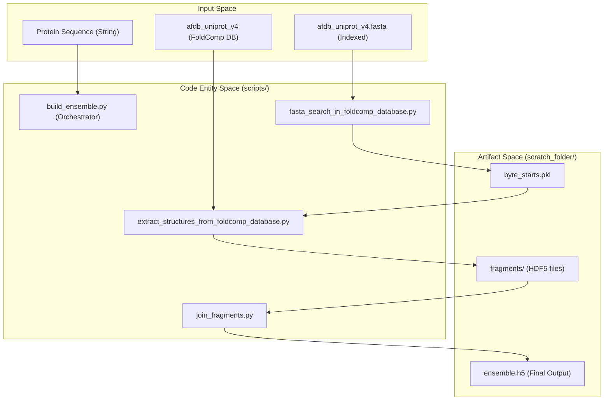
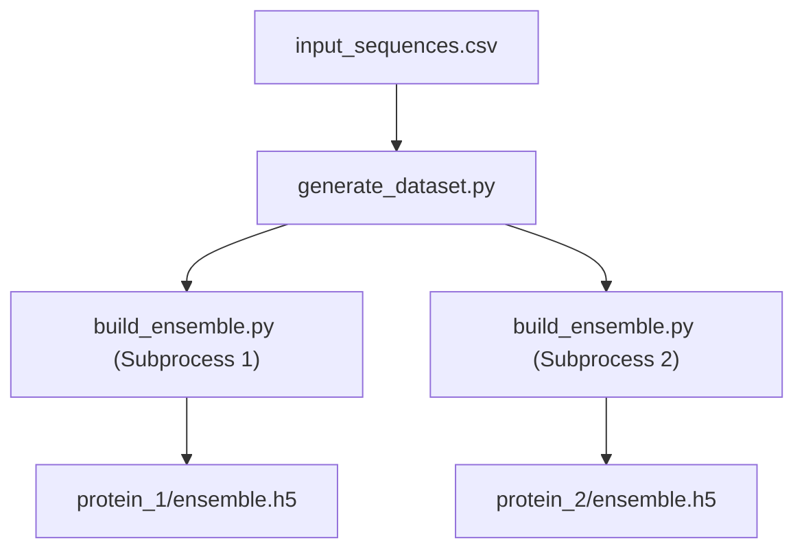

# Getting Started

> **Relevant source files**
> * [.dockerignore](https://github.com/PeptoneLtd/IDP-o/blob/93f72d31/.dockerignore)
> * [.gitignore](https://github.com/PeptoneLtd/IDP-o/blob/93f72d31/.gitignore)
> * [Dockerfile](https://github.com/PeptoneLtd/IDP-o/blob/93f72d31/Dockerfile)
> * [README.md](https://github.com/PeptoneLtd/IDP-o/blob/93f72d31/README.md?plain=1)

This page provides a technical guide for setting up and running IDP-o, a fragment-based ensemble generator for Intrinsically Disordered Proteins (IDPs). The system utilizes a GPU-accelerated pipeline to search for structural fragments within the AlphaFold Database (AFDB) and assembles them into a conformational ensemble.

## System Prerequisites and Environment

IDP-o is designed to run within a containerized environment to manage complex dependencies, including NVIDIA JAX and CuPy for GPU acceleration.

### Docker Image Construction

The project provides a `Dockerfile` based on the NVIDIA JAX runtime. It installs specialized dependencies such as `foldcomp` for structural data handling, `nerfax` for backbone and hydrogen reconstruction, and `cupy-cuda12x` for vectorized sequence searching [Dockerfile L1-L8](https://github.com/PeptoneLtd/IDP-o/blob/93f72d31/Dockerfile#L1-L8)

To build the container:

```markdown
# Clone the repositorygit clone https://github.com/PeptoneLtd/IDP-ocd IDP-o # Build Docker containerdocker build --platform=linux/amd64 . -t idp-o
```

[README.md L14-L21](https://github.com/PeptoneLtd/IDP-o/blob/93f72d31/README.md?plain=1#L14-L21)

### Repository Structure and Exclusions

The repository includes scripts for both single-sequence and batch processing. Local development environments typically exclude large datasets and cache folders via `.gitignore` and `.dockerignore` [.gitignore L168-L173](https://github.com/PeptoneLtd/IDP-o/blob/93f72d31/ .gitignore#L168-L173)

; [.dockerignore L1](https://github.com/PeptoneLtd/IDP-o/blob/93f72d31/.dockerignore#L1-L1)

**Sources:**

* [Dockerfile L1-L8](https://github.com/PeptoneLtd/IDP-o/blob/93f72d31/Dockerfile#L1-L8)
* [README.md L14-L21](https://github.com/PeptoneLtd/IDP-o/blob/93f72d31/README.md?plain=1#L14-L21)
* [.gitignore L168-L172](https://github.com/PeptoneLtd/IDP-o/blob/93f72d31/.gitignore#L168-L172)
* [.dockerignore L1](https://github.com/PeptoneLtd/IDP-o/blob/93f72d31/.dockerignore#L1-L1)

---

## Database Preparation

IDP-o requires the `afdb_uniprot_v4` database in FoldComp format. Because the standard FoldComp distribution does not include the specific byte-offset FASTA headers required for IDP-o's GPU search, a preprocessing step is mandatory.

### Offset-FASTA Format

The required FASTA format uses the byte offset of the structure within the binary FoldComp database as the header identifier:

```
> {offset in bytes in the foldcomp db}{sequence}
```

[README.md L24-L32](https://github.com/PeptoneLtd/IDP-o/blob/93f72d31/README.md?plain=1#L24-L32)

### Automated Setup

The `prepare_foldcomp_fasta.py` script automates the download of the ~1.1 TB database and the generation of the indexed FASTA file [README.md L33-L40](https://github.com/PeptoneLtd/IDP-o/blob/93f72d31/README.md?plain=1#L33-L40)

```
docker run -v $(pwd):/data --entrypoint python idp-o /IDP-o/scripts/prepare_foldcomp_fasta.py --workdir /data
```

[README.md L36](https://github.com/PeptoneLtd/IDP-o/blob/93f72d31/README.md?plain=1#L36-L36)

**Sources:**

* [README.md L24-L40](https://github.com/PeptoneLtd/IDP-o/blob/93f72d31/README.md?plain=1#L24-L40)

---

## Data Flow and Execution

The execution of IDP-o follows a linear pipeline from a raw amino acid sequence to a structural ensemble stored in HDF5 format.

### Entity Mapping: Pipeline Logic

The following diagram maps the logical stages of the ensemble generation to the specific scripts and data artifacts involved in the process.

**IDP-o Execution Data Flow**



**Sources:**

* [README.md L42-L52](https://github.com/PeptoneLtd/IDP-o/blob/93f72d31/README.md?plain=1#L42-L52)
* [Dockerfile L8](https://github.com/PeptoneLtd/IDP-o/blob/93f72d31/Dockerfile#L8-L8)

---

## Minimal End-to-End Example

To generate an ensemble for a single sequence, use the `build_ensemble.py` entrypoint. This script orchestrates the fragmentation (6-mers with 2-residue overlaps), searching, extraction, and assembly [README.md L8](https://github.com/PeptoneLtd/IDP-o/blob/93f72d31/README.md?plain=1#L8-L8)

### Running the Orchestrator

The command below mounts the current directory to `/data` inside the container and executes the pipeline on a single GPU.

```
docker run -v $(pwd):/data --gpus 1 \  idp-o \    --sequence DLIVERANDSANDRDANDCARLDANDMICHELEANDLDHIEANDFADIDANDSTEFANDANDISTVANANDALDERTANDDLIVERAGAINPLASDTHERS \    --outpath /data/example/ensemble.h5 \    --scratch_folder /data/example/ \    --foldcomp_fasta /data/afdb_uniprot_v4.fasta \    --foldcomp_db /data/afdb_uniprot_v4 \    --n_max_structures_per_fragment 100
```

[README.md L43-L52](https://github.com/PeptoneLtd/IDP-o/blob/93f72d31/README.md?plain=1#L43-L52)

### Configuration Parameters

| Parameter | Description |
| --- | --- |
| `--sequence` | The amino acid sequence of the IDP to model. |
| `--outpath` | Path for the final `.h5` ensemble file. |
| `--scratch_folder` | Directory for intermediate files (fragments, byte offsets). |
| `--foldcomp_fasta` | Path to the byte-offset indexed FASTA file created in Step 2. |
| `--foldcomp_db` | Path to the binary FoldComp database files. |
| `--n_max_structures_per_fragment` | Limit on the number of structural matches to keep for each 6-mer. |

**Sources:**

* [README.md L8-L10](https://github.com/PeptoneLtd/IDP-o/blob/93f72d31/README.md?plain=1#L8-L10)
* [README.md L43-L53](https://github.com/PeptoneLtd/IDP-o/blob/93f72d31/README.md?plain=1#L43-L53)

---

## Batch Processing

For large-scale generation (e.g., creating datasets like IDRome-o), the system provides `generate_dataset.py`. This script acts as a wrapper that manages multiple calls to `build_ensemble.py` [README.md L55](https://github.com/PeptoneLtd/IDP-o/blob/93f72d31/README.md?plain=1#L55-L55)

**Batch Workflow Diagram**



**Sources:**

* [README.md L55](https://github.com/PeptoneLtd/IDP-o/blob/93f72d31/README.md?plain=1#L55-L55)