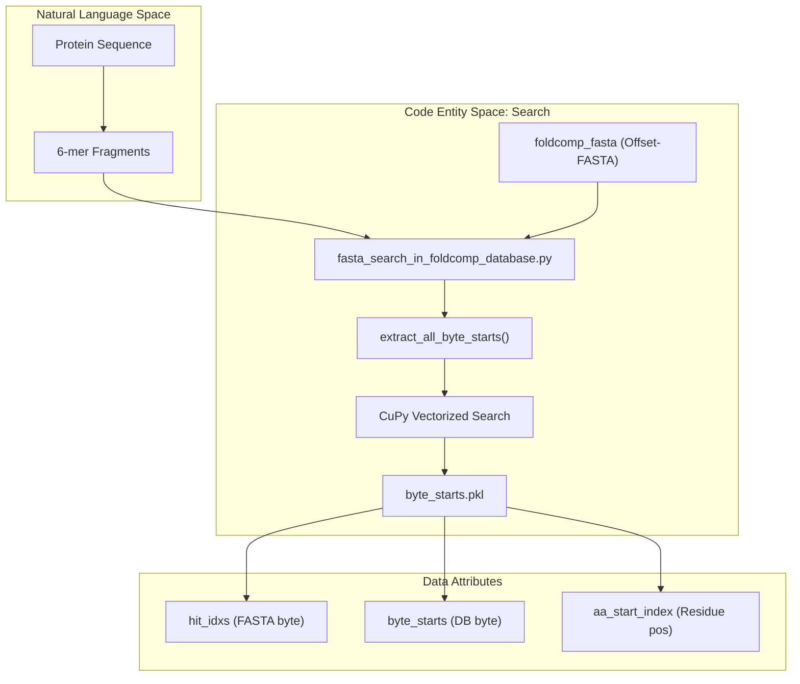
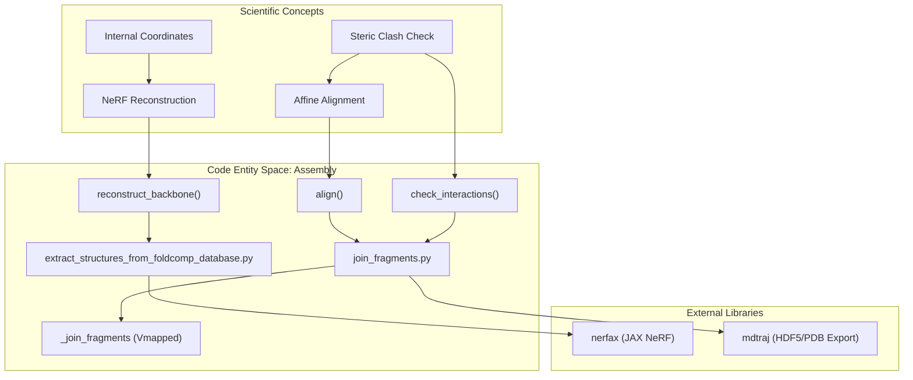

# Glossary

> **Relevant source files**
> * [Dockerfile](https://github.com/PeptoneLtd/IDP-o/blob/93f72d31/Dockerfile)
> * [README.md](https://github.com/PeptoneLtd/IDP-o/blob/93f72d31/README.md?plain=1)
> * [generate_dataset.py](https://github.com/PeptoneLtd/IDP-o/blob/93f72d31/generate_dataset.py)
> * [scripts/build_ensemble.py](https://github.com/PeptoneLtd/IDP-o/blob/93f72d31/scripts/build_ensemble.py)
> * [scripts/extract_structures_from_foldcomp_database.py](https://github.com/PeptoneLtd/IDP-o/blob/93f72d31/scripts/extract_structures_from_foldcomp_database.py)
> * [scripts/fasta_search_in_foldcomp_database.py](https://github.com/PeptoneLtd/IDP-o/blob/93f72d31/scripts/fasta_search_in_foldcomp_database.py)
> * [scripts/join_fragments.py](https://github.com/PeptoneLtd/IDP-o/blob/93f72d31/scripts/join_fragments.py)
> * [scripts/prepare_foldcomp_fasta.py](https://github.com/PeptoneLtd/IDP-o/blob/93f72d31/scripts/prepare_foldcomp_fasta.py)

This page provides definitions for the technical terms, scientific concepts, and codebase-specific identifiers used within the IDP-o project. IDP-o is a tool designed to generate structural ensembles for Intrinsically Disordered Proteins (IDPs) by searching for and assembling 6-mer fragments from the FoldComp database.

---

## Core Pipeline Concepts

### Fragment-Based Assembly

The fundamental strategy of IDP-o where a long, disordered protein sequence is decomposed into overlapping windows (fragments). These fragments are modeled individually by searching for structural matches in high-resolution databases and then stitched back together using affine alignment at the overlap points.

* **Implementation**: Fragments are generated with a default length of 6 residues and an overlap of 2 residues.
* **Key Function**: `generate_fragments` in [scripts/fasta_search_in_foldcomp_database.py L147-L153](https://github.com/PeptoneLtd/IDP-o/blob/93f72d31/scripts/fasta_search_in_foldcomp_database.py#L147-L153)

### Affine Alignment (SVD-based)

A mathematical method used to superimpose two sets of 3D coordinates. In IDP-o, this is used to align the overlapping residues of two adjacent fragments to ensure a continuous backbone. It uses Singular Value Decomposition (SVD) to find the optimal rotation and translation.

* **Implementation**: Uses `jax.numpy.linalg.svd` to calculate the rotation matrix.
* **Key Function**: `affine_alignment` in [scripts/join_fragments.py L38-L50](https://github.com/PeptoneLtd/IDP-o/blob/93f72d31/scripts/join_fragments.py#L38-L50)

### Byte-Offset FASTA

A specialized FASTA file format where the header (the line starting with `>`) contains the exact integer byte offset of that sequence's entry within the binary FoldComp database file. This allows the search module to instantly map a sequence match back to its structural coordinates without secondary lookups.

* **Implementation**: Generated by joining `.index` and `.lookup` files from FoldComp.
* **Key Function**: `create_offset_fasta` in [scripts/prepare_foldcomp_fasta.py L106-L118](https://github.com/PeptoneLtd/IDP-o/blob/93f72d31/scripts/prepare_foldcomp_fasta.py#L106-L118)

### Hierarchical Power-of-Two Merging

The assembly strategy used to join $N$ fragments. Instead of joining fragments sequentially (1+2, then +3, then +4), IDP-o joins them in pairs (1+2, 3+4), then joins those results, forming a binary tree structure. This improves efficiency and reduces cumulative error.

* **Implementation**: Managed within the `build_ensemble` orchestration logic.
* **Key Function**: `build_ensemble` in [scripts/join_fragments.py L195-L200](https://github.com/PeptoneLtd/IDP-o/blob/93f72d31/scripts/join_fragments.py#L195-L200)

---

## Codebase Terminology

| Term | Definition | Code Pointer |
| --- | --- | --- |
| `reduction_factor` | An integer used to subsample the database during search. A factor of 100 means only 1% of the database is searched. | [scripts/fasta_search_in_foldcomp_database.py L44-L45](https://github.com/PeptoneLtd/IDP-o/blob/93f72d31/scripts/fasta_search_in_foldcomp_database.py#L44-L45) |
| `exclude_cis_omega` | A filter that removes structural fragments containing a *cis* peptide bond (omega angle near 0°), which are rare in proteins. | [scripts/build_ensemble.py L131-L135](https://github.com/PeptoneLtd/IDP-o/blob/93f72d31/scripts/build_ensemble.py#L131-L135) |
| `scratch_folder` | A temporary directory used to store intermediate `.pkl` (byte starts) and fragment ensembles before the final join. | [scripts/build_ensemble.py L52-L59](https://github.com/PeptoneLtd/IDP-o/blob/93f72d31/scripts/build_ensemble.py#L52-L59) |
| `jit_chunked_vmap` | A performance optimization using JAX to apply a function over a large batch of data in smaller "chunks" to avoid GPU memory overflow. | [scripts/join_fragments.py L132-L144](https://github.com/PeptoneLtd/IDP-o/blob/93f72d31/scripts/join_fragments.py#L132-L144) |
| `FCMP` | The magic byte header string used to validate the start of a FoldComp binary entry. | [scripts/extract_structures_from_foldcomp_database.py L86](https://github.com/PeptoneLtd/IDP-o/blob/93f72d31/scripts/extract_structures_from_foldcomp_database.py#L86-L86) |

---

## Data Flow & System Entities

The following diagrams illustrate the relationship between high-level concepts and the specific code entities that implement them.

### Diagram 1: Search and Mapping Space

This diagram shows how the `fasta_search_in_foldcomp_database.py` script bridges the gap between raw sequence strings and the binary offsets required for extraction.

**Sources**: [scripts/fasta_search_in_foldcomp_database.py L40-L64](https://github.com/PeptoneLtd/IDP-o/blob/93f72d31/scripts/fasta_search_in_foldcomp_database.py#L40-L64)

 [scripts/fasta_search_in_foldcomp_database.py L155-L165](https://github.com/PeptoneLtd/IDP-o/blob/93f72d31/scripts/fasta_search_in_foldcomp_database.py#L155-L165)

### Diagram 2: Reconstruction and Assembly Space

This diagram maps the scientific process of structural reconstruction to the JAX-based implementation in the codebase.

**Sources**: [scripts/extract_structures_from_foldcomp_database.py L137-L163](https://github.com/PeptoneLtd/IDP-o/blob/93f72d31/scripts/extract_structures_from_foldcomp_database.py#L137-L163)

 [scripts/join_fragments.py L53-L70](https://github.com/PeptoneLtd/IDP-o/blob/93f72d31/scripts/join_fragments.py#L53-L70)

 [scripts/join_fragments.py L96-L123](https://github.com/PeptoneLtd/IDP-o/blob/93f72d31/scripts/join_fragments.py#L96-L123)

---

## Scientific Jargon & Abbreviations

**IDR (Intrinsically Disordered Region)**
Segments of proteins that lack a fixed or ordered three-dimensional structure under physiological conditions. IDP-o is optimized to model these by sampling diverse fragments from the AlphaFold Database (AFDB).

**NeRF (Natural Extension Reference Frame)**
An algorithm used to convert internal coordinates (bond lengths, bond angles, and torsion angles) into Cartesian coordinates (X, Y, Z).

* **Implementation**: Utilizes the `nerfax` library.
* **Reference**: [scripts/extract_structures_from_foldcomp_database.py L30-L31](https://github.com/PeptoneLtd/IDP-o/blob/93f72d31/scripts/extract_structures_from_foldcomp_database.py#L30-L31)

**Omega ($\omega$), Phi ($\phi$), Psi ($\psi$)**
The three primary torsion angles of the protein backbone.

* `Phi` ($\phi$): Rotation around the $N-C\alpha$ bond.
* `Psi` ($\psi$): Rotation around the $C\alpha-C$ bond.
* `Omega` ($\omega$): Rotation around the $C-N$ (peptide) bond.
* **Reference**: [scripts/extract_structures_from_foldcomp_database.py L70-L76](https://github.com/PeptoneLtd/IDP-o/blob/93f72d31/scripts/extract_structures_from_foldcomp_database.py#L70-L76)

**RMSD (Root-Mean-Square Deviation)**
A measure of the average distance between the atoms of superimposed proteins. IDP-o uses RMSD to validate the quality of fragment joins (threshold < 0.06 nm) and to sort the final ensemble.

* **Implementation**: `compute_rmsd` lambda.
* **Reference**: [scripts/join_fragments.py L72](https://github.com/PeptoneLtd/IDP-o/blob/93f72d31/scripts/join_fragments.py#L72-L72)  [scripts/join_fragments.py L122](https://github.com/PeptoneLtd/IDP-o/blob/93f72d31/scripts/join_fragments.py#L122-L122)

**SVD (Singular Value Decomposition)**
A matrix factorization method used here to calculate the optimal rotation matrix for aligning protein fragments.

* **Reference**: [scripts/join_fragments.py L43-L50](https://github.com/PeptoneLtd/IDP-o/blob/93f72d31/scripts/join_fragments.py#L43-L50)

---

**Sources**:

* [scripts/fasta_search_in_foldcomp_database.py L40-L165](https://github.com/PeptoneLtd/IDP-o/blob/93f72d31/scripts/fasta_search_in_foldcomp_database.py#L40-L165)
* [scripts/extract_structures_from_foldcomp_database.py L30-L163](https://github.com/PeptoneLtd/IDP-o/blob/93f72d31/scripts/extract_structures_from_foldcomp_database.py#L30-L163)
* [scripts/join_fragments.py L38-L195](https://github.com/PeptoneLtd/IDP-o/blob/93f72d31/scripts/join_fragments.py#L38-L195)
* [scripts/build_ensemble.py L52-L135](https://github.com/PeptoneLtd/IDP-o/blob/93f72d31/scripts/build_ensemble.py#L52-L135)
* [scripts/prepare_foldcomp_fasta.py L106-L118](https://github.com/PeptoneLtd/IDP-o/blob/93f72d31/scripts/prepare_foldcomp_fasta.py#L106-L118)