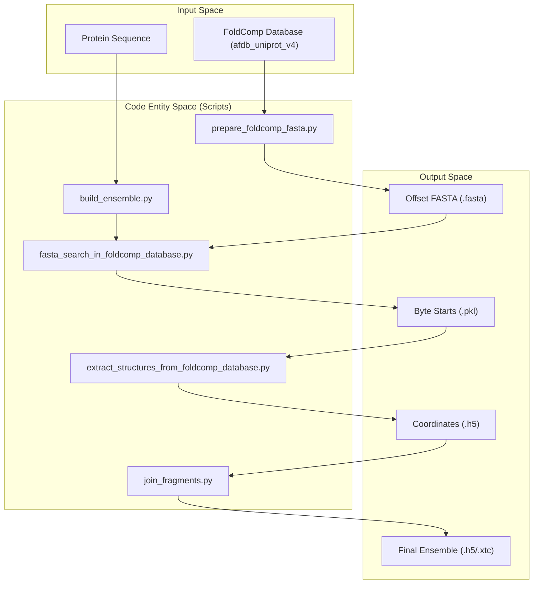
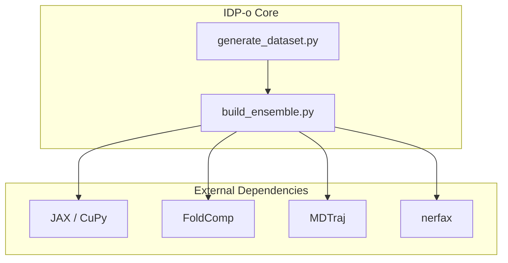

# IDP-o Overview

> **Relevant source files**
> * [LICENSE](https://github.com/PeptoneLtd/IDP-o/blob/93f72d31/LICENSE)
> * [README.md](https://github.com/PeptoneLtd/IDP-o/blob/93f72d31/README.md?plain=1)
> * [assets/idp-o.png](https://github.com/PeptoneLtd/IDP-o/blob/93f72d31/assets/idp-o.png)

IDP-o is a high-level computational framework designed to generate structural ensembles of **Intrinsically Disordered Proteins (IDPs)** using a fragment-based assembly approach. Unlike traditional molecular dynamics or de novo folding, IDP-o leverages the vast structural information in the AlphaFold Protein Structure Database (AFDB) by decomposing target sequences into overlapping fragments, retrieving matching structural hits, and stitching them into physically plausible ensembles.

The system is optimized for performance, utilizing GPU acceleration via **JAX** and **CuPy**, and employs the **FoldComp** format for efficient storage and retrieval of millions of protein structures.

### The IDP-o Workflow

The generation process follows a linear pipeline from raw sequence to a structural ensemble:

1. **Sequence Fragmentation**: The input sequence is cut into 6-residue fragments with a 2-residue overlap [README.md L8](https://github.com/PeptoneLtd/IDP-o/blob/93f72d31/README.md?plain=1#L8-L8)
2. **Database Search**: A GPU-accelerated search identifies matching fragments within the `afdb_uniprot_v4` database [README.md L23-L39](https://github.com/PeptoneLtd/IDP-o/blob/93f72d31/README.md?plain=1#L23-L39)
3. **Structure Extraction**: Coordinates for the identified hits are reconstructed from FoldComp binaries.
4. **Ensemble Assembly**: Fragments are aligned and merged using a hierarchical strategy, filtered for steric clashes, and sorted by RMSD.

For a step-by-step guide on environment setup and running your first ensemble, see [Getting Started](/PeptoneLtd/IDP-o/1.1-getting-started).

### System Architecture and Data Flow

The following diagram illustrates how the natural language concepts of the pipeline map to specific code entities and scripts within the repository.

**IDP-o Pipeline Mapping**

**Sources:** [README.md L36-L52](https://github.com/PeptoneLtd/IDP-o/blob/93f72d31/README.md?plain=1#L36-L52)

 [README.md L8-L10](https://github.com/PeptoneLtd/IDP-o/blob/93f72d31/README.md?plain=1#L8-L10)

### Core Components

IDP-o is organized into specialized scripts that handle distinct phases of the ensemble generation.

| Component | Code Entity | Role |
| --- | --- | --- |
| **Data Preprocessor** | `prepare_foldcomp_fasta.py` | Generates the byte-offset FASTA index required for rapid database lookups [README.md L36](https://github.com/PeptoneLtd/IDP-o/blob/93f72d31/README.md?plain=1#L36-L36) |
| **Search Engine** | `fasta_search_in_foldcomp_database.py` | Performs vectorized 6-mer matching against the database using CuPy. |
| **Structure Reconstructor** | `extract_structures_from_foldcomp_database.py` | Uses JAX and NeRF to convert FoldComp binaries into 3D coordinates. |
| **Assembly Engine** | `join_fragments.py` | Merges fragments using SVD alignment and steric filtering. |
| **Orchestrator** | `build_ensemble.py` | The main CLI that coordinates all stages for a single sequence [README.md L44-L52](https://github.com/PeptoneLtd/IDP-o/blob/93f72d31/README.md?plain=1#L44-L52) |

For a deep dive into the scientific theory, such as NeRF reconstruction and fragment overlaps, see [Key Concepts and Terminology](/PeptoneLtd/IDP-o/1.2-key-concepts-and-terminology).

### Technical Integration

The system is designed to run within a containerized environment to manage complex dependencies like CUDA, JAX, and FoldComp.

**Component Interaction and Dependencies**

**Sources:** [README.md L55](https://github.com/PeptoneLtd/IDP-o/blob/93f72d31/README.md?plain=1#L55-L55)

 [LICENSE L1-L76](https://github.com/PeptoneLtd/IDP-o/blob/93f72d31/LICENSE#L1-L76)

### Licensing and Citation

IDP-o is released under the **Apache License 2.0** [README.md L72-L75](https://github.com/PeptoneLtd/IDP-o/blob/93f72d31/README.md?plain=1#L72-L75)

 If you use this software in your research, please cite the work as described in the [README.md L58-L67](https://github.com/PeptoneLtd/IDP-o/blob/93f72d31/README.md?plain=1#L58-L67)

---

**Next Steps:**

* To install and run the software, visit [Getting Started](/PeptoneLtd/IDP-o/1.1-getting-started).
* To understand the underlying fragment-based methodology, visit [Key Concepts and Terminology](/PeptoneLtd/IDP-o/1.2-key-concepts-and-terminology).