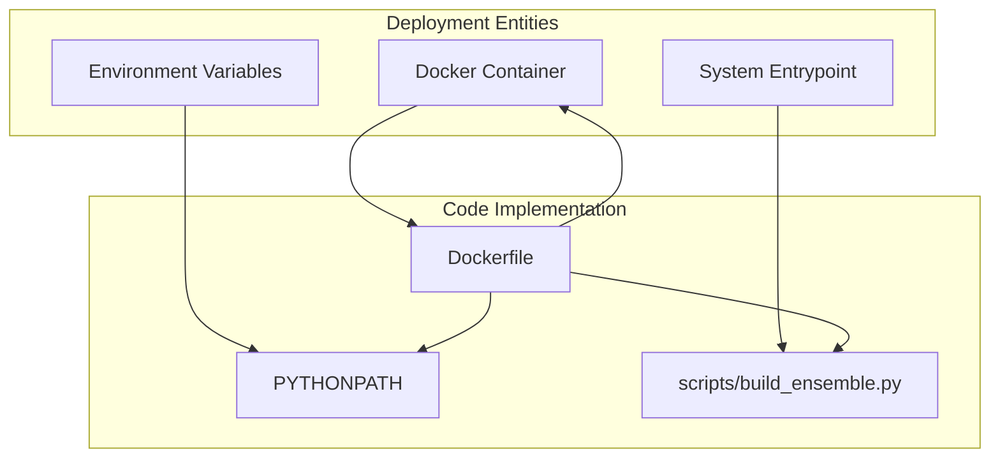
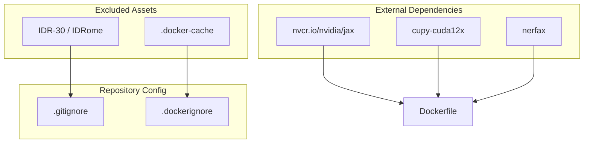

# Infrastructure and Deployment

> **Relevant source files**
> * [.dockerignore](https://github.com/PeptoneLtd/IDP-o/blob/93f72d31/.dockerignore)
> * [.gitignore](https://github.com/PeptoneLtd/IDP-o/blob/93f72d31/.gitignore)
> * [Dockerfile](https://github.com/PeptoneLtd/IDP-o/blob/93f72d31/Dockerfile)

This page provides a high-level overview of the containerized deployment model and the development environment configuration for the IDP-o project. IDP-o is designed to leverage GPU acceleration for both sequence searching and structural assembly, necessitating a specific stack of high-performance computing dependencies.

### Deployment Strategy

IDP-o is deployed primarily as a containerized application to ensure reproducibility across different high-performance computing (HPC) environments. The deployment model focuses on providing a stable environment for JAX-based computations and GPU-accelerated operations.

The core orchestration logic is encapsulated in the `build_ensemble.py` script, which serves as the primary entrypoint for the containerized environment.

For detailed information on the container configuration, see [Docker Container](/PeptoneLtd/IDP-o/4.1-docker-container).

### Dependency Stack

The IDP-o infrastructure relies on a specialized stack of libraries to handle large-scale structural data and accelerated geometric computations:

* **GPU Acceleration:** Utilizes `nvcr.io/nvidia/jax` as the base image to provide a robust JAX environment [Dockerfile L1](https://github.com/PeptoneLtd/IDP-o/blob/93f72d31/Dockerfile#L1-L1)
* **Structural Data Handling:** Uses `foldcomp` for efficient binary structure storage and `nerfax` for JAX-native Natural Extension Reference Frame (NeRF) coordinate reconstruction [Dockerfile L3](https://github.com/PeptoneLtd/IDP-o/blob/93f72d31/Dockerfile#L3-L3)
* **High-Performance Storage:** Employs `tables` (PyTables) for HDF5 ensemble storage and `hirola` for fast hash-table operations [Dockerfile L3](https://github.com/PeptoneLtd/IDP-o/blob/93f72d31/Dockerfile#L3-L3)
* **Vectorized Searching:** Leverages `cupy-cuda12x` for GPU-accelerated byte-stream matching during the fragment search phase [Dockerfile L3](https://github.com/PeptoneLtd/IDP-o/blob/93f72d31/Dockerfile#L3-L3)

### Development and Repository Layout

The repository is structured to separate core logic from execution scripts and assets. It includes configurations for standard Python tooling to maintain code quality and environment consistency.

Key aspects of the development environment include:

* **Source Organization:** A dedicated `scripts/` directory for execution logic and an `assets/` directory for static resources.
* **Environment Management:** Support for standard `venv` or `conda` environments, with a comprehensive `.gitignore` to prevent local artifacts and large datasets (e.g., `IDR-30`, `IDRome`) from being committed [Dockerfile L5](https://github.com/PeptoneLtd/IDP-o/blob/93f72d31/Dockerfile#L5-L5)  [.gitignore L122-L130](https://github.com/PeptoneLtd/IDP-o/blob/93f72d31/.gitignore#L122-L130)  [.gitignore L168-L172](https://github.com/PeptoneLtd/IDP-o/blob/93f72d31/.gitignore#L168-L172)
* **Tooling:** Integration with `pytest` for testing, `mypy` for static type checking, and `Jupyter` for interactive development [.gitignore L51](https://github.com/PeptoneLtd/IDP-o/blob/93f72d31/.gitignore#L51-L51)  [.gitignore L142](https://github.com/PeptoneLtd/IDP-o/blob/93f72d31/.gitignore#L142-L142)  [.gitignore L79](https://github.com/PeptoneLtd/IDP-o/blob/93f72d31/.gitignore#L79-L79)

For details on the repository structure and local setup, see [Development Environment and Repository Layout](/PeptoneLtd/IDP-o/4.2-development-environment-and-repository-layout).

### System Mapping

The following diagrams illustrate the relationship between the conceptual infrastructure components and the specific files or configurations that define them.

#### Infrastructure to Code Mapping

This diagram maps the high-level deployment components to their respective definitions in the codebase.

**Sources:** [Dockerfile L1-L8](https://github.com/PeptoneLtd/IDP-o/blob/93f72d31/Dockerfile#L1-L8)

#### Dependency and Asset Mapping

This diagram shows how external dependencies and local file exclusions are managed within the repository structure.

**Sources:** [Dockerfile L1-L3](https://github.com/PeptoneLtd/IDP-o/blob/93f72d31/Dockerfile#L1-L3)

 [.dockerignore L1](https://github.com/PeptoneLtd/IDP-o/blob/93f72d31/.dockerignore#L1-L1)

 [.gitignore L168-L172](https://github.com/PeptoneLtd/IDP-o/blob/93f72d31/.gitignore#L168-L172)

---

**Sources:**

* [Dockerfile L1-L8](https://github.com/PeptoneLtd/IDP-o/blob/93f72d31/Dockerfile#L1-L8)
* [.gitignore L1-L172](https://github.com/PeptoneLtd/IDP-o/blob/93f72d31/.gitignore#L1-L172)
* [.dockerignore L1](https://github.com/PeptoneLtd/IDP-o/blob/93f72d31/.dockerignore#L1-L1)