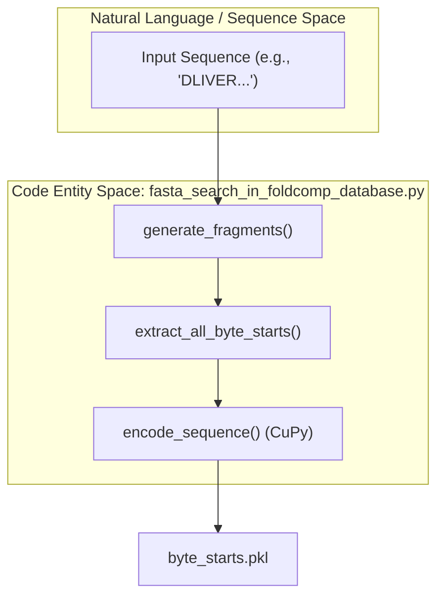
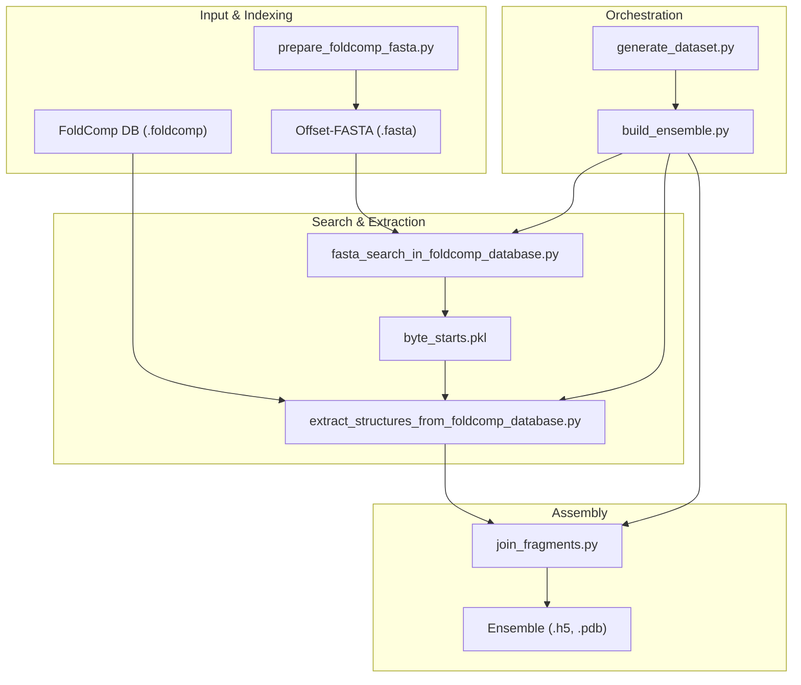

# Key Concepts and Terminology

> **Relevant source files**
> * [README.md](https://github.com/PeptoneLtd/IDP-o/blob/93f72d31/README.md?plain=1)
> * [scripts/build_ensemble.py](https://github.com/PeptoneLtd/IDP-o/blob/93f72d31/scripts/build_ensemble.py)
> * [scripts/fasta_search_in_foldcomp_database.py](https://github.com/PeptoneLtd/IDP-o/blob/93f72d31/scripts/fasta_search_in_foldcomp_database.py)

This page explains the core scientific and engineering concepts underpinning the IDP-o pipeline. It serves as a technical primer for understanding how Intrinsically Disordered Proteins (IDPs) are modeled through fragment-based assembly, how large-scale structural data is indexed via byte-offsets, and the specific data formats like FoldComp that enable GPU-accelerated ensemble generation.

## 1. Intrinsically Disordered Proteins (IDPs)

Intrinsically Disordered Proteins (IDPs) are proteins that lack a fixed or ordered three-dimensional structure under physiological conditions. Unlike globular proteins, IDPs exist as dynamic ensembles of interconverting conformations.

IDP-o models these proteins by sampling structural fragments from known protein structures (e.g., the AlphaFold Database) and stitching them together. This approach assumes that the local conformational preferences of IDRs (Intrinsically Disordered Regions) can be represented by short structural motifs found across the protein universe [README.md L8-L10](https://github.com/PeptoneLtd/IDP-o/blob/93f72d31/README.md?plain=1#L8-L10)

## 2. Fragment-Based Assembly

The core algorithm of IDP-o relies on a "divide and conquer" strategy for ensemble generation.

* **Fragmentation**: The input sequence is cut into overlapping fragments. By default, IDP-o uses **6-mer** fragments with a **2-residue overlap** [README.md L8](https://github.com/PeptoneLtd/IDP-o/blob/93f72d31/README.md?plain=1#L8-L8)  [scripts/fasta_search_in_foldcomp_database.py L155-L156](https://github.com/PeptoneLtd/IDP-o/blob/93f72d31/scripts/fasta_search_in_foldcomp_database.py#L155-L156)
* **Search**: Each 6-mer is searched against a massive database of known structures to find exact sequence matches [scripts/fasta_search_in_foldcomp_database.py L88-L95](https://github.com/PeptoneLtd/IDP-o/blob/93f72d31/scripts/fasta_search_in_foldcomp_database.py#L88-L95)
* **Assembly**: Fragments are joined using the overlapping residues. The pipeline uses a hierarchical power-of-two merging strategy, performing SVD-based affine alignment on the overlapping alpha-carbons to ensure structural continuity.

### Fragment Data Flow

The following diagram illustrates how a sequence is transformed into fragments and then indexed for structural extraction.

**Fragment Generation and Search Logic**

**Sources:** [scripts/fasta_search_in_foldcomp_database.py L26-L28](https://github.com/PeptoneLtd/IDP-o/blob/93f72d31/scripts/fasta_search_in_foldcomp_database.py#L26-L28)

 [scripts/fasta_search_in_foldcomp_database.py L147-L152](https://github.com/PeptoneLtd/IDP-o/blob/93f72d31/scripts/fasta_search_in_foldcomp_database.py#L147-L152)

 [scripts/fasta_search_in_foldcomp_database.py L155-L165](https://github.com/PeptoneLtd/IDP-o/blob/93f72d31/scripts/fasta_search_in_foldcomp_database.py#L155-L165)

## 3. FoldComp and Byte-Offset Indexing

To handle the terabyte-scale AlphaFold Database (AFDB), IDP-o utilizes the **FoldComp** format. FoldComp compresses protein structures by storing backbone torsion angles in a discretized binary format rather than full Cartesian coordinates.

### The "Offset-FASTA" Format

Standard FASTA files do not provide random access to structural data. IDP-o requires a specially formatted FASTA file where the header for each sequence contains the **byte-offset** of its corresponding entry in the binary FoldComp database (`.foldcomp` file) [README.md L24-L32](https://github.com/PeptoneLtd/IDP-o/blob/93f72d31/README.md?plain=1#L24-L32)

| FASTA Header | Sequence | Description |
| --- | --- | --- |
| `>677` | `LPYPAH...` | Entry starts at byte 677 in the FoldComp binary. |
| `>1402` | `MDLSKV...` | Entry starts at byte 1402 in the FoldComp binary. |

This allows the search module (`fasta_search_in_foldcomp_database.py`) to identify a sequence match and immediately determine exactly where to read the structural data in the multi-terabyte database without scanning the whole file [scripts/fasta_search_in_foldcomp_database.py L105-L114](https://github.com/PeptoneLtd/IDP-o/blob/93f72d31/scripts/fasta_search_in_foldcomp_database.py#L105-L114)

**Sources:** [README.md L33-L39](https://github.com/PeptoneLtd/IDP-o/blob/93f72d31/README.md?plain=1#L33-L39)

 [scripts/build_ensemble.py L92-L101](https://github.com/PeptoneLtd/IDP-o/blob/93f72d31/scripts/build_ensemble.py#L92-L101)

 [scripts/fasta_search_in_foldcomp_database.py L48-L57](https://github.com/PeptoneLtd/IDP-o/blob/93f72d31/scripts/fasta_search_in_foldcomp_database.py#L48-L57)

## 4. Engineering Concepts

### GPU-Accelerated Search

The search for 6-mer fragments is performed using **CuPy**. The pipeline loads chunks of the Offset-FASTA into GPU memory and uses vectorized byte-stream matching to find occurrences of the fragment sequences [scripts/fasta_search_in_foldcomp_database.py L70-L95](https://github.com/PeptoneLtd/IDP-o/blob/93f72d31/scripts/fasta_search_in_foldcomp_database.py#L70-L95)

### Reduction Factor

Given the size of the AFDB (Uniprot v4 is ~1.1 TB), searching the entire database for every fragment can be time-consuming. The `reduction_factor` parameter allows users to search only a fraction (e.g., 1/10th or 1/100th) of the database to speed up the process while still obtaining a representative ensemble [scripts/build_ensemble.py L122-L127](https://github.com/PeptoneLtd/IDP-o/blob/93f72d31/scripts/build_ensemble.py#L122-L127)

 [scripts/fasta_search_in_foldcomp_database.py L65-L67](https://github.com/PeptoneLtd/IDP-o/blob/93f72d31/scripts/fasta_search_in_foldcomp_database.py#L65-L67)

### IDRome-o

**IDRome-o** is a pre-generated dataset created using this pipeline. It contains ensembles for a vast array of intrinsically disordered proteins, serving as a benchmark for the "order-disorder continuum" in structural biology [README.md L55-L56](https://github.com/PeptoneLtd/IDP-o/blob/93f72d31/README.md?plain=1#L55-L56)

## 5. System Integration Diagram

The following diagram maps the high-level concepts to the specific script entrypoints and data artifacts.

**Pipeline Component Mapping**

**Sources:** [scripts/build_ensemble.py L60-L80](https://github.com/PeptoneLtd/IDP-o/blob/93f72d31/scripts/build_ensemble.py#L60-L80)

 [scripts/build_ensemble.py L145-L161](https://github.com/PeptoneLtd/IDP-o/blob/93f72d31/scripts/build_ensemble.py#L145-L161)

 [README.md L55-L56](https://github.com/PeptoneLtd/IDP-o/blob/93f72d31/README.md?plain=1#L55-L56)