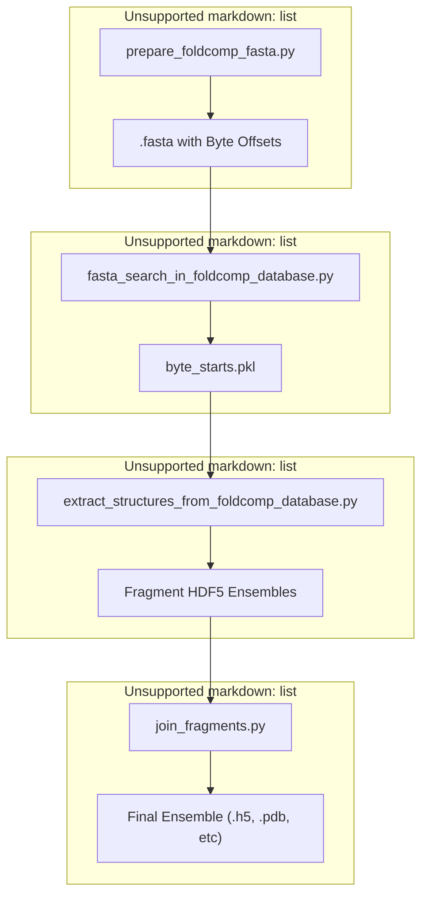
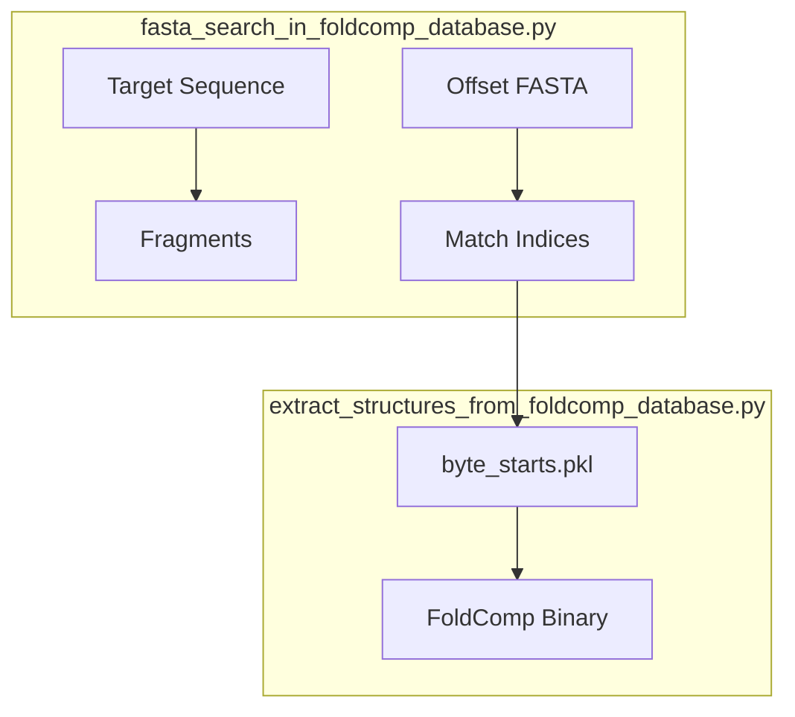

# Pipeline Architecture

> **Relevant source files**
> * [README.md](https://github.com/PeptoneLtd/IDP-o/blob/93f72d31/README.md?plain=1)
> * [scripts/build_ensemble.py](https://github.com/PeptoneLtd/IDP-o/blob/93f72d31/scripts/build_ensemble.py)

The IDP-o pipeline is a four-stage process designed to generate structural ensembles for Intrinsically Disordered Proteins (IDPs) by leveraging fragment-based assembly from the AlphaFold Database (AFDB). The pipeline transitions from raw sequence data to a fully reconstructed 3D ensemble by decomposing sequences into overlapping 6-mer fragments, searching a massive structural database, and stochastically assembling the results.

### High-Level Workflow

The orchestration of the pipeline is handled by `scripts/build_ensemble.py`, which sequentially invokes the three primary computational modules after ensuring the database is prepared [scripts/build_ensemble.py L60-L80](https://github.com/PeptoneLtd/IDP-o/blob/93f72d31/scripts/build_ensemble.py#L60-L80)

#### Pipeline Overview

**Sources:** [scripts/build_ensemble.py L25-L81](https://github.com/PeptoneLtd/IDP-o/blob/93f72d31/scripts/build_ensemble.py#L25-L81)

 [README.md L8-L10](https://github.com/PeptoneLtd/IDP-o/blob/93f72d31/README.md?plain=1#L8-L10)

---

### 1. Database Preparation

Before running searches, the system requires a specialized FASTA index of the FoldComp database. This index includes the byte-offset for each sequence within the binary FoldComp database file, allowing for rapid random access during extraction.

* **Primary Script:** `prepare_foldcomp_fasta.py`
* **Key Artifacts:** `afdb_uniprot_v4.fasta` (containing `>byte_offset` headers).
* **Role:** Downloads `afdb_uniprot_v4` and synchronizes the `.index` and `.lookup` files to map sequences to their binary locations [README.md L23-L39](https://github.com/PeptoneLtd/IDP-o/blob/93f72d31/README.md?plain=1#L23-L39)

For details, see [Database Preparation: prepare_foldcomp_fasta.py](/PeptoneLtd/IDP-o/2.1-database-preparation:-prepare_foldcomp_fasta.py).

---

### 2. Fragment Search

The sequence of interest is cut into overlapping 6-mer fragments. A GPU-accelerated search scans the indexed FASTA file to find all occurrences of these fragments across the entire AFDB.

* **Primary Script:** `fasta_search_in_foldcomp_database.py`
* **Key Artifacts:** `byte_starts.pkl` [scripts/build_ensemble.py L55](https://github.com/PeptoneLtd/IDP-o/blob/93f72d31/scripts/build_ensemble.py#L55-L55)
* **Role:** Uses CuPy-based vectorized matching to identify sequence hits and records the starting byte position of the parent protein in the FoldComp database [scripts/build_ensemble.py L61](https://github.com/PeptoneLtd/IDP-o/blob/93f72d31/scripts/build_ensemble.py#L61-L61)

For details, see [Fragment Search: fasta_search_in_foldcomp_database.py](/PeptoneLtd/IDP-o/2.2-fragment-search:-fasta_search_in_foldcomp_database.py).

#### Data Flow: Search to Extraction

**Sources:** [scripts/build_ensemble.py L60-L70](https://github.com/PeptoneLtd/IDP-o/blob/93f72d31/scripts/build_ensemble.py#L60-L70)

 [README.md L24-L32](https://github.com/PeptoneLtd/IDP-o/blob/93f72d31/README.md?plain=1#L24-L32)

---

### 3. Structure Extraction

Once the locations of matching sequences are known, the pipeline extracts the specific 3D coordinates for those fragments.

* **Primary Script:** `extract_structures_from_foldcomp_database.py`
* **Key Artifacts:** `fragment_ensembles/` directory containing HDF5 files for each fragment [scripts/build_ensemble.py L52-L54](https://github.com/PeptoneLtd/IDP-o/blob/93f72d31/scripts/build_ensemble.py#L52-L54)
* **Role:** Parses FoldComp binaries, de-quantizes torsion angles, and reconstructs backbone coordinates using JAX-accelerated NeRF (Natural Extension Reference Frame) [scripts/build_ensemble.py L62-L70](https://github.com/PeptoneLtd/IDP-o/blob/93f72d31/scripts/build_ensemble.py#L62-L70)  It can optionally filter out `cis-omega` angles [scripts/build_ensemble.py L131-L135](https://github.com/PeptoneLtd/IDP-o/blob/93f72d31/scripts/build_ensemble.py#L131-L135)

For details, see [Structure Extraction: extract_structures_from_foldcomp_database.py](/PeptoneLtd/IDP-o/2.3-structure-extraction:-extract_structures_from_foldcomp_database.py).

---

### 4. Fragment Assembly

The final stage stochastically joins the extracted fragments into full-length protein configurations.

* **Primary Script:** `join_fragments.py`
* **Key Artifacts:** Final ensemble file (e.g., `ensemble.h5`, `ensemble.pdb`) [scripts/build_ensemble.py L116-L119](https://github.com/PeptoneLtd/IDP-o/blob/93f72d31/scripts/build_ensemble.py#L116-L119)
* **Role:** Uses a hierarchical merging strategy to align overlapping residues via SVD-based affine transformations. It filters for steric clashes and can sort the resulting ensemble by RMSD for better visualization [scripts/build_ensemble.py L72-L80](https://github.com/PeptoneLtd/IDP-o/blob/93f72d31/scripts/build_ensemble.py#L72-L80)  [scripts/build_ensemble.py L137-L141](https://github.com/PeptoneLtd/IDP-o/blob/93f72d31/scripts/build_ensemble.py#L137-L141)

For details, see [Fragment Assembly: join_fragments.py](/PeptoneLtd/IDP-o/2.4-fragment-assembly:-join_fragments.py).

---

### Filesystem and Data Flow Summary

The pipeline relies on a `scratch_folder` to pass data between stages.

| Stage | Input | Output | Code Entity |
| --- | --- | --- | --- |
| **Preparation** | AFDB FoldComp | `afdb_uniprot_v4.fasta` | `prepare_foldcomp_fasta.py` |
| **Search** | Sequence + FASTA | `byte_starts.pkl` | `fasta_search_in_foldcomp_database.py` |
| **Extraction** | `byte_starts.pkl` + FoldComp DB | `fragment_ensembles/*.h5` | `extract_structures_from_foldcomp_database.py` |
| **Assembly** | `fragment_ensembles/` | `ensemble.h5` | `join_fragments.py` |

**Sources:** [scripts/build_ensemble.py L25-L80](https://github.com/PeptoneLtd/IDP-o/blob/93f72d31/scripts/build_ensemble.py#L25-L80)

 [README.md L43-L52](https://github.com/PeptoneLtd/IDP-o/blob/93f72d31/README.md?plain=1#L43-L52)