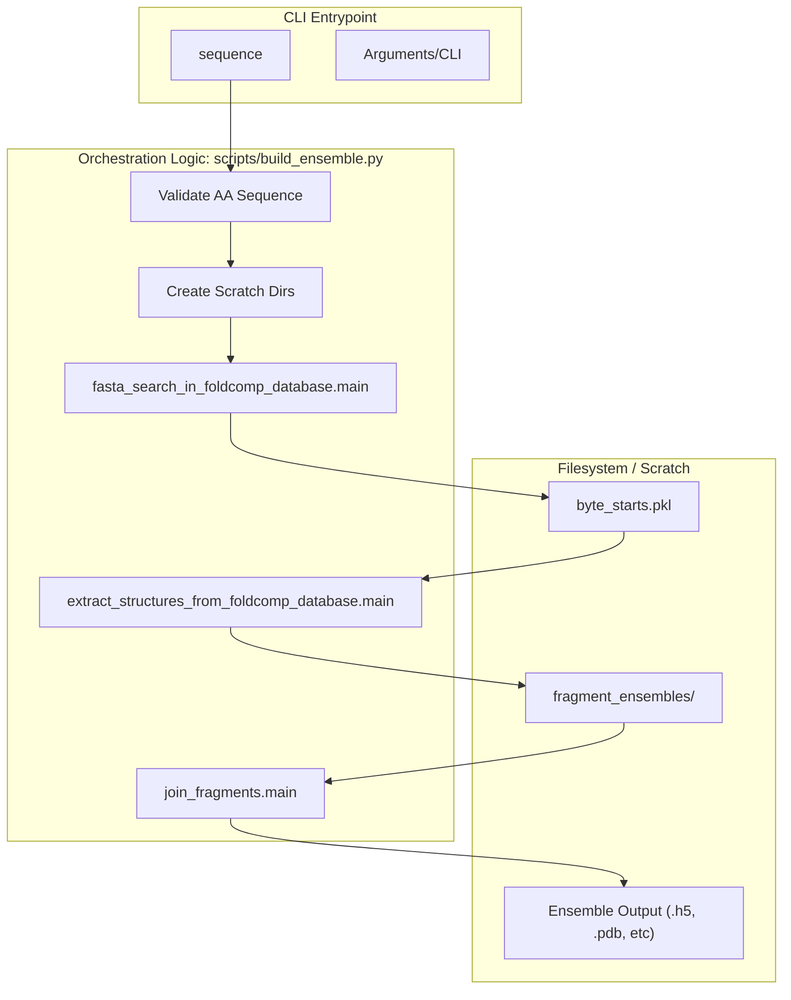
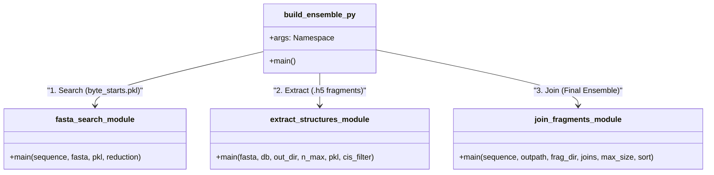

# Single\-Sequence Ensemble Builder: build\_ensemble\.py

> **Relevant source files**
> - [README\.md](https://github.com/PeptoneLtd/IDP-o/blob/93f72d31/README.md?plain=1)
> - [scripts/build\_ensemble\.py](https://github.com/PeptoneLtd/IDP-o/blob/93f72d31/scripts/build_ensemble.py)

 The `build_ensemble.py` script serves as the primary command\-line interface \(CLI\) and orchestration engine for the IDP\-o pipeline\. It manages the end\-to\-end workflow of transforming a single protein sequence into a structural ensemble by coordinating three specialized sub\-modules: fragment searching, structure extraction, and fragment assembly [build\_ensemble\.py L20-L22](https://github.com/PeptoneLtd/IDP-o/blob/93f72d31/scripts/build_ensemble.py#L20-L22)

## Purpose and Scope

 The builder automates the fragment\-based assembly approach, which cuts a protein sequence into overlapping 6\-mer fragments, retrieves matching structural configurations from the AlphaFold Database \(via FoldComp\), and stitches them together [README\.md?plain=1 L8-L10](https://github.com/PeptoneLtd/IDP-o/blob/93f72d31/README.md?plain=1#L8-L10) It handles environment setup, intermediate file management in a scratch directory, and final ensemble serialization into multiple user\-defined formats\.

## CLI Reference

 The script is executed via `python scripts/build_ensemble.py` or through the provided Docker entrypoint [README\.md?plain=1 L44-L52](https://github.com/PeptoneLtd/IDP-o/blob/93f72d31/README.md?plain=1#L44-L52)

### Arguments

| Argument | Type | Default | Description |
| --- | --- | --- | --- |
| \-\-sequence | str | Required | The amino acid sequence of the protein to model\. |
| \-\-foldcomp\_fasta | str | /data/afdb/afdb\_uniprot\_v4\.fasta | Path to the byte\-offset indexed FASTA file scripts/build\_ensemble\.py93\-103 |
| \-\-foldcomp\_db | str | /data/afdb/afdb\_uniprot\_v4 | Path to the FoldComp binary database file scripts/build\_ensemble\.py105\-108 |
| \-\-outpath | str | Required | Path for the final ensemble\. Supported: \.h5, \.xtc, \.dcd, \.pdb, \.pdb\.gz scripts/build\_ensemble\.py116\-119 |
| \-\-scratch\_folder | str | /tmp | Directory for intermediate \.pkl and fragment \.h5 files scripts/build\_ensemble\.py120 |
| \-\-n\_max\_structures\_per\_fragment | int | 1000 | Maximum structural matches to extract for each 6\-mer scripts/build\_ensemble\.py110\-114 |
| \-\-reduction\_factor | int | 1 | Subsampling factor for the database search \(e\.g\., 10 searches 1/10th of the DB\) scripts/build\_ensemble\.py122\-127 |
| \-\-joins\_to\_attempt\_per\_pairing | int | 500000 | Budget for stochastic fragment joining attempts scripts/build\_ensemble\.py128 |
| \-\-max\_structures\_in\_ensemble | int | 100 | Final number of full\-length structures to retain scripts/build\_ensemble\.py129 |
| \-\-exclude\_cis\_omega | bool | False | If set, filters out fragments containing cis peptide bonds scripts/build\_ensemble\.py131\-135 |
| \-\-rmsd\_sort | bool | False | If set, sorts the final ensemble by RMSD for smoother visualization scripts/build\_ensemble\.py137\-141 |
| \-\-overwrite | bool | False | Overwrite existing output files scripts/build\_ensemble\.py142 |

 **Sources:** [build\_ensemble\.py L87-L143](https://github.com/PeptoneLtd/IDP-o/blob/93f72d31/scripts/build_ensemble.py#L87-L143)

## Orchestration Logic

 The `main` function in `build_ensemble.py` acts as a controller that sequences the execution of the three core pipeline stages\.

### Data Flow Diagram

 The following diagram illustrates how the `build_ensemble.py` `main` function orchestrates the flow of data between the sub\-modules and the filesystem\.

 "build\_ensemble\.py Execution Flow"

 **Sources:** [build\_ensemble\.py L25-L80](https://github.com/PeptoneLtd/IDP-o/blob/93f72d31/scripts/build_ensemble.py#L25-L80)

### Logic Steps

 1. **Validation**: Checks if the sequence contains only standard amino acids [build\_ensemble\.py L47-L50](https://github.com/PeptoneLtd/IDP-o/blob/93f72d31/scripts/build_ensemble.py#L47-L50)
2. **Filesystem Preparation**: Creates the `scratch_folder` and a sub\-directory for fragment ensembles \(optionally named `fragment_ensembles-exclude_cis_omega` if filtering is enabled\) [build\_ensemble\.py L52-L59](https://github.com/PeptoneLtd/IDP-o/blob/93f72d31/scripts/build_ensemble.py#L52-L59)
3. **Search Stage**: Invokes the GPU\-accelerated search to find occurrences of 6\-mers in the database, producing `byte_starts.pkl` [build\_ensemble\.py L61](https://github.com/PeptoneLtd/IDP-o/blob/93f72d31/scripts/build_ensemble.py#L61-L61)
4. **Extraction Stage**: Reads the FoldComp binary database using the byte offsets and reconstructs 3D coordinates for each fragment, saving them as individual HDF5 files in the fragment directory [build\_ensemble\.py L63-L70](https://github.com/PeptoneLtd/IDP-o/blob/93f72d31/scripts/build_ensemble.py#L63-L70)
5. **Assembly Stage**: Merges the fragments into full\-length structures using alignment and steric filtering, then writes the final ensemble to the requested `outpath` [build\_ensemble\.py L72-L80](https://github.com/PeptoneLtd/IDP-o/blob/93f72d31/scripts/build_ensemble.py#L72-L80)

## System Entity Mapping

 This diagram maps the high\-level functional stages to the specific Python modules and their primary outputs\.

 "Code Entity Mapping"

 **Sources:** [build\_ensemble\.py L20-L22](https://github.com/PeptoneLtd/IDP-o/blob/93f72d31/scripts/build_ensemble.py#L20-L22) [build\_ensemble\.py L61-L80](https://github.com/PeptoneLtd/IDP-o/blob/93f72d31/scripts/build_ensemble.py#L61-L80)

## Output Formats and Error Handling

### Supported Formats

 The final ensemble is serialized using MDTraj, supporting several formats based on the extension provided in `--outpath` [build\_ensemble\.py L116-L119](https://github.com/PeptoneLtd/IDP-o/blob/93f72d31/scripts/build_ensemble.py#L116-L119):

 - **HDF5 \(\.h5\)**: Recommended for large ensembles; preserves all metadata\.
- **Trajectories**: `.xtc` \(GROMACS\), `.dcd` \(CHARMM/NAMD\)\.
- **PDB**: `.pdb` or compressed `.pdb.gz`\.

### Error Handling

 The script implements a global `try-except` block to capture and log failures during any stage of the pipeline [build\_ensemble\.py L163-L166](https://github.com/PeptoneLtd/IDP-o/blob/93f72d31/scripts/build_ensemble.py#L163-L166)

 - **Pre\-existing Files**: If the output file exists, the script will log a warning and exit unless `--overwrite` is specified [build\_ensemble\.py L40-L45](https://github.com/PeptoneLtd/IDP-o/blob/93f72d31/scripts/build_ensemble.py#L40-L45)
- **Invalid Sequences**: Raises a `ValueError` if non\-standard amino acids are detected [build\_ensemble\.py L49-L50](https://github.com/PeptoneLtd/IDP-o/blob/93f72d31/scripts/build_ensemble.py#L49-L50)
- **Tracebacks**: Full stack traces are logged to `stderr` to facilitate debugging of GPU/JAX\-related failures in sub\-modules [build\_ensemble\.py L164-L165](https://github.com/PeptoneLtd/IDP-o/blob/93f72d31/scripts/build_ensemble.py#L164-L165)

 **Sources:** [build\_ensemble\.py L40-L51](https://github.com/PeptoneLtd/IDP-o/blob/93f72d31/scripts/build_ensemble.py#L40-L51) [build\_ensemble\.py L163-L166](https://github.com/PeptoneLtd/IDP-o/blob/93f72d31/scripts/build_ensemble.py#L163-L166)
