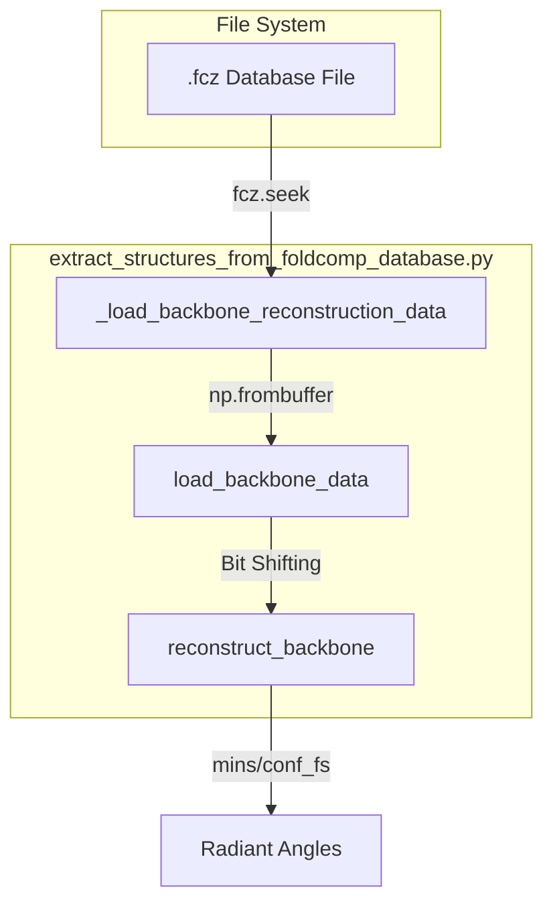

# Structure Extraction: extract\_structures\_from\_foldcomp\_database\.py

> **Relevant source files**
> - [Dockerfile](https://github.com/PeptoneLtd/IDP-o/blob/93f72d31/Dockerfile)
> - [scripts/extract\_structures\_from\_foldcomp\_database\.py](https://github.com/PeptoneLtd/IDP-o/blob/93f72d31/scripts/extract_structures_from_foldcomp_database.py)

 This module is responsible for extracting atomic coordinates from the binary FoldComp database based on sequence match indices\. It implements a high\-performance reconstruction engine using JAX to de\-quantize torsion angles and compute 3D Cartesian coordinates via the Natural Extension Reference Frame \(NeRF\) algorithm\.

## Purpose and Scope

 The `extract_structures_from_foldcomp_database.py` script serves as the bridge between compressed binary structural data and standard molecular trajectory formats\. It parses `.fcz` files, performs discretized torsion de\-quantization, reconstructs backbone and sidechain atoms, and filters fragments based on physical constraints \(e\.g\., cis\-omega bonds\)\. The final output is an HDF5 file containing the extracted structural ensemble\.

## FCMP Binary Parsing

 FoldComp files \(`.fcz`\) store protein structures in a highly compressed format\. This script manually parses the binary stream to extract the necessary discretizers and quantized angles\.

### Binary Header Structure

 The script identifies the start of a record by searching for the `b'FCMP'` tag [extract\_structures\_from\_foldcomp\_database\.py L86](https://github.com/PeptoneLtd/IDP-o/blob/93f72d31/scripts/extract_structures_from_foldcomp_database.py#L86-L86) It then extracts metadata including the number of residues, anchors, and the title length to calculate the exact byte offsets for backbone and sidechain data [extract\_structures\_from\_foldcomp\_database\.py L88-L96](https://github.com/PeptoneLtd/IDP-o/blob/93f72d31/scripts/extract_structures_from_foldcomp_database.py#L88-L96)

### Torsion De\-quantization

 Backbone data is stored as 8\-byte blocks per residue [extract\_structures\_from\_foldcomp\_database\.py L67](https://github.com/PeptoneLtd/IDP-o/blob/93f72d31/scripts/extract_structures_from_foldcomp_database.py#L67-L67) The script performs bit\-shifting to recover the 12\-bit quantized values for $\\phi, \\psi, \\omega$ and the three backbone bond angles [extract\_structures\_from\_foldcomp\_database\.py L70-L76](https://github.com/PeptoneLtd/IDP-o/blob/93f72d31/scripts/extract_structures_from_foldcomp_database.py#L70-L76) These are de\-quantized using `mainChainAnglesTorsionsDicretizers` [extract\_structures\_from\_foldcomp\_database\.py L142](https://github.com/PeptoneLtd/IDP-o/blob/93f72d31/scripts/extract_structures_from_foldcomp_database.py#L142-L142)

### Data Extraction Flow

 The following diagram illustrates the transition from the binary file to de\-quantized internal coordinates\.

 **FoldComp Binary Parsing Flow**



 Sources: [extract\_structures\_from\_foldcomp\_database\.py L66-L77](https://github.com/PeptoneLtd/IDP-o/blob/93f72d31/scripts/extract_structures_from_foldcomp_database.py#L66-L77) [extract\_structures\_from\_foldcomp\_database\.py L83-L103](https://github.com/PeptoneLtd/IDP-o/blob/93f72d31/scripts/extract_structures_from_foldcomp_database.py#L83-L103) [extract\_structures\_from\_foldcomp\_database\.py L137-L155](https://github.com/PeptoneLtd/IDP-o/blob/93f72d31/scripts/extract_structures_from_foldcomp_database.py#L137-L155)

## Coordinate Reconstruction

 The reconstruction process converts internal coordinates \(bond lengths, angles, and torsions\) into Cartesian $\(x, y, z\)$ coordinates\.

### Backbone Reconstruction

 Backbone reconstruction utilizes the `reconstruct_from_internal_coordinates_pure_sequential` function from the `nerfax` library [extract\_structures\_from\_foldcomp\_database\.py L31](https://github.com/PeptoneLtd/IDP-o/blob/93f72d31/scripts/extract_structures_from_foldcomp_database.py#L31-L31)

 1. **Bond Lengths**: Fixed values are retrieved from `BACKBONE_BOND_LENGTHS` [extract\_structures\_from\_foldcomp\_database\.py L156](https://github.com/PeptoneLtd/IDP-o/blob/93f72d31/scripts/extract_structures_from_foldcomp_database.py#L156-L156)
2. **Angles**: Torsion and bond angles are reordered to follow the $N \\rightarrow CA \\rightarrow C$ sequence [extract\_structures\_from\_foldcomp\_database\.py L146-L150](https://github.com/PeptoneLtd/IDP-o/blob/93f72d31/scripts/extract_structures_from_foldcomp_database.py#L146-L150)
3. **NeRF**: The sequential NeRF algorithm builds the chain atom\-by\-atom [extract\_structures\_from\_foldcomp\_database\.py L159-L162](https://github.com/PeptoneLtd/IDP-o/blob/93f72d31/scripts/extract_structures_from_foldcomp_database.py#L159-L162)

### Sidechain Placement

 Sidechains are reconstructed using `reconstruct_sidechains` [extract\_structures\_from\_foldcomp\_database\.py L168](https://github.com/PeptoneLtd/IDP-o/blob/93f72d31/scripts/extract_structures_from_foldcomp_database.py#L168-L168) This requires:

 - The residue sequence mapped to indices via a `HashTable` [extract\_structures\_from\_foldcomp\_database\.py L62-L63](https://github.com/PeptoneLtd/IDP-o/blob/93f72d31/scripts/extract_structures_from_foldcomp_database.py#L62-L63)
- Discretized sidechain angles extracted from the `.fcz` sidechain data block [extract\_structures\_from\_foldcomp\_database\.py L130-L132](https://github.com/PeptoneLtd/IDP-o/blob/93f72d31/scripts/extract_structures_from_foldcomp_database.py#L130-L132)

 **Entity Mapping: Logic to Code**

| Scientific Concept | Code Entity | Implementation |
| --- | --- | --- |
| Internal Coordinates | mainChainAnglesTorsions | scripts/extract\_structures\_from\_foldcomp\_database\.py76 |
| Coordinate Transform | reconstruct\_backbone | scripts/extract\_structures\_from\_foldcomp\_database\.py137 |
| Atom Placement | reconstruct\_from\_internal\_coordinates\_pure\_sequential | scripts/extract\_structures\_from\_foldcomp\_database\.py159\-162 |
| Topology Building | build\_mdtraj\_top | scripts/extract\_structures\_from\_foldcomp\_database\.py32 |

 Sources: [extract\_structures\_from\_foldcomp\_database\.py L137-L170](https://github.com/PeptoneLtd/IDP-o/blob/93f72d31/scripts/extract_structures_from_foldcomp_database.py#L137-L170) [extract\_structures\_from\_foldcomp\_database\.py L30-L32](https://github.com/PeptoneLtd/IDP-o/blob/93f72d31/scripts/extract_structures_from_foldcomp_database.py#L30-L32)

## Execution Pipeline

 The script operates in a batched manner, processing multiple fragment matches for a single query sequence\.

### Input Processing

 The script reads `byte_starts.pkl` \(generated by the fragment search stage\) which contains the locations of sequence matches in the FoldComp database [extract\_structures\_from\_foldcomp\_database\.py L228-L232](https://github.com/PeptoneLtd/IDP-o/blob/93f72d31/scripts/extract_structures_from_foldcomp_database.py#L228-L232)

### Cis\-Omega Filtering

 A critical quality control step is the filtering of residues with `cis` $\\omega$ angles\. By default, the script excludes structures where the $\\omega$ angle \(the peptide bond torsion\) is in the `cis` conformation, as these are rare in natural proteins unless specifically required [extract\_structures\_from\_foldcomp\_database\.py L246-L248](https://github.com/PeptoneLtd/IDP-o/blob/93f72d31/scripts/extract_structures_from_foldcomp_database.py#L246-L248)

### Output Generation

 The reconstructed coordinates are stored using `mdtraj`\. The script:

 1. Builds a topology for the fragment [extract\_structures\_from\_foldcomp\_database\.py L202](https://github.com/PeptoneLtd/IDP-o/blob/93f72d31/scripts/extract_structures_from_foldcomp_database.py#L202-L202)
2. Aggregates all valid fragments into a single trajectory [extract\_structures\_from\_foldcomp\_database\.py L261-L263](https://github.com/PeptoneLtd/IDP-o/blob/93f72d31/scripts/extract_structures_from_foldcomp_database.py#L261-L263)
3. Saves the ensemble to an HDF5 file [extract\_structures\_from\_foldcomp\_database\.py L265](https://github.com/PeptoneLtd/IDP-o/blob/93f72d31/scripts/extract_structures_from_foldcomp_database.py#L265-L265)

 **System Execution Diagram**

```mermaid
sequenceDiagram
  participant main()
  participant FoldComp File
  participant JAX/NeRF Engine
  participant MDTraj

  main()->>FoldComp File: Seek byte_start
  FoldComp File-->>main(): Quantized Torsions
  main()->>JAX/NeRF Engine: reconstruct(torsions)
  JAX/NeRF Engine-->>main(): Cartesian Coords (pos)
  main()->>main(): filter_cis_omega()
  main()->>MDTraj: build_mdtraj_top(sequence)
  main()->>MDTraj: save_hdf5(out_path)
```

 Sources: [extract\_structures\_from\_foldcomp\_database\.py L188-L266](https://github.com/PeptoneLtd/IDP-o/blob/93f72d31/scripts/extract_structures_from_foldcomp_database.py#L188-L266)

## Performance Optimization

 - **JAX Acceleration**: The reconstruction logic is wrapped in `jax.jit` and `jax.vmap` to allow for rapid processing of thousands of fragments [extract\_structures\_from\_foldcomp\_database\.py L28-L29](https://github.com/PeptoneLtd/IDP-o/blob/93f72d31/scripts/extract_structures_from_foldcomp_database.py#L28-L29)
- **CPU Platform**: The script explicitly sets `JAX_PLATFORMS = "cpu"` [extract\_structures\_from\_foldcomp\_database\.py L17](https://github.com/PeptoneLtd/IDP-o/blob/93f72d31/scripts/extract_structures_from_foldcomp_database.py#L17-L17) because the reconstruction of small fragments is often bottlenecked by GPU memory transfer latency rather than computation\.
- **Hashing**: A `hirola.HashTable` is used for fast amino acid one\-letter code to index mapping [extract\_structures\_from\_foldcomp\_database\.py L62-L63](https://github.com/PeptoneLtd/IDP-o/blob/93f72d31/scripts/extract_structures_from_foldcomp_database.py#L62-L63)

 Sources: [extract\_structures\_from\_foldcomp\_database\.py L17-L29](https://github.com/PeptoneLtd/IDP-o/blob/93f72d31/scripts/extract_structures_from_foldcomp_database.py#L17-L29) [extract\_structures\_from\_foldcomp\_database\.py L62-L63](https://github.com/PeptoneLtd/IDP-o/blob/93f72d31/scripts/extract_structures_from_foldcomp_database.py#L62-L63)
