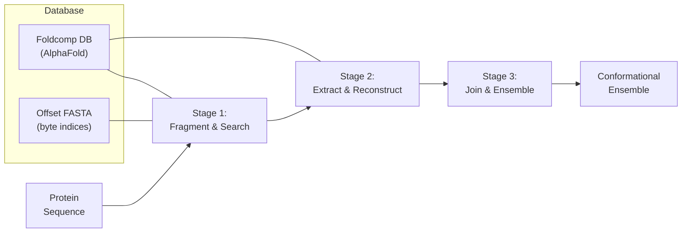

---
slug:1-overview
blog_type:normal
---


**IDP-o** 是一个基于片段的集合生成器，专用于内在无序蛋白（IDPs）。给定一条蛋白质序列，它能生成一个**构象集合**——即一系列物理上合理的 3D 结构——其原理是将序列分解为重叠片段，在 AlphaFold 数据库中搜索结构同源物，重建它们的 3D 坐标，并按层级将它们拼接在一起。生成的每个结构都会推断出氢原子，使其可以直接用于下游的计算生物物理任务，例如核磁共振（NMR）化学位移预测或分子动力学初始化。


来源: [README.md](/README.md#L1-L15)

## IDP-o 解决了什么问题？

内在无序蛋白（IDPs）不会形成单一的稳定折叠。相反，它们在溶液中会在庞大的构象集合之间不断互变。传统的结构预测工具（AlphaFold、RoseTTAFold）只返回单一的静态结构——这种点估计从根本上错误地表示了无序状态。IDP-o 通过生成**多个结构**来解决这一问题，这些结构共同对构象景观进行采样，生成的输出捕捉了对于 IDPs 生物物理分析至关重要的结构异质性。

来源: [README.md](/README.md#L1-L15)

## 核心流水线一览

IDP-o 的流水线由 `build_ensemble.py` 编排，它会顺序调用三个阶段。每个阶段都是一个专用脚本，负责处理从序列到集合工作流中的一次转换：



| 阶段 | 脚本 | 输入 | 输出 | 加速器 |
|-------|--------|-------|--------|-------------|
| **1. 片段化与搜索** | `fasta_search_in_foldcomp_database.py` | 蛋白质序列 | 序列化后的命中字典（字节偏移量 + 残基索引） | GPU (CuPy) |
| **2. 提取与重建** | `extract_structures_from_foldcomp_database.py` | 命中字典 | 每个片段的 `.h5` 轨迹文件 | CPU (JAX JIT) |
| **3. 拼接与集合** | `join_fragments.py` | 片段 `.h5` 文件 | 最终集合文件（`.h5`, `.xtc`, `.pdb` 等） | GPU (JAX vmap) |

来源: [scripts/build_ensemble.py](/scripts/build_ensemble.py#L22-L54), [scripts/fasta_search_in_foldcomp_database.py](/scripts/fasta_search_in_foldcomp_database.py#L1-L194), [scripts/extract_structures_from_foldcomp_database.py](/scripts/extract_structures_from_foldcomp_database.py#L1-L326), [scripts/join_fragments.py](/scripts/join_fragments.py#L1-L348)

## 片段化策略

IDP-o 将蛋白质序列切割为 **6 残基的片段**，连续片段之间存在 **2 个残基的重叠**。重叠区域提供了片段拼接时使用的结构锚点——通过仿射（Kabsch）叠合对齐这两个共享残基，以确定相邻片段的相对位置。根据序列总长度，最后一个片段可能少于 6 个残基。

对于长度为 *L* 的序列，片段数量大约为 ⌈(*L* − 6) / (6 − 2)⌉ + 1 = ⌈(*L* − 6) / 4⌉ + 1。这种滑动窗口片段化确保了每个残基至少被一个片段覆盖，同时保持片段足够短，以便在数据库中拥有丰富的结构同源物。

来源: [scripts/fasta_search_in_foldcomp_database.py](/scripts/fasta_search_in_foldcomp_database.py#L117-L126), [README.md](/README.md#L7-L8)

## 结构数据库: Foldcomp + AlphaFold

IDP-o 依赖 AlphaFold 数据库的 **Foldcomp** 压缩表示（`afdb_uniprot_v4`，约 1.1 TB）。Foldcomp 以离散二进制格式存储骨架二面角（φ, ψ, ω）、键角和侧链构象，而非完整的笛卡尔坐标。这种压缩至关重要：它使得 IDP-o 能够在整个 AlphaFold 数据库（覆盖 UniProt 蛋白质组）中执行穷举子串搜索，然后仅使用 JAX 编译的坐标重建函数按需重建相关的 3D 结构。

系统需要一种特殊格式的 FASTA 文件，其中每个头信息包含对应条目在 Foldcomp 数据库文件中的**字节偏移量**，而非序列标识符。`prepare_foldcomp_fasta.py` 脚本可自动下载并创建此文件。

来源: [scripts/prepare_foldcomp_fasta.py](/scripts/prepare_foldcomp_fasta.py#L1-L150), [scripts/extract_structures_from_foldcomp_database.py](/scripts/extract_structures_from_foldcomp_database.py#L60-L110), [README.md](/README.md#L20-L28)

## 项目结构

```
IDP-o/
├── Dockerfile                          # NVIDIA JAX GPU 容器定义
├── LICENSE                             # Apache 2.0
├── README.md                           # 包含使用示例的仓库说明
├── assets/
│   └── idp-o.png                       # 流水线工作流图
├── generate_dataset.py                 # 批量封装: CSV/FASTA → 多个集合
└── scripts/
    ├── build_ensemble.py               # 流水线编排器 (入口点)
    ├── fasta_search_in_foldcomp_database.py   # 阶段 1: GPU 子串搜索
    ├── extract_structures_from_foldcomp_database.py  # 阶段 2: 结构重建
    ├── join_fragments.py               # 阶段 3: 层级片段拼接
    └── prepare_foldcomp_fasta.py       # 数据库设置: 下载 + 偏移 FASTA
```

来源: [Dockerfile](/Dockerfile#L1-L9), [generate_dataset.py](/generate_dataset.py#L1-L126), [scripts/build_ensemble.py](/scripts/build_ensemble.py#L1-L167)

## 技术栈

| 层级 | 技术 | 在 IDP-o 中的作用 |
|-------|-----------|---------------|
| **GPU 计算** | JAX (NVIDIA 容器) | 向量化片段拼接 (`vmap`)，JIT 编译重建 |
| **GPU 搜索** | CuPy | 跨 Foldcomp FASTA 的并行子串匹配 |
| **坐标引擎** | nerfax (Peptone) | 内坐标 → 笛卡尔坐标重建，侧链放置，氢原子推断 |
| **结构 I/O** | MDTraj | 多格式轨迹加载/保存 (HDF5, XTC, PDB, DCD) |
| **数据库** | Foldcomp | 压缩的 AlphaFold DB 访问，二进制角度解码 |
| **哈希** | hirola | 用于序列编码的快速氨基酸查找表 |
| **部署** | Docker (NVIDIA JAX 24.10) | 可复现的 GPU 运行时环境 |

来源: [Dockerfile](/Dockerfile#L1-L9), [scripts/fasta_search_in_foldcomp_database.py](/scripts/fasta_search_in_foldcomp_database.py#L19-L20), [scripts/join_fragments.py](/scripts/join_fragments.py#L14-L20), [scripts/extract_structures_from_foldcomp_database.py](/scripts/extract_structures_from_foldcomp_database.py#L19-L29)

## 关键输出

IDP-o 生成一个**构象集合**，可以保存为以下任何格式，可通过 `--format` 标志选择：

| 格式 | 扩展名 | 最适用场景 |
|--------|-----------|----------|
| HDF5 | `.h5` | 紧凑，快速随机访问，MDTraj 原生 |
| XTC | `.xtc` | 兼容 GROMACS，压缩轨迹 |
| PDB | `.pdb` | 人类可读，可视化工具 |
| 压缩 PDB | `.pdb.gz` | 节省存储空间的 PDB |
| DCD | `.dcd` | 兼容 CHARMM/NAMD 的轨迹 |

每个集合包含 `--max_structures_in_ensemble` 个结构（默认: 100），氢原子通过 MDTraj 的标准残基模板自动推断，使得输出可以直接用于下游的 NMR 或 MD 应用。

来源: [scripts/join_fragments.py](/scripts/join_fragments.py#L299-L330), [generate_dataset.py](/generate_dataset.py#L44-L49), [README.md](/README.md#L35-L46)

<CgxTip>在 Docker 中运行时，必须使用 `--gpus 1` 标志——GPU 加速的序列搜索（阶段 1）和 JAX 向量化的片段拼接（阶段 3）均依赖于 CUDA。请确保宿主机已安装 NVIDIA 驱动和容器工具包。</CgxTip>

## 接下来去哪

既然你已经了解了 IDP-o 的功能及其流水线结构，可以按照以下阅读路径进一步深入：

1. **[快速开始](2-quick-start)** — 端到端运行你的首次集合生成
2. **[Foldcomp 数据库设置](3-foldcomp-database-setup)** — 下载并准备约 1.1 TB 的结构数据库
3. **[架构概览](4-architecture-overview)** — 详尽的数据流和模块间关系
4. **[片段生成策略](5-fragment-generation-strategy)** — 重叠片段化的工作原理及为何选择 6 个残基
5. **[GPU 加速序列搜索](6-gpu-accelerated-sequence-search)** — 基于 CuPy 的子串匹配内部机制
6. **[层级片段拼接](8-hierarchical-fragment-joining)** — 二的幂次拼接算法与冲突检测
7. **[批量数据集生成](11-batch-dataset-generation)** — 使用 `generate_dataset.py` 扩展至数千条序列