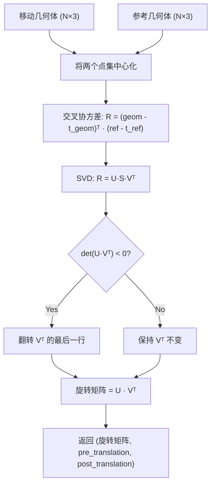
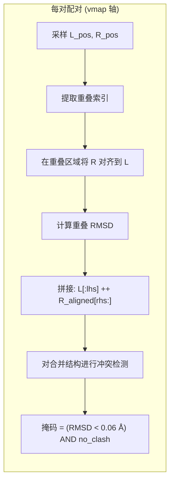
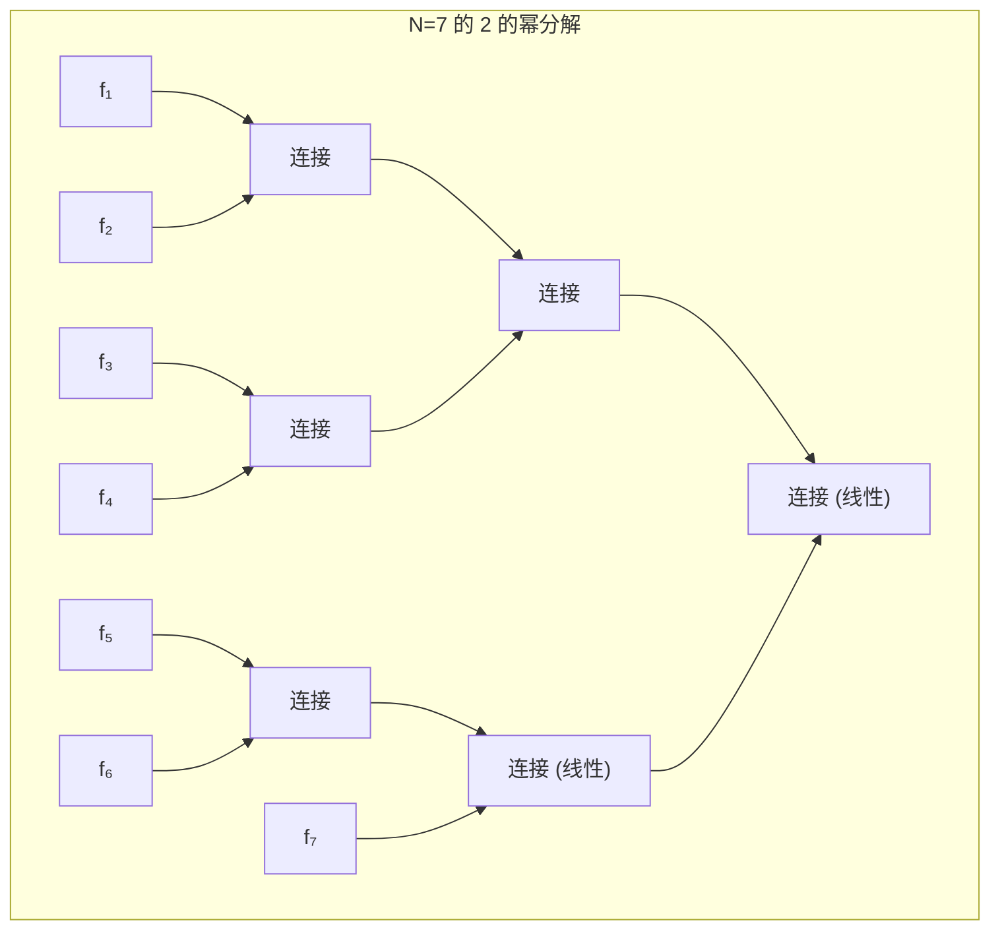

---
slug:10-jax-vectorized-ensemble-computation
blog_type:normal
---


IDP-o 利用 JAX 的函数式数组编程模型——特别是 `vmap`、`jit` 和 `jax.lax.scan`——将原本复杂度为 O(N²) 的串行片段连接循环，转换为一条 **GPU 加速、批量向量的系综构建流水线**。核心计算核函数在单个编译的 XLA 计算图中，对每次配对的数千个候选片段连接进行对齐、验证和过滤，消除了 Python 层面的循环开销，实现了每秒数十万次连接尝试的吞吐量。本页将剖析驱动系综构建器的三个 JAX 核函数：**SVD 对齐核**、**向量化冲突检测核**，以及**内存自适应分块 vmap 调度器**。

来源: [join_fragments.py](/scripts/join_fragments.py#L1-L348), [extract_structures_from_foldcomp_database.py](/scripts/extract_structures_from_foldcomp_database.py#L1-L326)

## GPU 内存预留与运行时配置

在任何 JAX 计算开始之前，运行时配置会通过 `XLA_PYTHON_CLIENT_MEM_FRACTION` 环境变量，为 XLA 编译器预留 **96% 的可用 GPU 内存**。这种激进的内存分配策略确保了在向量化连接期间生成的大型批量张量——特别是冲突检测中的 N×N 距离矩阵——能够常驻 GPU 内存，避免触发按需分配的停滞。Docker 镜像基于 `nvcr.io/nvidia/jax:24.10-py3` 构建，其中附带了支持 CUDA 12 的 JAX/XLA 运行时，以及用于内坐标重建和氢原子推断的 `nerfax` 库。

```python
os.environ["XLA_PYTHON_CLIENT_MEM_FRACTION"] = ".96"
```

在分级系综构建完成之后，主入口函数会对存活的 XLA 缓冲区执行显式清理，以释放 GPU 内存，随后再将最终轨迹写入磁盘：

```python
backend = jax.lib.xla_bridge.get_backend()
for buf in backend.live_buffers():
    buf.delete()
```

来源: [join_fragments.py](/scripts/join_fragments.py#L22-L22), [join_fragments.py](/scripts/join_fragments.py#L289-L292)

## SVD 对齐核

对齐核使用纯 `jnp` 操作实现了 **Kabsch 算法**，使其完全可微并兼容 `vmap`。给定一个移动几何体和一个参考几何体（均为 N×3 坐标数组），该核函数计算能够最小化两个点集之间 RMSD 的最佳刚体旋转。



该实现使用 `full_matrices=False` 的 `jnp.linalg.svd` 进行瘦分解，然后应用**反射校正**：如果 U·Vᵀ 的行列式为负，则将 Vᵀ 的最后一行取反，以确保得到真正的旋转（行列式 = +1）而非不正确的反射。该校正通过 `jnp.where` 条件实现，在 `jit` 编译下依然可追踪。

随后，`align` 函数使用 `jnp.einsum("ij,bj", rot, mobile_pos - pre_trans) + post_trans` 将仿射变换应用于完整的移动结构（而不仅仅是重叠残基），其中爱因斯坦求和约定高效地表达了批量旋转的应用。

| 组件 | JAX 操作 | 形状 | 目的 |
|-----------|--------------|-------|---------|
| 交叉协方差 | `jnp.dot((geom - t).T, (ref - t))` | (3, 3) | 最优旋转目标 |
| 瘦 SVD | `jnp.linalg.svd(R, full_matrices=False)` | U,S,Vᵀ 各为 (3,3) | 分解旋转 |
| 反射校正 | `jnp.where(det < 0, Vt.at[-1].multiply(-1), Vt)` | (3, 3) | 确保真正旋转 |
| 批量旋转 | `jnp.einsum("ij,bj", rot, pos)` | (N, 3) | 应用于所有原子 |

来源: [join_fragments.py](/scripts/join_fragments.py#L38-L57)

## 向量化冲突检测

`check_interactions` 函数计算完整的两两距离矩阵，并识别空间冲突——即距离小于可配置截断距离（默认 0.1 nm = 1.0 Å）且未通过共价键连接的原子。这是连接流水线中内存消耗最大的操作，因为它会具体化出一个 N×N 的距离矩阵。

```python
distances = jnp.sqrt(((xyz[:, None] - xyz[None, :]) ** 2).sum(-1))
mask = distances < cutoff
mask = mask.at[tuple(bonds.T)].set(False)   # 排除成键原子对
mask = jnp.triu(mask, k=1)                   # 仅取上三角 (j > i)
```

广播操作 `xyz[:, None] - xyz[None, :]` 无需显式的 Python 循环即可创建两两差分张量。通过以转置后的键表作为索引数组的元组对掩码进行索引，显式排除了成键原子对。`k=1` 的 `jnp.triu` 确保每次违规只被计数一次。然后，在连接核函数中使用 `.any()` 对生成的布尔掩码进行归约，为每个候选连接生成一个单一的 `no_clash_mask`。

<CgxTip>N×N 距离矩阵是主要的内存瓶颈。`join_fragments` 中的 `batch_size` 函数根据 `target_GB / (1e-5 × nres²)` 动态计算分块大小，其中 `target_GB = 10` GB。对于 100 个残基的蛋白质，这会产生约 100 的分块大小，从而将峰值内存保持在 96% 的 GPU 预留量内。</CgxTip>

来源: [join_fragments.py](/scripts/join_fragments.py#L60-L69)

## 向量化连接核：`_join_fragments`

`_join_fragments` 函数是系综构建器的**内部计算循环**。它接收随机采样的左右片段构象对，并在单个由 `vmap` 装饰的函数内，对每一对执行重叠对齐、RMSD 计算、冲突检查，并生成合并后的坐标数组。



关键的架构洞察在于，`vmap` **仅**应用于采样构象的批次维度，而重叠索引（`l_indices`、`r_indices`）在 `in_axes` 中以 `None` 进行广播。这意味着 SVD 对齐和冲突检测只需为特定的重叠模式编译一次，即可在批次中的所有 N 个候选中复用：

```python
pos, no_clash_mask, rmsds = vmap(align_and_validate, in_axes=(0, 0, None, None))(
    rpos, lpos, r_indices, l_indices
)
mask = (rmsds < 0.06) & no_clash_mask   # 0.6 Å 重叠 RMSD 阈值
```

**接受掩码**结合了两个标准：重叠 RMSD 必须小于 0.06 nm (0.6 Å)，且合并后的结构不能有空间冲突。这种双重过滤既保证了拼接接缝处的几何一致性，又确保了完整构象的物理合理性。

来源: [join_fragments.py](/scripts/join_fragments.py#L96-L123)

## 内存自适应分块 vmap：`jit_chunked_vmap`

对数十万个候选直接应用 `vmap` 会因 N×N 距离矩阵而超出 GPU 内存。`jit_chunked_vmap` 调度器通过**将批次拆分为内存安全的分块**，并使用 `jax.lax.scan` 对其进行迭代来解决此问题，这在每次迭代中维持了固定的内存占用。

```python
def jit_chunked_vmap(f, args, chunk_size):
    lengths = jax.tree.flatten(jax.tree.map(lambda x: jnp.shape(x)[0], args))[0]
    assert len(set(lengths)) == 1

    def _body(_, args):
        return (None, f(*args))

    _, outputs = jax.lax.scan(
        _body,
        init=None,
        xs=jax.tree.map(lambda x: x.reshape((-1, chunk_size) + x.shape[1:]), args),
    )
    return jax.tree.map(lambda x: x.reshape((-1,) + x.shape[2:]), outputs)
```

该函数分三个阶段运行：**(1)** 将所有输入 pytree 从 `(N, ...)` 重塑为 `(N/chunk_size, chunk_size, ...)`；**(2)** 对主导维度进行扫描，将 `f` 应用于每个分块（其中 `f` 本身包含对该分块批次维度的 `vmap`）；**(3)** 将输出重塑回 `(N, ...)`。由于 `jax.lax.scan` 在迭代间复用相同的 XLA 缓冲区，峰值内存受限于单个分块的代价，而非完整批次。

| 参数 | 公式 | 示例 (100 残基) |
|-----------|---------|----------------------|
| 目标内存 | 10 GB | 10 GB |
| 分块大小 | `10 / (1e-5 × nres²)` | 100 |
| 总尝试次数 | 向上取整至 chunk_size 的倍数 | 500,000 → 500,000 |
| 每个分块的峰值内存 | O(chunk_size × nres²) | ~10 GB |

来源: [join_fragments.py](/scripts/join_fragments.py#L132-L144), [join_fragments.py](/scripts/join_fragments.py#L150-L152)

## 概率采样与连接调度

`join_fragments` 函数实现了一个**重要性加权的随机连接**。它并非穷举测试左右构象的所有配对（其复杂度将是 O(M²)，其中 M 为每个片段的构象数），而是使用带有逐结构概率权重的 `jax.random.choice`，从每个片段的构象池中采样索引：

```python
random_indices = tuple(
    random.choice(key, jnp.arange(len(pos)), shape=(n,), p=probs)
    for key, pos, probs in ((lkey, lpos, lprobs), (rkey, rpos, rprobs))
)
```

概率权重（`probs`）由 `get_probs` 函数计算，该函数基于每个结构的源索引在池中出现的次数，分配**逆频率权重**。这会对过度代表的构象进行去重，这些构象是由于多个片段来源映射到同一个 Foldcomp 条目而产生的：

```python
def get_probs(x):
    _, indices, counts = jnp.unique(x, return_counts=True, return_inverse=True, size=x.shape[0])
    probs = (1 / counts)[indices]
    return probs
```

在连接两个片段时，输出概率是左右概率数组的**逐元素乘积**，通过 `jax.tree.map(jnp.multiply, *map(get_probs, sources))` 计算。这种乘性组合反映了片段构象选择之间的独立性假设。

如果采样后没有连接通过接受掩码，函数将使用新的随机密钥**最多重试 5 次**，每次尝试都会发出警告。5 次失败后，将回退到选择单个随机结构，从而确保流水线始终产生输出而非崩溃。

来源: [join_fragments.py](/scripts/join_fragments.py#L147-L192), [join_fragments.py](/scripts/join_fragments.py#L126-L129)

## 分级系综组装：`build_ensemble`

`build_ensemble` 函数为将 N 个片段组合成单一系综编排了**树形归约模式**。它并非线性连接片段（那将累积对齐误差），而是将 N 分解为 2 的幂之和，并在分级树中执行两两连接：



该分解对片段计数的 32 位无符号整型表示使用 `np.unpackbits` 以提取二进制表示，然后通过被位数组掩码的 `2 ** np.arange(16)[::-1]` 得出 2 的幂分段。对于 N=7，这会产生分段 [4, 2, 1]，并按顺序连接：首先是 4 片段块（两层级两两连接），然后是 2 片段块（一层级），最后是 1 片段单体。

在所有 2 的幂子集独立组装完成后，它们将在最终的顺序遍历中被**线性组合**。这种混合策略最小化了连接树的深度（减少误差传播），同时无需填充即可处理任意片段计数。

**内存管理**被整合到层级结构中：在每层连接完成后（即当 `i > 1` 时），来自之前两层的中间片段数据会使用 `jax.tree.map` 对任何 `jax.Array` 对象调用 `.delete()`，从 `data` 字典中显式删除，从而为下一层连接释放 GPU 内存。

来源: [join_fragments.py](/scripts/join_fragments.py#L195-L249)

## 结构重建中的 JAX (CPU 模式)

当连接流水线在 GPU 上运行时，`extract_structures_from_foldcomp_database.py` 中的结构重建阶段通过 `os.environ["JAX_PLATFORMS"] = "cpu"` 显式强制执行 **CPU 运行**。这种分离之所以存在，是因为重建核函数（`reconstruct_from_internal_coordinates_pure_sequential`）本质上是顺序的——每个残基的位置取决于前一个残基计算出的坐标——并且对于单个结构无法受益于 GPU 并行。

相反，JAX 的 `vmap` **跨批次维度**应用以并行重建多个结构：

```python
def build_parallel_reconstruct_fn(sequence):
    return build_reconstruct_fn(sequence, reconstruct_fn=vmap(reconstruct, in_axes=(0, 0, None, 0)))
```

`in_axes=(0, 0, None, 0)` 规范对离散化器参数、角度/扭转角数组以及侧链角度进行向量化，同时保持氨基酸序列（轴为 `None`）不变——因为片段系综中的所有结构共享相同的序列。内部函数上的 `@jit` 装饰器结合 `jax.ensure_compile_time_eval()`，将氨基酸索引锁定为编译时常量，使 XLA 编译器能够展开特定于该序列的侧链重建逻辑。这种特化相比于非特化路径可产生约 **2000 倍的加速**。

来源: [extract_structures_from_foldcomp_database.py](/scripts/extract_structures_from_foldcomp_database.py#L17-L17), [extract_structures_from_foldcomp_database.py](/scripts/extract_structures_from_foldcomp_database.py#L189-L206)

## JAX 模式总结

下表汇总了系综计算流水线中使用的所有 JAX 模式、其位置及其具体作用：

| JAX 模式 | 位置 | 作用 | 硬件 |
|-------------|----------|------|----------|
| `vmap` (批量对齐) | `join_fragments.py#L121` | 对 N 个候选配对进行对齐+验证向量化 | GPU |
| `vmap` (批量重建) | `extract_structures...py#L206` | 对 M 个结构进行结构重建向量化 | CPU |
| `jax.lax.scan` (分块 vmap) | `join_fragments.py#L139` | 对分块批次进行内存有界迭代 | GPU |
| `jnp.linalg.svd` | `join_fragments.py#L43` | Kabsch 对齐旋转 | GPU |
| `jnp.einsum` | `join_fragments.py#L56` | 批量旋转应用 | GPU |
| `random.choice` | `join_fragments.py#L166` | 重要性加权随机采样 | GPU |
| `jax.tree.map` | `join_fragments.py#L222,L231` | 用于概率权重和清理的 Pytree 操作 | GPU |
| `@jit` + `ensure_compile_time_eval` | `extract_structures...py#L192-L199` | 编译时序列特化 | CPU |
| `jnp.where` (反射校正) | `join_fragments.py#L44-L48` | 用于真正旋转的可追踪条件 | GPU |

<CgxTip>双硬件策略（GPU 用于连接，CPU 用于重建）并非偶然。连接核的 N×N 距离矩阵和批量 SVD 分解具有高度并行性，极大地受益于 GPU 吞吐量。重建核的顺序依赖链（残基 i+1 依赖于残基 i）使其在 GPU 上受延迟限制，但在 CPU 上是带宽高效的，因为 XLA 的 CPU 后端避免了约 1 GB Foldcomp 数据库读取的 PCIe 传输开销。</CgxTip>

来源: [join_fragments.py](/scripts/join_fragments.py#L28-L33), [join_fragments.py](/scripts/join_fragments.py#L38-L72), [extract_structures_from_foldcomp_database.py](/scripts/extract_structures_from_foldcomp_database.py#L28-L29)

## 计算复杂度与扩展性

系综构建的计算代价由每次分块 vmap 迭代中的冲突检测步骤主导。对于具有 `nres` 个残基的结构上的单次连接尝试：

- **对齐**：O(nres) —— 3×3 矩阵的 SVD 是常数；einsum 为 O(nres)
- **距离矩阵**：O(nres²) —— 两两广播创建 nres×nres×3 张量
- **冲突掩码**：O(nres²) —— 比较 + 键排除 + 上三角

对于分块大小为 `C` 的 `N` 次总连接尝试，总代价为 O(N/C × C × nres²) = O(N × nres²)。选择分块大小 `C = 10 / (1e-5 × nres²)` 恰好是为了使每个分块的 O(C × nres²) 内存占用保持在约 10 GB 以内，从而使算法具有**内存可扩展性**：更大的蛋白质会自动减小分块大小，以保持在 GPU 内存预算内。

| 残基数 | 分块大小 | 每块内存 | 尝试次数 | 总代价 |
|----------|-----------|-----------------|----------|------------|
| 50 | 400 | ~10 GB | 500K | O(500K × 2500) |
| 100 | 100 | ~10 GB | 500K | O(500K × 10000) |
| 200 | 25 | ~10 GB | 500K | O(500K × 40000) |
| 500 | 4 | ~10 GB | 500K | O(500K × 250000) |

来源: [join_fragments.py](/scripts/join_fragments.py#L150-L152), [join_fragments.py](/scripts/join_fragments.py#L60-L69)

## 与相邻流水线阶段的关系

JAX 向量化系综计算位于两个上游数据流的汇聚点，并馈送给一个下游消费者。[重叠对齐与冲突检测](9-overlap-alignment-and-clash-detection)页涵盖了此 JAX 核函数所实现的 SVD 对齐和基于距离的冲突准则的数学基础。[从 Foldcomp 进行结构重建](7-structure-reconstruction-from-foldcomp)页描述了产生被连接核函数消耗的片段坐标池的 CPU 端 `vmap` 批量重建。[分级片段连接](8-hierarchical-fragment-joining)页解释了在整个片段层级结构中调度 JAX 核函数何时及如何被调用的树形归约策略。

有关控制 JAX 核函数行为（分块大小、尝试次数、系综大小）的完整流水线配置选项，请参见[命令行配置参考](13-command-line-configuration-reference)。