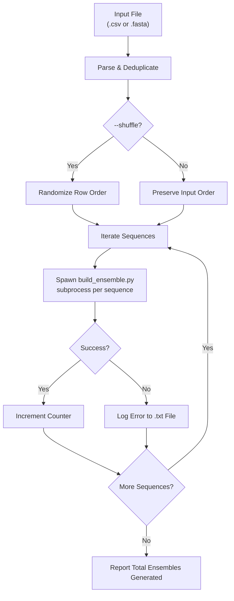
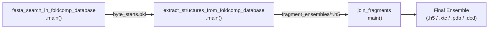

---
slug:11-batch-dataset-generation
blog_type:normal
---


IDP-o 的批量数据集生成系统将一组蛋白质序列（以 CSV 或 FASTA 文件的形式提供）转换为完整的结构系综数据集。编排器脚本 `generate_dataset.py` 遍历输入中的每一条序列，通过子进程调用 `build_ensemble.py` 将其分发至完整的三阶段流水线（GPU 加速搜索 → 结构重建 → 片段拼接）。此设计将**批次层面的关注点**（输入解析、去重、并行化、容错能力）与**序列层面的关注点**（实际的系综计算）分离开来，从而能够跨数千个天然无序蛋白质进行可扩展的数据集生成。

来源: [generate_dataset.py](/generate_dataset.py#L1-L126), [scripts/build_ensemble.py](/scripts/build_ensemble.py#L1-L167)

## 批次编排器架构

批处理系统完全由 `generate_dataset.py` 驱动，它充当一个轻量级协调器。它不直接导入流水线各阶段——而是通过 `subprocess.check_call` 将 `build_ensemble.py` 作为子进程调用。这种架构选择提供了**进程隔离**：某个系综计算中的崩溃或 GPU 内存泄漏不会破坏编排器的状态或后续序列的处理。



编排器读取输入文件，对行进行去重，可选择打乱处理顺序，然后循环遍历每条序列并将其分发至 `build_ensemble.py`。发生失败时，它会捕获完整的回溯信息，并将其写入预期输出路径旁的配套 `.txt` 文件中，从而使批处理能够不间断地继续执行。

来源: [generate_dataset.py](/generate_dataset.py#L67-L125)

## 输入格式处理

批处理生成器接受两种输入格式，每种格式具有由 `--column_names` 标志控制的特定列映射语义：

| 格式 | 检测规则 | 解析方法 | 必需列 |
|--------|---------------|----------------|-----------------|
| **FASTA** (`.fasta`) | 文件名以 `.fasta` 结尾 | 逐行解析：去掉 `>` 前缀的头部 → 下一行为序列 | 隐式：`>name` 后接 `sequence` |
| **CSV** (`.csv`) | 文件名以 `.csv` 结尾 | 使用 `pandas.read_csv` 并通过 `usecols` 进行选择性加载 | 可通过 `--column_names` 配置 |

`--column_names` 参数默认为 `seq_name,fasta`，并按逗号分割以识别序列标识符列和氨基酸序列列。对于 FASTA 文件，这些列名被分配给内部构建的 DataFrame。对于 CSV 文件，仅将指定的两列加载到内存中，从而最大程度减少宽表的 I/O 开销。

对两列**独立**执行**去重**。如果检测到重复的序列名称或重复的 FASTA 字符串，将记录警告并使用 `pandas.drop_duplicates` 丢弃重复项，仅保留首次出现的记录。

来源: [generate_dataset.py](/generate_dataset.py#L67-L87)

## 子进程分发与容错能力

对于每条序列行，编排器构造一个命令列表，使用以下参数调用 `build_ensemble.py`：

| 参数 | 值来源 | 描述 |
|----------|-------------|-------------|
| `--sequence` | `row[fasta]` | 氨基酸序列字符串 |
| `--outpath` | `{outfolder}/{seq_name}.{format}` | 由序列名称和格式派生的输出文件路径 |
| `--scratch_folder` | `/tmp/tmp-{seq_name}` | 每条序列独立的暂存目录 |
| `--max_structures_in_ensemble` | CLI 参数 `--max_structures_in_ensemble` | 最终系综中保留的帧数 |
| `--overwrite` | CLI 标志 | 若指定则透传 |

<CgxTip>每条序列在 `/tmp/tmp-{seq_name}` 下都会获得一个**独立的暂存目录**。这可以防止在针对同一输入文件并发运行多个批处理时，中间文件（片段系综、字节起始 pickle 文件）发生冲突。</CgxTip>

当子进程失败时，异常会被捕获，格式化完整的回溯信息，并将尝试执行的命令与错误信息一并写入输出文件夹中的 `{seq_name}.txt` 文件。随后批处理继续处理下一条序列。这种**快速失败**策略确保了单条有问题的序列（例如，包含非标准氨基酸的序列）不会中断剩余条目的数据集生成。

来源: [generate_dataset.py](/generate_dataset.py#L97-L125)

## 基于随机打乱的并行化

`--shuffle` 标志使用 `pandas.sample(frac=1)` 随机打乱序列的处理顺序。这不仅仅是为了美观——它是**分布式并行化的主要机制**。由于每条序列都是独立处理的（迭代之间没有共享的可变状态），多个工作器可以独立地运行 `generate_dataset.py`，并启用 `--shuffle` 来处理**同一输入文件**。根据统计期望，每个工作器将首先处理不同的随机子集，从而在无需任何中央协调器或队列系统的情况下自然地分配工作负载。

在实践中，你可以通过启动 N 个容器或进程来划分工作，每个容器或进程都使用 `--shuffle` 读取相同的输入文件。应省略 `--overwrite` 标志，以便 `build_ensemble.py` 跳过已完成的系综（其输出文件已存在），从而提供隐式的**幂等检查点**。

来源: [generate_dataset.py](/generate_dataset.py#L94-L96), [scripts/build_ensemble.py](/scripts/build_ensemble.py#L40-L45)

## 每序列流水线集成

每次子进程调用都会触发 `build_ensemble.py` 内部的完整三阶段流水线，该流水线将三个核心脚本作为模块级函数调用进行链接：



| 阶段 | 脚本 | 输入 | 输出 | 传递的关键参数 |
|-------|--------|-------|--------|----------------------|
| **1. 搜索** | `fasta_search_in_foldcomp_database` | 序列，foldcomp FASTA | `byte_starts.pkl` | `sequence`, `foldcomp_fasta`, `reduction_factor` |
| **2. 重建** | `extract_structures_from_foldcomp_database` | Foldcomp DB，字节起始位置 | 片段 `.h5` 文件 | `foldcomp_fasta`, `foldcomp_db`, `n_max_structures_per_fragment`, `exclude_cis_omega` |
| **3. 拼接** | `join_fragments` | 片段 `.h5` 文件 | 最终系综 | `joins_to_attempt_per_pairing`, `max_structures_in_ensemble`, `rmsd_sort` |

批次编排器仅向子进程暴露 `--max_structures_in_ensemble` 和 `--overwrite`；所有其他流水线参数（`foldcomp_fasta`、`foldcomp_db`、`reduction_factor`、`n_max_structures_per_fragment`、`joins_to_attempt_per_pairing`、`exclude_cis_omega`、`rmsd_sort`）均回退至 `build_ensemble.py` 内部的默认值。这使得批处理接口保持简单，同时依赖于合理的每序列默认值。

来源: [scripts/build_ensemble.py](/scripts/build_ensemble.py#L60-L80), [scripts/build_ensemble.py](/scripts/build_ensemble.py#L91-L142)

## 输出文件组织

批处理生成器将每条输入序列的系综文件写入指定的 `--outfolder` 目录。命名约定为 `{sequence_name}.{format}`，其中格式扩展名由 `--format` 标志决定：

| 格式 | 扩展名 | 轨迹拓扑文件 | 备注 |
|--------|-----------|--------------------------|-------|
| **HDF5** | `.h5` | 内嵌 | 原生 MDTraj 格式；I/O 效率最高 |
| **XTC** | `.xtc` | 配套 `.pdb` | GROMACS 压缩格式；为第一帧写入 `.pdb` |
| **DCD** | `.dcd` | 配套 `.pdb` | CHARMM 格式；为第一帧写入 `.pdb` |
| **PDB** | `.pdb` | N/A | 单帧；仅保留最后一帧构象 |
| **PDB.GZ** | `.pdb.gz` | N/A | Gzip 压缩的 PDB |

<CgxTip>对于轨迹格式（`.xtc`、`.dcd`），`join_fragments.py` 会自动写入一个配套的 `.pdb` 文件，其中包含来自第一帧的拓扑信息。这是必需的，因为这些二进制格式仅存储坐标——`.pdb` 提供了下游工具所需的原子名称、残基信息和键连接性。</CgxTip>

失败的序列会生成一个 `.txt` 错误日志来代替结构文件，从而便于识别并重试失败的条目。

来源: [generate_dataset.py](/generate_dataset.py#L100-L124), [scripts/join_fragments.py](/scripts/join_fragments.py#L317-L319)

## 安全防护与试运行模式

当省略 `--max_structures_in_ensemble` 或将其设置为 `0`（默认值）时，编排器会加载并去重输入文件，但**不会派生任何子进程**。相反，它会记录一条警告：`"set '--max_structures_in_ensemble' to actually generate the ensembles"`。这可作为防止意外运行完整数据集（可能需要数小时或数天）的**安全防护**，同时也可作为**试运行/验证模式**——你可以在提交完整计算之前确认输入文件解析正确，并检查去重警告。

来源: [generate_dataset.py](/generate_dataset.py#L91-L93)

## CLI 参考摘要

下表总结了 `generate_dataset.py` 接受的所有参数：

| 参数 | 短选项 | 类型 | 默认值 | 是否必需 | 描述 |
|----------|-------|------|---------|----------|-------------|
| `--input` | `-i` | `str` | — | **是** | 输入 CSV 或 FASTA 文件的路径 |
| `--outfolder` | `-o` | `str` | `./ensembles` | 否 | 系综文件的输出目录 |
| `--max_structures_in_ensemble` | `-n` | `int` | `0` | 否 | 每个系综的帧数；`0` = 试运行 |
| `--fragments_overlap` | — | `int` | `1` | 否 | 片段之间重叠的残基数 |
| `--column_names` | — | `str` | `seq_name,fasta` | 否 | CSV 中的列名（以逗号分隔） |
| `--shuffle` | — | 标志 | `False` | 否 | 随机打乱处理顺序以实现并行化 |
| `--format` | — | `str` | `xtc` | 否 | 输出格式：`h5`、`xtc`、`pdb`、`pdb.gz`、`dcd` |
| `--overwrite` | — | 标志 | `False` | 否 | 覆盖已存在的系综文件 |

来源: [generate_dataset.py](/generate_dataset.py#L24-L59)

## 典型使用模式

从包含 500 条序列的 CSV 文件进行**单机批处理生成**：

```bash
docker run -v $(pwd):/data --gpus 1 idp-o \
  python /IDP-o/generate_dataset.py \
    --input /data/sequences.csv \
    --outfolder /data/ensembles \
    --max_structures_in_ensemble 100 \
    --format h5
```

在具有独立 GPU 的 4 台机器上进行**分布式并行化**，均读取相同的输入：

```bash
# 在每台机器上 (运行 1-4):
docker run -v $(pwd):/data --gpus 1 idp-o \
  python /IDP-o/generate_dataset.py \
    --input /data/sequences.csv \
    --outfolder /data/ensembles \
    --max_structures_in_ensemble 100 \
    --shuffle \
    --format xtc
```

每个工作器独立地打乱并处理序列；由于未指定 `--overwrite`，已完成的系综将被跳过，从而提供自然的工作窃取行为。

在长时间批处理之前，用于检查输入解析的**验证试运行**：

```bash
python generate_dataset.py \
  --input sequences.fasta \
  --outfolder ./ensembles
# 保留 -n 为默认值 0 → 记录计数和重复项，不进行计算
```

来源: [generate_dataset.py](/generate_dataset.py#L23-L59)

## 后续步骤

- 对于每次批处理调用触发的每序列流水线，请参阅[架构概览](4-architecture-overview)以及各个流水线阶段页面：[GPU 加速序列搜索](6-gpu-accelerated-sequence-search)、[从 Foldcomp 重建结构](7-structure-reconstruction-from-foldcomp)和[分层片段拼接](8-hierarchical-fragment-joining)。
- 有关输出文件格式及如何在下游分析中使用它们的详细信息，请参阅[输出格式与下游使用](12-output-formats-and-downstream-use)。
- 有关所有脚本的完整 CLI 参数集（包括批处理封装器未暴露的每序列参数），请参阅[命令行配置参考](13-command-line-configuration-reference)。