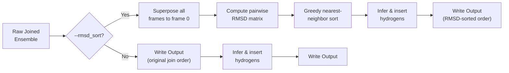

---
slug:12-output-formats-and-downstream-use
blog_type:normal
---


IDP-o 生成**结构完整的多帧蛋白质系综** —— 即轨迹文件，其中每一帧代表内在无序蛋白质的一种合理构象。其输出经过专门设计，可被标准分子动力学 (MD) 分析工具包、可视化软件及下游模拟引擎直接使用，无需任何后处理。本页详细说明了 IDP-o 可输出的所有格式、与主输出一同生成的辅助文件，以及将这些输出集成到常见下游工作流中的具体模式。

来源：[generate_dataset.py](/generate_dataset.py#L1-L126), [scripts/build_ensemble.py](/scripts/build_ensemble.py#L1-L167), [scripts/join_fragments.py](/scripts/join_fragments.py#L1-L348)

## 支持的输出格式

IDP-o 支持五种轨迹格式，可通过 `generate_dataset.py` 中的 `--format` 标志进行选择，或从 `build_ensemble.py` 中的 `--outpath` 扩展名推断得出。所有格式均通过 **MDTraj** 的 I/O 层写入，从而保证与读取这些标准的所有工具实现字节级兼容。

| 格式 | 扩展名 | 拓扑存储 | 压缩方式 | 最适用场景 |
|---|---|---|---|---|
| **HDF5** | `.h5` | 内嵌于文件 | 无损 | 单文件便携性，Python 原生分析 |
| **XTC** | `.xtc` | 伴随 `.pdb` | 有损 (GROMACS) | GROMACS 流水线，大型轨迹 |
| **PDB** | `.pdb` | 按模型内嵌 | 无 | 目视检查，小规模系综 |
| **Gzipped PDB** | `.pdb.gz` | 按模型内嵌 | gzip | 归档，减少磁盘占用 |
| **DCD** | `.dcd` | 伴随 `.pdb` | 无 | CHARMM/OpenMM 流水线 |

<CgxTip>对于生产级数据集（数百条序列 × 数百帧），请选择 **XTC** —— 其有损压缩生成的文件比 DCD 小约 3 倍，同时保持亚埃级精度，且 GROMACS 工具可原生读取。当你的下游分析完全基于 Python，且希望将拓扑和坐标整合在单个文件中而不产生任何伴随文件时，请选择 **HDF5**。</CgxTip>

该格式在 `generate_dataset.py` 中通过 `--format` 参数于批次级别指定，默认值为 `xtc`。输入 CSV/FASTA 中的每条序列都会在输出文件夹中生成一个名为 `{sequence_name}.{format}` 的输出文件。

来源：[generate_dataset.py](/generate_dataset.py#L74-L78), [scripts/join_fragments.py](/scripts/join_fragments.py#L321-L326)

## 伴随文件与辅助输出

### 二进制格式的拓扑伴随文件

二进制轨迹格式（`.xtc`、`.dcd`）仅存储坐标数组 —— 它们缺乏解释坐标所需的原子名称、残基标识和键合信息。IDP-o 在选择这些格式时，会自动写入一个包含第 0 帧拓扑的**伴随 PDB 文件**：

```python
t.save(outpath)
if outpath.endswith((".xtc", ".dcd")):
    t[0].save(outpath[:-3] + "pdb")
```

这会生成一对文件，例如 `P53_TAD.xtc` + `P53_TAD.pdb`。伴随 PDB 是一个**单帧文件**（系综的第 0 帧），作为所有需要分离坐标加拓扑输入的下游工具的拓扑参考。

来源：[scripts/join_fragments.py](/scripts/join_fragments.py#L324-L326)

### 生成失败时的错误日志

当批量生成遇到单条序列失败时，IDP-o 不会中止整个数据集的生成。相反，它会在预期输出路径旁写入一个名为 `{sequence_name}.txt` 的**纯文本错误日志**，其中包含失败的命令和完整的回溯信息：

```python
with open(os.path.splitext(outpath)[0] + ".txt", "w") as f:
    f.write(cmd + "\n" + error_msg + "\n")
```

这使得批量数据集生成能够在个别失败后继续进行，同时保留完整的调试诊断信息。

来源：[generate_dataset.py](/generate_dataset.py#L114-L116)

### 中间临时产物

在系综构建期间，IDP-o 会将两类中间文件写入 `--scratch_folder`：

| 产物 | 路径模式 | 用途 | 生命周期 |
|---|---|---|---|
| **字节起始索引** | `scratch_folder/byte_starts.pkl` | 经 Pickle 序列化的字典，将每个片段映射到其在 Foldcomp 数据库中的命中位置 | 由序列搜索写入；由结构提取消耗 |
| **片段系综** | `scratch_folder/fragment_ensembles/{fragment}.h5` | 来自 Foldcomp 重建的逐片段 HDF5 轨迹 | 由结构提取写入；由片段拼接消耗 |
| **片段系综 (顺式排除)** | `scratch_folder/fragment_ensembles-exclude_cis_omega/{fragment}.h5` | 同上，但仅保留反式-ω (trans-ω) 过滤结果 | 在启用 `--exclude_cis_omega` 时使用 |

这些中间文件在系综生成完成后**不会自动清理**。对于大批量运行，你应定期清空暂存目录，或将其挂载到高速临时存储上。

来源：[scripts/fasta_search_in_foldcomp_database.py](/scripts/fasta_search_in_foldcomp_database.py#L170-L173), [scripts/extract_structures_from_foldcomp_database.py](/scripts/extract_structures_from_foldcomp_database.py#L300-L305), [scripts/build_ensemble.py](/scripts/build_ensemble.py#L50-L55)

## 系综结构与完整性

### 包含推断氢原子的全原子输出

拼接流水线返回的最终系综会经历一个关键的后处理步骤：**氢原子推断与插入**。Foldcomp 数据库仅存储重原子坐标（主链 N/CA/C/O 及侧链原子）。在写入输出文件之前，IDP-o 会调用：

```python
t = infer_and_insert_hydrogens(t)
```

该函数（来自 `nerfax` 库）利用标准键长和键角，从重原子几何结构中重建所有氢原子位置，从而生成**完全全原子轨迹**。这意味着输出可直接用于力场评估、NMR 化学位移预测器以及任何需要氢原子位置的计算 —— 无需外部质子化步骤。

来源：[scripts/join_fragments.py](/scripts/join_fragments.py#L317-L318)

### 帧数与选择

最终系综中的构象数量由 `--max_structures_in_ensemble` 控制（默认值：在 `build_ensemble.py` 中为 100）。此参数作为写入磁盘帧数的**硬性上限**：

```python
t = md.Trajectory(
    data[seq]["coords"][:max_structures_in_ensemble],
    md.Topology.from_dataframe(build_mdtraj_top(seq)),
)
```

这些帧取自层级拼接过程生成的前 *N* 个结构。当启用 `--rmsd_sort` 时，这些帧将在应用上限前按贪心最近邻 RMSD **重排序**，确保所选帧在结构空间中形成一条平滑的构象路径。

来源：[scripts/join_fragments.py](/scripts/join_fragments.py#L311-L319)

### 可选的基于 RMSD 的排序

`--rmsd_sort` 标志会触发一个两步后处理流水线：

1. **叠合**：所有帧通过 `trajectory.superpose(trajectory, frame=0)` 与第 0 帧对齐。
2. **贪心 RMSD 排序**：通过 RMSD 矩阵进行最近邻排序，安排帧的顺序，使连续帧之间的结构偏差最小，从而在制作动画时产生视觉上平滑的轨迹。



此排序主要是一种**可视化辅助**手段 —— 它不会改变系综的统计特性，仅改变帧的排序。

来源：[scripts/join_fragments.py](/scripts/join_fragments.py#L259-L275), [scripts/join_fragments.py](/scripts/join_fragments.py#L315-L319)

## 下游集成模式

### 使用 MDTraj 加载系综 (Python)

由于 IDP-o 写入的是标准 MDTraj 兼容格式，最简单的加载模式为：

```python
import mdtraj as md

# HDF5 — 拓扑内嵌
ensemble = md.load_hdf5("P53_TAD.h5")

# XTC — 拓扑来自伴随 PDB
ensemble = md.load("P53_TAD.xtc", top="P53_TAD.pdb")

# DCD — 拓扑来自伴随 PDB
ensemble = md.load("P53_TAD.dcd", top="P53_TAD.pdb")

# 多模型 PDB
ensemble = md.load("P53_TAD.pdb")
```

这四种调用均返回一个 `md.Trajectory` 对象，其 `n_frames` 等于 `--max_structures_in_ensemble`，`n_atoms` 包含所有推断的氢原子。

### 计算系综平均性质

IDP-o 系综专为直接计算 IDP 相关可观测量而设计：

```python
# 回转半径分布
rg = md.compute_rg(ensemble)
print(f"Rg: {rg.mean():.2f} ± {rg.std():.2f} Å")

# 逐残基 RMSF（需以平均结构为参考）
rmsf = md.rmsf(ensemble, ensemble[0])

# 残基间距离分布
pairs = ensemble.topology.select_pairs("resid 0", "resid 50")
dists = md.compute_distances(ensemble, pairs)
```

### 与 GROMACS / CHARMM 流水线集成

对于 `.xtc` 输出，GROMACS 工具可直接接受该文件对：

```bash
# 相对于参考计算 RMSD
gmx rms -s ref.tpr -f ensemble.xtc -o rmsd.xvg

# 聚类构象
gmx cluster -f ensemble.xtc -s topol.tpr -method gromos -c clusters.pdb
```

对于 `.dcd` 输出，VMD 和 CHARMM 工具可原生使用该轨迹 + PDB 拓扑文件对。

### NMR 化学位移预测

由于 IDP-o 系综包含所有氢原子位置，它们可以直接输入到化学位移预测器（如 **SPARTA+** 或 **ShiftX2**），无需任何质子化步骤：

```python
# 将帧导出为 PDB 作为 SPARTA+ 输入
ensemble[0].save("frame_0.pdb")
# SPARTA+ 直接读取全原子 PDB
```

### 批量数据集集成

`generate_dataset.py` 封装器为每条输入序列生成一个系综，使输出文件夹可直接作为**数据集**使用。命名约定 `{sequence_name}.{format}` 保留了输入 CSV/FASTA 中的标识符，从而实现输入序列与其系综之间的程序化交叉引用。失败的序列生成 `.txt` 错误日志而非系综文件，因此系综文件本身的存在即可作为成功指示器。

来源：[generate_dataset.py](/generate_dataset.py#L95-L116), [scripts/join_fragments.py](/scripts/join_fragments.py#L306-L326)

## 输出格式比较：决策矩阵

以下矩阵总结了权衡因素，以指导针对特定下游场景的格式选择：

| 下游用例 | 推荐格式 | 理由 |
|---|---|---|
| 纯 Python 分析 (MDTraj, PyEMMA) | `.h5` | 单文件，拓扑内嵌，随机帧访问最快 |
| GROMACS MD 精修 | `.xtc` | 原生格式，有损压缩节省磁盘，自动生成伴随 PDB |
| CHARMM/OpenMM MD 精修 | `.dcd` | 这些引擎的原生格式，自动生成伴随 PDB |
| 目视检查 (PyMOL, ChimeraX) | `.pdb` | 可直接打开，多模型 PDB，无需伴随文件 |
| 长期归档或传输 | `.pdb.gz` | 最小独立文件，解压后通用可读 |
| 机器学习数据集 | `.h5` | 通过 h5py 实现高效向量化读取，可附加元数据 |
| NMR 反算 | `.h5` 或 `.xtc` | 氢原子存在；格式选择取决于预测器的输入 API |

<CgxTip>在构建大规模数据集（例如数千条 IDP 序列）时，请使用 `.xtc` 以提高存储效率，并单独归档伴随的 `.pdb` 文件 —— 它们对于给定序列的所有帧都是相同的，因此每个序列只需一个。对于需要反复迭代帧的 ML 训练流水线，`.h5` 可避免重复解析拓扑的开销。</CgxTip>

来源：[generate_dataset.py](/generate_dataset.py#L74-L78), [scripts/join_fragments.py](/scripts/join_fragments.py#L321-L326)

## 接下来阅读什么

- 有关大规模生成这些输出的批量生成工作流，请参阅 [批量数据集生成](11-batch-dataset-generation)。
- 有关控制输出格式、帧数和排序行为的完整 CLI 标志集，请参阅 [命令行配置参考](13-command-line-configuration-reference)。
- 有关氢原子推断算法和结构完整性保证，请参阅 [JAX 向量化系综计算](10-jax-vectorized-ensemble-computation)。