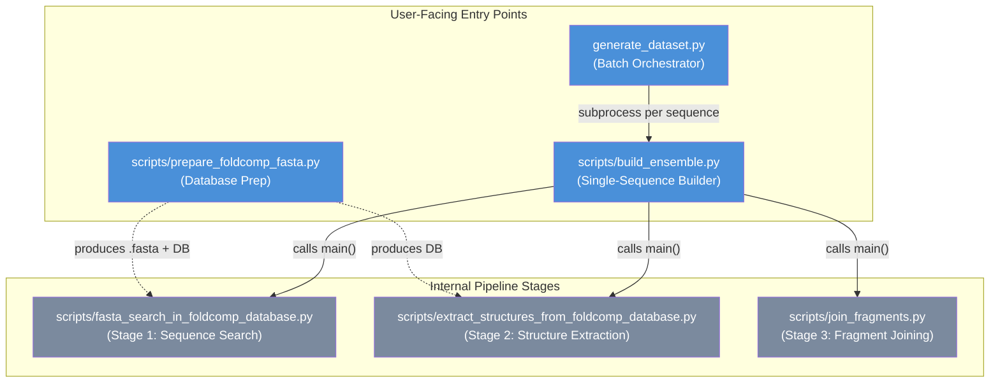

---
slug:13-command-line-configuration-reference
blog_type:normal
---


IDP-o 暴露了**六个命令行接口**，涵盖一个批量调度器、一个核心流水线入口点、三个内部流水线阶段以及一个数据库准备工具。两个主要的面向用户的入口点是 `generate_dataset.py`（批量处理）和 `scripts/build_ensemble.py`（单序列系综构建），而其余脚本由流水线内部调用，但也可在高级工作流中独立运行。每个接口都使用 Python 的 `argparse` 及 `ArgumentDefaultsHelpFormatter`，这意味着 `--help` 输出将始终包含默认值。本参考文档记录了所有标志及其类型、默认值、约束条件以及脚本间的配置传递。

来源：[generate_dataset.py](/generate_dataset.py#L24-L59), [build_ensemble.py](/scripts/build_ensemble.py#L87-L143), [prepare_foldcomp_fasta.py](/scripts/prepare_foldcomp_fasta.py#L121-L128)

## 入口点层次结构

下图阐明了哪些脚本由用户直接调用，哪些由流水线内部调用。当使用 `generate_dataset.py` 时，大部分配置通过其自身的标志进行传递，并通过子进程构建传播至 `build_ensemble.py` —— 在批量级别仅暴露了 `build_ensemble.py` 参数的一个子集。



**Docker 容器**将 `scripts/build_ensemble.py` 设置为其 `ENTRYPOINT`，因此所有 Docker 调用都会将标志直接传递给该脚本。`PYTHONPATH` 被设置为 `/IDP-o/`，以支持跨 `scripts/` 目录的内部模块导入。

来源：[Dockerfile](/Dockerfile#L1-L9), [build_ensemble.py](/scripts/build_ensemble.py#L25-L80)

## `generate_dataset.py` — 批量调度器

这是跨整个数据集（CSV 或 FASTA）生成系综的顶级脚本。它遍历输入序列，为每个序列启动 `build_ensemble.py` 作为子进程。关键设计约束是，**仅传播了 `build_ensemble.py` 参数的一个子集** —— 对 `--foldcomp_fasta`、`--foldcomp_db`、`--n_max_structures_per_fragment`、`--reduction_factor`、`--joins_to_attempt_per_pairing`、`--exclude_cis_omega` 和 `--rmsd_sort` 的高级调整需要直接调用 `build_ensemble.py`。

| 标志 | 短选项 | 类型 | 默认值 | 必需 | 描述 |
|------|-------|------|---------|----------|-------------|
| `--input` | `-i` | `str` | — | **是** | 输入文件路径（`.csv` 或 `.fasta`） |
| `--outfolder` | `-o` | `str` | `./ensembles` | 否 | 生成系综的输出目录 |
| `--max_structures_in_ensemble` | `-n` | `int` | `0` | 否 | 每个系综的帧数；`0` = 试运行（不生成系综） |
| `--fragments_overlap` | | `int` | `1` | 否 | 片段间的重叠残基数 |
| `--column_names` | | `str` | `seq_name,fasta` | 否 | CSV 中以逗号分隔的列名 |
| `--shuffle` | | flag | `False` | 否 | 打乱处理顺序（用于并行化） |
| `--format` | | `str` | `xtc` | 否 | 输出格式：`h5`、`xtc`、`pdb`、`pdb.gz`、`dcd` |
| `--overwrite` | | flag | `False` | 否 | 覆盖已存在的系综文件 |

<CgxTip>`--max_structures_in_ensemble` 的默认值 `0` 被有意设定为试运行模式 —— 脚本会记录警告并退出，不生成任何内容。你**必须**将其设置为正整数才能产生输出。</CgxTip>

**输入格式处理**：当 `--input` 以 `.fasta` 结尾时，解析器将以 `>` 为前缀的标头读取为序列名称，随后的行读取为序列。当以 `.csv` 结尾时，仅加载由 `--column_names` 指定的列。重复的序列名称或序列将被丢弃并发出警告。每个序列的输出文件在 `--outfolder` 中命名为 `{seq_name}.{format}`。

**子进程传播**：对于每个序列，脚本构造一个命令调用 `build_ensemble.py`，并传入 `--sequence`、`--outpath`、`--scratch_folder`（设为 `/tmp/tmp-{seq_name}`）、`--max_structures_in_ensemble` 以及条件性传入的 `--overwrite`。不会转发其他 `build_ensemble.py` 参数，这意味着 Foldcomp 路径、缩减因子、连接尝试和质量过滤器均使用其自身默认值。

来源：[generate_dataset.py](/generate_dataset.py#L67-L125)

## `scripts/build_ensemble.py` — 单序列系综构建器

这是**核心流水线入口点**，也是 Docker 的 `ENTRYPOINT`。它按顺序编排所有三个流水线阶段 —— 序列搜索、结构提取和片段连接。它接受最丰富的配置标志集，是你直接调用以进行单蛋白工作或需要对每个流水线参数进行细粒度控制时的脚本。

| 标志 | 类型 | 默认值 | 必需 | 描述 |
|------|------|---------|----------|-------------|
| `--sequence` | `str` | — | **是** | 氨基酸序列（单字母代码） |
| `--foldcomp_fasta` | `str` | `/data/afdb/afdb_uniprot_v4.fasta` | 否 | Foldcomp 数据库的带偏移量注释的 FASTA |
| `--foldcomp_db` | `str` | `/data/afdb/afdb_uniprot_v4` | 否 | Foldcomp 数据库文件路径 |
| `--n_max_structures_per_fragment` | `int` | `1000` | 否 | 每个片段提取的最大结构数 |
| `--outpath` | `str` | — | **是** | 输出路径；扩展名决定格式（`.h5`、`.xtc`、`.dcd`、`.pdb`、`.pdb.gz`） |
| `--scratch_folder` | `str` | `/tmp` | 否 | 中间文件目录 |
| `--reduction_factor` | `int` | `1` | 否 | 数据库搜索缩减（例如，`10` = 搜索 1/10） |
| `--joins_to_attempt_per_pairing` | `int` | `500000` | 否 | 每个片段对的连接尝试次数 |
| `--max_structures_in_ensemble` | `int` | `100` | 否 | 最终系综中的最大帧数 |
| `--exclude_cis_omega` | flag | `False` | 否 | 排除具有顺式-ω 骨架角的结构 |
| `--rmsd_sort` | flag | `False` | 否 | 基于 RMSD 排序并叠加帧以进行可视化 |
| `--overwrite` | flag | `False` | 否 | 覆盖已存在的输出文件 |

**序列验证**：`main()` 函数验证 `--sequence` 中的每个字符是否属于标准的 20 个氨基酸字母表（`ACDEFGHIKLMNPQRSTVWY`）。非标准残基（包括 `B`、`Z`、`X`、`*`）将引发 `ValueError`。

**临时目录结构**：临时文件夹接收两个产物：一个 `byte_starts.pkl` 文件（来自阶段 1 的搜索结果）和一个 `fragment_ensembles/` 子目录，其中包含来自阶段 2 的每个片段的 `.h5` 文件。当激活 `--exclude_cis_omega` 时，片段目录会附加 `-exclude_cis_omega` 后缀，以避免与未过滤的结果发生冲突。

来源：[build_ensemble.py](/scripts/build_ensemble.py#L25-L80), [build_ensemble.py](/scripts/build_ensemble.py#L87-L166)

## `scripts/prepare_foldcomp_fasta.py` — 数据库准备工具

此一次性设置脚本下载 Foldcomp 数据库，提取其 FASTA，并将标头重写为包含字节偏移量而非蛋白质标签 —— 生成搜索阶段所需的特殊格式 `.fasta` 文件。它是唯一**不**参与系综生成流水线本身的脚本。

| 标志 | 类型 | 默认值 | 必需 | 描述 |
|------|------|---------|----------|-------------|
| `--foldcomp-db` | `str` | `afdb_uniprot_v4` | 否 | Foldcomp 数据库名称（用于 `foldcomp.setup()`） |
| `--threads` | `int` | `8` | 否 | `foldcomp extract` 的线程数 |
| `--workdir` | `str` | `/data/foldcomp_db` | 否 | 下载和提取的工作目录 |

**行为细节**：脚本首先切换到 `--workdir`，然后检查数据库文件是否存在于本地 —— 如果不存在，则调用 `foldcomp.setup()` 进行下载（`afdb_uniprot_v4` 数据库大约为 1.1 TB）。然后，它从 `.index` 和 `.lookup` 伴随文件计算字节偏移映射，使用 `foldcomp` 二进制文件提取原始 FASTA（如果在 `PATH` 中未找到该二进制文件，则自动下载），最后将 FASTA 标头从 `>protein_label` 重写为 `>byte_offset`。

<CgxTip>`foldcomp` 二进制文件通过 `shutil.which()` 自动检测，若未找到则回退到当前目录下的 `./foldcomp`，最后对于 Windows (x64)、macOS (universal) 和 Linux (x86_64 / arm64) 平台，会从 `mmseqs.com` 自动下载。如果未预装该二进制文件，请确保网络可访问。</CgxTip>

来源：[prepare_foldcomp_fasta.py](/scripts/prepare_foldcomp_fasta.py#L33-L149)

## `scripts/fasta_search_in_foldcomp_database.py` — 阶段 1：序列搜索

此 GPU 加速阶段在带偏移量注释的 FASTA 中搜索每个片段序列的所有实例。它由 `build_ensemble.py` 内部调用，但也可独立运行以进行调试或预计算搜索结果。

| 标志 | 类型 | 默认值 | 必需 | 描述 |
|------|------|---------|----------|-------------|
| `--sequence` | `str` | — | **是** | 要切片和搜索的完整蛋白质序列 |
| `--foldcomp_fasta` | `str` | `/data/afdb/afdb_uniprot_v4.fasta` | 否 | 带偏移量注释的 FASTA 路径 |
| `--pkl_outpath` | `str` | — | **是** | 搜索命中数据的输出 `.pkl` 路径 |
| `--reduction_factor` | `int` | `1` | 否 | 比例缩减（例如，`10` = 搜索 1/10 的数据库） |

**内部片段生成**：`main()` 函数使用硬编码参数 `overlap=2` 和 `seq_len=6`（生成具有 2 个残基重叠的 6 残基片段）对输入序列进行切片。这些未作为 CLI 标志暴露。`--reduction_factor` 控制扫描 FASTA 文件的比例 —— 值为 `N` 意味着仅搜索文件（按字节大小）的 `1/N`，以速度换取召回率。

**输出格式**：序列化输出是一个字典，将每个片段字符串映射到由三个 NumPy 数组组成的 3 元组：`(hit_idxs, byte_starts, aa_start_index)`，其中 `byte_starts` 是 Foldcomp 数据库文件中的字节偏移量，`aa_start_index` 是匹配在命中蛋白质中开始的残基索引。

来源：[fasta_search_in_foldcomp_database.py](/scripts/fasta_search_in_foldcomp_database.py#L155-L193)

## `scripts/extract_structures_from_foldcomp_database.py` — 阶段 2：结构提取

此阶段读取搜索命中，定位到 Foldcomp 数据库中，使用 JAX 编译的函数从压缩的内部坐标表示重建 3D 坐标，并写入每个片段的 HDF5 轨迹文件。

| 标志 | 类型 | 默认值 | 必需 | 描述 |
|------|------|---------|----------|-------------|
| `--byte_starts_path` | `str` | `example/byte_starts.pkl` | **是** | 来自阶段 1 的序列化搜索命中 |
| `--foldcomp_fasta` | `str` | `/data/afdb/afdb_uniprot_v4.fasta` | 否 | 带偏移量注释的 FASTA 路径 |
| `--foldcomp_db` | `str` | `/data/afdb/afdb_uniprot_v4` | 否 | Foldcomp 数据库文件路径 |
| `--outfolder` | `str` | — | **是** | 每个片段的 `.h5` 文件的输出目录 |
| `--n_max_structures_per_fragment` | `int` | `1000` | 否 | 每个片段提取的最大结构数 |
| `--exclude_cis_omega` | flag | `False` | 否 | 过滤掉具有顺式-ω 角（|ω| ≤ 90°）的结构 |

**顺式-ω 过滤**：当激活 `--exclude_cis_omega` 时，提取步骤会检查每个候选结构的 omega 骨架角。**所有** omega 角满足 `|ω| > 90°`（即呈反式样）的结构被保留；任何至少具有一个顺式样 omega 的结构将被丢弃。这是一个保守的过滤器 —— 它要求片段中的每个 omega 都是反式样，而不仅仅是大多数。

**JAX 编译**：该模块在导入时设置 `JAX_PLATFORMS=cpu`，强制所有 JAX 计算在 CPU 上执行，即使有可用的 GPU。这是有意为之 —— 阶段 2 是计算轻量但内存密集型的，GPU 被保留用于阶段 1 基于 CuPy 的搜索。

来源：[extract_structures_from_foldcomp_database.py](/scripts/extract_structures_from_foldcomp_database.py#L17-L18), [extract_structures_from_foldcomp_database.py](/scripts/extract_structures_from_foldcomp_database.py#L277-L325)

## `scripts/join_fragments.py` — 阶段 3：片段连接

此阶段加载每个片段的 HDF5 文件，执行带有重叠对齐和冲突检测的分层成对连接，并写入最终的系综轨迹。

| 标志 | 类型 | 默认值 | 必需 | 描述 |
|------|------|---------|----------|-------------|
| `--sequence` | `str` | — | **是** | 完整的蛋白质序列 |
| `--fragments_folder` | `str` | — | **是** | 包含每个片段 `.h5` 文件的目录 |
| `--outpath` | `str` | — | **是** | 输出轨迹路径 |
| `--joins_to_attempt_per_pairing` | `int` | `500000` | 否 | 每个片段对的随机连接尝试次数 |
| `--max_structures_in_ensemble` | `int` | `500000` | 否 | 最终系综中的最大帧数 |
| `--rmsd_sort` | flag | `False` | 否 | 基于 RMSD 排序并叠加帧 |
| `--overwrite` | flag | `False` | 否 | 覆盖已存在的输出文件 |

**默认值差异说明**：当独立调用时，`--max_structures_in_ensemble` 默认为 `500000`，但当从 `build_ensemble.py` 调用时，它接收到的默认值为 `100`。这意味着独立运行时的默认值实际上是“保留所有有效连接”，而流水线默认值则更具选择性。在独立运行阶段 3 时请注意此差异。

**XLA 内存配置**：该模块在导入时设置 `XLA_PYTHON_CLIENT_MEM_FRACTION=.96`，为 JAX 编译保留 96% 的可用加速器内存。这对于向量化连接操作至关重要，且无法通过 CLI 配置 —— 如需更改，必须在源代码中修改。

**RMSD 排序**：当激活 `--rmsd_sort` 时，最终轨迹会叠加到第 0 帧，然后帧按 RMSD 空间中的贪婪最近邻重新排序。这会产生更平滑的可视化效果，但对于大型系综会增加显著的计算量。

来源：[join_fragments.py](/scripts/join_fragments.py#L22-L23), [join_fragments.py](/scripts/join_fragments.py#L323-L347)

## 环境变量

流水线依赖于在源代码内导入时设置的两个环境变量。这些**未**作为 CLI 标志暴露，需要修改源代码或通过 Docker `ENV` 覆盖才能更改。

| 变量 | 设置位置 | 值 | 用途 |
|----------|--------|-------|---------|
| `JAX_PLATFORMS` | `extract_structures_from_foldcomp_database.py` | `cpu` | 强制阶段 2 的 JAX 计算在 CPU 上执行 |
| `XLA_PYTHON_CLIENT_MEM_FRACTION` | `join_fragments.py` | `.96` | 为阶段 3 保留 96% 的加速器内存 |
| `PYTHONPATH` | `Dockerfile` | `/IDP-o/` | 支持 `scripts/` 中的跨模块导入 |

来源：[extract_structures_from_foldcomp_database.py](/scripts/extract_structures_from_foldcomp_database.py#L17), [join_fragments.py](/scripts/join_fragments.py#L22), [Dockerfile](/Dockerfile#L6)

## 输出格式参考

`--format` 标志（在 `generate_dataset.py` 中）和 `--outpath` 扩展名（在 `build_ensemble.py` 和 `join_fragments.py` 中）决定输出轨迹格式。所有格式都包含由 `nerfax.reduce_utils.reconstruct_from_mdtraj` 推断的氢原子。

| 格式 | 扩展名 | 备注 |
|--------|-----------|-------|
| HDF5 | `.h5` | MDTraj HDF5；原生往返；推荐用于大型系综 |
| XTC | `.xtc` | Gromacs XTC；自动生成伴随的 `.pdb` 拓扑文件 |
| DCD | `.dcd` | CHARMM DCD；自动生成伴随的 `.pdb` 拓扑文件 |
| PDB | `.pdb` | 每帧一个 PDB 文件（多模型） |
| 压缩 PDB | `.pdb.gz` | Gzip 压缩的多模型 PDB |

对于 XTC 和 DCD 格式，`join_fragments.py` 会自动在轨迹旁保存一个单帧 `.pdb` 文件，以提供下游工具所需的拓扑参考。

来源：[join_fragments.py](/scripts/join_fragments.py#L318-L319), [generate_dataset.py](/generate_dataset.py#L52-L57)

## 配置传递映射

当使用 `generate_dataset.py` 时，下表确切显示了哪些 `build_ensemble.py` 参数从调度器接收值，哪些回落至其内置默认值。这对于了解每个调用级别可用的调整旋钮至关重要。

| `build_ensemble.py` 参数 | 由 `generate_dataset.py` 设置 | 值来源 | 未传递时的默认值 |
|-------------------------------|------------------------------|--------------|---------------------------|
| `--sequence` | ✅ 是 | 输入 CSV/FASTA 行 | — |
| `--outpath` | ✅ 是 | `{outfolder}/{seq_name}.{format}` | — |
| `--scratch_folder` | ✅ 是 | `/tmp/tmp-{seq_name}` | — |
| `--max_structures_in_ensemble` | ✅ 是 | `-n` 标志值 | — |
| `--overwrite` | ✅ 是 | `--overwrite` 标志 | — |
| `--foldcomp_fasta` | ❌ 否 | 内置默认值 | `/data/afdb/afdb_uniprot_v4.fasta` |
| `--foldcomp_db` | ❌ 否 | 内置默认值 | `/data/afdb/afdb_uniprot_v4` |
| `--n_max_structures_per_fragment` | ❌ 否 | 内置默认值 | `1000` |
| `--reduction_factor` | ❌ 否 | 内置默认值 | `1` |
| `--joins_to_attempt_per_pairing` | ❌ 否 | 内置默认值 | `500000` |
| `--exclude_cis_omega` | ❌ 否 | 内置默认值 | `False` |
| `--rmsd_sort` | ❌ 否 | 内置默认值 | `False` |

六个未传递的参数代表了**高级调整面** —— 若要控制它们，请直接调用 `build_ensemble.py`（或通过 Docker），而不是通过批量调度器。

来源：[generate_dataset.py](/generate_dataset.py#L103-L118), [build_ensemble.py](/scripts/build_ensemble.py#L87-L143)

## Docker 调用模式

Docker 镜像使用 `scripts/build_ensemble.py` 作为其 `ENTRYPOINT`，因此镜像名称后的所有标志都直接映射到该脚本的参数解析器。以下模式涵盖了最常见的工作流。

**单序列系综生成**（GPU 加速搜索 + CPU 重建）：
```bash
docker run -v $(pwd):/data --gpus 1 \
  idp-o \
    --sequence DLIVERANDSANDRDANDCARLDANDMICHELEANDLDHIEANDFADIDANDSTEFANDANDISTVANANDALDERTANDDLIVERAGAINPLASDTHERS \
    --outpath /data/output/ensemble.xtc \
    --scratch_folder /data/output/scratch \
    --foldcomp_fasta /data/afdb_uniprot_v4.fasta \
    --foldcomp_db /data/afdb_uniprot_v4 \
    --n_max_structures_per_fragment 100 \
    --max_structures_in_ensemble 50
```

**数据库准备**（覆盖 ENTRYPOINT）：
```bash
docker run -v $(pwd):/data --entrypoint python idp-o \
  /IDP-o/scripts/prepare_foldcomp_fasta.py --workdir /data
```

**批量生成**（覆盖 ENTRYPOINT）：
```bash
docker run -v $(pwd):/data --gpus 1 --entrypoint python idp-o \
  /IDP-o/generate_dataset.py \
    --input /data/sequences.csv \
    --outfolder /data/ensembles \
    --max_structures_in_ensemble 50 \
    --format xtc
```

来源：[Dockerfile](/Dockerfile#L1-L9), [README.md](/README.md#L44-L52)

## 快速参考：所有脚本的所有标志

为便于快速查找，以下汇总表列出了所有六个脚本中的每个 CLI 标志及其类型和默认值。

| 脚本 | 标志 | 类型 | 默认值 | 必需 |
|--------|------|------|---------|----------|
| `generate_dataset.py` | `--input` / `-i` | `str` | — | 是 |
| `generate_dataset.py` | `--outfolder` / `-o` | `str` | `./ensembles` | 否 |
| `generate_dataset.py` | `--max_structures_in_ensemble` / `-n` | `int` | `0` | 否 |
| `generate_dataset.py` | `--fragments_overlap` | `int` | `1` | 否 |
| `generate_dataset.py` | `--column_names` | `str` | `seq_name,fasta` | 否 |
| `generate_dataset.py` | `--shuffle` | flag | `False` | 否 |
| `generate_dataset.py` | `--format` | `str` | `xtc` | 否 |
| `generate_dataset.py` | `--overwrite` | flag | `False` | 否 |
| `build_ensemble.py` | `--sequence` | `str` | — | 是 |
| `build_ensemble.py` | `--foldcomp_fasta` | `str` | `/data/afdb/afdb_uniprot_v4.fasta` | 否 |
| `build_ensemble.py` | `--foldcomp_db` | `str` | `/data/afdb/afdb_uniprot_v4` | 否 |
| `build_ensemble.py` | `--n_max_structures_per_fragment` | `int` | `1000` | 否 |
| `build_ensemble.py` | `--outpath` | `str` | — | 是 |
| `build_ensemble.py` | `--scratch_folder` | `str` | `/tmp` | 否 |
| `build_ensemble.py` | `--reduction_factor` | `int` | `1` | 否 |
| `build_ensemble.py` | `--joins_to_attempt_per_pairing` | `int` | `500000` | 否 |
| `build_ensemble.py` | `--max_structures_in_ensemble` | `int` | `100` | 否 |
| `build_ensemble.py` | `--exclude_cis_omega` | flag | `False` | 否 |
| `build_ensemble.py` | `--rmsd_sort` | flag | `False` | 否 |
| `build_ensemble.py` | `--overwrite` | flag | `False` | 否 |
| `prepare_foldcomp_fasta.py` | `--foldcomp-db` | `str` | `afdb_uniprot_v4` | 否 |
| `prepare_foldcomp_fasta.py` | `--threads` | `int` | `8` | 否 |
| `prepare_foldcomp_fasta.py` | `--workdir` | `str` | `/data/foldcomp_db` | 否 |
| `fasta_search_in_foldcomp_database.py` | `--sequence` | `str` | — | 是 |
| `fasta_search_in_foldcomp_database.py` | `--foldcomp_fasta` | `str` | `/data/afdb/afdb_uniprot_v4.fasta` | 否 |
| `fasta_search_in_foldcomp_database.py` | `--pkl_outpath` | `str` | — | 是 |
| `fasta_search_in_foldcomp_database.py` | `--reduction_factor` | `int` | `1` | 否 |
| `extract_structures_from_foldcomp_database.py` | `--byte_starts_path` | `str` | `example/byte_starts.pkl` | 是 |
| `extract_structures_from_foldcomp_database.py` | `--foldcomp_fasta` | `str` | `/data/afdb/afdb_uniprot_v4.fasta` | 否 |
| `extract_structures_from_foldcomp_database.py` | `--foldcomp_db` | `str` | `/data/afdb/afdb_uniprot_v4` | 否 |
| `extract_structures_from_foldcomp_database.py` | `--outfolder` | `str` | — | 是 |
| `extract_structures_from_foldcomp_database.py` | `--n_max_structures_per_fragment` | `int` | `1000` | 否 |
| `extract_structures_from_foldcomp_database.py` | `--exclude_cis_omega` | flag | `False` | 否 |
| `join_fragments.py` | `--sequence` | `str` | — | 是 |
| `join_fragments.py` | `--fragments_folder` | `str` | — | 是 |
| `join_fragments.py` | `--outpath` | `str` | — | 是 |
| `join_fragments.py` | `--joins_to_attempt_per_pairing` | `int` | `500000` | 否 |
| `join_fragments.py` | `--max_structures_in_ensemble` | `int` | `500000` | 否 |
| `join_fragments.py` | `--rmsd_sort` | flag | `False` | 否 |
| `join_fragments.py` | `--overwrite` | flag | `False` | 否 |

来源：[generate_dataset.py](/generate_dataset.py#L24-L59), [build_ensemble.py](/scripts/build_ensemble.py#L87-L143), [prepare_foldcomp_fasta.py](/scripts/prepare_foldcomp_fasta.py#L121-L128), [fasta_search_in_foldcomp_database.py](/scripts/fasta_search_in_foldcomp_database.py#L168-L193), [extract_structures_from_foldcomp_database.py](/scripts/extract_structures_from_foldcomp_database.py#L277-L316), [join_fragments.py](/scripts/join_fragments.py#L323-L337)

## 下一步

有关这些参数背后的架构原理 —— 特别是为什么片段长度固定为 6、重叠固定为 2，以及分层连接策略如何确定 `--joins_to_attempt_per_pairing` —— 请参阅[片段生成策略](5-fragment-generation-strategy)和[分层片段连接](8-hierarchical-fragment-joining)。有关输出格式细节和下游使用模式，请参阅[输出格式与下游使用](12-output-formats-and-downstream-use)。