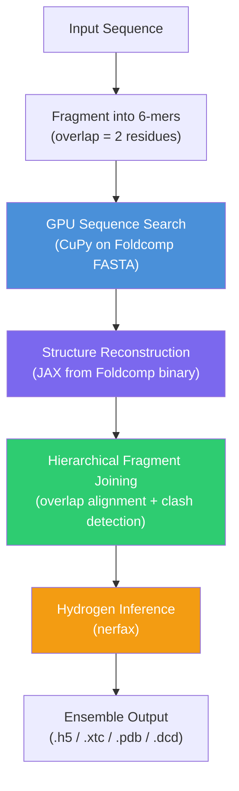

---
slug:2-quick-start
blog_type:normal
---


通过四个步骤让 IDP-o 端到端地运行起来：克隆、构建、准备数据库以及生成你的首个系综。本页将通过准确的命令引导你完成每一步，解释你需要的每一个参数，并在你准备深入探索时为你指引更详细的文档。


## 前提条件

在开始之前，请验证你的环境满足以下要求：

| 要求 | 详情 |
|---|---|
| **Docker** | Docker Engine 20+ 并已安装 NVIDIA Container Toolkit |
| **GPU** | 支持 CUDA 12 的 NVIDIA GPU（基于 CuPy 的 GPU 加速序列搜索所需） |
| **磁盘空间** | 约 1.1 TB，用于存放 `afdb_uniprot_v4` Foldcomp 数据库（仅需下载一次） |
| **平台** | Linux x86_64（Docker 镜像目标为 `linux/amd64`） |

Docker 镜像基于 `nvcr.io/nvidia/jax:24.10-py3` 构建，其中捆绑了 JAX、CUDA 12 和 Python 3——因此你**无需**在宿主机上安装任何 Python 依赖。

来源：[Dockerfile](/Dockerfile#L1-L9), [README.md](/README.md#L1-L76)

## 快速入门工作流

以下四个步骤构成了从全新克隆到可用系综的线性流水线。步骤 2（数据库准备）是一次性开销；后续的系综生成将完全跳过此步骤。


来源：[README.md](/README.md#L16-L52), [scripts/build_ensemble.py](/scripts/build_ensemble.py#L73-L167)

## 步骤 1 — 克隆并构建 Docker 镜像

克隆仓库并构建容器。`--platform=linux/amd64` 标志确保了即使在基于 ARM 的 Docker 宿主机（如搭载 Rosetta 的 Apple Silicon）上也能兼容运行：

```bash
# 克隆仓库
git clone https://github.com/PeptoneLtd/IDP-o
cd IDP-o

# 构建 Docker 镜像
docker build --platform=linux/amd64 . -t idp-o
```

构建过程会在容器内安装六个运行时依赖：**foldcomp**（数据库 I/O）、**tables**（HDF5 支持）、**cupy-cuda12x**（GPU 序列搜索）、**hirola**（用于氨基酸查找的哈希表）、**pynmrstar**（NMR STAR 格式）、**joblib**（并行化）以及 **nerfax**（JAX 加速的坐标重建）。你无需在宿主机上安装这些——Docker 会处理一切。

来源：[Dockerfile](/Dockerfile#L1-L9), [README.md](/README.md#L16-L21)

## 步骤 2 — 准备 Foldcomp 数据库

IDP-o 在 **AlphaFoldDB**（通过 Foldcomp 发行）中搜索与你蛋白质子序列匹配的结构片段。该数据库以压缩二进制文件形式提供，但 IDP-o 需要一个配套的 FASTA 文件，其中每条记录的头部编码了在 Foldcomp 数据库中的**字节偏移量**：

```
> {byte_offset_in_foldcomp_db}
{amino_acid_sequence}
```

一个便捷脚本可自动完成下载和 FASTA 生成：

```bash
docker run -v $(pwd):/data --entrypoint python idp-o \
  /IDP-o/scripts/prepare_foldcomp_fasta.py --workdir /data
```

此命令按顺序执行三项操作：(1) 将 `afdb_uniprot_v4` Foldcomp 数据库下载到你的工作目录（约 1.1 TB），(2) 使用 Foldcomp 二进制文件提取原始 FASTA，以及 (3) 将每条记录的头部重新映射为其在数据库文件中的字节偏移量，生成 `afdb_uniprot_v4.fasta`。在后续运行中，该脚本会检测现有文件并自动跳过已完成的步骤。

<CgxTip>`--workdir` 标志控制数据库和 FASTA 文件的写入位置。在后续所有的 `docker run` 命令中挂载同一目录（`-v $(pwd):/data`），以便 IDP-o 能够找到这些文件。</CgxTip>

来源：[scripts/prepare_foldcomp_fasta.py](/scripts/prepare_foldcomp_fasta.py#L97-L150), [README.md](/README.md#L23-L37)

## 步骤 3 — 生成你的首个系综

数据库准备就绪后，即可为单个蛋白质序列生成系综。以下示例使用了一条 69 残基的天然无序序列：

```bash
docker run -v $(pwd):/data --gpus 1 \
  idp-o \
    --sequence DLIVERANDSANDRDANDCARLDANDMICHELEANDLDHIEANDFADIDANDSTEFANDANDISTVANANDALDERTANDDLIVERAGAINPLASDTHERS \
    --outpath /data/example/ensemble.h5 \
    --scratch_folder /data/example/ \
    --foldcomp_fasta /data/afdb_uniprot_v4.fasta \
    --foldcomp_db /data/afdb_uniprot_v4 \
    --n_max_structures_per_fragment 100
```

`--gpus 1` 标志向容器暴露一块 NVIDIA GPU，用于 CuPy 加速的序列搜索阶段。`--sequence` 参数仅接受由**标准 20 种氨基酸**组成的字符串——非标准残基将导致 `ValueError`。

### 核心参数

| 参数 | 必需 | 默认值 | 描述 |
|---|---|---|---|
| `--sequence` | **是** | — | 目标蛋白质序列（标准 20 种氨基酸） |
| `--outpath` | **是** | — | 输出文件路径；扩展名决定格式（`.h5`、`.xtc`、`.dcd`、`.pdb`、`.pdb.gz`） |
| `--scratch_folder` | 否 | `/tmp` | 用于存放中间片段 `.h5` 文件的目录 |
| `--foldcomp_fasta` | 否 | `/data/afdb/afdb_uniprot_v4.fasta` | 步骤 2 生成的偏移量编码 FASTA 文件 |
| `--foldcomp_db` | 否 | `/data/afdb/afdb_uniprot_v4` | Foldcomp 数据库二进制文件路径 |
| `--n_max_structures_per_fragment` | 否 | `1000` | 从数据库中为每个 6 残基片段提取的最大结构数 |
| `--max_structures_in_ensemble` | 否 | `100` | 最终输出系综中的结构数量 |
| `--reduction_factor` | 否 | `1` | 搜索数据库的比例（例如，`10` = 搜索 1/10） |
| `--exclude_cis_omega` | 否 | `False` | 过滤掉具有顺式 ω 骨架角的结构 |
| `--rmsd_sort` | 否 | `False` | 按 RMSD 接近度对输出帧排序，以实现更平滑的可视化 |
| `--overwrite` | 否 | `False` | 覆盖已存在的输出文件 |

来源：[scripts/build_ensemble.py](/scripts/build_ensemble.py#L115-L167), [README.md](/README.md#L39-L52)

### 内部运行机制

当你运行上述命令时，三个流水线阶段将按顺序执行：



1. **片段化 + 搜索** — 序列被切分为带有 2 残基重叠的 6 残基片段。每个片段使用 GPU 加速的子串匹配在 Foldcomp 数据库中进行搜索。命中结果被记录为字节偏移量，以便直接访问数据库。
2. **提取 + 重建** — 对于每个片段，从 Foldcomp 二进制文件中加载最多 `n_max_structures_per_fragment` 个命中结果。JAX 编译的重建函数将压缩的内部坐标（骨架角、扭转角、侧链角）解码为包含所有重原子的完整 3D 坐标。
3. **拼接 + 输出** — 片段系综使用重叠比对和冲突检测进行分层合并（按 2 的幂次分组）。存活的结构将接受氢原子推断，并写入指定的输出格式。

来源：[scripts/build_ensemble.py](/scripts/build_ensemble.py#L34-L70), [scripts/fasta_search_in_foldcomp_database.py](/scripts/fasta_search_in_foldcomp_database.py#L37-L136), [scripts/extract_structures_from_foldcomp_database.py](/scripts/extract_structures_from_foldcomp_database.py#L200-L326), [scripts/join_fragments.py](/scripts/join_fragments.py#L286-L334)

## 步骤 4 — 检查输出

系综以多帧轨迹文件保存。以下是使用 **MDTraj**（容器内已提供）读取它的方法：

```python
import mdtraj as md

# 加载系综
t = md.load("example/ensemble.h5")

print(f"Frames:   {t.n_frames}")       # 构象数量
print(f"Residues: {t.n_residues}")     # 应与输入序列长度匹配
print(f"Atoms:    {t.n_atoms}")        # 重原子 + 推断的氢原子
```

### 支持的输出格式

| 格式 | 扩展名 | 备注 |
|---|---|---|
| HDF5 | `.h5` | 推荐；MDTraj 原生格式，快速随机访问 |
| XTC | `.xtc` | GROMACS 压缩轨迹；会自动生成配套的 `.pdb` 拓扑文件 |
| DCD | `.dcd` | CHARMM/NAMD 格式；会自动生成配套的 `.pdb` 拓扑文件 |
| PDB | `.pdb` | 单个多模型 PDB 文件 |
| 压缩 PDB | `.pdb.gz` | Gzip 压缩的 PDB 文件 |

来源：[scripts/join_fragments.py](/scripts/join_fragments.py#L309-L319)

## 批量数据集生成

要一次性处理多个序列，请使用 `generate_dataset.py` 并传入 CSV 或 FASTA 输入文件。CSV 必须包含两列（可通过 `--column_names` 配置）：一列用于序列名称，一列用于氨基酸字符串。

```bash
docker run -v $(pwd):/data --gpus 1 --entrypoint python idp-o \
  /IDP-o/generate_dataset.py \
    --input /data/sequences.csv \
    --outfolder /data/ensembles/ \
    --max_structures_in_ensemble 100 \
    --format h5
```

### 批量参数

| 参数 | 默认值 | 描述 |
|---|---|---|
| `--input` / `-i` | — | 输入 CSV 或 FASTA 文件（必需） |
| `--outfolder` / `-o` | `./ensembles` | 系综文件的输出目录 |
| `--max_structures_in_ensemble` / `-n` | `0`（不生成） | 每个系综的帧数；必须 > 0 才能触发生成 |
| `--format` | `xtc` | 输出格式：`h5`、`xtc`、`pdb`、`pdb.gz`、`dcd` |
| `--shuffle` | `False` | 随机化处理顺序（适用于并行运行） |
| `--overwrite` | `False` | 覆盖已存在的系综文件 |

<CgxTip>将 `-n` 设置为正整数——默认值 `0` 是一个安全防护，它会记录警告并完全跳过系综生成。这允许你在提交长时间计算之前验证输入文件。</CgxTip>

来源：[generate_dataset.py](/generate_dataset.py#L24-L126)

## 故障排除

| 症状 | 原因 | 解决方案 |
|---|---|---|
| `ValueError: Input sequence contains invalid amino acid` | `--sequence` 中存在非标准残基 | 移除 B、Z、X 或其他非标准代码；仅接受 20 种标准氨基酸 |
| `ensemble file already exists` | 输出路径已存在文件 | 在命令中添加 `--overwrite` |
| `mask is all zero, retrying` | 片段拼接未找到无冲突的比对 | 增加 `--n_max_structures_per_fragment` 以扩大片段候选池 |
| Docker 在 ARM 上构建失败 | 缺少 `--platform` 标志 | 使用 `docker build --platform=linux/amd64 . -t idp-o` |
| 首次系综生成缓慢 | 首次运行时 JAX JIT 编译 | 同一容器内的后续系综生成将复用已编译的内核；冷启动仅为一次性开销 |

来源：[scripts/build_ensemble.py](/scripts/build_ensemble.py#L42-L48), [scripts/join_fragments.py](/scripts/join_fragments.py#L215-L223)

## 后续步骤

现在你已经生成了首个系综，可以深入探索其架构与算法：

1. **数据库设置详情** — [Foldcomp 数据库设置](3-foldcomp-database-setup) 涵盖了高级配置、替代数据库和节省磁盘空间的策略。
2. **工作原理** — [架构概览](4-architecture-overview) 解释了三阶段流水线及脚本间的数据流。
3. **片段策略** — [片段生成策略](5-fragment-generation-strategy) 详述了 6-mer 重叠方案及其数学依据。
4. **输出格式** — [输出格式及下游应用](12-output-formats-and-downstream-use) 展示了如何将系综输入到 NMR、MD 或 ML 工作流中。
5. **完整 CLI 参考** — [命令行配置参考](13-command-line-configuration-reference) 记录了每个标志的类型、默认值和作用。