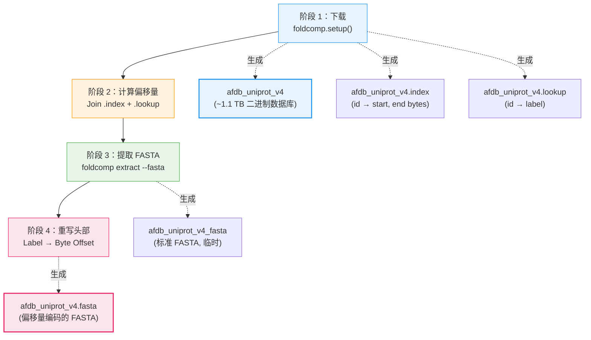

---
slug:3-foldcomp-database-setup
blog_type:normal
---


IDP-o 依赖 **Foldcomp** 压缩结构数据库——具体而言是 AlphaFold DB UniProt v4 版本（`afdb_uniprot_v4`）——作为其片段级结构模板的来源。然而，仅有数据库是不够的。IDP-o 需要一个**特殊格式的 FASTA 文件**，其中每个头部包含对应条目在原始 Foldcomp 数据库文件中的字节偏移量。这种编码了偏移量的 FASTA 文件，正是实现 GPU 加速的字节级序列搜索、从而驱动整个流水线的关键。本页将详述此自定义格式存在的原因、安装脚本的产出内容，以及如何运行它。

来源：[README.md](/README.md#L26-L42)，[prepare_foldcomp_fasta.py](/scripts/prepare_foldcomp_fasta.py#L1-L30)

## 为什么需要自定义 FASTA 格式？

标准 FASTA 格式使用描述性头部（例如 `>AF-Q9H2S5-F1-model_v4`），虽易于人工阅读，但在计算上是不透明的。IDP-o 的搜索引擎（`fasta_search_in_foldcomp_database.py`）通过 CuPy 经 GPU 加速的模式匹配，在**原始字节级别**扫描 FASTA 文件。当找到一个片段序列时，搜索引擎必须立即知道该结构的压缩数据**位于 Foldcomp 数据库二进制文件的何处**，而无需进行二次查找。通过将字节偏移量直接嵌入 FASTA 头部，搜索引擎能在单次遍历中将序列命中映射到数据库的寻道位置，从而在热路径中消除整个连接操作。

最终生成的格式如下所示：

```
>677
LPYPAHLEILVQTLRYWIRDVSSL
>14402
MKVILLFVGLSF...
```

此处，`677` 表示 `LPYPAHLEILVQTLRYWIRDVSSL` 的 Foldcomp 数据库条目起始于 `afdb_uniprot_v4` 二进制文件的**字节 677** 处。下游结构提取器会打开数据库文件，寻道至该字节位置，并直接读取压缩的主链和侧链数据。

来源：[fasta_search_in_foldcomp_database.py](/scripts/fasta_search_in_foldcomp_database.py#L40-L63)，[extract_structures_from_foldcomp_database.py](/scripts/extract_structures_from_foldcomp_database.py#L83-L103)

## 安装流水线概述

准备脚本 `prepare_foldcomp_fasta.py` 执行一个四阶段的流水线，将原始 Foldcomp 发行版转换为 IDP-o 所需的两个产物：



每个阶段都是**幂等**的——脚本会检查现有产物并跳过已完成的阶段，因此在中断后重新运行是安全的。

来源：[prepare_foldcomp_fasta.py](/scripts/prepare_foldcomp_fasta.py#L120-L150)

## 阶段详情

### 阶段 1 — 数据库下载

脚本调用 `foldcomp.setup("afdb_uniprot_v4")`，从 Foldcomp 发行版服务器下载官方 Foldcomp 数据库。此操作会生成核心二进制数据库文件及其附带的 `.index` 和 `.lookup` 制表符分隔文件。下载量约为 **1.1 TB**，是最耗时的阶段。如果数据库文件已在本地存在，则完全跳过下载。

来源：[prepare_foldcomp_fasta.py](/scripts/prepare_foldcomp_fasta.py#L133-L137)

### 阶段 2 — 偏移量映射计算

此阶段通过连接两个 Foldcomp 辅助文件，构建从**蛋白质标签 → 字节偏移量**的关键映射：

| 文件 | 列 | 用途 |
|------|---------|---------|
| `afdb_uniprot_v4.index` | `id`，`start`，`end` | 将内部数字 ID 映射到数据库二进制文件中的字节范围 |
| `afdb_uniprot_v4.lookup` | `id`，`label`，`other` | 将内部数字 ID 映射到人类可读标签（如 UniProt 编号） |

连接过程如下：在共享的 `id` 列上执行 `lookup.join(index)`，然后以 `label` 重新索引，并将 `start` 列提取到字典中。这会生成一个 `dict[str, int]`，其中每个键是蛋白质标签，每个值是其在数据库文件中的字节起始位置。

来源：[prepare_foldcomp_fasta.py](/scripts/prepare_foldcomp_fasta.py#L33-L49)

### 阶段 3 — FASTA 提取

脚本调用 **foldcomp CLI 二进制文件**，使用 `extract --fasta` 子命令将数据库中的所有序列解压为标准 FASTA 文件（`afdb_uniprot_v4_fasta`）。如果在 `PATH` 或当前目录中未找到 `foldcomp` 二进制文件，脚本会**自动下载**相应平台的二进制文件：

| 平台 | 架构 | 下载 URL 模式 |
|----------|-------------|---------------------|
| Linux | x86_64 | `foldcomp-linux-x86_64.tar.gz` |
| Linux | arm64 | `foldcomp-linux-arm64.tar.gz` |
| macOS | universal | `foldcomp-macos-universal.tar.gz` |
| Windows | x64 | `foldcomp-windows-x64.zip` |

提取的 FASTA 使用标准头部（蛋白质标签），这是阶段 4 重写步骤的输入。如果 `_fasta` 文件已存在，则跳过提取。

来源：[prepare_foldcomp_fasta.py](/scripts/prepare_foldcomp_fasta.py#L52-L103)

### 阶段 4 — 头部重写

最后阶段逐行读取阶段 3 生成的标准 FASTA，并将其重写至输出文件（`afdb_uniprot_v4.fasta`）。对于每个头部行，在阶段 2 生成的偏移量映射中查找蛋白质标签，并将该标签替换为对应的字节偏移量。序列行原样保留不变。最终结果即为 IDP-o 搜索引擎所使用的偏移量编码 FASTA 文件。

来源：[prepare_foldcomp_fasta.py](/scripts/prepare_foldcomp_fasta.py#L106-L117)

## 运行安装

### 快速命令

推荐的方法是使用 IDP-o Docker 镜像，该镜像已包含 `foldcomp` Python 包及所有依赖项：

```bash
docker run -v $(pwd):/data \
  --entrypoint python idp-o \
  /IDP-o/scripts/prepare_foldcomp_fasta.py \
  --workdir /data
```

此命令会将数据库下载到当前工作目录，并生成所需的两个产物。

来源：[README.md](/README.md#L34-L42)

### CLI 参数

| 参数 | 默认值 | 描述 |
|-----------|---------|-------------|
| `--foldcomp-db` | `afdb_uniprot_v4` | 要下载和处理的 Foldcomp 数据库名称 |
| `--threads` | `8` | `foldcomp extract` 操作的线程数 |
| `--workdir` | `/data/foldcomp_db` | 所有下载和生成文件的工作目录 |

来源：[prepare_foldcomp_fasta.py](/scripts/prepare_foldcomp_fasta.py#L120-L128)

### 自定义数据库名称

如果你拥有不同的 Foldcomp 数据库（例如自定义子集），可通过 `--foldcomp-db` 指定其名称。脚本期望 `foldcomp.setup()` 能够下载该数据库，且生成的文件将遵循 `{db_name}` 和 `{db_name}.fasta` 的命名模式。

### 磁盘空间与时间估算

| 阶段 | 磁盘空间 | 典型耗时 |
|-------|-----------|-----------------|
| 数据库下载 | ~1.1 TB | 数小时（取决于网络） |
| 偏移量映射计算 | ~可忽略不计（内存中） | 数分钟 |
| FASTA 提取 | ~数十 GB（临时） | 数十分钟 |
| 头部重写 | ~数十 GB（输出 FASTA） | 数分钟 |
| **总计** | **~1.1 TB+** | **数小时** |

阶段 3 生成的临时 `_fasta` 文件与最终 `.fasta` 输出文件占用同量级的空间。脚本完成后，你可以安全地删除 `afdb_uniprot_v4_fasta`——运行时仅需二进制数据库（`afdb_uniprot_v4`）和偏移量编码的 FASTA（`afdb_uniprot_v4.fasta`）。

<CgxTip>请预留至少 **1.5 TB** 的可用磁盘空间，以同时容纳数据库、中间文件和输出文件。脚本的幂等设计意味着你可以安全地中断并恢复——已完成的阶段会被检测到并在重新运行时跳过。</CgxTip>

来源：[prepare_foldcomp_fasta.py](/scripts/prepare_foldcomp_fasta.py#L133-L149)，[README.md](/README.md#L34-L42)

## 输出产物及其下游用途

安装完成后，IDP-o 流水线将使用以下两个文件：

| 产物 | 消费者 | 用途 |
|----------|----------|---------|
| `afdb_uniprot_v4`（二进制数据库） | `extract_structures_from_foldcomp_database.py` | 压缩的主链/侧链坐标来源；通过字节偏移量寻道访问条目 |
| `afdb_uniprot_v4.fasta`（偏移量 FASTA） | `fasta_search_in_foldcomp_database.py` | GPU 加速的字节级搜索表面；头部编码字节偏移量以直接进行数据库寻道 |

调用集成构建器时，必须同时提供这两个路径：

```bash
docker run -v $(pwd):/data --gpus 1 idp-o \
  --sequence YOUR_SEQUENCE \
  --outpath /data/output/ensemble.h5 \
  --scratch_folder /data/output/ \
  --foldcomp_fasta /data/afdb_uniprot_v4.fasta \
  --foldcomp_db /data/afdb_uniprot_v4 \
  --n_max_structures_per_fragment 100
```

来源：[build_ensemble.py](/scripts/build_ensemble.py#L91-L108)，[README.md](/README.md#L44-L54)

## 验证安装

你可以通过检查两个必需产物并检查偏移量编码来确认安装是否成功：

```bash
# 验证两个文件是否存在
ls -lh afdb_uniprot_v4 afdb_uniprot_v4.fasta

# 查看偏移量编码 FASTA 的前几个条目
head -4 afdb_uniprot_v4.fasta
```

预期输出应显示数字头部后跟氨基酸序列——**而非**蛋白质名称或编号：

```
>0
MEN...
>577
MKL...
```

如果头部包含字母标识符（例如 `>AF-Q9H2S5-F1`），则说明阶段 4 未正确完成。重新运行脚本即可——它将跳过阶段 1–3，仅重新执行头部重写。

来源：[prepare_foldcomp_fasta.py](/scripts/prepare_foldcomp_fasta.py#L106-L117)

## 下一步

在 Foldcomp 数据库和偏移量编码的 FASTA 就位后，你即可运行 IDP-o 流水线。下一页将提供架构的全局概览，随后的深入解析将详细介绍每个流水线阶段：

- **[架构概述](4-architecture-overview)** — 了解数据库产物如何流经三阶段流水线
- **[GPU 加速序列搜索](6-gpu-accelerated-sequence-search)** — 偏移量编码的 FASTA 如何实现字节级片段匹配
- **[从 Foldcomp 重构结构](7-structure-reconstruction-from-foldcomp)** — 如何使用字节偏移量解压并重构 3D 坐标