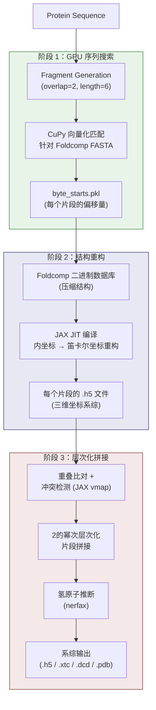
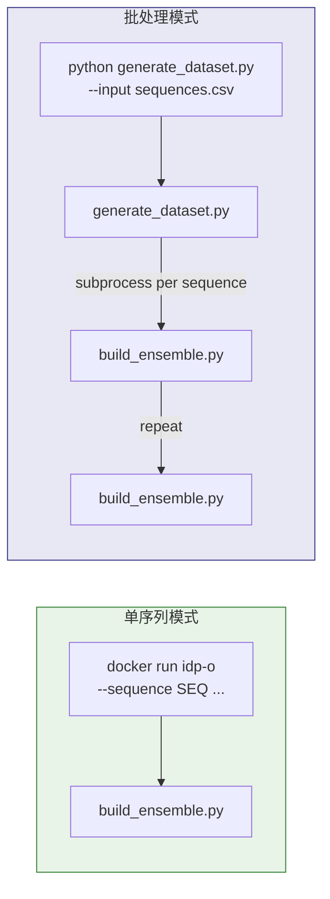

---
slug:4-architecture-overview
blog_type:normal
---


IDP-o 是一个针对本征无序蛋白（IDPs）的**基于片段的系综生成器**。其架构遵循确定性的三阶段流水线 — **搜索 → 重构 → 拼接** — 将单个氨基酸序列转换为包含推断氢原子在内的多样化三维结构构象系综。该系统基于两个关键性能原则构建：通过 CuPy 实现的 GPU 加速子序列匹配，以及通过 JAX 编译的向量化坐标重构与片段拼接。本页映射了完整的架构拓扑：入口点、数据流、各阶段职责以及将它们结合在一起的技术栈。


来源：[README.md](/README.md#L1-L11), [Dockerfile](/Dockerfile#L1-L9)

## 项目结构

该仓库设计紧凑 — 包含一个编排脚本、三个流水线阶段模块、一个批处理包装器以及一个数据库准备工具。所有流水线逻辑均位于 `scripts/` 目录下，`generate_dataset.py` 作为轻量级批处理驱动程序位于仓库根目录。

```
IDP-o/
├── Dockerfile                          # NVIDIA JAX 基础镜像，入口点 → build_ensemble.py
├── generate_dataset.py                 # 批处理包装器：遍历 CSV/FASTA → 调用 build_ensemble.py
├── scripts/
│   ├── build_ensemble.py               # 流水线编排器（入口点）
│   ├── fasta_search_in_foldcomp_database.py   # 阶段 1：GPU 加速序列搜索
│   ├── extract_structures_from_foldcomp_database.py  # 阶段 2：JAX 结构重构
│   ├── join_fragments.py               # 阶段 3：层次化片段拼接
│   └── prepare_foldcomp_fasta.py       # 预处理：构建带偏移量标注的 FASTA
└── assets/
    └── idp-o.png                       # 工作流图表
```

来源：[Dockerfile](/Dockerfile#L1-L9), [generate_dataset.py](/generate_dataset.py#L1-L20), [scripts/build_ensemble.py](/scripts/build_ensemble.py#L15-L23)

## 流水线架构

核心流水线由 `build_ensemble.py` 编排，严格按照顺序执行三个阶段。每个阶段生成定义明确的中间产物，供下一阶段消费。流水线在运行之间是无状态的 — 所有中间产物写入临时文件夹，最终系综写入指定的输出路径。



编排器的 `main()` 函数编码了这一精确调用序列：它首先针对标准氨基酸验证输入序列，然后按顺序调用每个阶段模块的 `main()` — `fasta_search_in_foldcomp_database.main()`、`extract_structures_from_foldcomp_database.main()` 和 `join_fragments.main()` — 将每个阶段的输出作为下一阶段的输入传递。

来源：[scripts/build_ensemble.py](/scripts/build_ensemble.py#L25-L80)

## 阶段职责

每个流水线阶段都有明确的契约。下表总结了每个阶段的输入/输出契约及主导的计算技术。

| 阶段 | 模块 | 输入 | 输出 | 核心技术 | 计算特征 |
|-------|--------|-------|--------|-----------------|----------------------|
| **1. 序列搜索** | `fasta_search_in_foldcomp_database` | 蛋白质序列 + foldcomp FASTA | `byte_starts.pkl` (每个片段的命中偏移量) | **CuPy** (GPU) | 跨约 1.1 TB FASTA 的易并行子串匹配 |
| **2. 结构重构** | `extract_structures_from_foldcomp_database` | 命中偏移量 + foldcomp 二进制数据库 | 每个片段的 `.h5` 文件 (三维系综) | **JAX** `jit` + `vmap` | JIT 编译的内坐标 → 笛卡尔坐标重构 |
| **3. 片段拼接** | `join_fragments` | 每个片段的 `.h5` 系综 + 序列 | 最终系综文件 (h5/xtc/dcd/pdb) | **JAX** `vmap` + `lax.scan` | 向量化比对、冲突检测、层次化归约 |

来源：[scripts/fasta_search_in_foldcomp_database.py](/scripts/fasta_search_in_foldcomp_database.py#L40-L144), [scripts/extract_structures_from_foldcomp_database.py](/scripts/extract_structures_from_foldcomp_database.py#L240-L268), [scripts/join_fragments.py](/scripts/join_fragments.py#L195-L249)

## 数据流与中间产物

理解各阶段之间的数据契约对于调试以及与外部工具的潜在集成至关重要。流水线在磁盘上生成两种中间产物：

**片段生成**是第一个操作，在 `fasta_search_in_foldcomp_database.main()` 内部执行。给定一个蛋白质序列，它使用 `generate_fragments()` 函数生成具有 2 个残基重叠的 6 残基重叠片段。对于长度为 *L* 的序列，这会生成大约 ⌈(*L* − 6) / (6 − 2)⌉ + 1 个片段。根据序列长度，最后一个片段可能短于 6 个残基。

**阶段 1 → 阶段 2 契约**：pickle 文件 `byte_starts.pkl` 包含一个以片段序列字符串为键的字典，其中每个值是一个由 NumPy 数组组成的 3 元组 — `(hit_idxs, byte_starts, aa_start_index)`。这三个数组共同指定了：每次命中在 FASTA 文件中的字节位置、对应条目在 foldcomp 二进制数据库中的字节偏移量，以及片段匹配开始的残基在该数据库条目中的索引。

**阶段 2 → 阶段 3 契约**：每个片段的结构系综以 mdtraj HDF5 文件（`{fragment_sequence}.h5`）的形式写入临时片段目录。这些文件包含匹配该片段的所有重构结构的完整三维坐标（骨架 + 侧链）。

**阶段 3 → 输出**：最终拼接的系综通过 mdtraj 写入用户指定的输出路径。写入前，氢原子由 `nerfax.reduce_utils.reconstruct_from_mdtraj` 推断得出。对于轨迹格式（.xtc, .dcd），还会生成一个包含第一帧的配套 .pdb 文件，用于拓扑参考。

来源：[scripts/fasta_search_in_foldcomp_database.py](/scripts/fasta_search_in_foldcomp_database.py#L147-L164), [scripts/extract_structures_from_foldcomp_database.py](/scripts/extract_structures_from_foldcomp_database.py#L271-L274), [scripts/join_fragments.py](/scripts/join_fragments.py#L277-L320)

## 技术栈与运行环境

IDP-o 运行在基于 NVIDIA JAX 基础镜像（`nvcr.io/nvidia/jax:24.10-py3`）构建的 Docker 容器内，确保 CuPy 和 JAX 计算均可访问 GPU。容器的入口点为 `build_ensemble.py`，使得流水线可直接通过 `docker run` 调用。

| 层级 | 技术 | 在流水线中的角色 |
|-------|-----------|-----------------|
| **GPU 计算** | CuPy (CUDA 12.x) | 阶段 1：GPU 上的向量化字节级序列匹配 |
| **自动微分/向量化** | JAX (XLA 编译器) | 阶段 2–3：JIT 编译的重构，`vmap` 化的比对与冲突检测 |
| **结构数据库** | foldcomp (~0.1.0) | 压缩的 AlphaFold 数据库存储及二进制格式解析 |
| **坐标数学** | nerfax | 内坐标 → 笛卡尔坐标重构、侧链放置、氢原子推断、拓扑构建 |
| **轨迹 I/O** | mdtraj | 读写 .h5, .xtc, .dcd, .pdb 格式；拓扑管理 |
| **哈希表** | hirola (~0.3.0) | 重构期间快速的氨基酸查找 |
| **并行化** | joblib (~1.5.2) | 用于数据集生成中的批处理级并行 |
| **NMR Star** | pynmrstar (~3.3.6) | 下游 NMR 格式兼容性 |

<CgxTip>`join_fragments.py` 中设置的环境变量 `XLA_PYTHON_CLIENT_MEM_FRACTION=".96"` 为 JAX 预留了 96% 的 GPU 内存，这对于向量化拼接阶段至关重要。如果你在拼接期间遇到 OOM 错误，减少 `--joins_to_attempt_per_pairing` 比调整此比例更有效。</CgxTip>

来源：[Dockerfile](/Dockerfile#L1-L3), [scripts/join_fragments.py](/scripts/join_fragments.py#L22-L23)

## 入口点与执行模式

IDP-o 支持两种不同的执行模式，每种模式均有其专属入口点：

**单序列模式** — 通过 Docker 容器直接调用（入口点：`build_ensemble.py`）。这是每次为一个蛋白质序列生成系综的主要模式。所有流水线参数均作为 CLI 参数暴露。

**批处理模式** — 通过 `generate_dataset.py` 调用，该脚本读取包含多个序列的 CSV 或 FASTA 文件并对其进行遍历，将 `build_ensemble.py` 作为子进程为每个序列调用。它支持用于跨独立运行并行化的乱序生成顺序、输入序列去重以及可配置的输出格式。错误处理按序列进行：失败会记录到配套的 `.txt` 文件中，而不会终止整个批处理。



来源：[scripts/build_ensemble.py](/scripts/build_ensemble.py#L83-L166), [generate_dataset.py](/generate_dataset.py#L89-L125)

## 预处理：Foldcomp 数据库准备

在流水线运行之前，必须将 foldcomp 数据库准备为特定格式。`prepare_foldcomp_fasta.py` 脚本自动执行此操作：它下载 `afdb_uniprot_v4` foldcomp 数据库（约 1.1 TB），使用 foldcomp 二进制文件提取其 FASTA 表示，并重写 FASTA 头部，使其包含每个条目在压缩二进制数据库文件中的**字节偏移量**，而非序列标签。这种带偏移量标注的 FASTA 正是阶段 1 搜索的对象 — 搜索期间发现的字节偏移量被阶段 2 直接用于在二进制数据库中寻址并提取结构数据，无需任何索引查找开销。

来源：[scripts/prepare_foldcomp_fasta.py](/scripts/prepare_foldcomp_fasta.py#L33-L149)

## 架构约束与设计原理

部分架构决策被硬编码，值得明确理解：

**片段重叠固定为 2 个残基。** `join_fragments.py` 模块在 `pre_join_fragments()` 和 `_join_fragments()` 内部均包含作为硬编码断言的 `overlap = 2`。此重叠定义了拼接相邻片段时用于比对的“肽键”区域 — 两个重叠残基提供四个骨架原子（N, CA, C, O）作为比对参考。

**片段长度默认为 6 个残基**，但最后一个片段可能较短。该值平衡了搜索特异性（较长的片段在数据库中命中较少）与覆盖率（较短的片段更可能在数据库中找到匹配）。

**层次化拼接采用 2 的幂次归约。** `build_ensemble()` 函数将片段数量分解为 2 的幂次之和，在每个 2 的幂次子集内层次化地拼接对（每个子集进行 log₂ 轮），然后线性拼接子集结果。此策略在保持中间系综大小可控的同时，最小化了总拼接操作数。

**有效拼接的 RMSD 阈值为 0.6 Å**（在代码中硬编码为 `rmsds < 0.06`，单位为 nm，因为 mdtraj 内部使用纳米）。超过此阈值或表现出空间冲突（任意非键合原子间距离 < 1.0 Å）的配对将被拒绝。

<CgxTip>层次化拼接策略意味着系综多样性在初始片段中最高，并随着片段的拼接逐渐收窄，因为每个拼接步骤会过滤掉未通过比对或冲突检查的构象。这是设计使然 — 它自然而然地生成了在局部和全局尺度上均结构合理的系综。</CgxTip>

来源：[scripts/join_fragments.py](/scripts/join_fragments.py#L76-L123), [scripts/join_fragments.py](/scripts/join_fragments.py#L195-L249), [scripts/fasta_search_in_foldcomp_database.py](/scripts/fasta_search_in_foldcomp_database.py#L147-L152)

## 接下来去哪

架构概述确立了流水线的整体形态。以下页面将深入探讨每个阶段的实现细节及其驱动算法：

- **[片段生成策略](5-fragment-generation-strategy)** — 序列如何被分解为重叠片段，以及为何 6/2 是默认值
- **[GPU 加速序列搜索](6-gpu-accelerated-sequence-search)** — 阶段 1 内部原理：CuPy 字节级匹配与分块处理
- **[从 Foldcomp 重构结构](7-structure-reconstruction-from-foldcomp)** — 阶段 2 内部原理：foldcomp 二进制格式解析与 JAX 坐标重构
- **[层次化片段拼接](8-hierarchical-fragment-joining)** — 阶段 3 内部原理：比对、冲突检测及 2 的幂次归约策略