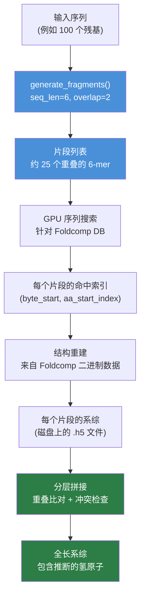

---
slug:5-fragment-generation-strategy
blog_type:normal
---

IDP-o 的核心创新在于采用**基于片段的分解**方法，将本质上固有无序的蛋白质（IDP）序列分解为短的、重叠的子序列，每个子序列独立地在海量结构数据库（通过 Foldcomp 访问的 AlphaFold DB）中进行解析。随后，这些片段级的结构系综在几何约束（重叠比对和冲突拒绝）下被分层重组，从而生成全长的构象系综。本页将解释将蛋白质序列切割为片段的*策略*、选择这些参数的原因，以及片段词汇表如何为下游流水线提供数据。

来源: [README.md](/README.md#L8-L8), [fasta_search_in_foldcomp_database.py](/scripts/fasta_search_in_foldcomp_database.py#L147-L152)

## 序列分解为重叠片段

片段生成函数 `generate_fragments` 实现了**具有可配置重叠的固定长度滑动窗口**。给定蛋白质序列 *s*、片段长度 `seq_len` 和重叠长度 `overlap`，连续片段起始位置之间的步长（偏移量）为：

> **shift = seq_len − overlap**

对于递增的 *i*，每个片段提取为 `s[i × shift : i × shift + seq_len]`，此过程持续进行直至覆盖整个序列。片段数量由 `((len(s) − seq_len) // shift) + 2` 决定，并包含两种边界情况修正：(1) **最后一个片段可能短于** `seq_len` —— 它仅提取剩余的残基；(2) 如果最后一个片段退化至恰好等于重叠长度，则将其**移除**，因为它不包含任何独有的残基信息。

来源: [fasta_search_in_foldcomp_database.py](/scripts/fasta_search_in_foldcomp_database.py#L147-L152)

### 默认参数与设计原理

| 参数 | 默认值 | 作用 |
|-----------|---------|------|
| `seq_len` | 6 | 片段的残基长度 |
| `overlap` | 2 | 连续片段之间的共享残基数 |
| `shift` | 4 (派生) | 片段起始位置之间的步长 |

**6 残基的片段长度**在两种相互竞争的需求之间取得了平衡。较短的片段（例如 3–4 个残基）会在拼接阶段产生过度的组合爆炸，而较长的片段（例如 10+ 个残基）在 Foldcomp 数据库中会产生过少的命中——特别是对于局部结构在 AlphaFold DB 中代表性不足的无序序列。**2 残基的重叠**是提供足够几何约束以在片段拼接期间实现稳健成对比对的最小值（重叠必须跨越至少一个完整的肽键，这需要 ≥ 2 个残基以完成主链 N–CA–C–O 的对齐）。

来源: [fasta_search_in_foldcomp_database.py](/scripts/fasta_search_in_foldcomp_database.py#L155-L156), [join_fragments.py](/scripts/join_fragments.py#L76-L77), [join_fragments.py](/scripts/join_fragments.py#L286-L287)

### 计算示例

考虑序列 `DLIVERANDSANDR`（14 个残基）。使用 `seq_len=6` 和 `overlap=2`：

| 片段索引 | 起始 | 结束 | 子序列 | 与前一片段的重叠 |
|:-:|:-:|:-:|:--|:--|
| 0 | 0 | 6 | `DLIVER` | — |
| 1 | 4 | 10 | `ERANDS` | `ER` |
| 2 | 8 | 14 | `NDSANDR` | `ND` |

片段 2 恰好为 6 个残基（完全匹配）。如果序列长度为 15 个残基，则最后一个片段将为 7 个残基——该算法能从容处理这种不对称性。重叠残基（`ER`、`ND`）在分层拼接时作为**几何缝合区域**。

来源: [fasta_search_in_foldcomp_database.py](/scripts/fasta_search_in_foldcomp_database.py#L147-L152)

### 片段数量公式

对于长度为 *L* 的序列，片段长度为 *F*，重叠为 *O*，片段数量 *N* 约为：

> **N ≈ ⌈(L − O) / (F − O)⌉**

这意味着一个 100 残基的 IDP 会产生约 25 个片段，每个片段在 Foldcomp 数据库中约 2 亿个结构里进行独立搜索。片段数量直接控制了分层拼接树的深度（参见 [分层片段拼接](8-hierarchical-fragment-joining)）。

来源: [fasta_search_in_foldcomp_database.py](/scripts/fasta_search_in_foldcomp_database.py#L147-L152)

## 从片段到结构系综

一旦序列被分解，每个片段在进入拼接阶段前需经过流水线的三个阶段。下图展示了由 `generate_fragments` 生成的片段词汇表如何流入下游阶段：

**阶段 1 — 序列搜索**：使用 GPU 加速的精确匹配（CuPy），将每个片段字符串与特殊格式的 Foldcomp FASTA 进行比对扫描。搜索返回在 Foldcomp 数据库中的字节偏移量，以及在每个命中蛋白质中片段匹配开始的残基索引。详见 [GPU 加速序列搜索](6-gpu-accelerated-sequence-search)。

**阶段 2 — 结构重建**：对于每个片段，从 Foldcomp 二进制数据库中加载最多 `n_max_structures_per_fragment` 个命中结果。内坐标（主链键角、二面角、侧链键角）被解码，并通过 JAX 编译的重建函数转换为笛卡尔坐标。可选择排除包含 *顺式*-ω 肽键的结构。详见 [从 Foldcomp 重建结构](7-structure-reconstruction-from-foldcomp)。

**阶段 3 — 分层拼接**：使用分治树将片段系综重组为全长系综，该树在每一层执行成对重叠比对和冲突检测。此主题详见 [分层片段拼接](8-hierarchical-fragment-joining)。

来源: [build_ensemble.py](/scripts/build_ensemble.py#L60-L80), [fasta_search_in_foldcomp_database.py](/scripts/fasta_search_in_foldcomp_database.py#L40-L144), [extract_structures_from_foldcomp_database.py](/scripts/extract_structures_from_foldcomp_database.py#L240-L268)

## 重叠作为几何约束

2 残基的重叠不仅是一种记录约定——它是使片段拼接具有良好适定性的**几何锚点**。在成对拼接期间，重叠区域提供两个完整的主链单元（每个包含 N、Cα、C、O 原子），这足以通过 SVD 分解计算左右片段之间唯一的刚体对齐。

对齐过程从左侧片段提取**尾部重叠**，从右侧片段提取**首部重叠**，然后：

1. **仿射对齐** — 计算基于 SVD 的最优旋转和平移，将右侧片段的重叠原子叠加到左侧片段的重叠原子上
2. **RMSD 验证** — 检查重叠的均方根偏差是否低于 **0.06 nm (0.6 Å)** 的阈值；超过此阈值的片段对将被拒绝
3. **冲突检测** — 对齐后，检查合并结构中的所有原子间距离；任何距离小于 **0.1 nm** 的非键合原子对将触发拒绝

这些阈值是硬编码的，反映了肽键几何的物理容差：2 个残基上 0.6 Å 的 RMSD 表明两个片段在局部主链构象上保持一致，而 0.1 nm 的冲突截断值可防止在物理上不切实际的立体违规。

来源: [join_fragments.py](/scripts/join_fragments.py#L38-L50), [join_fragments.py](/scripts/join_fragments.py#L96-L123), [join_fragments.py](/scripts/join_fragments.py#L112-L119)

<CgxTip>2 残基的重叠在整个代码库中被显式断言并作为默认假设——`pre_join_fragments` 函数无论输入如何都硬编码 `overlap = 2`，而 `_join_fragments` 函数通过 `bb_indices[indexing].ravel()[2:-2]` 提取主链索引，其中 `[2:-2]` 切片选择了左侧重叠残基的 (C, O) 原子和右侧重叠残基的 (N, Cα) 原子——即肽键连接处。更改重叠需要对此切片逻辑进行协同修改。</CgxTip>

## 片段词汇表与数据库覆盖度

片段策略隐式定义了一个**词汇表问题**：每个 6 残基片段必须在 AlphaFold DB 中具有足够的结构代表，以填充有意义的系综。这就是为什么 IDP-o 使用完整的 `afdb_uniprot_v4` 数据库（约 2 亿个结构，压缩后约 1.1 TB），而不是较小的精选集。

对于**有序区域**，大多数 6-mer 将有大量命中（数千到数百万个结构）。对于**无序区域**，覆盖度较为稀疏，因为 AlphaFold DB 偏向于折叠良好的蛋白质。`n_max_structures_per_fragment` 参数（在构建脚本中默认为 1000）限制了每个片段的系综大小——当一个片段的命中数超过此限制时，将随机对结构进行下采样，以控制拼接期间的内存和计算成本。

| 片段类型 | 典型命中数 | 系综行为 |
|---------------|-------------------|-------------------|
| 结构良好的 6-mer | 10³ – 10⁶+ | 下采样至 `n_max_structures_per_fragment` |
| 部分无序的 6-mer | 10² – 10³ | 完全保留 |
| 罕见的 6-mer | < 10² | 可能产生稀疏系综 |
| 未发现命中 | 0 | 流水线将在此片段处失败 |

`reduction_factor` 参数提供了一个调试/性能调节旋钮，可按比例减少搜索的数据库比例——值为 10 表示仅扫描十分之一的 FASTA，以牺牲覆盖度换取速度。

来源: [extract_structures_from_foldcomp_database.py](/scripts/extract_structures_from_foldcomp_database.py#L252-L256), [fasta_search_in_foldcomp_database.py](/scripts/fasta_search_in_foldcomp_database.py#L64-L65), [build_ensemble.py](/scripts/build_ensemble.py#L125-L127)

## 流水线中的端到端片段流程

`build_ensemble.py` 脚本编排了完整的片段生命周期。片段生成参数（`overlap=2`、`seq_len=6`）在 `join_fragments.main` 入口点设置，并在拼接阶段开始时传播给 `generate_fragments`。下表总结了每个流水线阶段如何与片段分解进行交互：

| 流水线阶段 | 脚本 | 片段交互 |
|----------------|--------|---------------------|
| 序列搜索 | `fasta_search_in_foldcomp_database.py` | 调用 `generate_fragments()` 生成片段列表；在 Foldcomp FASTA 中搜索每个片段 |
| 结构提取 | `extract_structures_from_foldcomp_database.py` | 读取每个片段的命中索引；重建 3D 坐标；保存每个片段的 `.h5` 系综 |
| 片段拼接 | `join_fragments.py` | 再次调用 `generate_fragments()` 重构片段列表；加载每个片段的 `.h5` 文件；执行分层拼接 |

注意，`generate_fragments()` 被调用了**两次**——一次在搜索期间（以确定要查找的片段），一次在拼接期间（以重构分层组装的片段排序）。这是一种无状态设计：片段列表始终由输入序列和固定参数派生，避免了序列化片段列表本身的需要。

来源: [build_ensemble.py](/scripts/build_ensemble.py#L60-L80), [join_fragments.py](/scripts/join_fragments.py#L286-L287)

<CgxTip>`generate_dataset.py` 包装器将 `--fragments_overlap` 作为可配置参数（默认值为 1）暴露，但该值在当前代码中**未传播**至 `build_ensemble.py`——系构建模器始终使用硬编码的默认值 `overlap=2`。`generate_dataset.py` 中的 `--fragments_overlap` 参数似乎是未来可配置性的占位符。</CgxTip>

## 设计权衡

片段生成策略包含几项深思熟虑的权衡，在解释系综输出时值得理解：

**固定与自适应片段长度** — IDP-o 使用固定的 6 残基窗口。另一种设计方案是使用可变长度片段，以适应局部无序倾向（例如，螺旋区域使用较长片段，高度无序区域使用较短片段）。固定长度方法简化了流水线并确保了统一的重叠几何，但可能在半有序区域中代表性不足局部结构偏好。

**精确与近似序列搜索** — 片段通过在 Foldcomp FASTA 中的精确子字符串搜索进行匹配。不执行序列相似性或模糊匹配。这意味着具有单个罕见突变的片段可能返回零命中，即使数据库中存在相近的同源物。该权衡偏向速度（GPU 精确匹配极快）而非敏感度。

**重叠大小与拼接灵活性** — 较大的重叠（例如 3–4 个残基）将提供更多几何约束并可能产生更高质量的拼接，但也会减小片段间的步长，从而增加片段数量及拼接树的深度。2 残基重叠是最小可行选择，并最大化了计算效率。

来源: [fasta_search_in_foldcomp_database.py](/scripts/fasta_search_in_foldcomp_database.py#L147-L152), [join_fragments.py](/scripts/join_fragments.py#L76-L77)

## 后续指引

片段生成策略为每项下游计算奠定了基础。要了解片段如何在数据库中被搜索，请参见 [GPU 加速序列搜索](6-gpu-accelerated-sequence-search)。要了解如何从 Foldcomp 二进制数据中恢复 3D 坐标，请参见 [从 Foldcomp 重建结构](7-structure-reconstruction-from-foldcomp)。要了解片段系综如何在几何约束下缝合在一起，请参见 [分层片段拼接](8-hierarchical-fragment-joining)。有关重叠比对和冲突检测的数学细节，请参见 [重叠比对与冲突检测](9-overlap-alignment-and-clash-detection)。