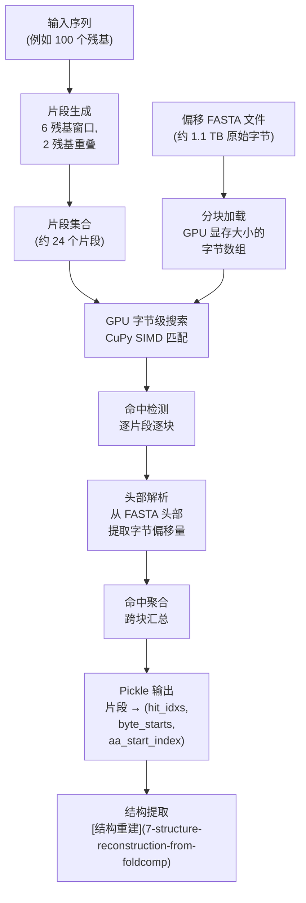

---
slug:6-gpu-accelerated-sequence-search
blog_type:normal
---


GPU 加速序列搜索是 IDP-o 流水线中的首个计算阶段，负责在海量 Foldcomp 结构数据库中定位短蛋白片段。它将全长蛋白序列转换为一组重叠的 6 残基片段，随后利用**基于 CuPy 的 CUDA 并行计算**，直接对特殊格式 FASTA 文件的原始字节执行字节级模式匹配——从而实现仅在 CPU 上无法企及的搜索吞吐量。该阶段的输出是一个记录命中位置的字典，借此可在压缩的 Foldcomp 数据库中依据精确的字节偏移量提取下游结构，而无需解压整个归档文件。

来源: [fasta_search_in_foldcomp_database.py](/scripts/fasta_search_in_foldcomp_database.py#L1-L194), [build_ensemble.py](/scripts/build_ensemble.py#L60-L61)

## 算法架构

该搜索基于一项核心洞见：与其将 FASTA 文件解析为序列数据库再执行 BLAST 风格的比对，不如将文件视为一个**扁平字节数组**，并在原始字节层面执行精确子串匹配。这消除了所有的解析开销，并自然映射到 GPU 广域 SIMD 执行模式。由 [Foldcomp 数据库设置](3-foldcomp-database-setup) 生成的特殊格式 FASTA 文件，直接将 Foldcomp 数据库中各条目的字节偏移量编码至 FASTA 头部，因此单次搜索即可同时获得序列匹配结果与结构数据位置。



来源: [fasta_search_in_foldcomp_database.py](/scripts/fasta_search_in_foldcomp_database.py#L40-L144), [fasta_search_in_foldcomp_database.py](/scripts/fasta_search_in_foldcomp_database.py#L147-L152)

## 片段生成策略

输入蛋白序列通过 `generate_fragments` 被分解为重叠的 6 残基片段，该函数实现了具有可配置重叠度的滑动窗口。在默认参数（`seq_len=6`，`overlap=2`）下，每个片段与其相邻片段共享 2 个残基，确保了后续由[层级片段拼接](8-hierarchical-fragment-joining)重组时结构的连续性。连续片段起始位置间的步移量为 `seq_len - overlap = 4` 个残基，对于长度为 N 的序列，约生成 `⌈(N - 6) / 4⌉ + 2` 个片段。长度等于重叠大小的末端片段会被丢弃，因为它不包含前趋片段已编码之外的独立结构信息。

来源: [fasta_search_in_foldcomp_database.py](/scripts/fasta_search_in_foldcomp_database.py#L147-L152)

## 字节级 GPU 匹配：`extract_all_byte_starts`

这是搜索阶段的计算核心。该函数以适配 GPU 显存大小的**块**（默认：320 MB）为单位处理偏移 FASTA 文件，并对每个片段在每个数据块上同时执行三项操作。

### 块加载与头部索引

每个数据块通过 `f.read(chunk_size)` 作为原始字节读入，并立即转换为 CuPy `uint8` 数组——此过程不进行任何字符串解析。所有 `>` 字符（FASTA 头部）的位置通过 `cp.flatnonzero` 在单次 GPU 遍历中定位，生成 `start_bytes` 索引，从而将字节流分割为序列记录。最后一块会补零至 8 字节的整数倍，以满足 GPU 显存对齐要求。

来源: [fasta_search_in_foldcomp_database.py](/scripts/fasta_search_in_foldcomp_database.py#L64-L86)

### 基于布尔卷积的精确子串匹配

对于每个片段，其编码序列（同为 `uint8`）与数据块的匹配是通过**在所有位置上同时进行并行逐元素比较**来完成的。初始化一个全为 True 的布尔累加器 `energies`，随后片段中每个残基位置 `j` 通过 AND 归约操作来收缩该累加器：

```python
energies &= indexs[j : chunk_size - (ncoeff - j)] == sequence_encoded[j]
```

仅在片段中**每个残基连续匹配**的字节位置处，该表达式的结果才为 `True`——这是一个 O(L × C) 复杂度的操作，其中 L 为片段长度，C 为块大小，完全在 GPU 上执行，无分支或循环开销。对所得布尔掩码执行 `flatnonzero` 即可得出块内的命中位置。

来源: [fasta_search_in_foldcomp_database.py](/scripts/fasta_search_in_foldcomp_database.py#L88-L99)

### 偏移量提取与氨基酸索引

对于每次命中，通过在 `start_bytes` 数组上执行 `searchsorted` 来确定其前趋 FASTA 头部。存储在该头部中的数字字节偏移量（如 `>677`）通过向量化十进制分解从其 ASCII 数字表示中解码：数字字符被掩码提取，按其位权乘以 10 的幂次后求和——全部在 GPU 上完成。同时，匹配序列内的**氨基酸起始索引**将根据头部 `>` 符号的偏移量计算得出，并考虑了变长的字节偏移量字符串。这三元组——`(hit_idxs, byte_starts, aa_start_index)`——通过 `.get()` 传回 CPU，并按片段和数据块分别存储。

来源: [fasta_search_in_detail_from_foldcomp_database.py](/scripts/fasta_search_in_foldcomp_database.py#L101-L121)

### 跨块聚合

片段序列跨越块边界的命中将被**有意丢弃**（第 102 行：`hit_idxs = hit_idxs[hit_idxs > start_bytes[0]]`）。这是一项审慎的设计抉择：跨块边界的部分匹配需要跨块协调，这将破坏高度并行的块处理模型。在所有块处理完毕后，每个片段的命中结果将通过 `np.concatenate` 跨块拼接，对于在给定块中未产生命中的片段则用空数组替代。最终结果是一个字典，将每个片段字符串映射到由拼接后的 NumPy 数组构成的三元组。

来源: [fasta_search_in_foldcomp_database.py](/scripts/fasta_search_in_foldcomp_database.py#L101-L143)

## CuPy 与 NumPy 对比：为何 GPU 加速至关重要

整个匹配流水线采用 CuPy（NumPy 的直接 GPU 替代品）实现，原因在于搜索操作直接针对**约 1.1 TB FASTA 文件的原始字节**进行。在 CPU 上，针对单个 6 残基片段在 320 MB 数据块上的逐元素比较循环将需要约 24 亿次比较，且需对约 24 个片段重复此过程。CuPy 将其作为大规模并行 CUDA 内核执行，充分利用 GPU 数千个核心及合并内存访问模式。唯一的 CPU-GPU 数据传输发生在边界处：块字节上传一次，最终的命中元组（通常极小，仅数百条目）通过 `.get()` 下载。

| 方面 | CPU (NumPy) | GPU (CuPy) |
|--------|-------------|------------|
| 比较执行 | 逐片段位置串行 | 跨所有位置大规模并行 |
| 内存模型 | 主机 RAM，无对齐约束 | 设备 VRAM，8 字节对齐块 |
| 数据传输 | 无（原生） | 上传块一次，仅下载命中结果 |
| 吞吐量瓶颈 | 单核标量运算 | 饱和显存带宽 |
| 典型块处理耗时 | 每片段数分钟 | 每片段亚秒级 |

来源: [fasta_search_in_foldcomp_database.py](/scripts/fasta_search_in_foldcomp_database.py#L20-L21), [Dockerfile](/Dockerfile#L1-L3)

## 输出格式与流水线集成

搜索阶段输出一个 **pickle 文件**，包含一个以片段字符串为键的字典，每个值为由三个 `np.int64` 数组构成的三元组：

| 元组索引 | 名称 | 含义 |
|-------------|------|---------|
| 0 | `hit_idxs` | FASTA 文件中匹配开始的字节位置 |
| 1 | `byte_starts` | Foldcomp 数据库文件中匹配条目结构数据起始处的字节偏移量 |
| 2 | `aa_start_index` | 匹配的数据库序列中片段匹配起点的残基索引（用于子提取特定残基范围） |

此 pickle 文件由 [Foldcomp 结构重建](7-structure-reconstruction-from-foldcomp) 阶段直接消费，该阶段利用 `byte_starts` 寻址至压缩的 Foldcomp 数据库，并利用 `aa_start_index` 仅提取相关的残基子范围——从而避免解压整个条目。此流程由 `build_ensemble.py` 负责编排，它按顺序调用搜索、提取和拼接阶段。

来源: [fasta_search_in_foldcomp_database.py](/scripts/fasta_search_in_foldcomp_database.py#L155-L164), [build_ensemble.py](/scripts/build_ensemble.py#L60-L61)

## 配置参数

搜索阶段暴露了两个控制搜索范围与精度的参数：

| 参数 | CLI 标志 | 默认值 | 作用 |
|-----------|----------|---------|--------|
| `chunk_size` | — | 320,000,000 字节 | GPU 显存块大小。当文件小于单块时自动缩减，并向下取整至 8 的倍数。未通过 CLI 暴露。 |
| `reduction_factor` | `--reduction_factor` | 1 | 应用于文件大小估算的除数。值为 10 时仅搜索约 1/10 的数据库——适用于开发期间的快速迭代或无需搜索完整性的场景。 |
| `overlap` | — | 2 | 连续片段间的重叠残基数。在整个流水线中硬编码为 2。未通过 CLI 暴露。 |
| `seq_len` | — | 6 | 片段的残基长度。未通过 CLI 暴露——更改此值需在[重叠比对与碰撞检测](9-overlap-alignment-and-clash-detection)中作相应调整。 |

<CgxTip>`reduction_factor` 参数**并非**对序列进行二次采样——而是对 FASTA 文件的**字节范围**进行二次采样。这意味着缩减因子为 10 并非搜索每第 10 条序列；而是按字节偏移量搜索文件的前 1/10。对于统计均匀采样而言，这是可接受的，因为 AlphaFoldDB 条目并未按序列内容排序。</CgxTip>

来源: [fasta_search_in_foldcomp_database.py](/scripts/fasta_search_in_foldcomp_database.py#L40-L46), [fasta_search_in_foldcomp_database.py](/scripts/fasta_search_in_foldcomp_database.py#L167-L193)

## 运行环境

搜索阶段要求具备支持 CUDA 的 GPU 以及 CuPy CUDA 12x 运行时，如 Dockerfile 基础镜像 `nvcr.io/nvidia/jax:24.10-py3` 及 `cupy-cuda12x~=13.6.0` 依赖项所指定。整个 IDP-o 流水线通过此 Docker 镜像编排，该镜像将基于 CuPy 的搜索与基于 JAX 的下游计算打包于单一容器中。搜索作为 `build_ensemble.py` 的首要步骤被调用，将其 pickle 输出写入临时目录后，控制权即移交至结构提取阶段。