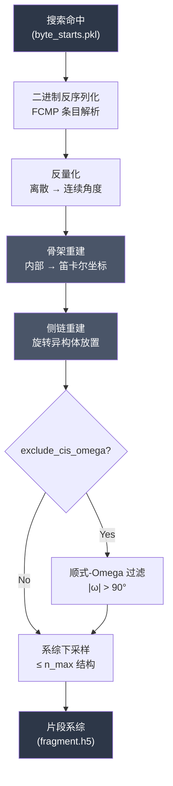
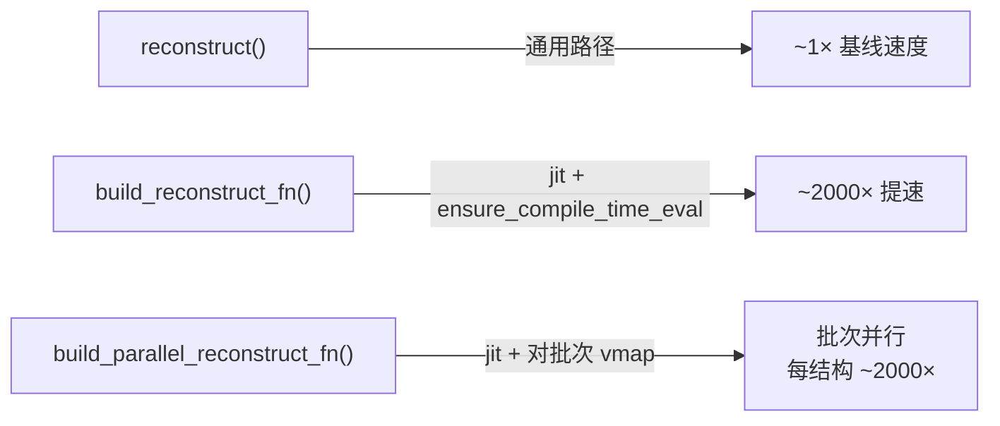
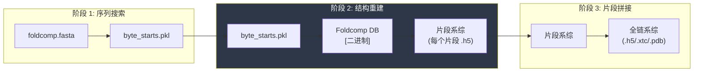

---
slug:7-structure-reconstruction-from-foldcomp
blog_type:normal
---


**结构重建**阶段是 IDP-o 的计算核心：它将压缩的 Foldcomp 数据库条目（以量化的内部坐标形式存储）转换回完整的 3D 笛卡尔原子坐标。该阶段位于 [GPU 加速序列搜索](6-gpu-accelerated-sequence-search)（用于识别片段命中及其字节位置）与[层级片段拼接](8-hierarchical-fragment-joining)（将重叠的片段系综缝合为完整链）之间。整个重建流程实现在 `extract_structures_from_foldcomp_database.py` 中，并由 `build_ensemble.py` 统一调度，作为三个连续阶段中的第二阶段被调用。

来源: [extract_structures_from_foldcomp_database.py](/scripts/extract_structures_from_foldcomp_database.py#L1-L326), [build_ensemble.py](/scripts/build_ensemble.py#L60-L70)

## 架构概述

重建阶段可分解为四个紧密耦合的子阶段：**二进制反序列化**（解析 Foldcomp FCMP 条目格式）、**反量化**（将离散整数编码转换回弧度制的连续角度）、**骨架重建**（通过 Nerfax 进行从内部坐标到笛卡尔坐标的顺序变换）以及**侧链重建**（将侧链原子放置在重建骨架的相对位置上）。整个流程由 JAX 加速，并提供一条 JIT 编译的特化路径，对于相同氨基酸序列的重复重建，该路径最高可实现约 2000 倍的加速。



来源: [extract_structures_from_foldcomp_database.py](/scripts/extract_structures_from_foldcomp_database.py#L217-L268)

## Foldcomp 二进制格式 — FCMP 条目布局

Foldcomp 数据库中的每个蛋白质结构均作为单独的 FCMP 条目存储。重建阶段必须利用从搜索命中元数据（`fasta_byte_start`、`byte_start`、`aa_start_index`）中导出的字节级精确偏移量来解析此二进制布局。条目以 `b"FCMP"` 魔术标签起始，随后是头部字段，这些字段编码了残基数、锚点，以及至关重要的、控制反量化过程的**离散化矩阵**。

| 字段 | 偏移量 (相对) | 大小 | 类型 | 描述 |
|---|---|---|---|---|
| 魔术标签 | `byte_start` | 4 B | `@4s` | 必须等于 `b"FCMP"` |
| `nResidue` | `+4` | 2 B | `H` (uint16) | 条目中的总残基数 |
| `nAnchor` | `+12` | 1 B | `B` (uint8) | 锚点数量 |
| `lenTitle` | `+24` | 4 B | `I` (uint32) | 标题字符串长度 |
| 离散化器 | `+28` | 48 B | `float32[2,6]` | 最小值 + 配置缩放比例 |
| 骨架数据 | `+89 + 40·nAnchor + lenTitle` | 8·nRes B | `uint8[nRes, 8]` | 每个残基的打包角度/扭角 |
| 侧链数据 | 骨架数据之后 | 可变 | `uint8[]` | 每个残基的侧链角度 |

骨架数据段起始于计算得出的偏移量：`byte_start + 89 + 40 * nAnchor + lenTitle`。骨架段的前 8 个字节为虚拟填充位；实际的每残基数据从该起始点偏移 `(l - 1) * 8` 字节处开始，其中 `l` 为片段命中的残基起始索引。

来源: [extract_structures_from_foldcomp_database.py](/scripts/extract_structures_from_foldcomp_database.py#L83-L103)

## 二进制反序列化 — 逐位骨架解码

`load_backbone_data` 函数对每个残基的 8 个字节执行**逐位解包**，提取出六个内部坐标值和一个氨基酸标识符。每个残基的 8 字节行首先被向上转型为 `uint16`，以实现 12 位字段的提取。字节 0 的最高 5 位编码了氨基酸索引（`(d[:,0] & 0xF8) >> 3`）。剩余的位通过移位和掩码操作跨越字节边界重新组合，形成三个 12 位的扭角/角度值（omega, psi, phi），而最后三个字节则直接提供键角（n_ca_c, ca_c_n, c_n_ca）。

```python
# 从最高 5 位获取氨基酸
aas = (d[:, 0] & 0xF8) >> 3
# 跨字节边界的 12 位重建
d[:, 0] = ((d[:, 0] & 0x0007) << 8) | (d[:, 1] & 0x00FF)   # omega
d[:, 1] = ((d[:, 2] & 0x00FF) << 4) | (d[:, 3] & 0x00FF) >> 4  # psi
d[:, 2] = ((d[:, 3] & 0x000F) << 8) | (d[:, 4] & 0x00FF)   # phi
# 重排为规范顺序: [phi, psi, omega, n_ca_c_angle, ca_c_n_angle, c_n_ca_angle]
mainChainAnglesTorsions = d[:, [2, 1, 0, 7, 5, 6]]
```

列重排 `d[:, [2, 1, 0, 7, 5, 6]]` 将数据从存储布局 `(omega, psi, phi, ..., ca_c_n, c_n_ca, n_ca_c)` 映射到下游重建函数所期望的规范内部坐标顺序 `(phi, psi, omega, n_ca_c_angle, ca_c_n_angle, c_n_ca_angle)`。

来源: [extract_structures_from_foldcomp_database.py](/scripts/extract_structures_from_foldcomp_database.py#L66-L77)

## 反量化 — 从离散编码到弧度

离散整数值必须使用逐条目的离散化矩阵进行**线性反量化**，还原为连续角度。这个 2×6 的 `float32` 矩阵包含最小值（`mins`）和配置缩放比例（`conf_fs`），每个内部坐标通道各一对。在 `reconstruct_backbone` 中应用的反量化公式为：

```
continuous = (discrete × conf_fs + mins) × (π / 180)
```

乘以 `π/180` 是将度数转换为弧度。反量化之后，角度在坐标重建前还要经历两次变换：**扭角重排** `[..., [1, 2, 0]]` 将顺序从 `(phi, psi, omega)` 重组为 `(psi, omega, phi)`，以匹配 N→CA→C 的链行走约定；以及**键角互补** `π - angle`，这是为了适应 SCNet 的历史约定，即存储的角度是内部坐标键角的补角。

来源: [extract_structures_from_foldcomp_database.py](/scripts/extract_structures_from_foldcomp_database.py#L137-L163)

## 骨架重建 — 从内部坐标到笛卡尔坐标的变换

凭借反量化并重排后的角度、扭角，以及来自 `BACKBONE_BOND_LENGTHS` 的固定骨架键长，`reconstruct_backbone` 函数执行**顺序化的内部坐标到笛卡尔坐标重建**。三个初始锚点位置被放置在 3D 空间的 `[-1, -1, 0], [-1, 0, 0], [0, 0, 0]`，随后 Nerfax 的 `reconstruct_from_internal_coordinates_pure_sequential` 函数沿链行走，利用由键长、键角和二面角定义的 N-CA-C 肽键骨架几何结构，放置后续的每个原子。输出的 `bb_pos` 包含了片段中每个残基的完整骨架笛卡尔坐标（N, CA, C, O）。

来源: [extract_structures_from_foldcomp_database.py](/scripts/extract_structures_from_foldcomp_database.py#L137-L163)

## 侧链重建

`reconstruct` 函数通过调用 Nerfax 的 `reconstruct_sidechains` 进行**侧链原子放置**，从而扩展了骨架重建过程。侧链数据从 Foldcomp 条目中单独加载：每个残基的侧链被编码为可变数量的 `uint8` 值，每个残基的具体数量由氨基酸类型通过 `AA_N_SC_ATOMS` 查找表确定。对 `AA_N_SC_ATOMS` 值计算前缀累加和，可得出在侧链数据段中的字节偏移量，从而能够选择性提取仅属于片段残基的数据，而非整个条目。随后，侧链角度被用于将旋转异构体放置在其重建的骨架锚点相对位置上。

来源: [extract_structures_from_foldcomp_database.py](/scripts/extract_structures_from_foldcomp_database.py#L116-L134), [extract_structures_from_foldcomp_database.py](/scripts/extract_structures_from_foldcomp_database.py#L166-L169)

## JAX JIT 编译 — 序列特化重建

此阶段最显著的性能优化是通过 `build_reconstruct_fn` 实现的 **JAX JIT 编译特化**。该函数并非通过通用的 `reconstruct` 路径逐个重建结构，而是利用 `jax.ensure_compile_time_eval()` 将氨基酸序列捕获为编译时常量，从而生成一个特化的 XLA 编译函数，消除了运行时所有依赖氨基酸类型的分支逻辑。



`build_parallel_reconstruct_fn` 变体将 `reconstruct` 包装在 `vmap` 中，参数为 `in_axes=(0, 0, None, 0)`——对离散化器、骨架角度和侧链角度进行批处理，同时保持氨基酸数组为常量（因为片段系综中的所有结构共享相同的序列）。这个批处理的 vmapped 函数随后被 JIT 编译，使得片段的整个系综重建可以作为单一的 XLA 编译计算执行。

<CgxTip>在模块导入时，JAX 被显式强制使用 CPU 后端（`os.environ["JAX_PLATFORMS"] = "cpu"`）。GPU 被保留给前置的序列搜索阶段使用，而重建过程属于计算密集型，相比于 GPU 传输开销，它更能从 XLA 的 CPU 编译和内存局部性中获益。</CgxTip>

来源: [extract_structures_from_foldcomp_database.py](/scripts/extract_structures_from_foldcomp_database.py#L15-L17), [extract_structures_from_foldcomp_database.py](/scripts/extract_structures_from_foldcomp_database.py#L189-L206)

## 顺式-Omega 过滤

可选的 `--exclude_cis_omega` 标志用于过滤掉带有**顺式肽键**的结构，这种肽键在天然蛋白质中极为罕见（非脯氨酸肽键中占比 < 0.1%）。该过滤器在完全重建之前，对反量化后的 omega 二面角进行操作：只有当片段中的**所有** omega 角度都满足 `|ω| > 90°`（即所有肽键均为反式构象）时，该结构才会被保留。此过滤器在 `extract_data` 内部的原始角度层应用，避免了为那些本会被丢弃的结构执行全坐标重建的计算开销。

来源: [extract_structures_from_foldcomp_database.py](/scripts/extract_structures_from_foldcomp_database.py#L230-L235)

## 流程调度 — `compute_ensembles` 与 `extract_data`

顶层 `compute_ensembles` 函数驱动着每个片段的完整流程。对于搜索结果字典中的每个片段键，它依次执行：(1) 通过 `extract_data` 从 Foldcomp 数据库中读取片段系综，该函数遍历所有命中 `(fasta_byte_start, byte_start, aa_start_index)` 并加载残基范围 `[l, l+nres)` 的重建数据，通过 `join_list_of_identical_pytrees` 堆叠结果；(2) 若结构数量超过 `n_max_structures_per_fragment`，则通过随机索引选择进行下采样；(3) 通过 JIT 编译的 `build_parallel_reconstruct_fn` 在一次批量调用中重建整个系综；(4) 将坐标从埃（Å）转换为纳米（÷10.0），并使用 mdtraj 将轨迹保存为 HDF5 文件，其中拓扑结构通过 `build_mdtraj_top` 从片段序列构建。

| 步骤 | 函数 | 关键操作 |
|---|---|---|
| 1 | `extract_data` | 从所有命中中加载并堆叠重建数据 |
| 2 | 随机下采样 | 限制为 `n_max_structures_per_fragment` |
| 3 | `build_parallel_reconstruct_fn` → `jit_fn(...)` | 批量重建所有结构 |
| 4 | `md.Trajectory(...)` + `.save_hdf5(...)` | 使用 mdtraj 拓扑序列化为 HDF5 |

来源: [extract_structures_from_foldcomp_database.py](/scripts/extract_structures_from_foldcomp_database.py#L217-L268)

## CLI 接口

该脚本作为独立命令调用，运行于搜索阶段生成 `byte_starts.pkl` 之后：

```bash
python3 scripts/extract_structures_from_foldcomp_database.py \
  --byte_starts_path /tmp/byte_starts.pkl \
  --foldcomp_fasta /data/afdb_uniprot_v4.fasta \
  --foldcomp_db /data/afdb_uniprot_v4 \
  --outfolder /tmp/fragment_ensembles \
  --n_max_structures_per_fragment 1000 \
  --exclude_cis_omega
```

| 参数 | 默认值 | 描述 |
|---|---|---|
| `--byte_starts_path` | (必填) | 来自搜索阶段的包含命中元数据的 Pickle 文件 |
| `--foldcomp_fasta` | `/data/afdb_uniprot_v4.fasta` | Foldcomp 数据库的带偏移量注释 FASTA 文件 |
| `--foldcomp_db` | `/data/afdb_uniprot_v4` | 二进制 Foldcomp 数据库文件路径 |
| `--outfolder` | (必填) | 每个片段的 `.h5` 系综文件输出目录 |
| `--n_max_structures_per_fragment` | `1000` | 每个片段提取的最大结构数 |
| `--exclude_cis_omega` | `False` | 排除带有顺式肽键的结构 |

当通过 `build_ensemble.py` 调用时，这些参数会由系综构建器的 CLI 参数自动填充，该阶段作为 `fasta_search_in_foldcomp_database.main()` 和 `join_fragments.main()` 之间的第二步运行。

来源: [extract_structures_from_foldcomp_database.py](/scripts/extract_structures_from_foldcomp_database.py#L277-L326), [build_ensemble.py](/scripts/build_ensemble.py#L60-L70)

## 跨流程阶段的数据流



重建阶段消费由 [GPU 加速序列搜索](6-gpu-accelerated-sequence-search) 生成的 `byte_starts.pkl` pickle 文件，该文件将每个片段序列映射到一个包含三个数组的元组：`hit_idxs`（FASTA 文件中的字节位置）、`byte_starts`（Foldcomp 数据库中的字节位置）和 `aa_start_index`（匹配条目内的残基偏移量）。它为每个片段生成一个 `.h5` 文件，其中包含所有重建构象的 mdtraj 兼容轨迹，随后该文件将被[层级片段拼接](8-hierarchical-fragment-joining)消费。

<CgxTip>`join_list_of_identical_pytrees` 实用工具函数利用 JAX 的 pytree 展平/展平操作，将多次命中中的异构重建数据元组堆叠为批处理数组。这使得后续的单次调用批处理 JIT 重建成为可能，远比逐结构重建循环高效得多。</CgxTip>

来源: [extract_structures_from_foldcomp_database.py](/scripts/extract_structures_from_foldcomp_database.py#L209-L214), [extract_structures_from_foldcomp_database.py](/scripts/extract_structures_from_foldcomp_database.py#L240-L268)

## 后续步骤

在片段系综重建完成并保存为 `.h5` 文件后，流程将进入[层级片段拼接](8-hierarchical-fragment-joining)阶段。在此阶段中，重叠的片段对将在其共享残基上进行对齐，进行空间碰撞验证，并逐步合并为一个全链系综。有关完整的端到端调用，请参阅[快速开始](2-quick-start)；如需专门调整重建阶段的参数，请查阅[命令行配置参考](13-command-line-configuration-reference)。