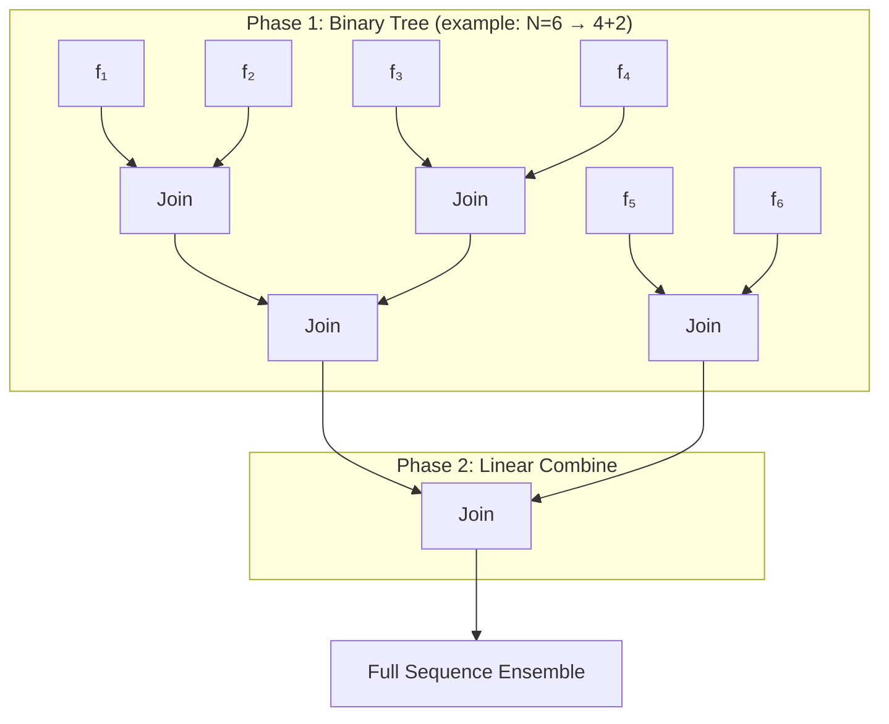

---
slug:8-hierarchical-fragment-joining
blog_type:normal
---

层级片段拼接阶段是 IDP-o 流程的组合核心——它将逐片段的结构系综（从 Foldcomp 重建而来）转换为针对完整目标序列的全局一致系综。系统并非从左到右线性拼接片段，而是将片段列表分解为**2的幂次分段**，通过**平衡二叉树**拼接每个分段，然后**线性组合**生成的超片段。这种层级结构最大限度地减少了比对误差的累积，并在拼接图中更均匀地分布冲突概率，与朴素的顺序拼接相比，能生成结构连贯性更优的系综。

## 从片段到完整序列

拼接过程作用于片段生成策略的输出，该策略将长度为 *L* 的目标序列划分为 `seq_len=6` 个残基、且 `overlap=2` 个残基窗口重叠的片段。步长为 4（`seq_len - overlap`），长度为 *L* 的序列会产生约 ⌈(*L* − 4) / 4⌉ + 1 个片段。每个片段携带一个构象系综（坐标、主链索引以及均匀或派生的概率权重），这些数据从 [Foldcomp 结构重建](7-structure-reconstruction-from-foldcomp) 生成的逐片段 `.h5` 文件中加载。

`generate_fragments` 函数实现了此划分：它在每一步将滑动窗口移动 `seq_len - overlap` 个残基，确保每对相邻片段恰好共享 2 个残基——即执行结构比对的**拼接接口**。长度等于重叠大小的退化尾部片段会被丢弃，因为它不携带新的结构信息。

来源: [fasta_search_in_foldcomp_database.py](/scripts/fasta_search_in_foldcomp_database.py#L147-L152), [join_fragments.py](/scripts/join_fragments.py#L286-L288)

## 两两拼接：比对、验证与接受

在原子层面上，层级结构中的每次拼接都是一个**两两操作**，组合了共享 2 个残基重叠的左片段 *l* 和右片段 *r*。`join_fragments` 函数以类似蒙特卡洛的采样过程来编排此操作：

1. **加权构象采样** — 根据各自的概率分布（`lprobs`、`rprobs`），从每个片段的系综中独立抽取 `n` 个构象索引，生成 `n` 对候选的左右组合。
2. **向量化比对与验证** — 对于每对组合，通过重叠主链原子将右片段叠加到左片段上，然后检查合并结构是否存在空间冲突。
3. **过滤** — 只有同时满足 **RMSD 阈值**（重叠主链上 < 0.06 nm = 0.6 Å）和**无冲突条件**的组合才能通过过滤掩码。
4. **重采样重试** — 如果未找到有效组合，则在回退至单次随机选择前，最多进行 5 次重新抽取新随机索引。

采样数 `n` 向上取整为块大小的倍数，而块大小本身由内存预算启发式算法计算得出：`batch_size = target_GB / (1e-5 × nres²)`，其中 `nres` 是拼接序列中的残基总数。这确保了 GPU 内存利用率保持在模块导入时设定的 96% XLA 分配上限内。

来源: [join_fragments.py](/scripts/join_fragments.py#L147-L192)

### 基于 SVD 的重叠比对

将右片段比对到左片段的操作由 `affine_alignment` 执行，它计算**最佳刚体变换**（旋转 + 平移），以最小化两个重叠区域之间的 RMSD。这是用 JAX 实现的经典 Kabsch 算法：

- 通过减去质心来**居中**两个坐标集。
- **计算**互协方差矩阵 *R* = (*x* − *x̄*)T(*y* − *ȳ*)。
- 通过 SVD **分解** *R*：*R* = *USV*T。
- **修正**反射：如果 det(*UV*T) < 0，则翻转 *V*T 最后一行的符号。
- **组合**旋转 *Q* = *UV*T。

随后，`align` 函数将此变换应用于整个移动（右侧）坐标集，而不仅仅是重叠部分——这正是将右片段的非重叠部分正确定位在合并帧中的原因。

来源: [join_fragments.py](/scripts/join_fragments.py#L38-L57)

### 冲突检测

比对后，合并的坐标数组将由 `check_interactions` 进行测试，该函数计算完整的两两距离矩阵，并标记任何距离小于 `cutoff=0.1` nm（1.0 Å）的非键合原子对。键合对（来自 mdtraj 拓扑）被排除在检查之外。该函数返回一个上三角对布尔掩码，`_join_fragments` 将其简化为每个候选的单个 `no_clash_mask = ~mask.any()`。这种极度严格的截断值仅过滤掉最严重的空间违规——这适用于本质上无序的语境，在此语境下适度的范德华重叠是预期之内且可容忍的。

来源: [join_fragments.py](/scripts/join_fragments.py#L60-L69), [join_fragments.py](/scripts/join_fragments.py#L112-L123)

### 核心拼接内核

`_join_fragments` 函数是经 JAX 编译的内循环，用于处理单对采样构象。其逻辑为：

- 从每个片段中提取**重叠主链原子索引**：对于左片段，最后 `overlap=2` 个残基提供其 `(C, O)` 原子；对于右片段，前 2 个残基提供 `(N, CA)` 原子。每侧的这四个原子（共 8 个）构成了肽键拼接接口。
- 通过 `vmap(align_and_validate)` 对批次进行**向量化**处理，同时生成所有 `n` 个候选的比对位置、冲突掩码和 RMSD。
- **组合**质量标准：`mask = (rmsds < 0.06) & no_clash_mask`。

`static_context` 元组 `(lhs, rhs)` 标记了合并坐标数组中左右片段之间的原子索引边界——`lhs` 是左片段贡献后的第一个原子索引，`rhs` 是右片段非重叠区域的第一个原子索引。合并位置数组的构造方式为 `concat([lpos[:lhs], rpos_aligned[rhs:]])`，丢弃了右片段中冗余的重叠坐标。

来源: [join_fragments.py](/scripts/join_fragments.py#L96-L123)

## 层级拼接策略

`build_ensemble` 函数实现了**层级分解**，这是 IDP-o 拼接区别于简单从左到右累积的关键。该算法分两阶段进行：

**阶段 1 — 2的幂次二叉树拼接。** 片段计数 *N* 被分解为其二进制表示（最多 16 位）。位置 *k* 上的每个置位产生一个包含 2*k* 个片段的分段。在每个分段内，拼接在 ⌊log₂(segment_size)⌋ 轮中进行：在第 *i* 轮中，来自第 *i*−1 轮的相邻对进行两两拼接，每一轮将超片段数量减半，直到剩下单个超片段。较小的分段优先拼接（`segments[::-1]` 反转操作），这确保了拼接树在每个 2 的幂次块内是平衡的。

**阶段 2 — 超片段的线性组合。** 来自每个 2 的幂次分段的超片段从左到右依次拼接。仅当 *N* 本身不是 2 的幂次时，才需要此阶段。

对于上述包含 6 个片段的示例，4 片段分段在平衡树中拼接（2 轮），2 片段分段在一轮中拼接，然后线性组合生成的两个超片段。

<CgxTip>二进制分解确保了任何拼接链的最大深度为 ⌊log₂(N)⌋ + (number_of_set_bits − 1)，而朴素线性拼接则为 N−1。这极大地减少了累积比对误差的传播。</CgxTip>

来源: [join_fragments.py](/scripts/join_fragments.py#L195-L249)

### 概率传播

每次成功拼接后，生成的超片段会与源自源构象索引的**乘积概率**一起存储在共享的 `data` 字典中。`get_probs` 函数计算源数组中每个唯一构象索引的逆频率权重（为非均匀片段系综实现重要性加权），拼接系综的概率是通过 `jax.tree.map(jnp.multiply, ...)` 计算的左右源概率的逐元素乘积。这确保了从两个片段的高概率区域中提取的构象在拼接系综中更受青睐。

来源: [join_fragments.py](/scripts/join_fragments.py#L126-L129), [join_fragments.py](/scripts/join_fragments.py#L218-L223)

### 内存管理

在层级之间会积极回收 GPU 设备内存。一旦拼接轮次完成（当 `i > 1` 时），来自前两层的所有 `jax.Array` 对象都会通过 `.delete()` 显式删除。这至关重要，因为中间超片段的坐标数组与残基数量成比例增长，如果不进行清理，设备在最终拼接之前就会耗尽其 96% 的分配内存。在任何拼接开始之前，XLA 后端的 `live_buffers()` 也会在 `main` 函数开头被清空。

来源: [join_fragments.py](/scripts/join_fragments.py#L228-L234), [join_fragments.py](/scripts/join_fragments.py#L289-L292)

## JAX 向量化与分块执行

`jit_chunked_vmap` 函数是 JAX 编译时向量化和运行时内存限制之间的桥梁。它并非对 `n` 个候选的完整批次应用 `vmap`（这将同时具体化为 *n × n_atoms × 3* 的坐标张量和 *n × n_atoms × n_atoms* 的距离张量），而是将输入数组重塑为 `chunk_size` 大小的块，然后在单个编译计算内使用 `jax.lax.scan` 按顺序迭代这些块。这在保留每个块内 XLA 优化性能优势的同时，将峰值内存限制在块大小而非总批次大小范围内。

块大小由 `batch_size` lambda 函数决定，其目标约为 10 GB 的设备内存，并与残基计数的平方成反比缩放（反映了 `check_interactions` 中两两距离计算的 *O(n²)* 开销）。

来源: [join_fragments.py](/scripts/join_fragments.py#L132-L144), [join_fragments.py](/scripts/join_fragments.py#L150-L151)

## 拼接后处理：RMSD 排序与氢原子插入

在完整系综组装完成后，会应用两个可选的变换：

1. **基于 RMSD 的轨迹排序** — 启用 `--rmsd_sort` 时，`sort_trajectory` 将所有帧叠加到第 0 帧，计算完整的 RMSD 矩阵，然后通过在 RMSD 空间中的贪心最近邻对帧进行排序。这会生成一个帧间平滑变化的轨迹，这对于在分子查看器中进行视觉检查至关重要。

2. **氢原子插入** — 来自 `nerfax.reduce_utils` 的 `infer_and_insert_hydrogens` 函数根据重原子主链和侧链坐标重建氢原子位置，生成适用于下游 MD 或分析流程的完整全原子轨迹。

来源: [join_fragments.py](/scripts/join_fragments.py#L252-L274), [join_fragments.py](/scripts/join_fragments.py#L308-L319)

## 命令行接口

`join_fragments.py` 脚本暴露了以下用于控制拼接过程的参数：

| 参数 | 类型 | 默认值 | 描述 |
|---|---|---|---|
| `--sequence` | str | *(必需)* | 目标氨基酸序列 |
| `--fragments_folder` | str | *(必需)* | 逐片段 `.h5` 系综文件的路径 |
| `--outpath` | str | *(必需)* | 输出轨迹路径（`.h5`、`.xtc`、`.dcd`、`.pdb`） |
| `--joins_to_attempt_per_pairing` | int | 500000 | 每次拼接中采样的候选构象对数量 |
| `--max_structures_in_ensemble` | int | 500000 | 最终输出系综中的最大构象数 |
| `--rmsd_sort` | flag | False | 按 RMSD 对轨迹排序以实现平滑可视化 |
| `--overwrite` | flag | False | 覆盖现有输出文件 |

请注意，`join_fragments.py` 通常通过 `build_ensemble.py` 间接调用，后者编排完整流程（搜索 → 提取 → 拼接）。当片段系综已被提取且仅需重新运行或调整拼接步骤时，独立调用非常有用。

来源: [join_fragments.py](/scripts/join_fragments.py#L323-L347), [build_ensemble.py](/scripts/build_ensemble.py#L71-L80)

## 架构概要

下表总结了层级拼接阶段中的关键计算组件及其作用：

| 组件 | 作用 | 复杂度类别 |
|---|---|---|
| `affine_alignment` | 基于 SVD 的最佳刚体叠加 | 每次比对 *O(n)* |
| `align` | 将旋转/平移应用于完整移动坐标 | 每次比对 *O(n)* |
| `check_interactions` | 两两空间冲突检测 | 每个候选 *O(n²)* |
| `_join_fragments` | 向量化比对 + 验证 + 过滤 | *O(batch × n²)* |
| `jit_chunked_vmap` | 内存分批的 XLA 编译扫描 | *O((n/chunks) × chunk × n²)* |
| `join_fragments` | 一对组合的采样、拼接、重试循环 | *O(attempts × n_joins × nres²)* |
| `build_ensemble` | 层级树 + 线性组合 | 拼接深度 *O(log N)* |

<CgxTip>2 残基重叠在整个流程中是硬编码的（`pre_join_fragments` 和 `_join_fragments` 中的 `overlap = 2`）。修改此值需要对 `generate_fragments`、主链索引提取逻辑以及 `_join_fragments` 中的重叠原子选择进行协调变更——这并非简单的参数更改。</CgxTip>

层级片段拼接阶段生成完整的构象系综，该系综将输入至 [JAX 向量化系综计算](10-jax-vectorized-ensemble-computation) 以进行下游分析。有关比对数学和冲突条件的更深入论述，请参阅 [重叠比对与冲突检测](9-overlap-alignment-and-clash-detection)。要了解此阶段如何融入完整流程编排，请查阅 [架构概览](4-architecture-overview)。