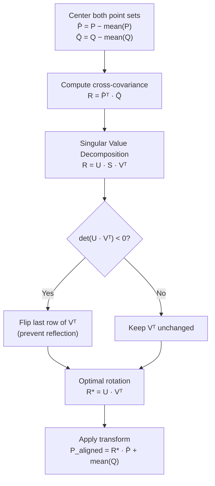
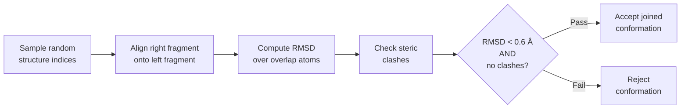

---
slug:9-overlap-alignment-and-clash-detection
blog_type:normal
---


当两个结构片段共享共同的残基序列时，它们的3D坐标几乎永远不会一致——这些片段源自具有不同主链构象的不同数据库条目。**重叠比对**算法通过计算最佳叠加共享主链原子的刚体变换来解决此问题，而**冲突检测**则拒绝任何导致非键合原子进入物理上不可能的接近程度的最终构象。这两个关卡共同构成了 IDP-o 片段拼接管道核心的质量过滤器，决定哪些候选拼接能够存活并进入最终的系综。

## 重叠区域：肽键锚定

IDP-o 片段的长度均为 6 个残基，相邻片段之间存在 **2 个残基的重叠**。这种重叠并非任意设置——它提供了足够的主链原子来唯一确定两个片段的相对方向。`generate_fragments` 函数通过沿序列移动 `seq_len=6` 的窗口（步长为 `seq_len - overlap = 4`）来生成片段，从而使得每对连续片段分别在位置 `[i-2, i-1]` 和 `[i-2, i-1]` 处共享残基。

```python
fragments = [s[i * shift : i * shift + seq_len] for i in range((len(s) - seq_len) // shift + 2)]
```

`pre_join_fragments` 中的断言 `l[-overlap:] == r[:overlap]` 保证在进行任何结构比较之前，重叠残基在序列级别上是匹配的。然后，合并序列被构建为 `l + r[overlap:]`，从而避免共享残基的重复。

来源: [fasta_search_in_foldcomp_database.py](scripts/fasta_search_in_foldcomp_database.py#L146-L150), [join_fragments.py](scripts/join_fragments.py#L88-L93)

## 选择比对锚点原子

IDP-o 并没有在重叠区域中对所有 8 个主链原子（N, CA, C, O × 2 个残基）进行比对，而是选择了一个横跨两个重叠残基之间肽键的 **4 原子子集**：

| 片段 | 重叠残基 | `.ravel()` (8 个原子) | `[2:-2]` 切片 (4 个原子) |
|----------|-----------------|----------------------|---------------------------|
| 左侧（最后 2 个残基） | i−1, i | N,CA,C,O,N,CA,C,O | **C**₍ᵢ₋₁₎, **O**₍ᵢ₋₁₎, **N**₍ᵢ₎, **CA**₍ᵢ₎ |
| 右侧（前 2 个残基） | i−1, i | N,CA,C,O,N,CA,C,O | **C**₍ᵢ₋₁₎, **O**₍ᵢ₋₁₎, **N**₍ᵢ₎, **CA**₍ᵢ₎ |

```python
l_indices, r_indices = (
    bb_indices[indexing].ravel()[2:-2]  # (C, O)_i, (N, CA)_(iplus1), join on peptide bond
    for bb_indices, indexing in [
        (l_bb_indices, jnp.arange(-overlap, 0)),
        (r_bb_indices, jnp.arange(overlap)),
    ]
)
```

这是一个深思熟虑的设计选择：C–N 肽键是多肽主链中几何约束最强的特征（部分双键特性限制了其旋转）。通过将比对锚定在该键两侧的原子上——即上游残基的 C 和 O，以及下游残基的 N 和 CA——该算法瞄准了物理上最具信息量的参考系。舍弃外围原子（上游残基的 N 和 CA，以及下游残基的 C 和 O）避免了用构象变化较大的原子稀释比对信号。

<CgxTip>`[2:-2]` 切片并非在剔除异常值——它是在提取物理上定义肽键连接处的 4 个原子。这就是为什么重叠必须恰好是 2 个残基：更少的残基将无法提供足够的主链原子来锚定比对。</CgxTip>

来源: [join_fragments.py](scripts/join_fragments.py#L106-L115)

## Kabsch 比对：仿射配准

`affine_alignment` 函数实现了 **Kabsch 算法**——这是一种闭合解法，用于求出最小化两个配对点集之间 RMSD 的最优旋转矩阵。给定一个移动点集 **P** 和一个参考点集 **Q**，该算法分三个阶段进行：



**步骤 1 — 中心化：** 两个点集都被平移，使其质心位于原点。平移向量为 `translation_geom = geom.mean(0)` 和 `translation_ref_geom = ref_geom.mean(0)`。中心化解耦了比对的旋转和平移分量，将问题简化为纯旋转。

**步骤 2 — 互协方差与 SVD：** 3×3 互协方差矩阵 `R = (P − P̄)ᵀ · (Q − Q̄)` 编码了两个点集之间的旋转关系。其奇异值分解 `R = U · S · Vᵀ` 将这种关系分解为张成旋转自由度的正交矩阵 U 和 V。

**步骤 3 — 反射处理：** 如果 `det(U · Vᵀ) < 0`，则分解产生了一个非正常旋转（即反射）。算法通过取反 Vᵀ 的最后一行来纠正这一点，确保结果旋转是正常旋转（det = +1）。若无此纠正，病理输入几何可能会产生镜像坐标。

**步骤 4 — 变换应用：** `align` 函数组装完整的仿射变换。移动结构首先中心化（`mobile_pos - pre_trans`），通过爱因斯坦求和旋转（`jnp.einsum("ij,bj", rot, ...)`），然后平移至参考质心（`+ post_trans`）。einsum 表示法通过单次向量化操作，高效地将 3×3 旋转矩阵应用于结构中的每一个原子。

```python
def align(mobile_pos, ref_pos, mobile_indices, ref_indices):
    l_bb, r_bb = ref_pos[ref_indices], mobile_pos[mobile_indices]
    rot, pre_trans, post_trans = affine_alignment(r_bb, l_bb)
    mobile_pos_aligned = jnp.einsum("ij,bj", rot, mobile_pos - pre_trans) + post_trans
    return mobile_pos_aligned
```

来源: [join_fragments.py](scripts/join_fragments.py#L35-L50), [join_fragments.py](scripts/join_fragments.py#L52-L57)

## 冲突检测：空间位阻违规过滤

比对后，合并结构中可能包含被推入物理上不可能的接近程度的原子——即**空间位阻冲突**。`check_interactions` 函数通过穷举的成对距离计算来检测这些违规情况：

```python
def check_interactions(xyz, bonds=None, cutoff=0.1):
    distances = jnp.sqrt(((xyz[:, None] - xyz[None, :]) ** 2).sum(-1))
    mask = distances < cutoff
    mask = mask.at[tuple(bonds.T)].set(False)   # exclude bonded pairs
    mask = jnp.triu(mask, k=1)                   # upper triangle only (j > i)
    return mask
```

该算法分三步执行：

| 步骤 | 操作 | 原理 |
|------|-----------|-----------|
| **距离矩阵** | 对所有原子对计算 `√(Σ(xᵢ - xⱼ)²)` | 完整的成对距离场 |
| **键排除** | 设置 `mask[bonded_pairs] = False` | 成键原子天然距离很近；它们不得触发违规 |
| **上三角** | `jnp.triu(mask, k=1)` | 每对原子只出现一次；避免重复计算并排除自距离（k=1 跳过对角线） |

**0.1 nm (1.0 Å) 的截断值**远低于任何原子对的范德华半径。在此阈值下，被标记的相互作用并不代表边缘的空间重叠——它标志着灾难性的几何违规，即两个非键合原子占据了空间中几乎相同的位置。此类构象在物理上是不可能的，必须予以拒绝。

键表派生自 MDTraj 的 `top.create_standard_bonds()`，它为合并后的拓扑生成标准的共价键。这确保了合法的 1–2 和 1–3 键合相互作用（其天然具有较短距离）绝不会被误判为冲突。

来源: [join_fragments.py](scripts/join_fragments.py#L60-L68), [join_fragments.py](scripts/join_fragments.py#L88-L97)

## 组合验证关卡

`_join_fragments` 函数将比对和冲突检测统一为单一的向量化验证管道。对于从左右系综中抽取的每对候选片段结构，它按顺序执行四项操作：



```python
def align_and_validate(rpos, lpos, r_indices, l_indices):
    rpos_aligned = align(rpos, lpos, r_indices, l_indices)
    rmsd = compute_rmsd(rpos_aligned[r_indices], lpos[l_indices])
    pos = jnp.concatenate([lpos[:lhs], rpos_aligned[rhs:]])
    mask = check_interactions(pos, bonds)
    no_clash_mask = ~mask.any()
    return pos, no_clash_mask, rmsd
```

**比对**产生最优叠加的右侧片段。在 4 个肽键锚点原子上计算 **RMSD** 以量化残余未对齐量——即使经过最优旋转，两个片段的重叠原子也不会完全重合，因为它们源自具有不同主链构象的不同数据库结构。**结构组装**将左侧片段直到重叠边界的原子（`lpos[:lhs]`）与比对后的右侧片段超出重叠的原子（`rpos_aligned[rhs:]`）拼接起来，生成完整的合并坐标数组。随后，**冲突检测**扫描此合并结构以排查空间位阻违规。

最终的接受掩码要求**同时**满足两个标准：

```python
mask = (rmsds < 0.06) & no_clash_mask  # 0.6 Angstrom RMSD threshold
```

| 标准 | 阈值 | 物理解释 |
|-----------|-----------|------------------------|
| 重叠 RMSD | < 0.06 nm (0.6 Å) | 连接处的主链原子达到亚埃级精度一致 |
| 无空间位阻冲突 | 0 个非键合原子对 < 0.1 nm | 合并结构中不存在灾难性的原子重叠 |

0.6 Å 的 RMSD 阈值异常严格。作为参考，在 2.0 Å 分辨率下，X 射线晶体学中的典型坐标不确定度约为 0.2 Å，而 NMR 系综成员在局部主链片段上的 RMSD 差异通常为 1–2 Å。如此严苛的阈值确保了只有当两个片段在重叠区域几乎无法区分时，其拼接才会被接受，从而保持了连接处的局部结构完整性。

<CgxTip>如果在 5 次不同随机样本的重试尝试后，仍无候选对能通过两项过滤，算法将降级为接受单次随机拼接（并记录警告日志）。这防止了片段数据库仅提供重叠性较差的结构时，导致管道运行失败。</CgxTip>

来源: [join_fragments.py](scripts/join_fragments.py#L100-L127)

## JAX 向量化：大规模批量验证

验证关卡并非仅执行一次，而是每个片段对执行**数万至数十万次**——`joins_to_attempt_per_pairing` 参数默认为 500,000。这得益于 JAX 的 `vmap`，它将逐对执行的 `align_and_validate` 函数转换为批量操作，在 GPU 上的单个编译 XLA 内核中运行：

```python
pos, no_clash_mask, rmsds = vmap(align_and_validate, in_axes=(0, 0, None, None))(
    rpos, lpos, r_indices, l_indices
)
```

`in_axes=(0, 0, None, None)` 规范表明 `rpos` 和 `lpos` 沿其第一轴进行批处理（不同的结构样本），而 `r_indices` 和 `l_indices` 是共享常量（所有配对使用相同的重叠原子）。这避免了冗余的索引计算并减少了内存流量。

为防止大型合并结构出现 GPU 内存不足错误，`jit_chunked_vmap` 函数根据预估的内存预算将完整批次分解为块：

```python
batch_size = lambda nres, target=10: target / (1e-5 * (nres**2))  # target in GB
```

O(n²) 的缩放比例考虑了 `check_interactions` 中的成对距离矩阵，该矩阵主导了内存使用。每个块通过 `jax.lax.scan` 处理，结果被重新组装为扁平的输出数组。这确保了算法能够扩展到任意长的序列，而不会超出可用的 GPU 内存。

来源: [join_fragments.py](scripts/join_fragments.py#L123-L126), [join_fragments.py](scripts/join_fragments.py#L140-L156), [join_fragments.py](scripts/join_fragments.py#L158-L197)

## 概率加权采样与重试逻辑

片段系综中并非所有结构候选者都具有相同的可能性。`join_fragments` 函数使用**概率加权随机采样**，在抽取候选拼接对时优先选择具有较高统计权重的结构：

```python
random_indices = tuple(
    random.choice(key, jnp.arange(len(pos)), shape=(n,), p=probs)
    for key, pos, probs in ((lkey, lpos, lprobs), (rkey, rpos, rprobs))
)
```

概率向量（`probs`）派生自每个结构的源片段在数据库中出现的频率——在多个数据库条目中作为命中出现的结构，通过 `get_probs` 函数获得更高的权重，该函数根据唯一值频率计算逆计数权重。在每次成功拼接后，输出系综的概率被设置为源片段概率的逐元素乘积，从而将统计置信度贯穿层级拼接过程。

如果组合的 RMSD + 冲突过滤器拒绝了某批次中的所有候选者，算法将使用新的 PRNG 密钥重新采样，最多尝试 **5 次**，然后降级接受单次随机拼接。这种优雅的降级确保了即使是数据库覆盖稀疏或质量较差的序列，也能生成系综，而不是彻底失败。

来源: [join_fragments.py](scripts/join_fragments.py#L158-L197), [join_fragments.py](scripts/join_fragments.py#L130-L138)

## 算法复杂度与性能特征

重叠比对和冲突检测管道的计算成本主要由每个候选对的以下两项操作决定：

| 操作 | 每对复杂度 | 备注 |
|-----------|-------------------|-------|
| Kabsch 比对 (SVD) | O(1) | 固定的 4×3 点集 → 3×3 SVD |
| RMSD 计算 | O(1) | 固定的 4 个重叠原子 |
| 成对距离矩阵 | O(n²) | n = 合并结构中的总原子数 |
| 键排除 | O(b) | b = 键的数量 |

**O(n²) 距离矩阵**是瓶颈，这就是分块大小公式与 n² 成反比的原因。对于典型的 100 个残基的 IDP（在氢原子推断前约有 1,600 个重原子），距离矩阵需要约 2000 万个条目——这在每块约 400 个候选者的批大小下，完全在 GPU 内存容量之内。针对 500,000 个候选者的整个验证管道被编译为单个 XLA 内核，在现代 GPU 上仅需数秒即可执行完毕。

来源: [join_fragments.py](scripts/join_fragments.py#L60-L68), [join_fragments.py](scripts/join_fragments.py#L159-L162)

---

理解片段如何进行几何验证，是理解管道中下一个算法的关键背景：[JAX 向量化系综计算](10-jax-vectorized-ensemble-computation)涵盖了在所有拼接经过过滤后，完整系综是如何组装和存储的。至于生成进入此算法的片段对的上游机制，请参见[层级片段拼接](8-hierarchical-fragment-joining)。