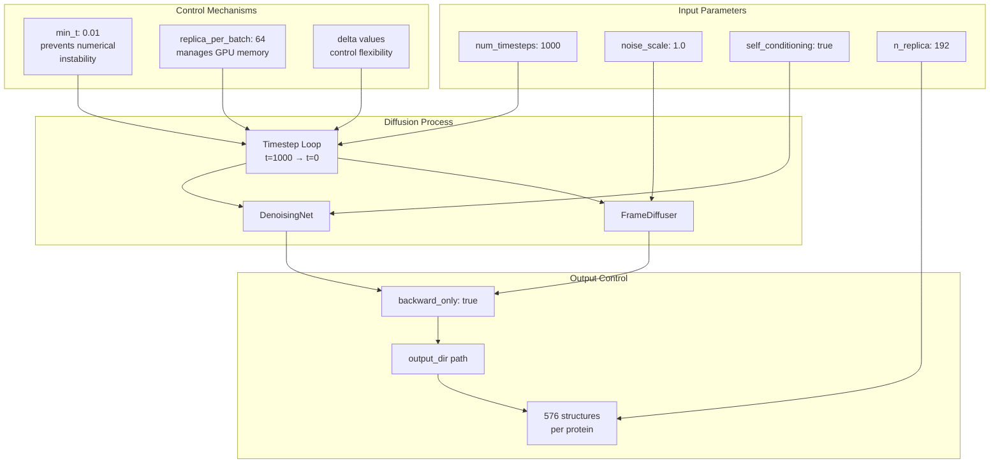
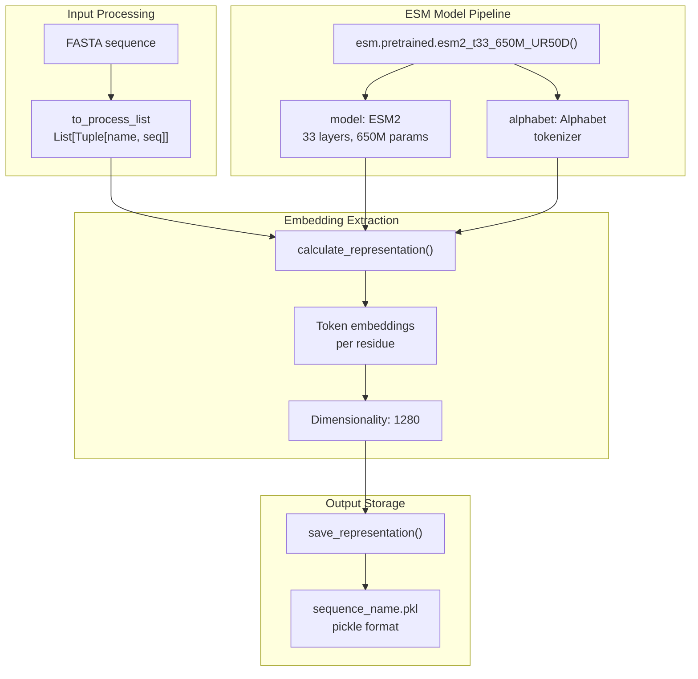
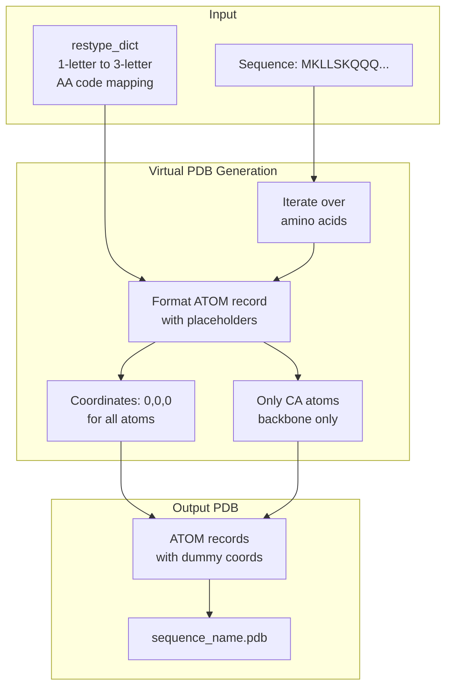
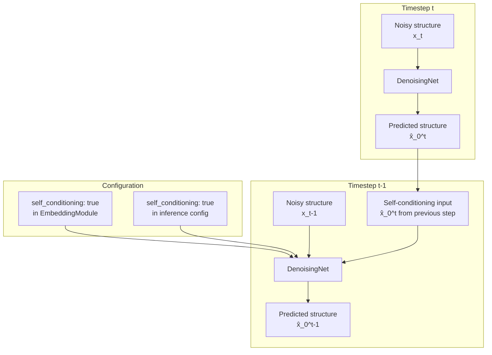
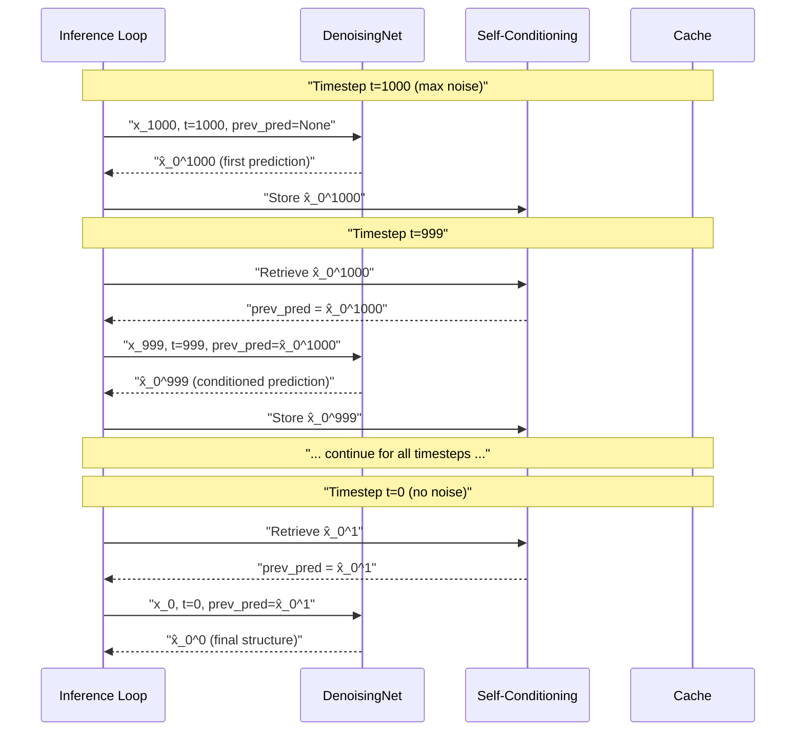

# Advanced Topics

> **Relevant source files**
> * [configs/model/diffusion.yaml](https://github.com/Junjie-Zhu/IDPFold/blob/ba40f40c/configs/model/diffusion.yaml)
> * [initialize.py](https://github.com/Junjie-Zhu/IDPFold/blob/ba40f40c/initialize.py)
> * [src/read_seqs.py](https://github.com/Junjie-Zhu/IDPFold/blob/ba40f40c/src/read_seqs.py)

This page covers advanced technical concepts and implementation details for IDPFold users who need deeper understanding of the system's internal mechanisms. Topics include inference parameter tuning, ESM embedding extraction processes, virtual PDB file generation, and self-conditioning techniques.

For basic usage instructions, see [User Guide](/Junjie-Zhu/IDPFold/3-user-guide). For model architecture details, see [Model Architecture](/Junjie-Zhu/IDPFold/4-model-architecture). For configuration file structure, see [Configuration System](/Junjie-Zhu/IDPFold/5-configuration-system).

---

## 7.1 Inference Parameters

The `DiffusionLitModule` provides several advanced parameters that control the quality, diversity, and computational cost of conformational ensemble generation. These parameters are configured in [configs/model/diffusion.yaml L87-L101](https://github.com/Junjie-Zhu/IDPFold/blob/ba40f40c/configs/model/diffusion.yaml#L87-L101)

### Core Inference Parameters

The following table documents the key inference parameters and their effects:

| Parameter | Type | Default | Description |
| --- | --- | --- | --- |
| `num_timesteps` | int | 1000 | Number of diffusion timesteps for denoising process |
| `noise_scale` | float | 1.0 | Scaling factor for noise addition during forward diffusion |
| `self_conditioning` | bool | true | Enable self-conditioning to improve prediction quality |
| `n_replica` | int | 192 | Number of structural replicas to generate per protein |
| `replica_per_batch` | int | 64 | Batch size for replica generation (affects memory usage) |
| `min_t` | float | 0.01 | Minimum timestep value to prevent numerical instability |
| `probability_flow` | bool | false | Use probability flow ODE instead of SDE sampling |
| `backward_only` | bool | true | Only perform backward diffusion (skip forward pass) |

**Sources:** [configs/model/diffusion.yaml L87-L101](https://github.com/Junjie-Zhu/IDPFold/blob/ba40f40c/configs/model/diffusion.yaml#L87-L101)

### Delta Parameters for Ensemble Diversity

IDPFold generates ensembles with varying flexibility by sweeping through delta values:

```yaml
delta_min: 0.25delta_max: 0.35delta_step: 0.05
```

The total number of structures generated is: `n_replica * ((delta_max - delta_min) / delta_step + 1)`

With default values: `192 * ((0.35 - 0.25) / 0.05 + 1) = 192 * 3 = 576` structures per protein.

**Sources:** [configs/model/diffusion.yaml L89-L92](https://github.com/Junjie-Zhu/IDPFold/blob/ba40f40c/configs/model/diffusion.yaml#L89-L92)

### Inference Parameter Flow Diagram



**Sources:** [configs/model/diffusion.yaml L87-L101](https://github.com/Junjie-Zhu/IDPFold/blob/ba40f40c/configs/model/diffusion.yaml#L87-L101)

### Memory and Performance Considerations

The `replica_per_batch` parameter directly affects GPU memory usage. For proteins with `L` residues:

* Memory per replica ≈ `L² * sizeof(float)` for pairwise distance matrices
* Memory per batch ≈ `replica_per_batch * L² * sizeof(float)`
* For a 100-residue protein with `replica_per_batch=64`: ~2.5 MB per batch

Reducing `replica_per_batch` enables longer protein sequences but increases wall-clock time linearly.

**Sources:** [configs/model/diffusion.yaml L93](https://github.com/Junjie-Zhu/IDPFold/blob/ba40f40c/configs/model/diffusion.yaml#L93-L93)

---

## 7.2 ESM Embedding Extraction

IDPFold uses Facebook's ESM (Evolutionary Scale Modeling) language model to extract sequence embeddings. The extraction process is implemented in [src/read_seqs.py](https://github.com/Junjie-Zhu/IDPFold/blob/ba40f40c/src/read_seqs.py)

 and uses the `esm2_t33_650M_UR50D` model variant.

### ESM Model Architecture



**Sources:** [src/read_seqs.py L51-L58](https://github.com/Junjie-Zhu/IDPFold/blob/ba40f40c/src/read_seqs.py#L51-L58)

### ESM2 Model Specifications

The `esm2_t33_650M_UR50D` model has the following characteristics:

| Property | Value |
| --- | --- |
| Model type | ESM-2 |
| Number of transformer layers | 33 |
| Parameters | 650 million |
| Training dataset | UniRef50 (2021) |
| Embedding dimension | 1280 |
| Maximum sequence length | ~1000 residues |

**Sources:** [src/read_seqs.py L51](https://github.com/Junjie-Zhu/IDPFold/blob/ba40f40c/src/read_seqs.py#L51-L51)

### Embedding Extraction Implementation

The embedding extraction process in `read_seqs.py` follows this sequence:

```mermaid
sequenceDiagram
  participant FASTA File
  participant read_seqs.py:main()
  participant ESM Model
  participant calculate_representation()
  participant save_representation()
  participant Pickle File

  FASTA File->>read_seqs.py:main(): "Read input_fasta"
  read_seqs.py:main()->>read_seqs.py:main(): "Parse sequences
  read_seqs.py:main()->>read_seqs.py:main(): line 27-36"
  read_seqs.py:main()->>ESM Model: "Create to_process_list
  ESM Model-->>read_seqs.py:main(): List[(name, seq)]"
  read_seqs.py:main()->>read_seqs.py:main(): "Load esm2_t33_650M_UR50D
  read_seqs.py:main()->>calculate_representation(): line 51"
  calculate_representation()->>ESM Model: "model, alphabet"
  ESM Model-->>calculate_representation(): "model.to(device)
  calculate_representation()-->>read_seqs.py:main(): line 52"
  loop ["For each sequence"]
    read_seqs.py:main()->>save_representation(): "calculate_representation()
    save_representation()->>Pickle File: model, alphabet, to_process_list"
  end
```

**Sources:** [src/read_seqs.py L15-L58](https://github.com/Junjie-Zhu/IDPFold/blob/ba40f40c/src/read_seqs.py#L15-L58)

### Device Management and GPU Acceleration

The embedding extraction automatically detects and uses available GPU:

```
device = torch.device('cuda' if torch.cuda.is_available() else 'cpu')model = model.to(device)
```

On CUDA-enabled systems, embedding extraction for a 100-residue protein takes approximately 0.5-2 seconds. CPU-only extraction can take 10-30 seconds per protein.

**Sources:** [src/read_seqs.py L24-L52](https://github.com/Junjie-Zhu/IDPFold/blob/ba40f40c/src/read_seqs.py#L24-L52)

### Embedding File Format

The `save_representation()` function from `src.utils.esm_extract` saves embeddings as pickle files containing:

* **Sequence label**: Protein identifier from FASTA header
* **Sequence string**: Raw amino acid sequence
* **Representation**: Numpy array of shape `(L, 1280)` where `L` is sequence length

Each residue has a 1280-dimensional embedding vector capturing evolutionary and structural information.

**Sources:** [src/read_seqs.py L58](https://github.com/Junjie-Zhu/IDPFold/blob/ba40f40c/src/read_seqs.py#L58-L58)

---

## 7.3 Virtual PDB Files

During preprocessing, `read_seqs.py` generates "virtual" PDB files with placeholder coordinates. These files serve as structural templates for the diffusion model while providing proper formatting for downstream processing.

### Virtual PDB Generation Process



**Sources:** [src/read_seqs.py L38-L49](https://github.com/Junjie-Zhu/IDPFold/blob/ba40f40c/src/read_seqs.py#L38-L49)

### PDB Record Format

Each virtual PDB file contains only CA (alpha carbon) atoms with zero coordinates. The format follows PDB specification:

```
ATOM      1  CA  MET A   1       0.000   0.000   0.000  1.00  0.00           C
ATOM      2  CA  LYS A   2       0.000   0.000   0.000  1.00  0.00           C
ATOM      3  CA  LEU A   3       0.000   0.000   0.000  1.00  0.00           C
```

Field breakdown:

* **ATOM**: Record type
* **Serial**: Atom number (1-indexed, line 48: `i + 1`)
* **CA**: Atom name (alpha carbon)
* **Residue**: 3-letter amino acid code from `restype_dict`
* **Chain**: Always 'A'
* **ResSeq**: Residue number (1-indexed, line 49: `i + 1`)
* **X, Y, Z**: Coordinates (always 0.000)
* **Occupancy**: 1.00
* **TempFactor**: 0.00
* **Element**: C (carbon)

**Sources:** [src/read_seqs.py L48-L49](https://github.com/Junjie-Zhu/IDPFold/blob/ba40f40c/src/read_seqs.py#L48-L49)

### Residue Type Dictionary

The `restype_dict` maps single-letter amino acid codes to three-letter PDB format:

```
restype_dict = {    'A': 'ALA', 'C': 'CYS', 'D': 'ASP', 'E': 'GLU',    'F': 'PHE', 'G': 'GLY', 'H': 'HIS', 'I': 'ILE',    'K': 'LYS', 'L': 'LEU', 'M': 'MET', 'N': 'ASN',    'P': 'PRO', 'Q': 'GLN', 'R': 'ARG', 'S': 'SER',    'T': 'THR', 'V': 'VAL', 'W': 'TRP', 'Y': 'TYR'}
```

This dictionary supports all 20 standard amino acids. Non-standard residues or ambiguous codes are not supported.

**Sources:** [src/read_seqs.py L39-L41](https://github.com/Junjie-Zhu/IDPFold/blob/ba40f40c/src/read_seqs.py#L39-L41)

### Purpose and Usage

Virtual PDB files serve multiple functions in the IDPFold pipeline:

1. **Format Compatibility**: Provide standard PDB structure for data loading modules that expect PDB input
2. **Sequence Template**: Store residue identity and chain information
3. **Placeholder Structure**: Enable initialization of coordinate tensors with proper shape
4. **Debugging**: Allow visual inspection of sequence length and composition

The diffusion model replaces all placeholder coordinates during the denoising process, generating physically realistic conformations.

**Sources:** [src/read_seqs.py L43-L49](https://github.com/Junjie-Zhu/IDPFold/blob/ba40f40c/src/read_seqs.py#L43-L49)

### File Location

Virtual PDB files are written to the path specified by `cfg.data.dataset.path_to_dataset`, which defaults to the `TEST_DATA` directory configured in `.env`:

```
pdb_path = cfg.data.dataset.path_to_datasetwith open(os.path.join(pdb_path, (seq_name + '.pdb')), 'w') as f:
```

**Sources:** [src/read_seqs.py L22-L45](https://github.com/Junjie-Zhu/IDPFold/blob/ba40f40c/src/read_seqs.py#L22-L45)

 [initialize.py L10](https://github.com/Junjie-Zhu/IDPFold/blob/ba40f40c/initialize.py#L10-L10)

---

## 7.4 Self-Conditioning

Self-conditioning is a technique that improves diffusion model performance by using the model's own previous predictions to inform subsequent predictions. IDPFold implements self-conditioning in both the `EmbeddingModule` and during inference.

### Self-Conditioning Architecture



**Sources:** [configs/model/diffusion.yaml L26-L97](https://github.com/Junjie-Zhu/IDPFold/blob/ba40f40c/configs/model/diffusion.yaml#L26-L97)

### Configuration Parameters

Self-conditioning is controlled by two boolean flags in the configuration:

| Parameter | Location | Default | Effect |
| --- | --- | --- | --- |
| `embedder.self_conditioning` | Model config | true | Enables self-conditioning in `EmbeddingModule` |
| `inference.self_conditioning` | Inference config | true | Uses self-conditioning during sampling |

Both flags must be `true` for self-conditioning to be active during inference.

**Sources:** [configs/model/diffusion.yaml L26](https://github.com/Junjie-Zhu/IDPFold/blob/ba40f40c/configs/model/diffusion.yaml#L26-L26)

 [configs/model/diffusion.yaml L97](https://github.com/Junjie-Zhu/IDPFold/blob/ba40f40c/configs/model/diffusion.yaml#L97-L97)

### Implementation in EmbeddingModule

The `EmbeddingModule` (configured at [configs/model/diffusion.yaml L18-L26](https://github.com/Junjie-Zhu/IDPFold/blob/ba40f40c/configs/model/diffusion.yaml#L18-L26)

) accepts a `self_conditioning` parameter:

```yaml
embedder:  _target_: src.models.net.denoising_ipa.EmbeddingModule  init_embed_size: 32  node_embed_size: 256  edge_embed_size: 128  num_bins: 22  min_bin: 1e-5  max_bin: 20.0  self_conditioning: true
```

When enabled, the `EmbeddingModule` accepts previous predictions as additional input features, concatenating them with the current embeddings before processing.

**Sources:** [configs/model/diffusion.yaml L18-L26](https://github.com/Junjie-Zhu/IDPFold/blob/ba40f40c/configs/model/diffusion.yaml#L18-L26)

### Self-Conditioning During Inference

The inference process with self-conditioning follows this pattern:



**Sources:** [configs/model/diffusion.yaml L97](https://github.com/Junjie-Zhu/IDPFold/blob/ba40f40c/configs/model/diffusion.yaml#L97-L97)

### Benefits and Trade-offs

Self-conditioning provides several advantages:

**Benefits:**

* **Improved accuracy**: Model learns from its own predictions, reducing prediction error
* **Faster convergence**: Fewer denoising steps needed for comparable quality
* **Consistency**: Predictions are more coherent across timesteps

**Trade-offs:**

* **Increased memory**: Must cache previous predictions (shape: `[batch, L, 3]`)
* **Slight computational overhead**: Additional concatenation and processing
* **First-step cold start**: No previous prediction available at `t=T`

For IDPFold's conformational ensemble generation, the accuracy improvements outweigh the modest memory cost, making self-conditioning enabled by default.

**Sources:** [configs/model/diffusion.yaml L26-L97](https://github.com/Junjie-Zhu/IDPFold/blob/ba40f40c/configs/model/diffusion.yaml#L26-L97)

### Disabling Self-Conditioning

To disable self-conditioning, set both configuration flags to `false`:

```markdown
# In configs/model/diffusion.yamlnet:  embedder:    self_conditioning: false  # line 26 inference:  self_conditioning: false  # line 97
```

This may be useful for ablation studies or when memory is severely constrained.

**Sources:** [configs/model/diffusion.yaml L26-L97](https://github.com/Junjie-Zhu/IDPFold/blob/ba40f40c/configs/model/diffusion.yaml#L26-L97)