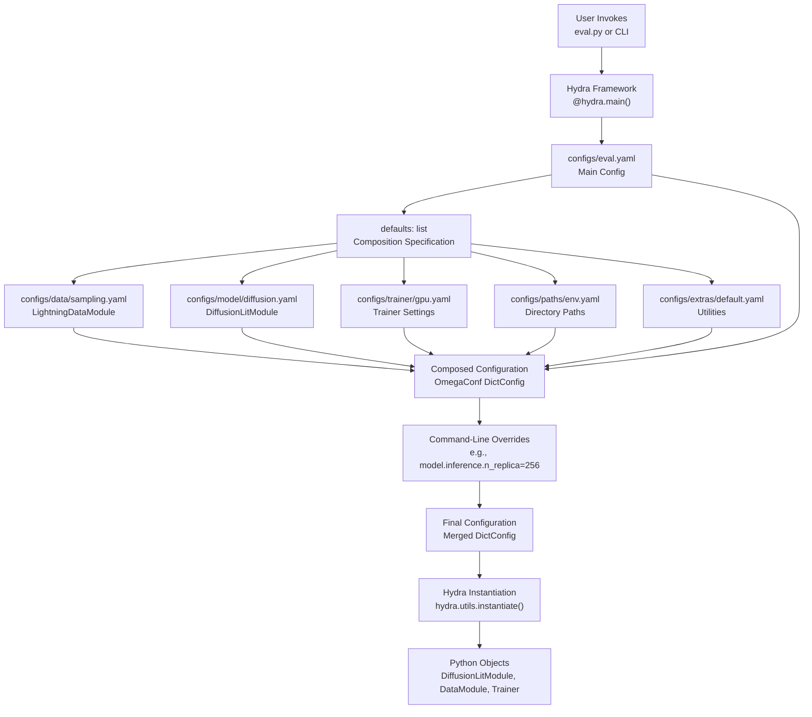
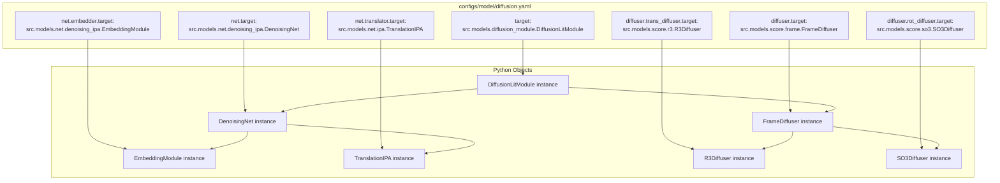

# Configuration Overview

> **Relevant source files**
> * [configs/eval.yaml](https://github.com/Junjie-Zhu/IDPFold/blob/ba40f40c/configs/eval.yaml)
> * [configs/model/diffusion.yaml](https://github.com/Junjie-Zhu/IDPFold/blob/ba40f40c/configs/model/diffusion.yaml)

## Purpose and Scope

This document introduces IDPFold's configuration system, which uses the Hydra framework to manage all model, training, and evaluation parameters through composable YAML files. It explains the overall structure of configuration files, how configs are composed together, and how the `_target_` instantiation pattern maps YAML configurations to Python objects.

For detailed parameter references, see [Model Configuration Reference](/Junjie-Zhu/IDPFold/5.2-model-configuration-reference) for `diffusion.yaml` parameters and [Evaluation Configuration Reference](/Junjie-Zhu/IDPFold/5.3-evaluation-configuration-reference) for `eval.yaml` parameters.

## Hydra Framework Integration

IDPFold uses [Hydra](https://hydra.cc/) as its configuration management framework. Hydra enables:

* **Composable configurations**: Building complete configurations from multiple modular YAML files
* **Command-line overrides**: Modifying any configuration parameter without editing files
* **Structured configs**: Type-safe configuration through instantiation of Python objects
* **Working directory management**: Automatic creation of output directories per run

The main entry points (`eval.py`, training scripts) are decorated with `@hydra.main()` to enable Hydra's configuration loading and composition.

**Sources:** configs/eval.yaml, Diagram 3 from high-level architecture

## Configuration File Structure

Configuration files in IDPFold follow a hierarchical directory structure under `configs/`:

```python
configs/
├── eval.yaml                 # Main evaluation configuration
├── model/
│   └── diffusion.yaml       # Model architecture and training parameters
├── data/
│   └── sampling.yaml        # Data module configuration
├── trainer/
│   └── gpu.yaml             # PyTorch Lightning trainer settings
├── logger/
│   └── [logger configs]     # Experiment tracking configurations
├── paths/
│   └── env.yaml             # Path definitions from .env
└── extras/
    └── default.yaml         # Additional utilities
```

Each configuration file defines parameters for a specific system component. The modular organization allows researchers to experiment with different combinations (e.g., swap data modules or trainer configurations) without modifying code.

**Sources:** configs/eval.yaml:1-11

## Configuration Composition with Defaults

The `defaults` list in configuration files specifies which configs to compose together. The eval configuration demonstrates this pattern:

```yaml
defaults:  - _self_  - data: sampling  - model: diffusion  - logger: null  - trainer: gpu  - paths: env  - extras: default  - hydra: default
```

[configs/eval.yaml L3-L11](https://github.com/Junjie-Zhu/IDPFold/blob/ba40f40c/configs/eval.yaml#L3-L11)

This composition pattern works as follows:

| Default Entry | Resolution | Purpose |
| --- | --- | --- |
| `_self_` | Current file | Places this config in composition order |
| `data: sampling` | `configs/data/sampling.yaml` | Specifies the data module configuration |
| `model: diffusion` | `configs/model/diffusion.yaml` | Specifies the model architecture |
| `logger: null` | No logger | Disables experiment tracking |
| `trainer: gpu` | `configs/trainer/gpu.yaml` | Specifies PyTorch Lightning trainer |
| `paths: env` | `configs/paths/env.yaml` | Loads paths from `.env` file |
| `extras: default` | `configs/extras/default.yaml` | Additional utilities |
| `hydra: default` | Hydra's default settings | Framework configuration |

The order of defaults matters: later entries can override values from earlier ones. `_self_` controls where the current file's values appear in this order.

**Sources:** configs/eval.yaml:3-11

## Configuration Composition Flow

The following diagram illustrates how Hydra composes the final configuration from multiple YAML files:



**Sources:** configs/eval.yaml:3-11, configs/model/diffusion.yaml:1

## Target-Based Instantiation Pattern

IDPFold uses Hydra's `_target_` key to specify which Python class should be instantiated from each configuration. This pattern bridges YAML configurations to Python objects:

### Model Configuration Instantiation



**Sources:** configs/model/diffusion.yaml:1, 17, 19, 28, 43, 45, 50

The `_target_` key specifies the fully qualified Python class path. When Hydra encounters `_target_`, it:

1. Imports the specified class
2. Passes all other keys in the same YAML section as constructor arguments
3. Recursively instantiates any nested `_target_` configs

### Key Instantiation Examples

The model configuration demonstrates nested instantiation:

```yaml
_target_: src.models.diffusion_module.DiffusionLitModule net:  _target_: src.models.net.denoising_ipa.DenoisingNet  embedder:     _target_: src.models.net.denoising_ipa.EmbeddingModule    init_embed_size: 32    node_embed_size: 256
```

[configs/model/diffusion.yaml L1-L22](https://github.com/Junjie-Zhu/IDPFold/blob/ba40f40c/configs/model/diffusion.yaml#L1-L22)

This creates a `DiffusionLitModule` instance with a `net` attribute containing a `DenoisingNet` instance, which itself contains an `EmbeddingModule` instance with the specified parameters.

### Partial Instantiation

Some configs use `_partial_: true` to create partial functions rather than immediate instances:

```yaml
optimizer:  _target_: torch.optim.Adam  _partial_: true  lr: 1e-4  weight_decay: 0.0
```

[configs/model/diffusion.yaml L3-L7](https://github.com/Junjie-Zhu/IDPFold/blob/ba40f40c/configs/model/diffusion.yaml#L3-L7)

This creates a partial function that can be called later with additional arguments (typically model parameters), enabling lazy instantiation within the module's setup logic.

**Sources:** configs/model/diffusion.yaml:1-58

## Configuration Types and Responsibilities

IDPFold's configuration system divides responsibilities across several config groups:

### Configuration Groups Table

| Config Group | Location | Instantiated Class | Responsibility |
| --- | --- | --- | --- |
| `model` | `configs/model/` | `DiffusionLitModule` | Model architecture, diffusion process, loss functions, optimizer |
| `data` | `configs/data/` | `LightningDataModule` | Dataset loading, preprocessing, dataloaders |
| `trainer` | `configs/trainer/` | `lightning.Trainer` | Training strategy, devices, precision, callbacks |
| `logger` | `configs/logger/` | Experiment tracker | W&B, TensorBoard, or other logging backends |
| `paths` | `configs/paths/` | Path strings | Directory locations from `.env` file |
| `extras` | `configs/extras/` | Utilities | Additional helper functionality |

Each group is independently composable, allowing combinations like:

* Different models with the same data configuration
* Different trainer strategies (CPU, single GPU, multi-GPU) with the same model
* Enabling/disabling loggers without touching other configs

**Sources:** configs/eval.yaml:5-10, configs/model/diffusion.yaml:1-103

## Variable Interpolation and Path References

Hydra supports variable interpolation using the `${...}` syntax to reference other configuration values:

```python
# In diffusion.yamlrot_diffuser:  cache_dir: ${paths.cache_dir}  # References paths.cache_dir from paths/env.yaml inference:  output_dir: ${paths.output_dir}/samples  # Builds path from paths config
```

[configs/model/diffusion.yaml L56-L99](https://github.com/Junjie-Zhu/IDPFold/blob/ba40f40c/configs/model/diffusion.yaml#L56-L99)

Common interpolation patterns:

* `${paths.data_dir}` - References base data directory
* `${paths.output_dir}` - References output directory for results
* `${paths.cache_dir}` - References cache directory for precomputed data

This approach centralizes path management in the `paths` config group (typically loaded from `.env`), making the system portable across different environments.

**Sources:** configs/model/diffusion.yaml:56, 99; configs/eval.yaml:18

## Command-Line Configuration Overrides

Hydra allows overriding any configuration parameter from the command line without editing files:

```markdown
# Override model inference parameterspython src/eval.py model.inference.n_replica=256 model.inference.num_timesteps=500 # Change checkpoint pathpython src/eval.py ckpt_path=/path/to/checkpoint.ckpt # Override nested parameterspython src/eval.py model.net.translator.no_ipa_blocks=8 # Change output directorypython src/eval.py model.inference.output_dir=/custom/output
```

The syntax follows the YAML structure with dot notation: `config_group.section.parameter=value`. This enables rapid experimentation without maintaining multiple configuration files.

### Override Priority

Configuration values are resolved in this order (later overrides earlier):

1. Default values in config files
2. Composed configs from `defaults` list
3. Values in the main config file (after `_self_`)
4. Command-line overrides

**Sources:** configs/model/diffusion.yaml, configs/eval.yaml

## Configuration State and Reproducibility

Hydra automatically saves the complete resolved configuration for each run, ensuring reproducibility:

* **Config resolution**: All interpolations, defaults, and overrides are resolved to concrete values
* **Config logging**: The final configuration is saved to `outputs/<date>/<time>/.hydra/config.yaml`
* **Overrides tracking**: Command-line overrides are logged to `overrides.yaml`

This makes every experiment fully reproducible - the saved config can regenerate the exact same setup.

**Sources:** High-level Diagram 3 (Configuration Architecture)

## Summary

IDPFold's configuration system provides:

* **Modularity**: Separate configs for model, data, trainer, and paths
* **Composition**: Flexible combination of config components via `defaults`
* **Instantiation**: Direct YAML-to-Python object mapping via `_target_`
* **Overrides**: Command-line parameter modification without file editing
* **Reproducibility**: Automatic saving of complete configuration state

For detailed parameter documentation, refer to [Model Configuration Reference](/Junjie-Zhu/IDPFold/5.2-model-configuration-reference) and [Evaluation Configuration Reference](/Junjie-Zhu/IDPFold/5.3-evaluation-configuration-reference).

**Sources:** configs/eval.yaml:1-20, configs/model/diffusion.yaml:1-103, High-level System Diagram 3