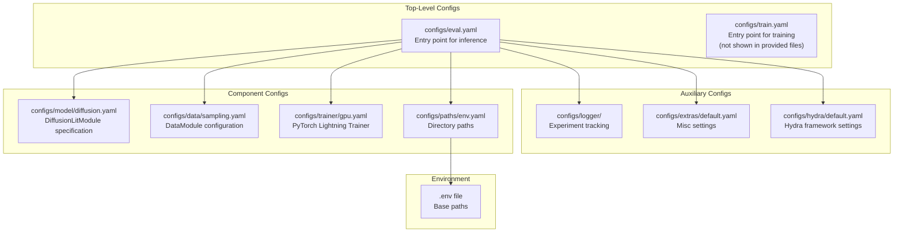
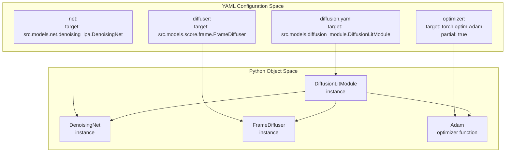
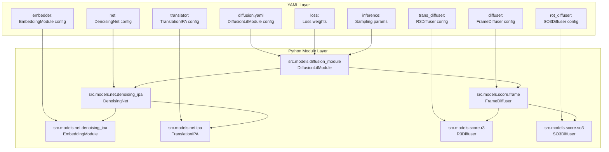
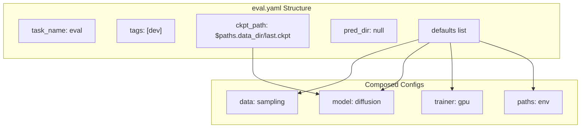
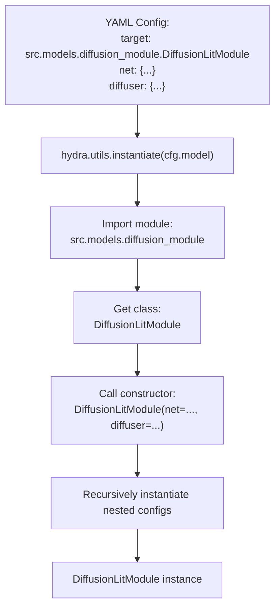

# Configuration System

> **Relevant source files**
> * [configs/eval.yaml](https://github.com/Junjie-Zhu/IDPFold/blob/ba40f40c/configs/eval.yaml)
> * [configs/model/diffusion.yaml](https://github.com/Junjie-Zhu/IDPFold/blob/ba40f40c/configs/model/diffusion.yaml)

## Purpose and Scope

This document describes the configuration system used throughout IDPFold. The system uses the [Hydra framework](https://hydra.cc/) to manage hierarchical YAML-based configurations that control model architecture, training hyperparameters, evaluation settings, and file paths.

For detailed parameter references, see:

* [Configuration Overview](/Junjie-Zhu/IDPFold/5.1-configuration-overview) for Hydra usage patterns and composition mechanics
* [Model Configuration Reference](/Junjie-Zhu/IDPFold/5.2-model-configuration-reference) for all parameters in `diffusion.yaml`
* [Evaluation Configuration Reference](/Junjie-Zhu/IDPFold/5.3-evaluation-configuration-reference) for all parameters in `eval.yaml`

For environment setup and path configuration using the `.env` file, see [Environment Configuration](/Junjie-Zhu/IDPFold/2.3-environment-configuration).

---

## Configuration Architecture Overview

IDPFold's configuration system implements separation of concerns across multiple YAML files, each controlling a specific aspect of the system. The Hydra framework orchestrates these configurations through a composition pattern.

### Configuration File Structure



**Configuration Hierarchy Diagram**: Shows how `eval.yaml` composes configurations from multiple specialized YAML files.

**Sources:** [configs/eval.yaml L3-L11](https://github.com/Junjie-Zhu/IDPFold/blob/ba40f40c/configs/eval.yaml#L3-L11)

---

## Hydra Integration Points

The configuration system integrates with Python code through Hydra decorators and the `_target_` directive for object instantiation.

### Target-Based Instantiation Pattern



**Hydra Instantiation Flow**: The `_target_` directive maps YAML configuration blocks to Python class instantiation.

**Sources:** [configs/model/diffusion.yaml L1](https://github.com/Junjie-Zhu/IDPFold/blob/ba40f40c/configs/model/diffusion.yaml#L1-L1)

 [configs/model/diffusion.yaml L17](https://github.com/Junjie-Zhu/IDPFold/blob/ba40f40c/configs/model/diffusion.yaml#L17-L17)

 [configs/model/diffusion.yaml L43](https://github.com/Junjie-Zhu/IDPFold/blob/ba40f40c/configs/model/diffusion.yaml#L43-L43)

 [configs/model/diffusion.yaml L4-L6](https://github.com/Junjie-Zhu/IDPFold/blob/ba40f40c/configs/model/diffusion.yaml#L4-L6)

---

## Configuration Composition Mechanism

### Defaults List Resolution

The `defaults` list in configuration files defines the composition order. Hydra processes these in sequence, with later entries overriding earlier ones.

| Order | Key | Value | Purpose |
| --- | --- | --- | --- |
| 1 | `_self_` | - | Marks where current file's values apply |
| 2 | `data` | `sampling` | Loads `configs/data/sampling.yaml` |
| 3 | `model` | `diffusion` | Loads `configs/model/diffusion.yaml` |
| 4 | `logger` | `null` | No experiment tracking logger |
| 5 | `trainer` | `gpu` | Loads `configs/trainer/gpu.yaml` |
| 6 | `paths` | `env` | Loads `configs/paths/env.yaml` |
| 7 | `extras` | `default` | Loads `configs/extras/default.yaml` |
| 8 | `hydra` | `default` | Loads `configs/hydra/default.yaml` |

**Sources:** [configs/eval.yaml L3-L11](https://github.com/Junjie-Zhu/IDPFold/blob/ba40f40c/configs/eval.yaml#L3-L11)

### Variable Interpolation

Hydra supports variable interpolation using the `${...}` syntax to reference other configuration values:

```python
# In diffusion.yamldiffuser:  rot_diffuser:    cache_dir: ${paths.cache_dir}  # References paths.cache_dir from paths/env.yaml inference:  output_dir: ${paths.output_dir}/samples  # Builds path from base directory
```

```python
# In eval.yamlckpt_path: ${paths.data_dir}/last.ckpt  # Checkpoint path derived from data_dir
```

**Sources:** [configs/model/diffusion.yaml L56](https://github.com/Junjie-Zhu/IDPFold/blob/ba40f40c/configs/model/diffusion.yaml#L56-L56)

 [configs/model/diffusion.yaml L99](https://github.com/Junjie-Zhu/IDPFold/blob/ba40f40c/configs/model/diffusion.yaml#L99-L99)

 [configs/eval.yaml L18](https://github.com/Junjie-Zhu/IDPFold/blob/ba40f40c/configs/eval.yaml#L18-L18)

---

## Configuration to Code Mapping

### Model Configuration Instantiation Chain



**Configuration-to-Code Mapping**: Shows the complete instantiation chain from YAML to Python objects.

**Sources:** [configs/model/diffusion.yaml L1](https://github.com/Junjie-Zhu/IDPFold/blob/ba40f40c/configs/model/diffusion.yaml#L1-L1)

 [configs/model/diffusion.yaml L16-L40](https://github.com/Junjie-Zhu/IDPFold/blob/ba40f40c/configs/model/diffusion.yaml#L16-L40)

 [configs/model/diffusion.yaml L42-L58](https://github.com/Junjie-Zhu/IDPFold/blob/ba40f40c/configs/model/diffusion.yaml#L42-L58)

---

## Configuration Categories

### Network Architecture Configuration

The `net` section in `diffusion.yaml` controls neural network architecture:

```yaml
net:  _target_: src.models.net.denoising_ipa.DenoisingNet  embedder:    node_embed_size: 256      # Node feature dimensions    edge_embed_size: 128      # Edge feature dimensions    num_bins: 22              # Distance histogram bins  translator:    c_s: 256                  # Single representation channels    c_z: 128                  # Pair representation channels    no_ipa_blocks: 4          # Number of IPA blocks    no_heads: 8               # Attention heads per block
```

**Sources:** [configs/model/diffusion.yaml L16-L40](https://github.com/Junjie-Zhu/IDPFold/blob/ba40f40c/configs/model/diffusion.yaml#L16-L40)

### Diffusion Process Configuration

The `diffuser` section specifies the diffusion schedule and noise parameters:

```yaml
diffuser:  trans_diffuser:    min_b: 0.1               # Minimum noise variance    max_b: 20.0              # Maximum noise variance  rot_diffuser:    num_omega: 1000          # Angular discretization    num_sigma: 1000          # Noise level discretization    schedule: logarithmic    # Noise schedule type
```

**Sources:** [configs/model/diffusion.yaml L42-L58](https://github.com/Junjie-Zhu/IDPFold/blob/ba40f40c/configs/model/diffusion.yaml#L42-L58)

### Loss Function Configuration

The `loss` section enables/disables different loss components and their weights:

| Loss Type | Enabled | Weight | Description |
| --- | --- | --- | --- |
| `translation` | Always | 1.0 | Translation prediction loss |
| `rotation` | Always | 1.0 | Rotation prediction loss |
| `backbone` | true | 0.25 | Backbone geometry loss |
| `pwd` | true | 0.25 | Pairwise distance loss |
| `distogram` | false | - | Distance distribution loss |
| `supervised_chi` | false | - | Side chain angle loss |
| `lddt` | false | - | Local distance difference test |
| `fape` | false | - | Frame aligned point error |
| `tm` | false | - | TM-score loss |

**Sources:** [configs/model/diffusion.yaml L60-L85](https://github.com/Junjie-Zhu/IDPFold/blob/ba40f40c/configs/model/diffusion.yaml#L60-L85)

### Inference Configuration

The `inference` section controls sampling parameters for ensemble generation:

```yaml
inference:  n_replica: 192              # Number of structures per protein  replica_per_batch: 64       # Batch size for generation  num_timesteps: 1000         # Diffusion sampling steps  noise_scale: 1.0            # Initial noise level  self_conditioning: true     # Enable self-conditioning  backward_only: true         # Sample backward only (no forward)
```

**Sources:** [configs/model/diffusion.yaml L87-L100](https://github.com/Junjie-Zhu/IDPFold/blob/ba40f40c/configs/model/diffusion.yaml#L87-L100)

---

## Evaluation Configuration Structure

The evaluation configuration (`eval.yaml`) serves as the entry point for inference runs:



**Evaluation Configuration Components**: The minimal set of settings required for running inference.

**Sources:** [configs/eval.yaml L1-L20](https://github.com/Junjie-Zhu/IDPFold/blob/ba40f40c/configs/eval.yaml#L1-L20)

---

## Configuration Override Patterns

### Command-Line Overrides

Hydra allows runtime configuration overrides through command-line arguments:

```markdown
# Override checkpoint pathpython src/eval.py ckpt_path=/path/to/custom.ckpt # Override inference parameterspython src/eval.py model.inference.n_replica=384 model.inference.noise_scale=1.5 # Override nested configurationpython src/eval.py model.net.translator.no_ipa_blocks=8
```

### Dotted Path Syntax

Configuration parameters use dotted paths for nested access:

| Dotted Path | YAML Location | Example Value |
| --- | --- | --- |
| `model.net.embedder.node_embed_size` | `diffusion.yaml → net → embedder` | `256` |
| `model.diffuser.trans_diffuser.max_b` | `diffusion.yaml → diffuser → trans_diffuser` | `20.0` |
| `model.inference.num_timesteps` | `diffusion.yaml → inference` | `1000` |
| `ckpt_path` | `eval.yaml` (top-level) | `${paths.data_dir}/last.ckpt` |

**Sources:** [configs/model/diffusion.yaml L21](https://github.com/Junjie-Zhu/IDPFold/blob/ba40f40c/configs/model/diffusion.yaml#L21-L21)

 [configs/model/diffusion.yaml L47](https://github.com/Junjie-Zhu/IDPFold/blob/ba40f40c/configs/model/diffusion.yaml#L47-L47)

 [configs/model/diffusion.yaml L94](https://github.com/Junjie-Zhu/IDPFold/blob/ba40f40c/configs/model/diffusion.yaml#L94-L94)

 [configs/eval.yaml L18](https://github.com/Junjie-Zhu/IDPFold/blob/ba40f40c/configs/eval.yaml#L18-L18)

---

## Partial Instantiation with _partial_

Some configuration objects use `_partial_: true` to create function factories rather than immediate instances:

```yaml
optimizer:  _target_: torch.optim.Adam  _partial_: true           # Creates a function, not an instance  lr: 1e-4  weight_decay: 0.0 scheduler:  _target_: torch.optim.lr_scheduler.ReduceLROnPlateau  _partial_: true           # Returns callable for later instantiation  mode: min  factor: 0.1
```

This pattern allows `DiffusionLitModule` to instantiate the optimizer with its own parameters at runtime, rather than creating a pre-bound optimizer instance.

**Sources:** [configs/model/diffusion.yaml L3-L14](https://github.com/Junjie-Zhu/IDPFold/blob/ba40f40c/configs/model/diffusion.yaml#L3-L14)

---

## Configuration Usage in Code

### Script-Level Configuration Loading

Python scripts use Hydra decorators to load configurations:

```javascript
import hydrafrom omegaconf import DictConfig @hydra.main(version_base="1.3", config_path="../configs", config_name="eval.yaml")def main(cfg: DictConfig):    # cfg now contains the composed configuration    model = hydra.utils.instantiate(cfg.model)    trainer = hydra.utils.instantiate(cfg.trainer)
```

### Object Instantiation Pattern

The `_target_` directive enables declarative object construction:



**Hydra Instantiation Process**: How `_target_` directives are resolved to Python objects.

**Sources:** [configs/model/diffusion.yaml L1](https://github.com/Junjie-Zhu/IDPFold/blob/ba40f40c/configs/model/diffusion.yaml#L1-L1)

---

## Related Configuration Files

While this document focuses on the configuration system architecture, specific configuration files are documented in detail in child pages:

* **[Configuration Overview](/Junjie-Zhu/IDPFold/5.1-configuration-overview)**: Detailed Hydra usage patterns, config groups, and composition rules
* **[Model Configuration Reference](/Junjie-Zhu/IDPFold/5.2-model-configuration-reference)**: Complete parameter documentation for `diffusion.yaml`
* **[Evaluation Configuration Reference](/Junjie-Zhu/IDPFold/5.3-evaluation-configuration-reference)**: Complete parameter documentation for `eval.yaml`

For path and directory configuration, see **[Environment Configuration](/Junjie-Zhu/IDPFold/2.3-environment-configuration)** which covers the `.env` file setup.

---

**Sources:** [configs/model/diffusion.yaml L1-L103](https://github.com/Junjie-Zhu/IDPFold/blob/ba40f40c/configs/model/diffusion.yaml#L1-L103)

 [configs/eval.yaml L1-L20](https://github.com/Junjie-Zhu/IDPFold/blob/ba40f40c/configs/eval.yaml#L1-L20)