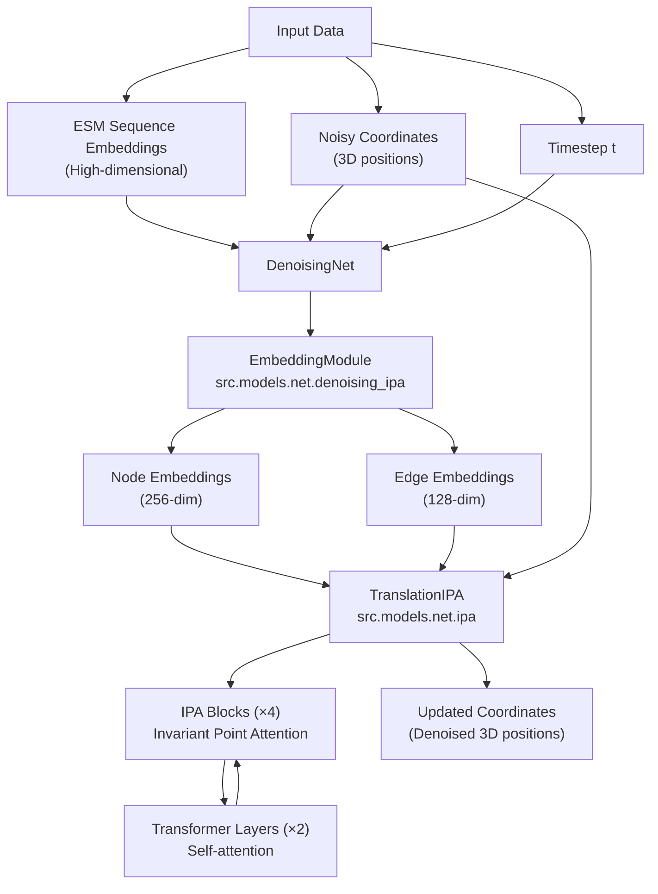
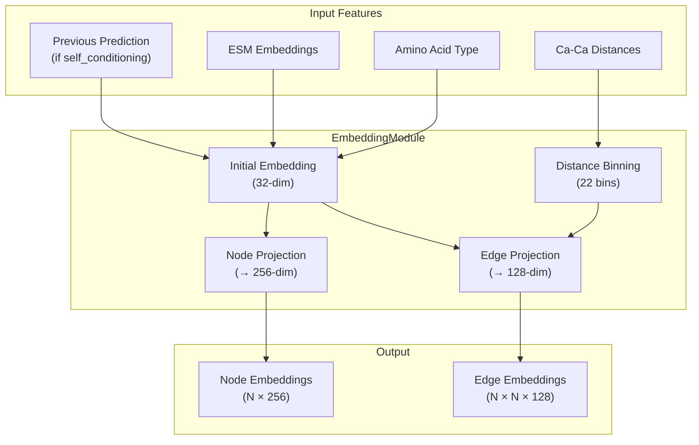
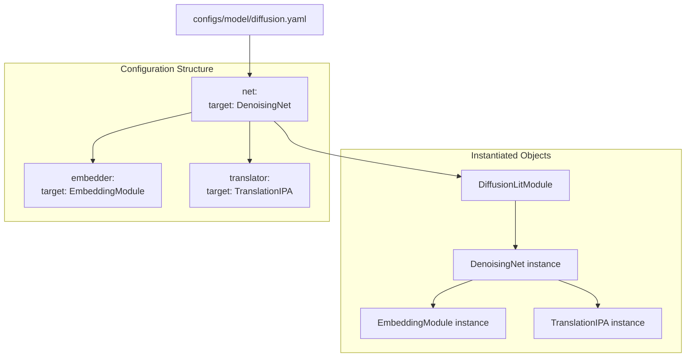
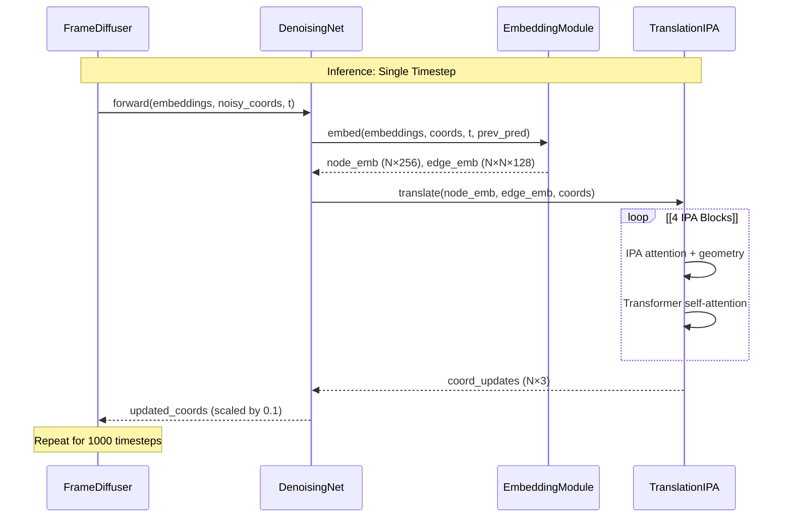

# DenoisingNet

> **Relevant source files**
> * [configs/model/diffusion.yaml](https://github.com/Junjie-Zhu/IDPFold/blob/ba40f40c/configs/model/diffusion.yaml)

This page documents the `DenoisingNet` neural network architecture, which is the core component responsible for predicting denoised protein structures in the IDPFold diffusion model. `DenoisingNet` processes sequence embeddings and noisy structural information to produce updated 3D coordinates during the reverse diffusion process.

For information about the top-level orchestration of training and inference, see [DiffusionLitModule Overview](/Junjie-Zhu/IDPFold/4.1-diffusionlitmodule-overview). For details about the diffusion process that generates noise and schedules, see [FrameDiffuser](/Junjie-Zhu/IDPFold/4.3-framediffuser).

## Architecture Overview

`DenoisingNet` is defined at `src.models.net.denoising_ipa.DenoisingNet` and consists of two primary sequential components:

1. **EmbeddingModule** (`embedder`) - Converts input features into learned node and edge representations
2. **TranslationIPA** (`translator`) - Applies Invariant Point Attention to update residue coordinates

The network takes as input sequence embeddings, current coordinate estimates, and timestep information, then outputs refined 3D positions for each residue.

**Diagram: DenoisingNet Data Flow**

*Sources: [configs/model/diffusion.yaml L16-L40](https://github.com/Junjie-Zhu/IDPFold/blob/ba40f40c/configs/model/diffusion.yaml#L16-L40)*

## EmbeddingModule

The `EmbeddingModule` class (defined at `src.models.net.denoising_ipa.EmbeddingModule`) converts raw input features into learned representations suitable for the attention mechanism.

### Configuration Parameters

| Parameter | Default Value | Description |
| --- | --- | --- |
| `init_embed_size` | 32 | Initial embedding dimension for residue features |
| `node_embed_size` | 256 | Output dimension for node (single residue) embeddings |
| `edge_embed_size` | 128 | Output dimension for edge (residue pair) embeddings |
| `num_bins` | 22 | Number of bins for distance histograms |
| `min_bin` | 1e-5 | Minimum distance value for binning |
| `max_bin` | 20.0 | Maximum distance value (in Ångströms) |
| `self_conditioning` | true | Whether to include previous predictions as input |

### Functionality

The embedding module performs several key operations:

1. **Residue Feature Encoding**: Embeds amino acid type and other per-residue features into a `node_embed_size`-dimensional vector
2. **Pairwise Distance Encoding**: Computes inter-residue distances from current coordinates and bins them into a histogram representation
3. **Edge Feature Construction**: Combines distance information with learned pairwise features to create `edge_embed_size`-dimensional edge representations
4. **Self-Conditioning Support**: Optionally incorporates predictions from the previous denoising step to improve convergence

**Diagram: EmbeddingModule Internal Structure**

*Sources: [configs/model/diffusion.yaml L18-L26](https://github.com/Junjie-Zhu/IDPFold/blob/ba40f40c/configs/model/diffusion.yaml#L18-L26)*

## TranslationIPA

The `TranslationIPA` class (defined at `src.models.net.ipa.TranslationIPA`) is the core processing module that applies geometry-aware attention mechanisms to update coordinates.

### Configuration Parameters

| Parameter | Default Value | Description |
| --- | --- | --- |
| `c_s` | 256 | Channel dimension for node (single) representations |
| `c_z` | 128 | Channel dimension for edge (pair) representations |
| `coordinate_scaling` | 0.1 | Scaling factor for coordinate updates to stabilize training |
| `no_ipa_blocks` | 4 | Number of IPA (Invariant Point Attention) blocks |
| `skip_embed_size` | 64 | Dimension for skip connections between blocks |
| `transformer_num_heads` | 4 | Number of attention heads in transformer layers |
| `transformer_num_layers` | 2 | Number of transformer layers for sequence processing |
| `c_hidden` | 256 | Hidden dimension in feed-forward networks |
| `no_heads` | 8 | Number of attention heads in IPA layers |
| `no_qk_points` | 8 | Number of query/key points for geometric attention |
| `no_v_points` | 12 | Number of value points for geometric attention |
| `dropout` | 0.0 | Dropout probability (0.0 = no dropout) |

### Architecture Components

The `TranslationIPA` module consists of two interleaved components:

**IPA Blocks**: Perform geometry-aware attention using the Invariant Point Attention mechanism, which respects 3D equivariance properties by operating in local coordinate frames.

**Transformer Layers**: Apply standard self-attention to node embeddings to capture long-range sequence dependencies.

```mermaid
flowchart TD

Input["Node Embeddings (N × 256)<br>Edge Embeddings (N × N × 128)<br>Coordinates (N × 3)"]
Block1["IPA Block 1"]
Trans1["Transformer Layer 1"]
Skip1["Skip Connection<br>(64-dim)"]
Block2["IPA Block 2"]
Trans2["Transformer Layer 2"]
Skip2["Skip Connection<br>(64-dim)"]
Block3["IPA Block 3"]
Trans3["Transformer Layer 3"]
Skip3["Skip Connection<br>(64-dim)"]
Block4["IPA Block 4"]
Trans4["Transformer Layer 4"]
Skip4["Skip Connection<br>(64-dim)"]
Output["Coordinate Updates<br>(N × 3)"]
Scaling["Apply coordinate_scaling<br>(× 0.1)"]
Final["Final Coordinates"]

subgraph subGraph0 ["TranslationIPA Processing Pipeline"]
    Input
    Block1
    Trans1
    Skip1
    Block2
    Trans2
    Skip2
    Block3
    Trans3
    Skip3
    Block4
    Trans4
    Skip4
    Output
    Scaling
    Final
    Input --> Block1
    Block1 --> Trans1
    Trans1 --> Skip1
    Skip1 --> Block2
    Block2 --> Trans2
    Trans2 --> Skip2
    Skip2 --> Block3
    Block3 --> Trans3
    Trans3 --> Skip3
    Skip3 --> Block4
    Block4 --> Trans4
    Trans4 --> Skip4
    Skip4 --> Output
    Output --> Scaling
    Scaling --> Final
end
```

**Diagram: TranslationIPA Block Structure**

*Sources: [configs/model/diffusion.yaml L27-L40](https://github.com/Junjie-Zhu/IDPFold/blob/ba40f40c/configs/model/diffusion.yaml#L27-L40)*

### Invariant Point Attention

The IPA mechanism is a key innovation that allows the network to process 3D structures while maintaining equivariance to rotations and translations. Each IPA block:

1. Constructs local coordinate frames centered at each residue
2. Computes attention weights using both sequence features and geometric point distances
3. Aggregates information from neighboring residues in a geometry-aware manner
4. Updates both residue embeddings and 3D coordinates

The parameters `no_qk_points` (8) and `no_v_points` (12) determine how many 3D points are used to represent query/key and value information respectively in the geometric attention computation.

## Configuration in DiffusionLitModule

The `DenoisingNet` is instantiated within the `DiffusionLitModule` using the configuration specified in `configs/model/diffusion.yaml`:

**Diagram: Configuration and Instantiation Flow**

The `_target_` fields specify the Python class paths that Hydra uses to instantiate objects:

* `src.models.net.denoising_ipa.DenoisingNet` - Main network class
* `src.models.net.denoising_ipa.EmbeddingModule` - Feature embedding component
* `src.models.net.ipa.TranslationIPA` - IPA-based coordinate updater

*Sources: [configs/model/diffusion.yaml L16-L40](https://github.com/Junjie-Zhu/IDPFold/blob/ba40f40c/configs/model/diffusion.yaml#L16-L40)*

## Coordinate Scaling

The `coordinate_scaling` parameter (0.1) appears in both the `EmbeddingModule` and `TranslationIPA` configurations. This scaling factor serves to:

1. **Stabilize Training**: Reduces the magnitude of coordinate updates to prevent divergence
2. **Match Diffusion Scale**: Aligns network outputs with the scale of noise added by the diffusion process
3. **Improve Convergence**: Smaller updates allow for more gradual refinement of structures

The scaling is applied as a multiplicative factor: `final_coords = current_coords + coordinate_scaling * predicted_update`.

*Sources: [configs/model/diffusion.yaml L31-L63](https://github.com/Junjie-Zhu/IDPFold/blob/ba40f40c/configs/model/diffusion.yaml#L31-L63)*

## Self-Conditioning

When `self_conditioning` is enabled (default: `true`), the network incorporates its own previous predictions as additional input features. This technique:

1. **Improves Iterative Refinement**: Allows the network to build upon its earlier predictions
2. **Reduces Inference Steps**: Can produce better results with fewer denoising timesteps
3. **Enhances Consistency**: Encourages the network to make predictions that are coherent with prior outputs

During training, self-conditioning inputs are randomly dropped with some probability to ensure the network can operate both with and without them. During inference with `self_conditioning: true`, each denoising step uses the output from the previous timestep as additional input.

*Sources: [configs/model/diffusion.yaml L26-L97](https://github.com/Junjie-Zhu/IDPFold/blob/ba40f40c/configs/model/diffusion.yaml#L26-L97)*

## Usage in Training and Inference

The `DenoisingNet` is called repeatedly during both training and inference:

**Training**: At each training step, the network receives noisy coordinates at a random timestep `t` and predicts the denoised structure. The predictions are compared against ground truth using various loss functions (see [Loss Functions](/Junjie-Zhu/IDPFold/4.4-loss-functions)).

**Inference**: During the reverse diffusion process, the network is called `num_timesteps` times (default: 1000) to gradually denoise a random initial structure into a final predicted conformation. With `n_replica: 192`, this process generates an ensemble of diverse structures.

**Diagram: DenoisingNet Execution Flow During Inference**

*Sources: [configs/model/diffusion.yaml L16-L98](https://github.com/Junjie-Zhu/IDPFold/blob/ba40f40c/configs/model/diffusion.yaml#L16-L98)*

## Relationship to Model Configuration

All parameters for `DenoisingNet` and its subcomponents are specified in the model configuration file. To modify the architecture, users can edit the relevant sections:

* **Network capacity**: Adjust `node_embed_size`, `edge_embed_size`, `c_hidden`
* **Attention mechanism**: Modify `no_heads`, `no_qk_points`, `no_v_points`, `no_ipa_blocks`
* **Sequence modeling**: Change `transformer_num_heads`, `transformer_num_layers`
* **Training stability**: Tune `coordinate_scaling`, `dropout`
* **Feature encoding**: Adjust `num_bins`, `min_bin`, `max_bin` for distance representation

For the complete model configuration reference, see [Model Configuration Reference](/Junjie-Zhu/IDPFold/5.2-model-configuration-reference).

*Sources: [configs/model/diffusion.yaml L16-L40](https://github.com/Junjie-Zhu/IDPFold/blob/ba40f40c/configs/model/diffusion.yaml#L16-L40)*