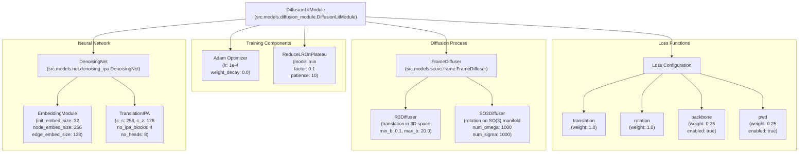
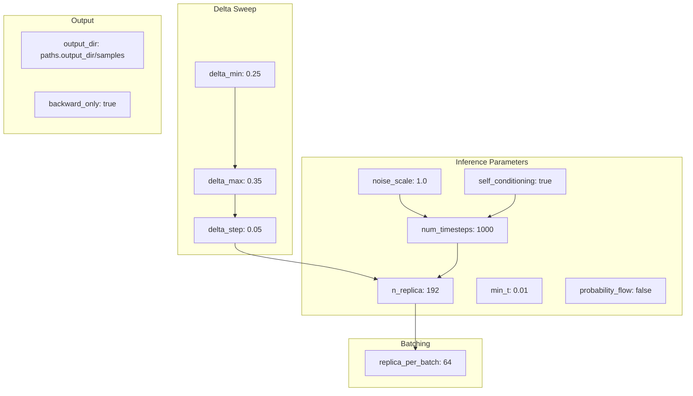
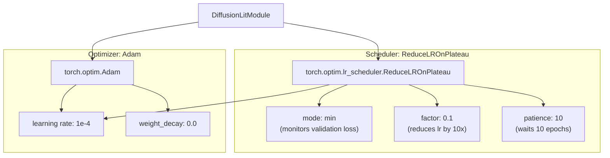
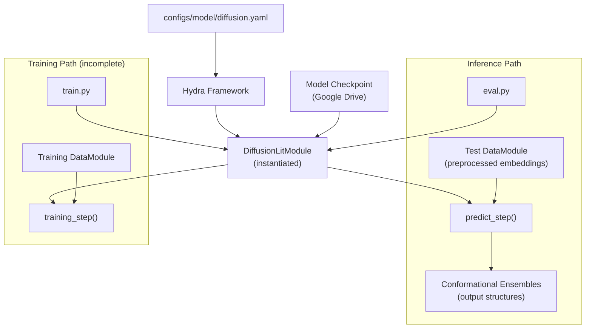

# DiffusionLitModule Overview

> **Relevant source files**
> * [configs/model/diffusion.yaml](https://github.com/Junjie-Zhu/IDPFold/blob/ba40f40c/configs/model/diffusion.yaml)

## Purpose and Scope

This document explains the `DiffusionLitModule` class, which serves as the top-level PyTorch Lightning module in the IDPFold system. `DiffusionLitModule` orchestrates all aspects of the diffusion model including the neural network architecture, diffusion process, training optimization, and inference generation. This page focuses on the module's structure, responsibilities, and how it integrates with the PyTorch Lightning framework.

For details on specific sub-components, see:

* Neural network architecture: [DenoisingNet](/Junjie-Zhu/IDPFold/4.2-denoisingnet)
* Diffusion process mechanics: [FrameDiffuser](/Junjie-Zhu/IDPFold/4.3-framediffuser)
* Loss computation details: [Loss Functions](/Junjie-Zhu/IDPFold/4.4-loss-functions)
* Optimization strategy: [Optimizer and Scheduler](/Junjie-Zhu/IDPFold/4.5-optimizer-and-scheduler)

---

## Module Location and Instantiation

The `DiffusionLitModule` class is defined in `src/models/diffusion_module.py` and is instantiated via Hydra configuration from [configs/model/diffusion.yaml L1](https://github.com/Junjie-Zhu/IDPFold/blob/ba40f40c/configs/model/diffusion.yaml#L1-L1)

```yaml
_target_: src.models.diffusion_module.DiffusionLitModule
```

When IDPFold runs training or inference, Hydra automatically instantiates this module by:

1. Reading the configuration file
2. Resolving the `_target_` path to locate the class
3. Recursively instantiating nested components (net, diffuser, optimizer, scheduler)
4. Passing all configured parameters to the constructor

**Sources:** [configs/model/diffusion.yaml L1](https://github.com/Junjie-Zhu/IDPFold/blob/ba40f40c/configs/model/diffusion.yaml#L1-L1)

---

## Component Architecture

The `DiffusionLitModule` is composed of five primary components, each configured independently in the YAML file:

| Component | Configuration Path | Purpose | Target Class |
| --- | --- | --- | --- |
| **net** | `net` | Neural network that predicts noise to remove from structures | `src.models.net.denoising_ipa.DenoisingNet` |
| **diffuser** | `diffuser` | Manages diffusion process for translations and rotations | `src.models.score.frame.FrameDiffuser` |
| **optimizer** | `optimizer` | Gradient-based parameter optimization | `torch.optim.Adam` |
| **scheduler** | `scheduler` | Learning rate adjustment strategy | `torch.optim.lr_scheduler.ReduceLROnPlateau` |
| **loss** | `loss` | Loss function weights and configurations | (dict configuration) |

**Sources:** [configs/model/diffusion.yaml L3-L85](https://github.com/Junjie-Zhu/IDPFold/blob/ba40f40c/configs/model/diffusion.yaml#L3-L85)

---

## DiffusionLitModule Component Hierarchy



This diagram shows how `DiffusionLitModule` aggregates independently configured components. Each component is instantiated from its `_target_` specification in the YAML configuration and manages a distinct aspect of the model.

**Sources:** [configs/model/diffusion.yaml L16-L85](https://github.com/Junjie-Zhu/IDPFold/blob/ba40f40c/configs/model/diffusion.yaml#L16-L85)

---

## PyTorch Lightning Integration

`DiffusionLitModule` extends `pytorch_lightning.LightningModule`, which provides standardized methods for training and inference. The module implements key Lightning hook methods:


The Lightning framework calls these methods automatically based on the execution mode (`Trainer.fit()` for training, `Trainer.predict()` for inference), abstracting away boilerplate code for distributed training, checkpointing, and logging.

**Sources:** [configs/model/diffusion.yaml L1-L103](https://github.com/Junjie-Zhu/IDPFold/blob/ba40f40c/configs/model/diffusion.yaml#L1-L103)

 system architecture diagrams

---

## Training Mode Configuration

During training, `DiffusionLitModule` uses multiple loss functions with configurable weights to guide the model. The loss configuration controls which objectives are active:

| Loss Component | Enabled | Weight | Threshold | Purpose |
| --- | --- | --- | --- | --- |
| **translation** | Always | 1.0 | x0_threshold: 1.0 | Penalizes errors in predicted 3D translations |
| **rotation** | Always | 1.0 | - | Penalizes errors in predicted rotations on SO(3) |
| **backbone** | true | 0.25 | t_threshold: 0.25 | Enforces realistic backbone geometry |
| **pwd** | true | 0.25 | t_threshold: 0.25 | Maintains pairwise distance distributions |
| **distogram** | false | - | - | Auxiliary loss (disabled) |
| **supervised_chi** | false | - | - | Side chain angle loss (disabled) |
| **lddt** | false | - | - | Local distance difference test (disabled) |
| **fape** | false | - | - | Frame aligned point error (disabled) |
| **tm** | false | - | - | Template modeling score (disabled) |

The `t_threshold` parameters indicate that certain losses (backbone, pwd) are only applied when the diffusion timestep `t` is below the threshold, focusing auxiliary losses on the later stages of denoising where fine details matter.

**Sources:** [configs/model/diffusion.yaml L60-L85](https://github.com/Junjie-Zhu/IDPFold/blob/ba40f40c/configs/model/diffusion.yaml#L60-L85)

---

## Inference Mode Configuration

When generating conformational ensembles, `DiffusionLitModule` operates in inference mode with specific sampling parameters:



**Key Inference Parameters:**

* **num_timesteps (1000)**: Number of denoising steps from pure noise to final structure
* **n_replica (192)**: Number of independent structure samples to generate per sequence
* **noise_scale (1.0)**: Scaling factor for initial noise magnitude
* **self_conditioning (true)**: Uses previous prediction to condition current denoising step, improving consistency
* **delta_min/max/step**: Controls sweep over different noise schedules, generating multiple ensembles per protein
* **replica_per_batch (64)**: Batches replicas for memory efficiency during GPU inference
* **min_t (0.01)**: Minimum timestep value to prevent numerical instability at t=0

The total number of generated structures is: `n_replica × ((delta_max - delta_min) / delta_step + 1) = 192 × 3 = 576` structures per protein.

**Sources:** [configs/model/diffusion.yaml L87-L101](https://github.com/Junjie-Zhu/IDPFold/blob/ba40f40c/configs/model/diffusion.yaml#L87-L101)

---

## Optimizer and Scheduler Configuration



The module uses the Adam optimizer with a fixed learning rate of `1e-4` and no weight decay (L2 regularization disabled). The `ReduceLROnPlateau` scheduler monitors validation loss and reduces the learning rate by a factor of 10 if no improvement is observed for 10 consecutive epochs. This adaptive scheduling helps the model converge to better solutions by taking smaller steps when approaching local minima.

The `_partial_: true` flag in the configuration [configs/model/diffusion.yaml L5-L11](https://github.com/Junjie-Zhu/IDPFold/blob/ba40f40c/configs/model/diffusion.yaml#L5-L11)

 indicates that these objects are created as partial functions, with the model parameters being passed later when `configure_optimizers()` is called by PyTorch Lightning.

**Sources:** [configs/model/diffusion.yaml L3-L14](https://github.com/Junjie-Zhu/IDPFold/blob/ba40f40c/configs/model/diffusion.yaml#L3-L14)

---

## Self-Conditioning Mechanism

The `self_conditioning` parameter appears in two locations in the configuration:

1. **EmbeddingModule** [configs/model/diffusion.yaml L26](https://github.com/Junjie-Zhu/IDPFold/blob/ba40f40c/configs/model/diffusion.yaml#L26-L26) : `self_conditioning: true`
2. **Inference settings** [configs/model/diffusion.yaml L97](https://github.com/Junjie-Zhu/IDPFold/blob/ba40f40c/configs/model/diffusion.yaml#L97-L97) : `self_conditioning: true`

This indicates that `DiffusionLitModule` implements self-conditioning, a technique where the model's previous prediction is fed back as an additional input to the current denoising step. This creates a feedback loop that helps the model produce more consistent predictions across timesteps.

For detailed explanation of the self-conditioning mechanism, see [Self-Conditioning](/Junjie-Zhu/IDPFold/7.4-self-conditioning).

**Sources:** [configs/model/diffusion.yaml L26-L97](https://github.com/Junjie-Zhu/IDPFold/blob/ba40f40c/configs/model/diffusion.yaml#L26-L97)

---

## Model Compilation

The configuration includes a `compile` flag:

```yaml
compile: false
```

When set to `true`, this would enable PyTorch 2.0's `torch.compile()` feature, which uses TorchDynamo to JIT-compile the model for faster execution. The flag is currently disabled, likely for debugging purposes or compatibility with the current PyTorch version.

**Sources:** [configs/model/diffusion.yaml L103](https://github.com/Junjie-Zhu/IDPFold/blob/ba40f40c/configs/model/diffusion.yaml#L103-L103)

---

## Integration with System Workflow



The `DiffusionLitModule` serves as the central model component in both training and inference workflows:

* **Training**: Would receive batches from a training DataModule, compute losses via `training_step()`, and update parameters via the optimizer
* **Inference**: Loads weights from a checkpoint, receives preprocessed embeddings from the test DataModule, and generates structure ensembles via `predict_step()`

The Hydra configuration system ensures that the exact same model architecture used during training can be reconstructed for inference by loading the same `diffusion.yaml` configuration.

**Sources:** [configs/model/diffusion.yaml L1-L103](https://github.com/Junjie-Zhu/IDPFold/blob/ba40f40c/configs/model/diffusion.yaml#L1-L103)

 system architecture diagrams

---

## Summary

`DiffusionLitModule` is the top-level orchestrator of the IDPFold diffusion model. It:

1. **Aggregates** all model components (network, diffuser, optimizer, scheduler, losses)
2. **Inherits** from PyTorch Lightning's `LightningModule` for standardized training/inference
3. **Configures** behavior via the Hydra configuration system
4. **Implements** training logic through loss computation and optimization
5. **Generates** conformational ensembles through iterative denoising during inference
6. **Manages** self-conditioning, noise schedules, and sampling strategies

The modular design allows researchers to independently modify each component (e.g., swap the neural architecture, change the diffusion schedule, adjust loss weights) by editing the configuration file without modifying the `DiffusionLitModule` code itself.

**Sources:** [configs/model/diffusion.yaml L1-L103](https://github.com/Junjie-Zhu/IDPFold/blob/ba40f40c/configs/model/diffusion.yaml#L1-L103)

 system architecture diagrams