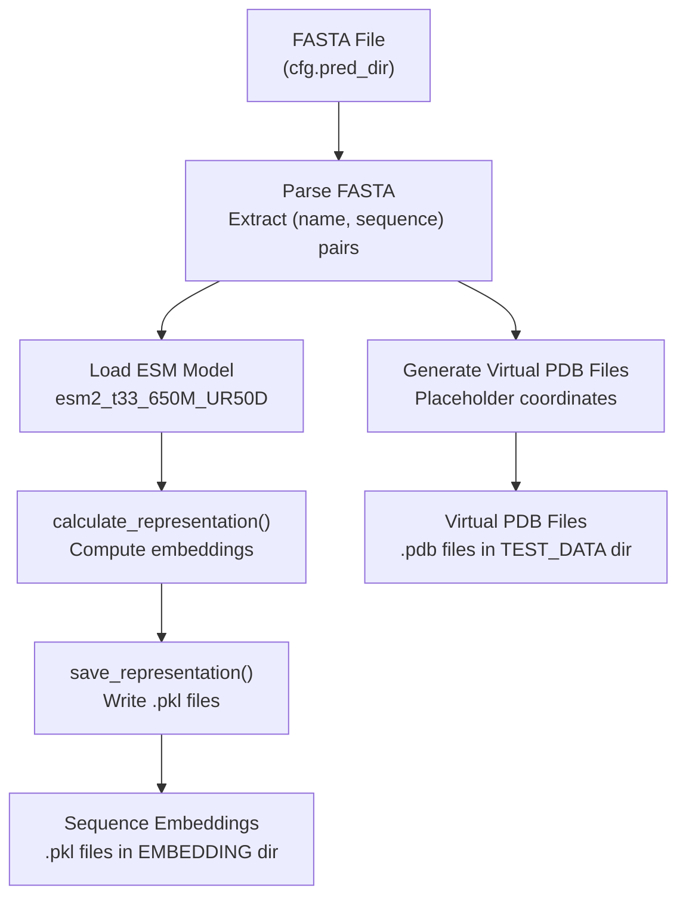
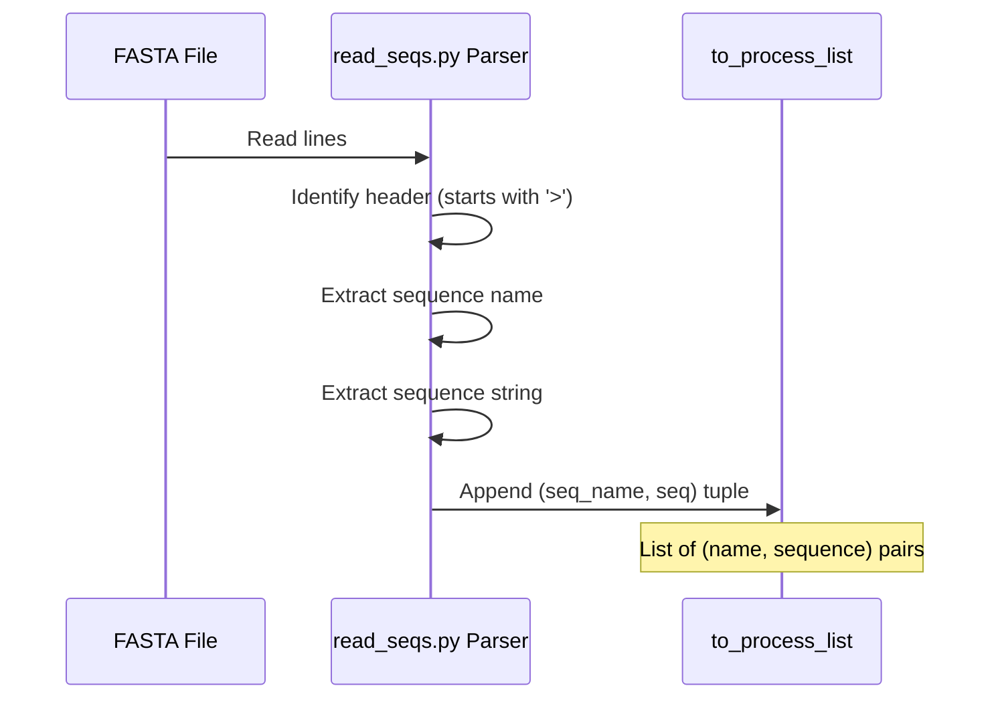
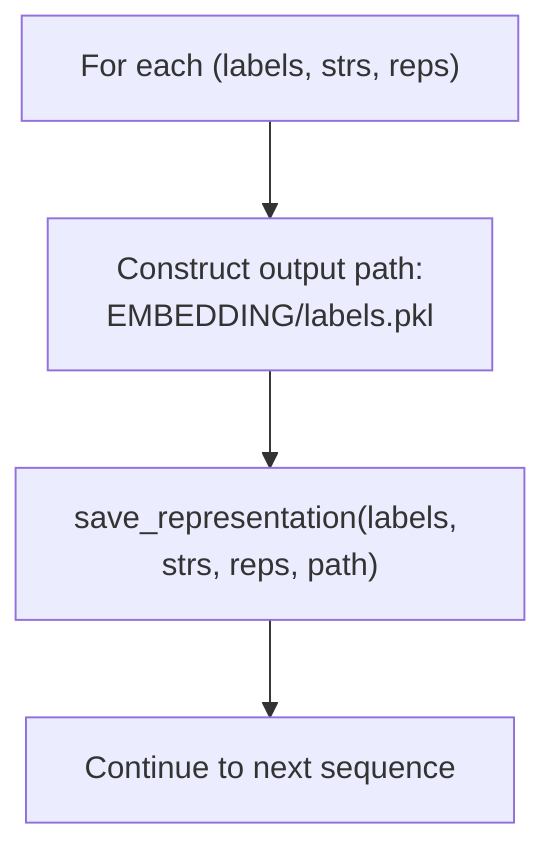
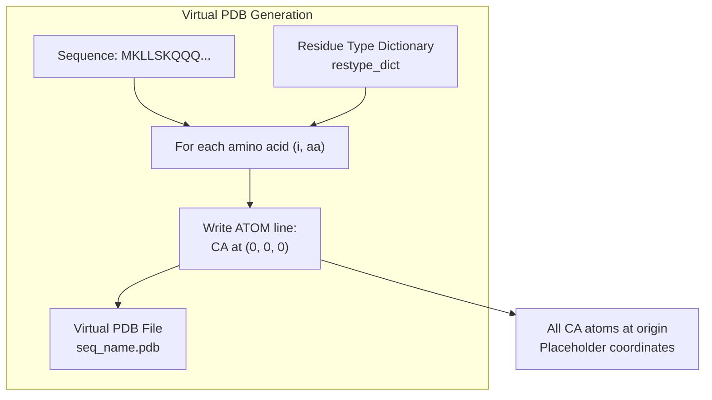
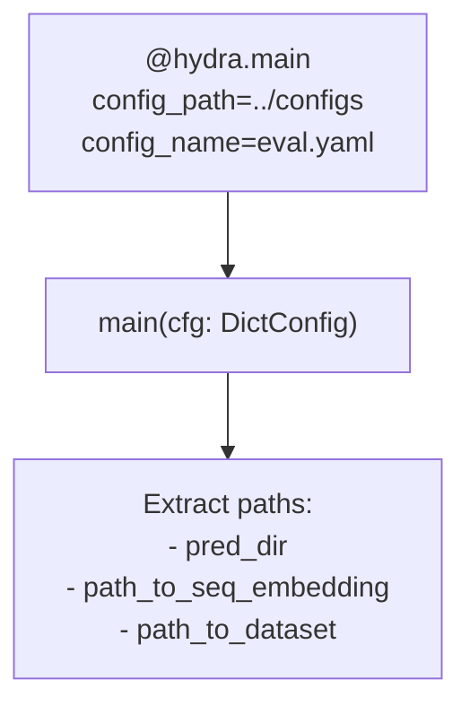
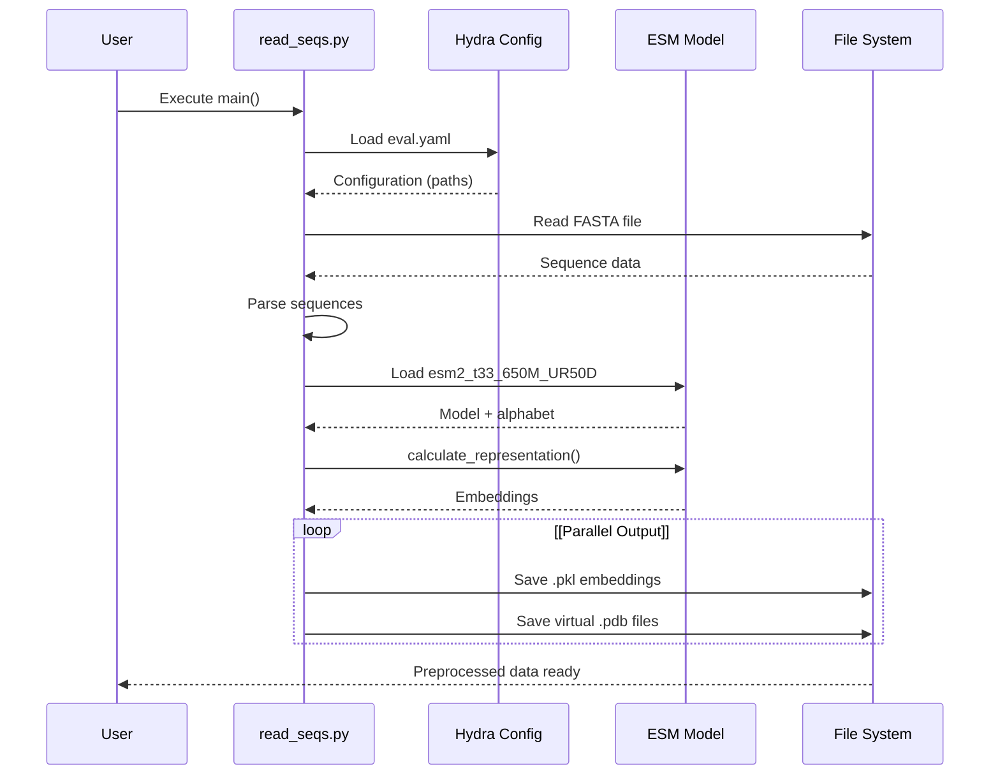

# ESM Embedding Extraction

> **Relevant source files**
> * [initialize.py](https://github.com/Junjie-Zhu/IDPFold/blob/ba40f40c/initialize.py)
> * [src/read_seqs.py](https://github.com/Junjie-Zhu/IDPFold/blob/ba40f40c/src/read_seqs.py)

## Purpose and Scope

This page provides technical documentation on how ESM (Evolutionary Scale Modeling) protein language model embeddings are extracted from amino acid sequences in IDPFold. It covers the specific ESM model variant used, the extraction pipeline implementation, and the technical details of the embedding computation process.

For user-level instructions on preprocessing sequences, see [Preprocessing Sequences](/Junjie-Zhu/IDPFold/3.2-preprocessing-sequences). For details on the embedding file format, see [Embedding Files (.pkl)](/Junjie-Zhu/IDPFold/8.2-embedding-files-(.pkl)). For CLI usage, see [preprocess_command](/Junjie-Zhu/IDPFold/6.1-preprocess_command).

---

## ESM Model Specification

IDPFold uses the **ESM-2** protein language model with the following configuration:

| Model Parameter | Value |
| --- | --- |
| Model Name | `esm2_t33_650M_UR50D` |
| Number of Layers | 33 |
| Parameters | 650 million |
| Training Dataset | UniRef50 |
| Loading Method | `esm.pretrained.esm2_t33_650M_UR50D()` |

The model is loaded at [src/read_seqs.py L51](https://github.com/Junjie-Zhu/IDPFold/blob/ba40f40c/src/read_seqs.py#L51-L51)

 and deployed to the available device (CUDA GPU if available, otherwise CPU) at [src/read_seqs.py L52](https://github.com/Junjie-Zhu/IDPFold/blob/ba40f40c/src/read_seqs.py#L52-L52)

**Sources:** [src/read_seqs.py L51-L52](https://github.com/Junjie-Zhu/IDPFold/blob/ba40f40c/src/read_seqs.py#L51-L52)

---

## Extraction Pipeline Overview

The embedding extraction process is implemented in `read_seqs.py` and consists of four main stages:



**Diagram: ESM Embedding Extraction Workflow**

The process generates two types of outputs: sequence embeddings (used for model inference) and virtual PDB files (used as structural templates).

**Sources:** [src/read_seqs.py L15-L62](https://github.com/Junjie-Zhu/IDPFold/blob/ba40f40c/src/read_seqs.py#L15-L62)

---

## Input Processing

### FASTA Parsing

The input FASTA file path is specified via the Hydra configuration parameter `cfg.pred_dir` at [src/read_seqs.py L23](https://github.com/Junjie-Zhu/IDPFold/blob/ba40f40c/src/read_seqs.py#L23-L23)

 The parsing logic is implemented at [src/read_seqs.py L26-L36](https://github.com/Junjie-Zhu/IDPFold/blob/ba40f40c/src/read_seqs.py#L26-L36)

:



**Diagram: FASTA File Parsing Logic**

Each entry in `to_process_list` is a tuple containing:

* **seq_name**: The sequence identifier (header line without '>')
* **seq**: The amino acid sequence string

**Sources:** [src/read_seqs.py L26-L36](https://github.com/Junjie-Zhu/IDPFold/blob/ba40f40c/src/read_seqs.py#L26-L36)

---

## Embedding Calculation

The core embedding extraction is performed by the `calculate_representation` function imported from `src.utils.esm_extract` at [src/read_seqs.py L10](https://github.com/Junjie-Zhu/IDPFold/blob/ba40f40c/src/read_seqs.py#L10-L10)

```mermaid
flowchart TD

model["ESM Model Instance"]
alphabet["ESM Alphabet"]
sequences["to_process_list<br>(name, seq) tuples"]
device["Device (CUDA/CPU)"]
func["src.utils.esm_extract<br>calculate_representation()"]
labels["sequence_labels<br>List of names"]
strs["sequence_strs<br>List of sequences"]
reps["representation<br>Embedding tensors"]

model --> func
alphabet --> func
sequences --> func
device --> func
func --> labels
func --> strs
func --> reps

subgraph Output ["Output"]
    labels
    strs
    reps
end

subgraph calculate_representation() ["calculate_representation()"]
    func
end

subgraph Input ["Input"]
    model
    alphabet
    sequences
    device
end
```

**Diagram: calculate_representation Function Data Flow**

The function call at [src/read_seqs.py L55](https://github.com/Junjie-Zhu/IDPFold/blob/ba40f40c/src/read_seqs.py#L55-L55)

 processes all sequences in batch and returns three parallel lists:

| Output Variable | Type | Content |
| --- | --- | --- |
| `sequence_labels` | List[str] | Sequence identifiers |
| `sequence_strs` | List[str] | Amino acid sequences |
| `representation` | List[Tensor] | ESM embedding vectors |

**Sources:** [src/read_seqs.py L10](https://github.com/Junjie-Zhu/IDPFold/blob/ba40f40c/src/read_seqs.py#L10-L10)

 [src/read_seqs.py L55](https://github.com/Junjie-Zhu/IDPFold/blob/ba40f40c/src/read_seqs.py#L55-L55)

---

## Embedding Storage

### Save Process

Embeddings are saved using the `save_representation` function at [src/read_seqs.py L58](https://github.com/Junjie-Zhu/IDPFold/blob/ba40f40c/src/read_seqs.py#L58-L58)

 The function iterates over the three output lists in parallel:



**Diagram: Embedding Save Loop**

### Output Directory Configuration

The output directory for embeddings is configured through the `.env` file:

| Environment Variable | Default Value | Purpose |
| --- | --- | --- |
| `EMBEDDING` | `data/embeddings` | Directory for .pkl embedding files |
| `TEST_DATA` | `data/test_pdb` | Directory for virtual PDB files |

These directories are created by `initialize.py` at [initialize.py L7-L11](https://github.com/Junjie-Zhu/IDPFold/blob/ba40f40c/initialize.py#L7-L11)

 and [initialize.py L18-L19](https://github.com/Junjie-Zhu/IDPFold/blob/ba40f40c/initialize.py#L18-L19)

**Sources:** [src/read_seqs.py L57-L58](https://github.com/Junjie-Zhu/IDPFold/blob/ba40f40c/src/read_seqs.py#L57-L58)

 [initialize.py L7-L11](https://github.com/Junjie-Zhu/IDPFold/blob/ba40f40c/initialize.py#L7-L11)

---

## Virtual PDB Generation

Alongside embeddings, the script generates virtual PDB files with placeholder coordinates. This process is implemented at [src/read_seqs.py L44-L49](https://github.com/Junjie-Zhu/IDPFold/blob/ba40f40c/src/read_seqs.py#L44-L49)

:



**Diagram: Virtual PDB File Generation**

### Residue Type Dictionary

A single-letter to three-letter amino acid code mapping is defined at [src/read_seqs.py L39-L41](https://github.com/Junjie-Zhu/IDPFold/blob/ba40f40c/src/read_seqs.py#L39-L41)

:

```
restype_dict = {
    'A': 'ALA', 'C': 'CYS', 'D': 'ASP', 'E': 'GLU', 'F': 'PHE',
    'G': 'GLY', 'H': 'HIS', 'I': 'ILE', 'K': 'LYS', 'L': 'LEU',
    'M': 'MET', 'N': 'ASN', 'P': 'PRO', 'Q': 'GLN', 'R': 'ARG',
    'S': 'SER', 'T': 'THR', 'V': 'VAL', 'W': 'TRP', 'Y': 'TYR'
}
```

Each ATOM line follows this format at [src/read_seqs.py L48-L49](https://github.com/Junjie-Zhu/IDPFold/blob/ba40f40c/src/read_seqs.py#L48-L49)

:

```
ATOM  {index:>5}  CA  {residue_type:>3} A {index:>3}      0.000   0.000   0.000  1.00  0.00           C
```

All CA (alpha-carbon) atoms are positioned at coordinates (0.000, 0.000, 0.000).

**Sources:** [src/read_seqs.py L39-L49](https://github.com/Junjie-Zhu/IDPFold/blob/ba40f40c/src/read_seqs.py#L39-L49)

---

## Technical Implementation Details

### Device Selection

The script automatically selects the computation device at [src/read_seqs.py L24](https://github.com/Junjie-Zhu/IDPFold/blob/ba40f40c/src/read_seqs.py#L24-L24)

:

```
device = torch.device('cuda' if torch.cuda.is_available() else 'cpu')
```

This enables GPU acceleration when CUDA is available, falling back to CPU otherwise.

### Configuration Integration

The script uses Hydra configuration management, loading settings from `eval.yaml` at [src/read_seqs.py L15](https://github.com/Junjie-Zhu/IDPFold/blob/ba40f40c/src/read_seqs.py#L15-L15)

:



**Diagram: Hydra Configuration Loading**

Key configuration paths accessed:

| Configuration Path | Variable | Purpose |
| --- | --- | --- |
| `cfg.pred_dir` | `input_fasta` | Input FASTA file path |
| `cfg.data.dataset.path_to_seq_embedding` | `sequence_path` | Output directory for embeddings |
| `cfg.data.dataset.path_to_dataset` | `pdb_path` | Output directory for virtual PDBs |

**Sources:** [src/read_seqs.py L15](https://github.com/Junjie-Zhu/IDPFold/blob/ba40f40c/src/read_seqs.py#L15-L15)

 [src/read_seqs.py L21-L23](https://github.com/Junjie-Zhu/IDPFold/blob/ba40f40c/src/read_seqs.py#L21-L23)

---

## Code Entity Reference

### Key Functions and Modules

| Entity | Type | Location | Purpose |
| --- | --- | --- | --- |
| `main` | Function | [src/read_seqs.py L16-L62](https://github.com/Junjie-Zhu/IDPFold/blob/ba40f40c/src/read_seqs.py#L16-L62) | Main entry point for embedding extraction |
| `calculate_representation` | Function | `src.utils.esm_extract` | Computes ESM embeddings from sequences |
| `save_representation` | Function | `src.utils.esm_extract` | Saves embeddings to .pkl files |
| `esm.pretrained.esm2_t33_650M_UR50D` | Function | `esm` library | Loads pretrained ESM-2 model |
| `restype_dict` | Dict | [src/read_seqs.py L39-L41](https://github.com/Junjie-Zhu/IDPFold/blob/ba40f40c/src/read_seqs.py#L39-L41) | Maps single-letter to three-letter amino acid codes |

### External Dependencies

| Package | Usage |
| --- | --- |
| `esm` | Provides ESM-2 model and alphabet |
| `torch` | Tensor operations and device management |
| `hydra` | Configuration management |
| `omegaconf` | Configuration object handling |

**Sources:** [src/read_seqs.py L1-L10](https://github.com/Junjie-Zhu/IDPFold/blob/ba40f40c/src/read_seqs.py#L1-L10)

---

## Processing Workflow Summary

The complete embedding extraction workflow can be summarized as:



**Diagram: Complete Embedding Extraction Sequence**

**Sources:** [src/read_seqs.py L15-L62](https://github.com/Junjie-Zhu/IDPFold/blob/ba40f40c/src/read_seqs.py#L15-L62)