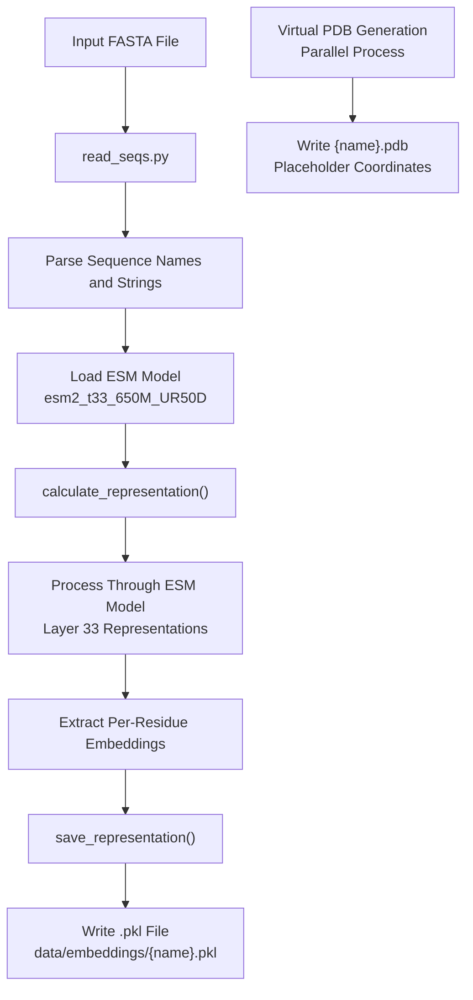
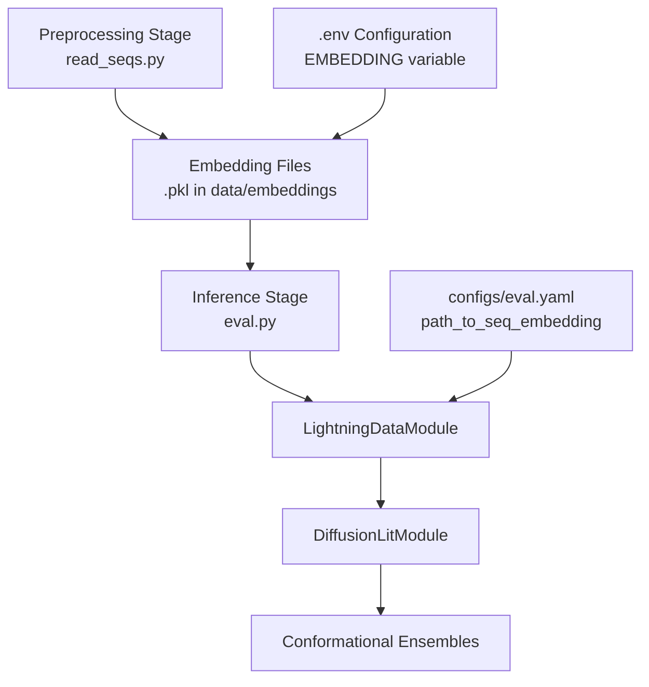

# Embedding Files (.pkl)

> **Relevant source files**
> * [initialize.py](https://github.com/Junjie-Zhu/IDPFold/blob/ba40f40c/initialize.py)
> * [src/read_seqs.py](https://github.com/Junjie-Zhu/IDPFold/blob/ba40f40c/src/read_seqs.py)

This document describes the structure, content, and generation of pickle files (`.pkl`) containing ESM sequence embeddings produced during the preprocessing stage of IDPFold. These files serve as intermediate representations between input FASTA sequences and the diffusion model inference process.

For information about the input sequences that generate these files, see [Input FASTA Format](/Junjie-Zhu/IDPFold/8.1-input-fasta-format). For details on using these embeddings during inference, see [Running Inference](/Junjie-Zhu/IDPFold/3.3-running-inference) and [ESM Embedding Extraction](/Junjie-Zhu/IDPFold/7.2-esm-embedding-extraction).

## Overview

Embedding files are Python pickle files containing high-dimensional vector representations of protein sequences extracted using the ESM (Evolutionary Scale Modeling) language model. These embeddings capture sequence-level features learned from protein evolution and are used as input to the diffusion model during conformational ensemble generation.

**Key Characteristics:**

* **Format:** Python pickle (`.pkl`) files
* **Content:** Per-residue embeddings from the `esm2_t33_650M_UR50D` model
* **Purpose:** Reusable intermediate representations for inference
* **Generation:** Produced by the preprocessing stage via `read_seqs.py`

Sources: [src/read_seqs.py L1-L63](https://github.com/Junjie-Zhu/IDPFold/blob/ba40f40c/src/read_seqs.py#L1-L63)

## File Location and Naming Convention

### Default Storage Location

Embedding files are stored in the directory specified by the `EMBEDDING` environment variable, which is configured during initialization:

| Configuration | Default Value | Purpose |
| --- | --- | --- |
| `.env` variable | `EMBEDDING` | Path to embedding storage directory |
| Default path | `data/embeddings` | Relative to project root |
| Hydra config reference | `cfg.data.dataset.path_to_seq_embedding` | Runtime configuration |

### Naming Convention

Each embedding file is named according to the sequence identifier from the input FASTA file:

```
{sequence_name}.pkl
```

**Example Mappings:**

| Input FASTA Header | Generated Embedding File |
| --- | --- |
| `>Abeta40` | `Abeta40.pkl` |
| `>PaaA2` | `PaaA2.pkl` |
| `>p15PAF` | `p15PAF.pkl` |

Sources: [src/read_seqs.py L21-L58](https://github.com/Junjie-Zhu/IDPFold/blob/ba40f40c/src/read_seqs.py#L21-L58)

 [initialize.py L7-L21](https://github.com/Junjie-Zhu/IDPFold/blob/ba40f40c/initialize.py#L7-L21)

## Generation Workflow

The following diagram illustrates the end-to-end process for generating embedding files from FASTA sequences:



### Code Implementation

The generation process is orchestrated by [src/read_seqs.py L15-L62](https://github.com/Junjie-Zhu/IDPFold/blob/ba40f40c/src/read_seqs.py#L15-L62)

:

1. **Parse Input FASTA** [src/read_seqs.py L26-L36](https://github.com/Junjie-Zhu/IDPFold/blob/ba40f40c/src/read_seqs.py#L26-L36) * Read FASTA file specified by `cfg.pred_dir` * Extract sequence names (lines starting with `>`) * Extract sequence strings * Build `to_process_list` of `(seq_name, seq)` tuples
2. **Load ESM Model** [src/read_seqs.py L51-L52](https://github.com/Junjie-Zhu/IDPFold/blob/ba40f40c/src/read_seqs.py#L51-L52) ``` model, alphabet = esm.pretrained.esm2_t33_650M_UR50D()model = model.to(device) ``` * Loads the pretrained ESM-2 model with 650M parameters * Transfers model to available device (CUDA or CPU)
3. **Calculate Embeddings** [src/read_seqs.py L55](https://github.com/Junjie-Zhu/IDPFold/blob/ba40f40c/src/read_seqs.py#L55-L55) ``` sequence_labels, sequence_strs, representation = calculate_representation(    model, alphabet, to_process_list, device) ``` * Invokes `calculate_representation` from `src.utils.esm_extract` * Returns sequence identifiers, strings, and embedding tensors
4. **Save Pickle Files** [src/read_seqs.py L57-L58](https://github.com/Junjie-Zhu/IDPFold/blob/ba40f40c/src/read_seqs.py#L57-L58) ``` for labels, strs, reps in zip(sequence_labels, sequence_strs, representation):    save_representation(labels, strs, reps,                        os.path.join(sequence_path, (labels + '.pkl'))) ``` * Iterates over processed sequences * Writes each embedding to a separate `.pkl` file

Sources: [src/read_seqs.py L1-L63](https://github.com/Junjie-Zhu/IDPFold/blob/ba40f40c/src/read_seqs.py#L1-L63)

## File Contents and Structure

### Embedding Dimensions

While the exact structure is determined by the `save_representation` function in `src.utils.esm_extract`, the embeddings have the following properties based on the ESM-2 model architecture:

| Property | Value | Description |
| --- | --- | --- |
| **Model** | `esm2_t33_650M_UR50D` | 33-layer transformer with 650M parameters |
| **Embedding Dimension** | 1280 | Hidden dimension of the model |
| **Sequence Coverage** | Per-residue | One embedding vector per amino acid |
| **Representation Layer** | Layer 33 | Final layer representations (typical) |

### Expected Data Structure

Although the internal structure depends on the `save_representation` implementation, typical ESM embedding pickle files contain:

* **Sequence label:** String identifier from FASTA header
* **Sequence string:** Original amino acid sequence
* **Embeddings tensor:** Shape `[sequence_length, embedding_dim]`
* **Metadata:** May include model version, processing parameters

### File Size Considerations

Embedding file size depends on sequence length:

```
File Size ≈ sequence_length × 1280 (embedding_dim) × 4 bytes (float32)
```

**Example Estimates:**

| Sequence Length | Approximate File Size |
| --- | --- |
| 40 residues | ~205 KB |
| 100 residues | ~512 KB |
| 200 residues | ~1 MB |

Sources: [src/read_seqs.py L51-L58](https://github.com/Junjie-Zhu/IDPFold/blob/ba40f40c/src/read_seqs.py#L51-L58)

## Usage in Inference Pipeline

### Loading During Inference

The embedding files are loaded by the data module during inference when running `eval.py`. The path to these files is configured via:

```css
# configs/eval.yamldata:  dataset:    path_to_seq_embedding: ${oc.env:EMBEDDING}
```

### Data Flow Architecture



### Advantages of Cached Embeddings

1. **Computational Efficiency:** ESM embedding extraction is computationally expensive; caching avoids re-computation
2. **Reproducibility:** Fixed embeddings ensure consistent inputs across multiple inference runs
3. **Experimentation:** Users can test different diffusion parameters without re-preprocessing
4. **Decoupling:** Preprocessing and inference can be run on different machines or at different times

Sources: [src/read_seqs.py L21-L22](https://github.com/Junjie-Zhu/IDPFold/blob/ba40f40c/src/read_seqs.py#L21-L22)

## Relationship to Other Files

### Parallel Generation with Virtual PDBs

During the same preprocessing run, `read_seqs.py` also generates virtual PDB files with placeholder coordinates. These files share the same naming convention:

| File Type | Extension | Location | Purpose |
| --- | --- | --- | --- |
| Embedding | `.pkl` | `data/embeddings/{name}.pkl` | Model input features |
| Virtual PDB | `.pdb` | `data/test_pdb/{name}.pdb` | Structure template |

Both files are generated for each sequence in the input FASTA. See [Virtual PDB Files](/Junjie-Zhu/IDPFold/7.3-virtual-pdb-files) for details on the PDB file structure.

Sources: [src/read_seqs.py L43-L49](https://github.com/Junjie-Zhu/IDPFold/blob/ba40f40c/src/read_seqs.py#L43-L49)

## Command-Line Generation

To generate embedding files, use the preprocessing command:

```
preprocess_command
```

Or directly invoke the script:

```
python src/read_seqs.py pred_dir=/path/to/input.fasta
```

The script expects:

* `pred_dir`: Path to input FASTA file (configured in eval.yaml or command line)
* `.env` file with `EMBEDDING` variable pointing to output directory
* CUDA-capable GPU (recommended) or CPU for ESM model inference

For detailed command-line usage, see [preprocess_command](/Junjie-Zhu/IDPFold/6.1-preprocess_command).

Sources: [src/read_seqs.py L15-L25](https://github.com/Junjie-Zhu/IDPFold/blob/ba40f40c/src/read_seqs.py#L15-L25)

## Verification and Troubleshooting

### Expected Output

After running preprocessing, verify the embeddings directory contains `.pkl` files:

```
data/embeddings/
├── Abeta40.pkl
├── PaaA2.pkl
└── p15PAF.pkl
```

### Common Issues

| Issue | Cause | Solution |
| --- | --- | --- |
| Missing `.pkl` files | Incorrect `EMBEDDING` path | Check `.env` file configuration |
| Empty embeddings directory | Preprocessing not run | Execute `preprocess_command` first |
| CUDA out of memory | Large sequences on GPU | Reduce batch size or use CPU |
| Import error for `esm` | Missing fair-esm package | Reinstall environment from `environment.yml` |

### File Integrity

To verify an embedding file is valid Python pickle:

```javascript
import pickle with open('data/embeddings/Abeta40.pkl', 'rb') as f:    data = pickle.load(f)    # Inspect data structure    print(type(data))
```

Sources: [src/read_seqs.py L1-L63](https://github.com/Junjie-Zhu/IDPFold/blob/ba40f40c/src/read_seqs.py#L1-L63)

 [initialize.py L7-L21](https://github.com/Junjie-Zhu/IDPFold/blob/ba40f40c/initialize.py#L7-L21)