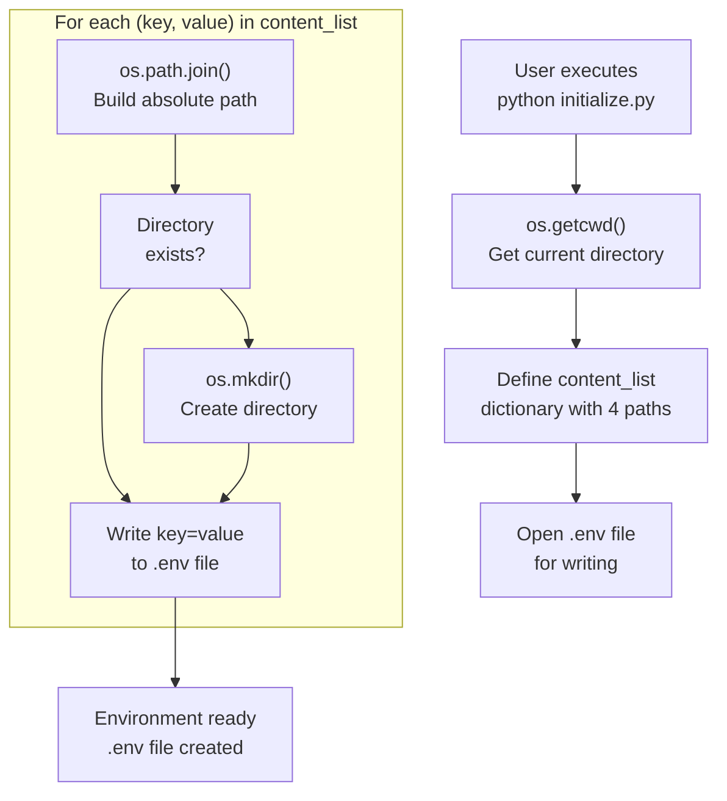
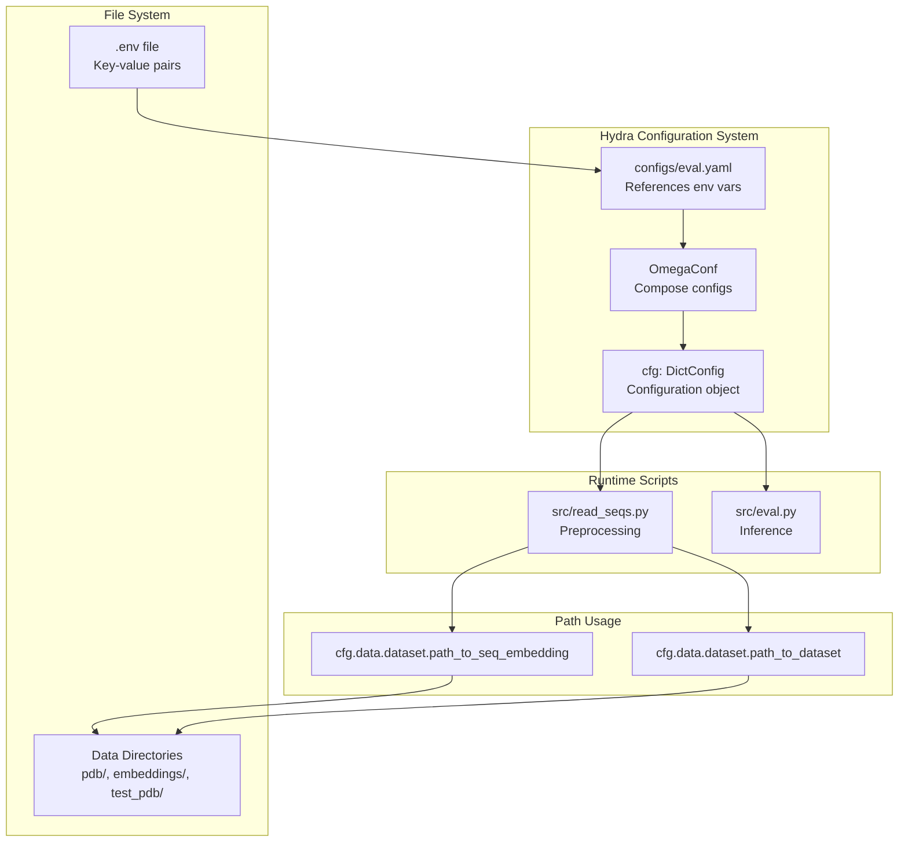
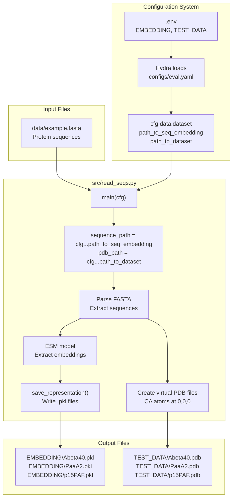

# Environment Configuration

> **Relevant source files**
> * [README.md](https://github.com/Junjie-Zhu/IDPFold/blob/ba40f40c/README.md?plain=1)
> * [data/example.fasta](https://github.com/Junjie-Zhu/IDPFold/blob/ba40f40c/data/example.fasta)
> * [initialize.py](https://github.com/Junjie-Zhu/IDPFold/blob/ba40f40c/initialize.py)
> * [src/read_seqs.py](https://github.com/Junjie-Zhu/IDPFold/blob/ba40f40c/src/read_seqs.py)

## Purpose and Scope

This document explains how to configure the IDPFold runtime environment by setting up the `.env` file and establishing the required directory structure. Environment configuration defines file system paths for datasets, embeddings, and cache directories used throughout the system. For overall installation procedures, see [Installation Steps](/Junjie-Zhu/IDPFold/2.2-installation-steps). For details on how these paths are referenced in configuration files, see [Configuration Overview](/Junjie-Zhu/IDPFold/5.1-configuration-overview).

---

## Overview

IDPFold requires several directory paths to be configured before use. These paths specify where the system stores and retrieves:

* Training datasets (PDB structures)
* Test datasets (inference inputs)
* Sequence embeddings (ESM model outputs)
* Cache files (temporary data)

Rather than hardcoding these paths, IDPFold uses environment variables defined in a `.env` file at the project root. This approach enables flexible deployment across different systems and user configurations. The `initialize.py` script automates the creation of this file and the necessary directories.

**Sources:** [README.md L39-L43](https://github.com/Junjie-Zhu/IDPFold/blob/ba40f40c/README.md?plain=1#L39-L43)

 [initialize.py L1-L22](https://github.com/Junjie-Zhu/IDPFold/blob/ba40f40c/initialize.py#L1-L22)

---

## The .env File Structure

The `.env` file contains key-value pairs defining absolute paths to data directories. IDPFold's configuration system (Hydra) reads these variables and makes them available to all scripts.

### Environment Variables

| Variable | Purpose | Default Relative Path |
| --- | --- | --- |
| `CACHE_DIR` | Temporary cache storage | `.cache` |
| `TRAIN_DATA` | Training PDB structures | `data/pdb` |
| `EMBEDDING` | Sequence embedding files (.pkl) | `data/embeddings` |
| `TEST_DATA` | Test/inference PDB files | `data/test_pdb` |

### File Format

The `.env` file uses a simple key-value format with quoted paths:

```
CACHE_DIR="/absolute/path/to/IDPFold/.cache"
TRAIN_DATA="/absolute/path/to/IDPFold/data/pdb"
EMBEDDING="/absolute/path/to/IDPFold/data/embeddings"
TEST_DATA="/absolute/path/to/IDPFold/data/test_pdb"
```

**Sources:** [initialize.py L7-L11](https://github.com/Junjie-Zhu/IDPFold/blob/ba40f40c/initialize.py#L7-L11)

---

## Automated Setup with initialize.py

### Initialization Process

The `initialize.py` script automates environment setup by:

1. Determining the current working directory (project root)
2. Creating the `.env` file
3. Creating all required directories if they don't exist
4. Writing absolute paths to the `.env` file

**Diagram: Initialization Workflow**



**Sources:** [initialize.py L1-L22](https://github.com/Junjie-Zhu/IDPFold/blob/ba40f40c/initialize.py#L1-L22)

### Running initialize.py

Execute from the project root directory:

```
python initialize.py
```

This command:

* Creates `.env` in the current directory
* Creates `data/pdb/`, `data/embeddings/`, `data/test_pdb/`, and `.cache/` subdirectories
* Writes absolute paths to `.env`

**Sources:** [README.md L42](https://github.com/Junjie-Zhu/IDPFold/blob/ba40f40c/README.md?plain=1#L42-L42)

 [initialize.py L1-L22](https://github.com/Junjie-Zhu/IDPFold/blob/ba40f40c/initialize.py#L1-L22)

---

## Directory Structure Created

After running `initialize.py`, the following structure exists:

```markdown
IDPFold/
├── .env                    # Environment variables file
├── .cache/                 # Cache directory (CACHE_DIR)
├── data/
│   ├── embeddings/        # Sequence embeddings (EMBEDDING)
│   ├── pdb/               # Training structures (TRAIN_DATA)
│   └── test_pdb/          # Inference structures (TEST_DATA)
└── initialize.py
```

**Sources:** [initialize.py L7-L19](https://github.com/Junjie-Zhu/IDPFold/blob/ba40f40c/initialize.py#L7-L19)

---

## How Configuration Paths Are Used

### Configuration Loading Flow

**Diagram: Environment Variable Flow from .env to Runtime**



**Sources:** [src/read_seqs.py L15-L22](https://github.com/Junjie-Zhu/IDPFold/blob/ba40f40c/src/read_seqs.py#L15-L22)

### Path Usage in read_seqs.py

The preprocessing script `src/read_seqs.py` demonstrates how environment paths are accessed:

```markdown
sequence_path = cfg.data.dataset.path_to_seq_embedding  # EMBEDDING directorypdb_path = cfg.data.dataset.path_to_dataset            # TEST_DATA directory
```

These paths are used to:

* **`path_to_seq_embedding`**: Save extracted ESM embeddings as `.pkl` files [src/read_seqs.py L58](https://github.com/Junjie-Zhu/IDPFold/blob/ba40f40c/src/read_seqs.py#L58-L58)
* **`path_to_dataset`**: Create virtual PDB files with placeholder coordinates [src/read_seqs.py L45-L49](https://github.com/Junjie-Zhu/IDPFold/blob/ba40f40c/src/read_seqs.py#L45-L49)

**Sources:** [src/read_seqs.py L21-L22](https://github.com/Junjie-Zhu/IDPFold/blob/ba40f40c/src/read_seqs.py#L21-L22)

 [src/read_seqs.py L45-L58](https://github.com/Junjie-Zhu/IDPFold/blob/ba40f40c/src/read_seqs.py#L45-L58)

---

## Practical Examples

### Example 1: Default Configuration

Running `initialize.py` from `/home/user/IDPFold` creates:

```
CACHE_DIR="/home/user/IDPFold/.cache"
TRAIN_DATA="/home/user/IDPFold/data/pdb"
EMBEDDING="/home/user/IDPFold/data/embeddings"
TEST_DATA="/home/user/IDPFold/data/test_pdb"
```

### Example 2: Custom Paths

For custom paths, manually edit `.env`:

```
CACHE_DIR="/mnt/fast_storage/idpfold_cache"
TRAIN_DATA="/data/protein_structures/pdb"
EMBEDDING="/data/protein_structures/embeddings"
TEST_DATA="/scratch/user/idp_test"
```

Ensure all directories exist or create them manually:

```
mkdir -p /mnt/fast_storage/idpfold_cachemkdir -p /data/protein_structures/pdbmkdir -p /data/protein_structures/embeddingsmkdir -p /scratch/user/idp_test
```

**Sources:** [initialize.py L7-L21](https://github.com/Junjie-Zhu/IDPFold/blob/ba40f40c/initialize.py#L7-L21)

---

## Integration with Preprocessing

**Diagram: Configuration Integration in Preprocessing Pipeline**



**Sources:** [src/read_seqs.py L1-L62](https://github.com/Junjie-Zhu/IDPFold/blob/ba40f40c/src/read_seqs.py#L1-L62)

 [data/example.fasta L1-L6](https://github.com/Junjie-Zhu/IDPFold/blob/ba40f40c/data/example.fasta#L1-L6)

The preprocessing workflow illustrates how:

1. `.env` variables are read by Hydra configuration system
2. `read_seqs.py` accesses paths via `cfg.data.dataset`
3. Virtual PDB files are written to `TEST_DATA` directory
4. Embedding files are written to `EMBEDDING` directory

---

## Manual Configuration Alternative

While `initialize.py` is recommended, manual setup is possible:

1. **Create .env file manually:** ``` touch .env ```
2. **Add environment variables:** ``` echo 'CACHE_DIR="/absolute/path/to/.cache"' >> .envecho 'TRAIN_DATA="/absolute/path/to/data/pdb"' >> .envecho 'EMBEDDING="/absolute/path/to/data/embeddings"' >> .envecho 'TEST_DATA="/absolute/path/to/data/test_pdb"' >> .env ```
3. **Create directories:** ``` mkdir -p .cache data/pdb data/embeddings data/test_pdb ```

**Sources:** [initialize.py L7-L21](https://github.com/Junjie-Zhu/IDPFold/blob/ba40f40c/initialize.py#L7-L21)

---

## Verification

After configuration, verify the setup:

```markdown
# Check .env exists and contains pathscat .env # Verify directories existls -la data/ls -la .cache/
```

Expected output:

```
data/
├── embeddings/
├── pdb/
└── test_pdb/
```

To test the configuration with actual preprocessing, see [Preprocessing Sequences](/Junjie-Zhu/IDPFold/3.2-preprocessing-sequences).

**Sources:** [README.md L39-L43](https://github.com/Junjie-Zhu/IDPFold/blob/ba40f40c/README.md?plain=1#L39-L43)

 [initialize.py L1-L22](https://github.com/Junjie-Zhu/IDPFold/blob/ba40f40c/initialize.py#L1-L22)

---

## Common Issues

### Issue: Relative Paths in .env

**Problem:** Manually edited `.env` contains relative paths

```
EMBEDDING="data/embeddings"
```

**Solution:** Use absolute paths as generated by `initialize.py`

```
EMBEDDING="/home/user/IDPFold/data/embeddings"
```

### Issue: Missing Directories

**Problem:** Directories referenced in `.env` don't exist

**Solution:** Re-run `initialize.py` or manually create directories:

```
mkdir -p data/embeddings data/pdb data/test_pdb .cache
```

**Sources:** [initialize.py L17-L19](https://github.com/Junjie-Zhu/IDPFold/blob/ba40f40c/initialize.py#L17-L19)

---

## Summary

Environment configuration in IDPFold is managed through:

* **`.env` file**: Defines four directory paths (CACHE_DIR, TRAIN_DATA, EMBEDDING, TEST_DATA)
* **`initialize.py`**: Automated script that creates `.env` and directories
* **Hydra integration**: Configuration system loads `.env` variables and makes them available to scripts

This configuration establishes the file system foundation required for preprocessing sequences and running inference.

**Sources:** [initialize.py L1-L22](https://github.com/Junjie-Zhu/IDPFold/blob/ba40f40c/initialize.py#L1-L22)

 [README.md L39-L43](https://github.com/Junjie-Zhu/IDPFold/blob/ba40f40c/README.md?plain=1#L39-L43)

 [src/read_seqs.py L21-L22](https://github.com/Junjie-Zhu/IDPFold/blob/ba40f40c/src/read_seqs.py#L21-L22)