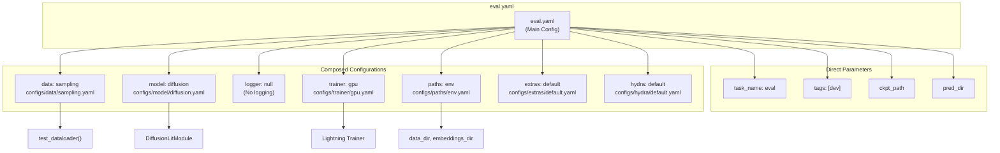
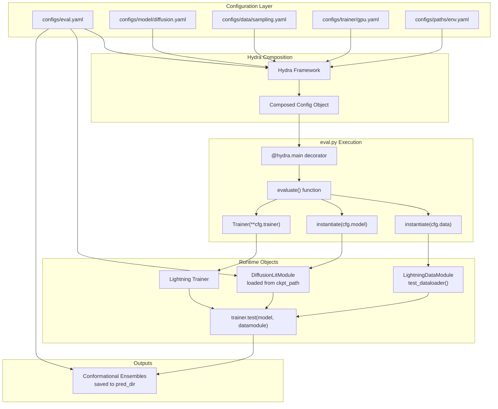
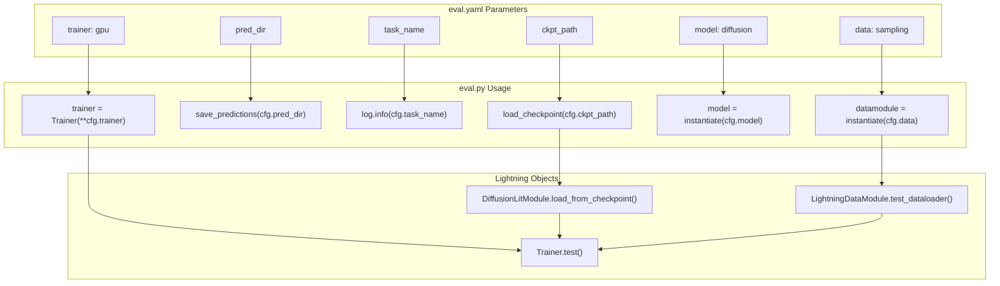
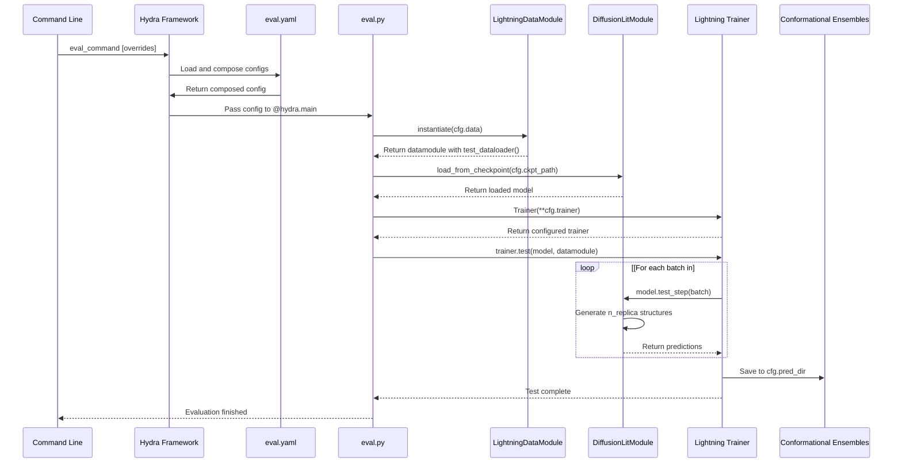

# Evaluation Configuration Reference

> **Relevant source files**
> * [configs/eval.yaml](https://github.com/Junjie-Zhu/IDPFold/blob/ba40f40c/configs/eval.yaml)

## Purpose and Scope

This document provides a comprehensive reference for all configuration parameters in `configs/eval.yaml`, which controls the behavior of inference and evaluation in IDPFold. This configuration file is used by `eval.py` to load model checkpoints, configure data loading, set up the PyTorch Lightning Trainer, and generate conformational ensembles for test sequences.

For information about model architecture parameters, see [Model Configuration Reference](/Junjie-Zhu/IDPFold/5.2-model-configuration-reference). For an overview of the Hydra configuration system, see [Configuration Overview](/Junjie-Zhu/IDPFold/5.1-configuration-overview). For practical usage instructions, see [Running Inference](/Junjie-Zhu/IDPFold/3.3-running-inference).

**Sources:** [configs/eval.yaml L1-L20](https://github.com/Junjie-Zhu/IDPFold/blob/ba40f40c/configs/eval.yaml#L1-L20)

---

## Configuration File Structure

The `eval.yaml` file follows the Hydra configuration framework pattern, using composition to assemble a complete configuration from multiple specialized configuration files. The file is located at the repository root under `configs/eval.yaml`.



**Diagram: Configuration Composition Structure**

The `defaults` section at [configs/eval.yaml L3-L11](https://github.com/Junjie-Zhu/IDPFold/blob/ba40f40c/configs/eval.yaml#L3-L11)

 specifies which configuration groups to compose. Hydra processes these defaults in order, with later configurations overriding earlier ones when conflicts occur. The `_self_` entry controls when the current file's parameters are merged into the composition.

**Sources:** [configs/eval.yaml L3-L11](https://github.com/Junjie-Zhu/IDPFold/blob/ba40f40c/configs/eval.yaml#L3-L11)

---

## Core Parameters

### task_name

```yaml
task_name: "eval"
```

**Type:** String
**Default:** `"eval"`
**Required:** No

Identifies the task being performed. This parameter is primarily used for logging, experiment tracking, and output organization. The value `"eval"` distinguishes evaluation runs from training runs (which would use `task_name: "train"`).

**Location in file:** [configs/eval.yaml L13](https://github.com/Junjie-Zhu/IDPFold/blob/ba40f40c/configs/eval.yaml#L13-L13)

---

### tags

```yaml
tags: ["dev"]
```

**Type:** List of strings
**Default:** `["dev"]`
**Required:** No

Tags for categorizing and organizing experiments. These tags can be used by experiment tracking systems (like Weights & Biases) or for filtering runs. The default `"dev"` tag indicates a development/testing run rather than a production or final evaluation run.

Common tag values might include:

* `"dev"` - Development experiments
* `"test"` - Test runs
* `"production"` - Final evaluation runs
* `"benchmark"` - Benchmarking runs

**Location in file:** [configs/eval.yaml L15](https://github.com/Junjie-Zhu/IDPFold/blob/ba40f40c/configs/eval.yaml#L15-L15)

---

### ckpt_path

```
ckpt_path: ${paths.data_dir}/last.ckpt
```

**Type:** String (path)
**Default:** `${paths.data_dir}/last.ckpt`
**Required:** Yes

Path to the model checkpoint file to load for evaluation. This is the most critical parameter for evaluation as it specifies which trained model weights to use for generating predictions.

The default value uses Hydra variable interpolation (`${...}`) to reference `paths.data_dir` from the composed `paths/env.yaml` configuration, making the path relative to the configured data directory.

**Common values:**

* `${paths.data_dir}/last.ckpt` - Most recent checkpoint
* `${paths.data_dir}/best.ckpt` - Best performing checkpoint
* `/absolute/path/to/checkpoint.ckpt` - Explicit path
* `null` - Would cause an error; checkpoint is required

The checkpoint file must be a valid PyTorch Lightning checkpoint containing the model state dict and other training metadata.

**Location in file:** [configs/eval.yaml L18](https://github.com/Junjie-Zhu/IDPFold/blob/ba40f40c/configs/eval.yaml#L18-L18)

**Related:** See [Model Checkpoints](/Junjie-Zhu/IDPFold/8.3-model-checkpoints) for details on checkpoint file structure.

---

### pred_dir

```yaml
pred_dir: null
```

**Type:** String (path) or null
**Default:** `null`
**Required:** No

Directory path where prediction outputs (conformational ensembles) should be saved. When set to `null`, the system likely uses a default output location or generates predictions in memory without persistent storage.

**Common values:**

* `null` - Use default behavior
* `${paths.output_dir}/predictions` - Save to configured output directory
* `/path/to/output/predictions` - Explicit output path

**Location in file:** [configs/eval.yaml L19](https://github.com/Junjie-Zhu/IDPFold/blob/ba40f40c/configs/eval.yaml#L19-L19)

**Sources:** [configs/eval.yaml L13-L19](https://github.com/Junjie-Zhu/IDPFold/blob/ba40f40c/configs/eval.yaml#L13-L19)

---

## Composed Configuration Groups

The `defaults` section composes configurations from multiple specialized files. Each composed configuration provides parameters for different aspects of the evaluation pipeline.

### Configuration Composition Table

| Group | Value | File Path | Purpose |
| --- | --- | --- | --- |
| `_self_` | - | Current file | Controls merge order of this config |
| `data` | `sampling` | `configs/data/sampling.yaml` | Datamodule with `test_dataloader()` for evaluation |
| `model` | `diffusion` | `configs/model/diffusion.yaml` | DiffusionLitModule architecture parameters |
| `logger` | `null` | - | Disables experiment logging |
| `trainer` | `gpu` | `configs/trainer/gpu.yaml` | PyTorch Lightning Trainer settings |
| `paths` | `env` | `configs/paths/env.yaml` | Directory paths from environment |
| `extras` | `default` | `configs/extras/default.yaml` | Additional utilities and settings |
| `hydra` | `default` | `configs/hydra/default.yaml` | Hydra framework configuration |

**Sources:** [configs/eval.yaml L3-L11](https://github.com/Junjie-Zhu/IDPFold/blob/ba40f40c/configs/eval.yaml#L3-L11)

---

### data: sampling

```yaml
data: sampling  # choose datamodule with `test_dataloader()` for evaluation
```

Specifies the datamodule configuration to use. The `sampling` datamodule is designed for evaluation and must provide a `test_dataloader()` method that returns sequences for inference.

**Key behaviors:**

* Loads preprocessed sequence embeddings from `.pkl` files
* Creates virtual PDB structures for coordinate initialization
* Batches sequences appropriately for the model
* Returns data in the format expected by DiffusionLitModule

**Configuration file:** `configs/data/sampling.yaml` (not shown in provided files)

---

### model: diffusion

```yaml
model: diffusion
```

Specifies the model architecture configuration. References `configs/model/diffusion.yaml`, which defines all parameters for the DiffusionLitModule including network architecture, diffusion process settings, and inference parameters.

**For detailed model parameters, see:** [Model Configuration Reference](/Junjie-Zhu/IDPFold/5.2-model-configuration-reference)

Key model parameters that affect evaluation:

* `num_timesteps` - Number of diffusion steps (default: 1000)
* `noise_scale` - Noise magnitude (default: 1.0)
* `self_conditioning` - Whether to use self-conditioning (default: true)
* `n_replica` - Number of ensemble members to generate (default: 192)

---

### logger: null

```yaml
logger: null
```

Disables experiment logging during evaluation. When set to `null`, no experiment tracking system (like Weights & Biases, TensorBoard, or MLflow) is initialized.

**Common alternatives:**

* `logger: wandb` - Enable Weights & Biases logging
* `logger: tensorboard` - Enable TensorBoard logging
* `logger: csv` - Enable CSV logging

For evaluation runs, logging is typically disabled to avoid cluttering experiment tracking systems with inference-only runs.

---

### trainer: gpu

```yaml
trainer: gpu
```

Specifies the PyTorch Lightning Trainer configuration. The `gpu` option configures the trainer to use GPU acceleration for inference.

**Configuration file:** `configs/trainer/gpu.yaml` (not shown in provided files)

**Typical parameters set by this config:**

* `accelerator: "gpu"` - Use GPU acceleration
* `devices: 1` - Number of GPUs to use
* `precision: 16` or `32` - Floating point precision
* `enable_progress_bar: true` - Show progress during inference

---

### paths: env

```yaml
paths: env
```

Loads path configurations from the `.env` file via `configs/paths/env.yaml`. This provides directory locations for:

* `data_dir` - Root data directory
* `embeddings_dir` - Preprocessed embeddings location
* `output_dir` - Output location for predictions

The `${paths.data_dir}` variable used in `ckpt_path` comes from this configuration.

**For environment setup details, see:** [Environment Configuration](/Junjie-Zhu/IDPFold/2.3-environment-configuration)

---

### extras: default

```yaml
extras: default
```

Includes additional utilities and settings from `configs/extras/default.yaml`. This typically includes settings for:

* Print configuration on startup
* Ignore certain warnings
* Enforce reproducibility settings
* Set up callbacks

---

### hydra: default

```yaml
hydra: default
```

Configures Hydra framework behavior from `configs/hydra/default.yaml`. This controls:

* Output directory structure
* Run directory naming
* Sweep behavior (for hyperparameter optimization)
* Configuration resolution rules

**Sources:** [configs/eval.yaml L5-L11](https://github.com/Junjie-Zhu/IDPFold/blob/ba40f40c/configs/eval.yaml#L5-L11)

---

## Configuration Usage in Code

The evaluation configuration is consumed by `src/eval.py` to orchestrate the inference pipeline. The following diagram shows how configuration parameters flow from `eval.yaml` to the execution code.



**Diagram: Configuration to Code Flow**

**Sources:** [configs/eval.yaml L1-L20](https://github.com/Junjie-Zhu/IDPFold/blob/ba40f40c/configs/eval.yaml#L1-L20)

---

## Code Entity Mapping

This section maps configuration parameters to their usage in the codebase.



**Diagram: Parameter-to-Code Mapping**

### Key Code Locations

| Parameter | Used In | Purpose |
| --- | --- | --- |
| `ckpt_path` | `eval.py` | Passed to `DiffusionLitModule.load_from_checkpoint()` |
| `pred_dir` | `eval.py` | Output directory for conformational ensembles |
| `task_name` | `eval.py` | Logging and experiment identification |
| `cfg.data` | `eval.py` | Instantiated as LightningDataModule |
| `cfg.model` | `eval.py` | Architecture spec for checkpoint loading |
| `cfg.trainer` | `eval.py` | Passed to `Trainer()` constructor |

**Sources:** [configs/eval.yaml L1-L20](https://github.com/Junjie-Zhu/IDPFold/blob/ba40f40c/configs/eval.yaml#L1-L20)

---

## Customization Examples

### Example 1: Evaluate with Custom Checkpoint

To evaluate using a specific checkpoint file:

```markdown
# configs/eval.yamlckpt_path: /path/to/my/checkpoint.ckptpred_dir: ./my_predictions
```

Or via command line override:

```
eval_command ckpt_path=/path/to/checkpoint.ckpt pred_dir=./output
```

---

### Example 2: Change Number of Ensemble Members

Since `n_replica` is defined in the composed model config, override it:

```markdown
eval_command model.n_replica=384  # Generate 384 structures instead of 192
```

---

### Example 3: Enable Experiment Logging

To track evaluation metrics with Weights & Biases:

```markdown
# configs/eval.yamllogger: wandb
```

Or via command line:

```
eval_command logger=wandb
```

---

### Example 4: Evaluate with Different Diffusion Steps

```markdown
eval_command model.num_timesteps=500  # Use 500 diffusion steps instead of 1000
```

This reduces computational cost at the expense of potentially lower quality predictions.

---

### Example 5: CPU-Only Evaluation

To run evaluation on CPU instead of GPU:

```
eval_command trainer=cpu
```

**Sources:** [configs/eval.yaml L1-L20](https://github.com/Junjie-Zhu/IDPFold/blob/ba40f40c/configs/eval.yaml#L1-L20)

---

## Variable Interpolation

The configuration uses Hydra's variable interpolation feature to reference values from other parts of the configuration:

```
ckpt_path: ${paths.data_dir}/last.ckpt
```

**Interpolation syntax:**

* `${paths.data_dir}` - References `data_dir` from the `paths` config group
* `${paths.embeddings_dir}` - References embeddings directory
* `${model.n_replica}` - References model parameter

**Resolution order:**

1. Hydra composes all default configs
2. Variable references are resolved after composition
3. Command-line overrides are applied last

---

## Complete Configuration Schema

Here is the complete schema for `eval.yaml` showing all parameters and their types:

| Parameter | Type | Default | Required | Description |
| --- | --- | --- | --- | --- |
| `task_name` | string | `"eval"` | No | Task identifier |
| `tags` | list[string] | `["dev"]` | No | Experiment tags |
| `ckpt_path` | string | `${paths.data_dir}/last.ckpt` | Yes | Model checkpoint path |
| `pred_dir` | string \| null | `null` | No | Prediction output directory |
| `data` | string | `"sampling"` | Yes | Datamodule config name |
| `model` | string | `"diffusion"` | Yes | Model config name |
| `logger` | string \| null | `null` | No | Logger config name |
| `trainer` | string | `"gpu"` | Yes | Trainer config name |
| `paths` | string | `"env"` | Yes | Paths config name |
| `extras` | string | `"default"` | No | Extras config name |
| `hydra` | string | `"default"` | No | Hydra config name |

**Sources:** [configs/eval.yaml L1-L20](https://github.com/Junjie-Zhu/IDPFold/blob/ba40f40c/configs/eval.yaml#L1-L20)

---

## Integration with Evaluation Pipeline

The following diagram shows how `eval.yaml` integrates into the complete evaluation pipeline from configuration to output:



**Diagram: Evaluation Pipeline with Configuration**

**Sources:** [configs/eval.yaml L1-L20](https://github.com/Junjie-Zhu/IDPFold/blob/ba40f40c/configs/eval.yaml#L1-L20)

---

## Common Configuration Patterns

### Pattern 1: Quick Test Run

For rapid testing with fewer replicas and timesteps:

```
eval_command \  model.n_replica=32 \  model.num_timesteps=100 \  tags="[quicktest]"
```

---

### Pattern 2: Production Evaluation

For final evaluation runs with full quality:

```
eval_command \  ckpt_path=/path/to/best_model.ckpt \  model.n_replica=192 \  model.num_timesteps=1000 \  pred_dir=./production_predictions \  tags="[production,final]"
```

---

### Pattern 3: Benchmark Evaluation

For systematic benchmarking across multiple checkpoints:

```
for ckpt in checkpoints/*.ckpt; do  eval_command \    ckpt_path=$ckpt \    pred_dir=./benchmarks/$(basename $ckpt .ckpt) \    tags="[benchmark]"done
```

**Sources:** [configs/eval.yaml L1-L20](https://github.com/Junjie-Zhu/IDPFold/blob/ba40f40c/configs/eval.yaml#L1-L20)

---

## Related Configuration Files

While this page documents `eval.yaml`, evaluation behavior is also influenced by:

* **[Model Configuration](/Junjie-Zhu/IDPFold/5.2-model-configuration-reference)** - `configs/model/diffusion.yaml` defines architecture and inference parameters
* **[Environment Configuration](/Junjie-Zhu/IDPFold/2.3-environment-configuration)** - `.env` file and `configs/paths/env.yaml` define directory paths
* **Data Configuration** - `configs/data/sampling.yaml` defines datamodule behavior
* **Trainer Configuration** - `configs/trainer/gpu.yaml` defines PyTorch Lightning Trainer settings

These configurations are composed together via the `defaults` section to create the complete evaluation configuration.

**Sources:** [configs/eval.yaml L3-L11](https://github.com/Junjie-Zhu/IDPFold/blob/ba40f40c/configs/eval.yaml#L3-L11)