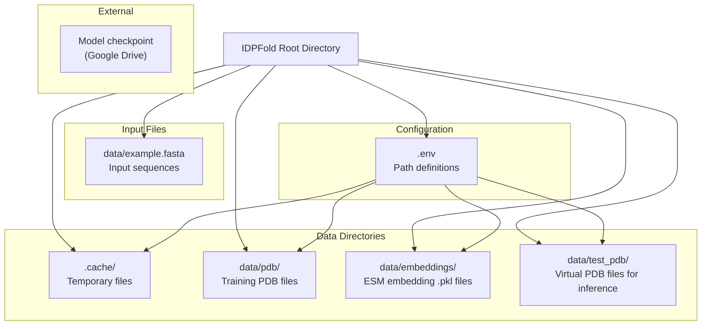
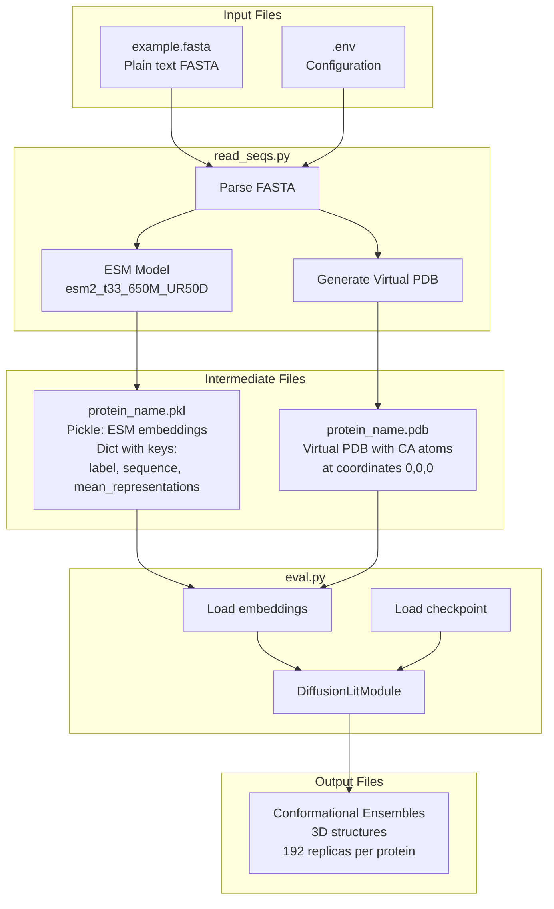
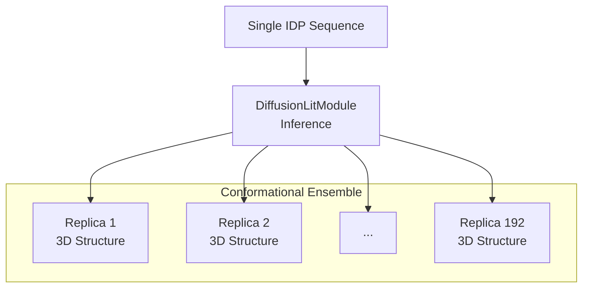
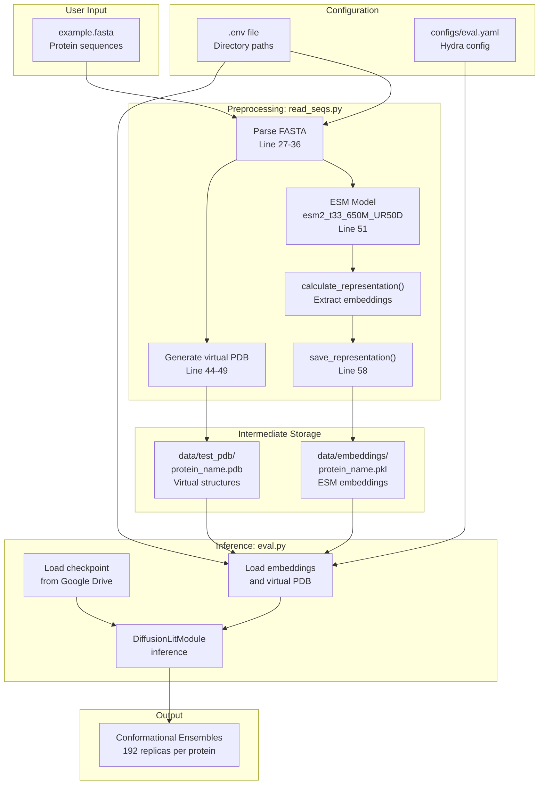

# File Formats and Data

> **Relevant source files**
> * [README.md](https://github.com/Junjie-Zhu/IDPFold/blob/ba40f40c/README.md?plain=1)
> * [data/example.fasta](https://github.com/Junjie-Zhu/IDPFold/blob/ba40f40c/data/example.fasta)
> * [initialize.py](https://github.com/Junjie-Zhu/IDPFold/blob/ba40f40c/initialize.py)
> * [src/read_seqs.py](https://github.com/Junjie-Zhu/IDPFold/blob/ba40f40c/src/read_seqs.py)

This page documents all input, intermediate, and output file formats used in the IDPFold system. Understanding these formats is essential for preparing input data, interpreting results, and integrating IDPFold into larger workflows.

For information about how to use these files in practice, see [User Guide](/Junjie-Zhu/IDPFold/3-user-guide). For details on the preprocessing pipeline, see [Preprocessing Sequences](/Junjie-Zhu/IDPFold/3.2-preprocessing-sequences). For inference workflow details, see [Running Inference](/Junjie-Zhu/IDPFold/3.3-running-inference).

## Data Directory Structure

The IDPFold system organizes data files into a structured directory hierarchy. The `initialize.py` script creates this structure and generates a `.env` configuration file that defines paths to these directories.



**Sources:** [initialize.py L1-L22](https://github.com/Junjie-Zhu/IDPFold/blob/ba40f40c/initialize.py#L1-L22)

The `initialize.py` script creates four primary data directories:

| Environment Variable | Default Path | Purpose |
| --- | --- | --- |
| `CACHE_DIR` | `.cache` | Temporary files and caching |
| `TRAIN_DATA` | `data/pdb` | PDB structure files for training |
| `EMBEDDING` | `data/embeddings` | ESM sequence embedding files (.pkl) |
| `TEST_DATA` | `data/test_pdb` | Virtual PDB files for inference |

**Sources:** [initialize.py L7-L11](https://github.com/Junjie-Zhu/IDPFold/blob/ba40f40c/initialize.py#L7-L11)

## File Format Overview

The following diagram illustrates how different file formats are transformed throughout the IDPFold pipeline:



**Sources:** [src/read_seqs.py L15-L62](https://github.com/Junjie-Zhu/IDPFold/blob/ba40f40c/src/read_seqs.py#L15-L62)

 [README.md L45-L59](https://github.com/Junjie-Zhu/IDPFold/blob/ba40f40c/README.md?plain=1#L45-L59)

## Input File Formats

### FASTA Format

IDPFold accepts protein sequences in standard FASTA format. Both single and multiple sequences are supported in a single file.

**Format Specification:**

```
> sequence_identifier
AMINO_ACID_SEQUENCE
```

* Header lines begin with `>` followed by a sequence identifier
* Sequence identifiers become filenames for generated embeddings and virtual PDB files
* Sequences contain single-letter amino acid codes (20 standard amino acids)
* Whitespace in sequences is stripped during parsing

**Example:**

```
> Abeta40
DAEFRHDSGYEVHHQKLVFFAEDVGSNKGAIIGLMVGGVV
> PaaA2
MDYKDDDDKNRALSPMVSEFETIEQENSYNEWLRAKVATSLADPRPAIPHDEVERRMAERFAKMRKERSKQ
> p15PAF
VRTKADSVPGTYRKVVAARAPRKVLGSSTSATNSTSVSSRKAENKYAGGNPVCVRPTPKWQKGIGEFFRLSPKDSEKENQIPEEAGSSGLGKAKRKACPLQPDHTNDEKE
```

**Sources:** [data/example.fasta L1-L6](https://github.com/Junjie-Zhu/IDPFold/blob/ba40f40c/data/example.fasta#L1-L6)

**Parsing Implementation:**

The FASTA file is parsed in [src/read_seqs.py L27-L36](https://github.com/Junjie-Zhu/IDPFold/blob/ba40f40c/src/read_seqs.py#L27-L36)

:

```
to_process_list = []with open(input_fasta, 'r') as f:    lines = f.readlines()        seq_name, seq = '', ''    for line in lines:        if line.startswith('>'):            seq_name = line[1:].strip()        else:            seq = line.strip()            to_process_list.append((seq_name, seq))
```

The resulting `to_process_list` is a list of tuples: `[(seq_name, seq), ...]`

**Sources:** [src/read_seqs.py L27-L36](https://github.com/Junjie-Zhu/IDPFold/blob/ba40f40c/src/read_seqs.py#L27-L36)

### Environment Configuration File (.env)

The `.env` file stores absolute paths to data directories. This file is automatically generated by `initialize.py` but can be manually edited.

**Format:**

```
CACHE_DIR="/absolute/path/to/IDPFold/.cache"
TRAIN_DATA="/absolute/path/to/IDPFold/data/pdb"
EMBEDDING="/absolute/path/to/IDPFold/data/embeddings"
TEST_DATA="/absolute/path/to/IDPFold/data/test_pdb"
```

Each line defines an environment variable with an absolute path enclosed in double quotes.

**Sources:** [initialize.py L14-L21](https://github.com/Junjie-Zhu/IDPFold/blob/ba40f40c/initialize.py#L14-L21)

 [README.md L39-L43](https://github.com/Junjie-Zhu/IDPFold/blob/ba40f40c/README.md?plain=1#L39-L43)

## Intermediate File Formats

### ESM Embedding Files (.pkl)

Sequence embeddings are stored as Python pickle files containing dictionaries with sequence representations from the ESM language model.

**File Naming Convention:**

```
{sequence_identifier}.pkl
```

Where `{sequence_identifier}` matches the name from the FASTA header.

**Data Structure:**

The pickle file contains a dictionary with three keys:

| Key | Type | Description |
| --- | --- | --- |
| `label` | `str` | Sequence identifier from FASTA |
| `sequence` | `str` | Amino acid sequence |
| `mean_representations` | `torch.Tensor` | ESM embedding vector (averaged across sequence length) |

**Generation Process:**

Embeddings are extracted using the `esm2_t33_650M_UR50D` model [src/read_seqs.py L51](https://github.com/Junjie-Zhu/IDPFold/blob/ba40f40c/src/read_seqs.py#L51-L51)

:

1. Load ESM model and alphabet
2. Process sequences through `calculate_representation()` function
3. Save results using `save_representation()` to `{EMBEDDING}/{seq_name}.pkl`

**Sources:** [src/read_seqs.py L51-L58](https://github.com/Junjie-Zhu/IDPFold/blob/ba40f40c/src/read_seqs.py#L51-L58)

**Storage Location:**

Embedding files are saved to the directory specified by the `EMBEDDING` environment variable (default: `data/embeddings/`), as configured in [src/read_seqs.py L21](https://github.com/Junjie-Zhu/IDPFold/blob/ba40f40c/src/read_seqs.py#L21-L21)

:

```
sequence_path = cfg.data.dataset.path_to_seq_embedding
```

**Sources:** [src/read_seqs.py L21](https://github.com/Junjie-Zhu/IDPFold/blob/ba40f40c/src/read_seqs.py#L21-L21)

 [src/read_seqs.py L58](https://github.com/Junjie-Zhu/IDPFold/blob/ba40f40c/src/read_seqs.py#L58-L58)

### Virtual PDB Files

During preprocessing, IDPFold generates "virtual" PDB files with placeholder coordinates. These files serve as structural templates for the inference pipeline.

**File Naming Convention:**

```
{sequence_identifier}.pdb
```

**Format Specification:**

Virtual PDB files contain only CA (alpha carbon) atoms with coordinates set to `(0.000, 0.000, 0.000)`:

```
ATOM      1  CA  ALA A   1       0.000   0.000   0.000  1.00  0.00           C
ATOM      2  CA  SER A   2       0.000   0.000   0.000  1.00  0.00           C
ATOM      3  CA  ASP A   3       0.000   0.000   0.000  1.00  0.00           C
...
```

**Generation Code:**

Virtual PDB files are generated in [src/read_seqs.py L44-L49](https://github.com/Junjie-Zhu/IDPFold/blob/ba40f40c/src/read_seqs.py#L44-L49)

:

```
for seq_name, seq in to_process_list:    with open(os.path.join(pdb_path, (seq_name + '.pdb')), 'w') as f:        for i, aa in enumerate(seq):            f.write(                f'ATOM  {i + 1:>5}  CA  {restype_dict[aa]:>3} A {i + 1:>3}      0.000   0.000   0.000  1.00  0.00           C\n')
```

**Amino Acid Mapping:**

Single-letter codes are converted to three-letter PDB residue names using the dictionary defined in [src/read_seqs.py L39-L41](https://github.com/Junjie-Zhu/IDPFold/blob/ba40f40c/src/read_seqs.py#L39-L41)

:

| Single Letter | Three Letter | Single Letter | Three Letter |
| --- | --- | --- | --- |
| A | ALA | M | MET |
| C | CYS | N | ASN |
| D | ASP | P | PRO |
| E | GLU | Q | GLN |
| F | PHE | R | ARG |
| G | GLY | S | SER |
| H | HIS | T | THR |
| I | ILE | V | VAL |
| K | LYS | W | TRP |
| L | LEU | Y | TYR |

**Storage Location:**

Virtual PDB files are saved to the directory specified by the `TEST_DATA` environment variable (default: `data/test_pdb/`), as configured in [src/read_seqs.py L22](https://github.com/Junjie-Zhu/IDPFold/blob/ba40f40c/src/read_seqs.py#L22-L22)

:

```
pdb_path = cfg.data.dataset.path_to_dataset
```

**Purpose:**

Virtual PDB files provide a standardized structural template that the model uses during inference. The placeholder coordinates are replaced with predicted conformations during the diffusion process. For more details on how these files are used, see [Virtual PDB Files](/Junjie-Zhu/IDPFold/7.3-virtual-pdb-files).

**Sources:** [src/read_seqs.py L22](https://github.com/Junjie-Zhu/IDPFold/blob/ba40f40c/src/read_seqs.py#L22-L22)

 [src/read_seqs.py L39-L49](https://github.com/Junjie-Zhu/IDPFold/blob/ba40f40c/src/read_seqs.py#L39-L49)

## Model Checkpoint Files

### Checkpoint Format and Location

Model checkpoints contain the trained weights for the `DiffusionLitModule` and are stored in PyTorch Lightning's checkpoint format.

**Availability:**

Pretrained model checkpoints are hosted on Google Drive and must be downloaded separately:

* **Location:** [Google Drive](https://drive.google.com/drive/folders/1-5BHexAZKGX1lWyPkYU-JFi1EId88P9i?usp=sharing)
* **Format:** `.ckpt` files (PyTorch Lightning checkpoint format)

**Sources:** [README.md L50](https://github.com/Junjie-Zhu/IDPFold/blob/ba40f40c/README.md?plain=1#L50-L50)

**Usage in Inference:**

Checkpoints are loaded via the `ckpt_path` parameter when running inference:

```
python src/eval.py ckpt_path='/path/to/ckpt'
```

**Sources:** [README.md L58](https://github.com/Junjie-Zhu/IDPFold/blob/ba40f40c/README.md?plain=1#L58-L58)

**Checkpoint Contents:**

PyTorch Lightning checkpoints typically contain:

* Model state dictionary (neural network weights)
* Optimizer state
* Training configuration
* Epoch and global step counters
* Learning rate scheduler state

For detailed information on model architecture, see [DiffusionLitModule Overview](/Junjie-Zhu/IDPFold/4.1-diffusionlitmodule-overview). For checkpoint configuration in evaluation, see [Evaluation Configuration Reference](/Junjie-Zhu/IDPFold/5.3-evaluation-configuration-reference).

**Sources:** [README.md L50](https://github.com/Junjie-Zhu/IDPFold/blob/ba40f40c/README.md?plain=1#L50-L50)

 [README.md L58](https://github.com/Junjie-Zhu/IDPFold/blob/ba40f40c/README.md?plain=1#L58-L58)

## Output File Formats

### Conformational Ensembles

The primary output of IDPFold is conformational ensembles: collections of 3D protein structures representing the conformational heterogeneity of intrinsically disordered proteins.

**Ensemble Characteristics:**



| Property | Value | Configuration Parameter |
| --- | --- | --- |
| Number of replicas per protein | 192 (default) | `n_replica` in model config |
| Structure representation | 3D atomic coordinates | Generated by denoising process |
| Sampling method | Diffusion model with 1000 timesteps | `num_timesteps` in model config |

**Ensemble Generation Process:**

For each input sequence, the model:

1. Loads sequence embeddings from `.pkl` file
2. Runs diffusion denoising process for `num_timesteps` iterations
3. Generates `n_replica` independent conformations
4. Outputs ensemble of diverse structures

**Structure Format:**

The exact output format for conformational ensembles depends on the implementation details of the evaluation script. The structures represent full atomic coordinates for the protein backbone and are suitable for downstream analysis of ensemble properties such as:

* Radius of gyration distributions
* End-to-end distance distributions
* Secondary structure propensities
* Intramolecular contact probabilities

For details on inference parameters that control ensemble generation, see [Inference Parameters](/Junjie-Zhu/IDPFold/7.1-inference-parameters). For practical usage instructions, see [Running Inference](/Junjie-Zhu/IDPFold/3.3-running-inference).

**Sources:** Based on system architecture diagrams and [README.md L12-L14](https://github.com/Junjie-Zhu/IDPFold/blob/ba40f40c/README.md?plain=1#L12-L14)

## Complete Data Flow Diagram

The following diagram shows how all file formats relate to each other in the complete IDPFold workflow:



**Sources:** [src/read_seqs.py L15-L62](https://github.com/Junjie-Zhu/IDPFold/blob/ba40f40c/src/read_seqs.py#L15-L62)

 [README.md L45-L59](https://github.com/Junjie-Zhu/IDPFold/blob/ba40f40c/README.md?plain=1#L45-L59)

 [initialize.py L1-L22](https://github.com/Junjie-Zhu/IDPFold/blob/ba40f40c/initialize.py#L1-L22)

## File Format Summary Table

| File Type | Extension | Purpose | Created By | Used By | Location |
| --- | --- | --- | --- | --- | --- |
| Input sequences | `.fasta` | Protein sequences to predict | User | `read_seqs.py` | User-specified path |
| Environment config | `.env` | Path configuration | `initialize.py` | All scripts | Project root |
| ESM embeddings | `.pkl` | Sequence representations | `read_seqs.py` | `eval.py` | `${EMBEDDING}/` |
| Virtual PDB | `.pdb` | Structural templates | `read_seqs.py` | `eval.py` | `${TEST_DATA}/` |
| Model checkpoint | `.ckpt` | Trained model weights | Training process | `eval.py` | Google Drive / user path |
| Conformational ensembles | Various | Predicted 3D structures | `eval.py` | Downstream analysis | Output directory |

**Sources:** [src/read_seqs.py L15-L62](https://github.com/Junjie-Zhu/IDPFold/blob/ba40f40c/src/read_seqs.py#L15-L62)

 [initialize.py L1-L22](https://github.com/Junjie-Zhu/IDPFold/blob/ba40f40c/initialize.py#L1-L22)

 [README.md L45-L59](https://github.com/Junjie-Zhu/IDPFold/blob/ba40f40c/README.md?plain=1#L45-L59)