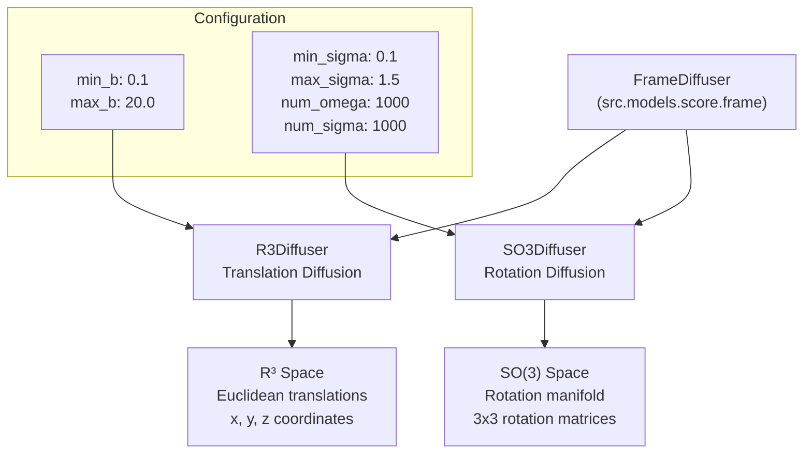
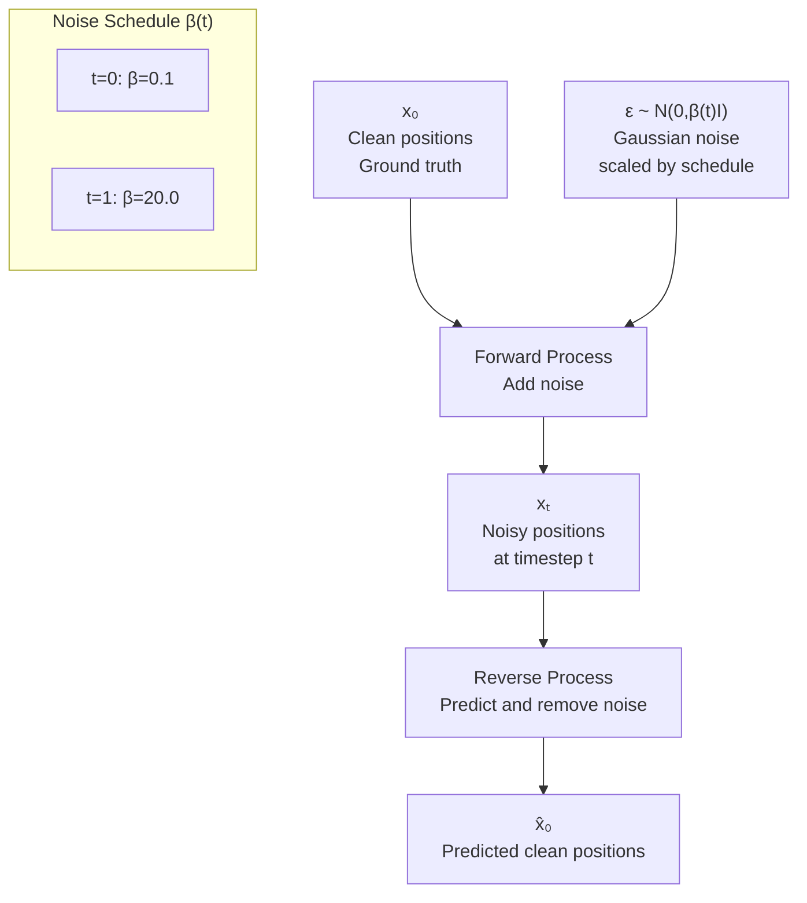
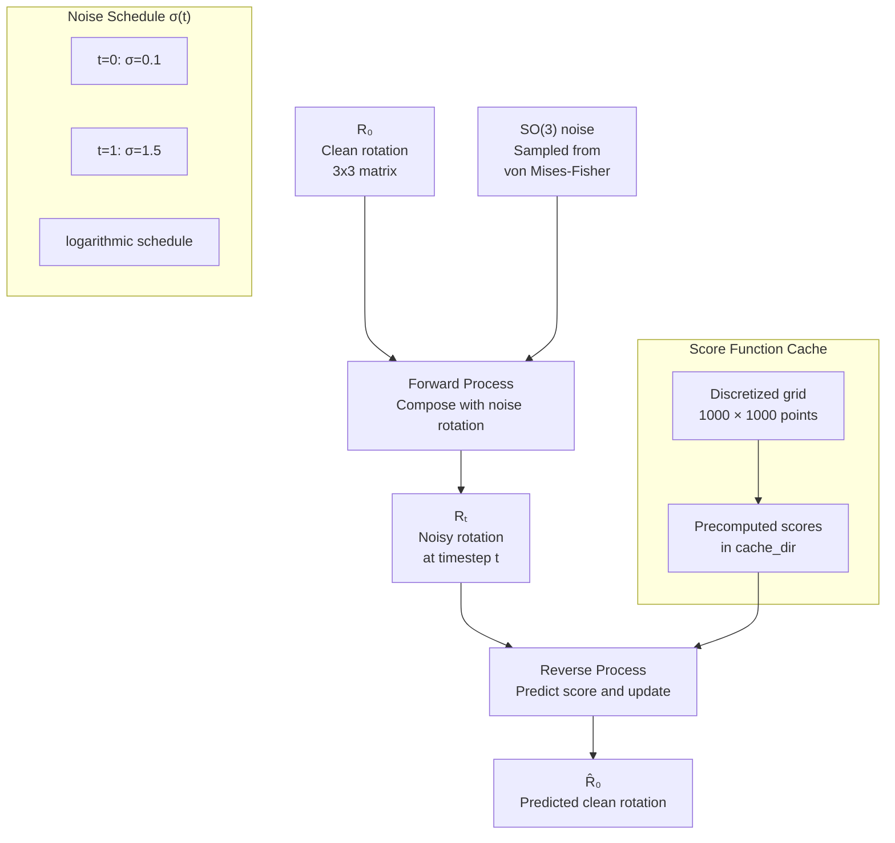
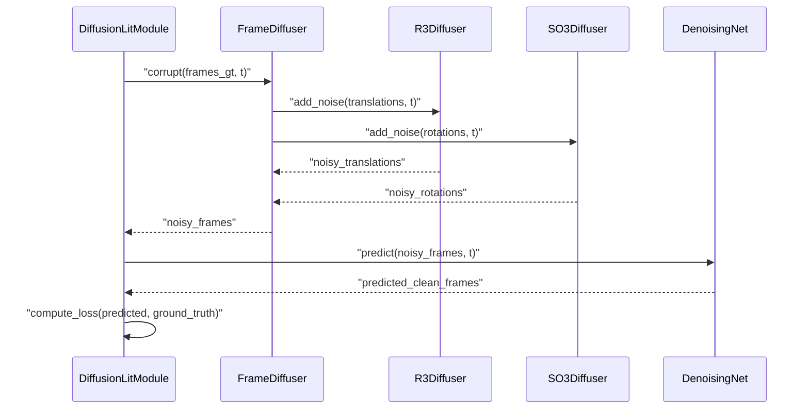
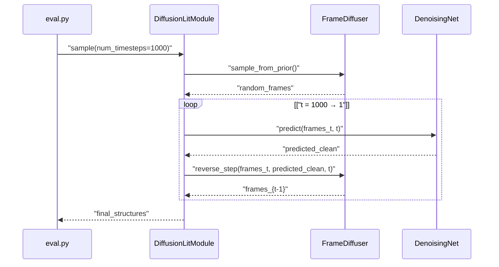

# FrameDiffuser

> **Relevant source files**
> * [configs/model/diffusion.yaml](https://github.com/Junjie-Zhu/IDPFold/blob/ba40f40c/configs/model/diffusion.yaml)

## Purpose and Scope

This page documents the `FrameDiffuser` component, which implements the diffusion process for molecular frames (rigid body transformations) in the IDPFold model. `FrameDiffuser` handles the mathematical framework for adding and removing noise from protein backbone coordinates during training and inference.

For information about the neural network that predicts denoised structures, see [DenoisingNet](/Junjie-Zhu/IDPFold/4.2-denoisingnet). For the overall model orchestration, see [DiffusionLitModule Overview](/Junjie-Zhu/IDPFold/4.1-diffusionlitmodule-overview).

**Sources:** [configs/model/diffusion.yaml L42-L58](https://github.com/Junjie-Zhu/IDPFold/blob/ba40f40c/configs/model/diffusion.yaml#L42-L58)

---

## Overview

`FrameDiffuser` is responsible for the diffusion process in IDPFold's generative model. It treats protein backbone conformations as collections of rigid body frames, where each frame consists of a 3D translation and a 3D rotation. The diffusion process corrupts these frames with noise during training and reverses this process during inference to generate new structures.

The key design principle is **separation of geometric spaces**: translations exist in Euclidean space (R³) while rotations exist on the special orthogonal group (SO(3)). `FrameDiffuser` uses two specialized sub-diffusers to handle these different geometric manifolds appropriately.



**Diagram: FrameDiffuser Architecture**

**Sources:** [configs/model/diffusion.yaml L42-L58](https://github.com/Junjie-Zhu/IDPFold/blob/ba40f40c/configs/model/diffusion.yaml#L42-L58)

---

## Component Architecture

`FrameDiffuser` is instantiated with two independent diffusion processes and a minimum time threshold parameter:

| Component | Target Class | Purpose |
| --- | --- | --- |
| `trans_diffuser` | `src.models.score.r3.R3Diffuser` | Handles translation (position) diffusion in 3D Euclidean space |
| `rot_diffuser` | `src.models.score.so3.SO3Diffuser` | Handles rotation diffusion on the SO(3) manifold |
| `min_t` | Scalar (1e-2) | Minimum timestep threshold to avoid numerical instabilities |

The separation allows the model to:

* Apply different noise schedules optimized for each geometric space
* Scale translations and rotations independently
* Use appropriate mathematical operations for each manifold (addition vs. matrix multiplication)

**Sources:** [configs/model/diffusion.yaml L42-L58](https://github.com/Junjie-Zhu/IDPFold/blob/ba40f40c/configs/model/diffusion.yaml#L42-L58)

---

## R3Diffuser: Translation Diffusion

`R3Diffuser` implements the diffusion process for 3D translations (positions) of protein backbone atoms. It operates in Euclidean space where noise addition is straightforward vector addition.

### Configuration Parameters

| Parameter | Value | Purpose |
| --- | --- | --- |
| `min_b` | 0.1 | Minimum noise level (beta) at timestep t=0 |
| `max_b` | 20.0 | Maximum noise level (beta) at timestep t=1 |
| `coordinate_scaling` | 0.1 | Scaling factor applied to coordinates for numerical stability |

### Noise Schedule

The `R3Diffuser` uses a linear or variance-preserving noise schedule between `min_b` and `max_b`. During the forward process (training), Gaussian noise with variance β(t) is added to ground truth positions. During the reverse process (inference), the neural network predicts the noise to be removed at each timestep.

The `coordinate_scaling` parameter (0.1) normalizes coordinates to prevent numerical overflow, as protein structures typically span tens of Angstroms.



**Diagram: R3 Translation Diffusion Process**

**Sources:** [configs/model/diffusion.yaml L44-L48](https://github.com/Junjie-Zhu/IDPFold/blob/ba40f40c/configs/model/diffusion.yaml#L44-L48)

---

## SO3Diffuser: Rotation Diffusion

`SO3Diffuser` implements diffusion on the special orthogonal group SO(3), the manifold of 3D rotations. Unlike translations, rotations cannot simply have Gaussian noise added; they require careful treatment to preserve the group structure and maintain valid rotation matrices.

### Configuration Parameters

| Parameter | Value | Purpose |
| --- | --- | --- |
| `num_omega` | 1000 | Number of discretization points for ω (axis-angle magnitude) |
| `num_sigma` | 1000 | Number of discretization points for σ (noise level) |
| `min_sigma` | 0.1 | Minimum noise level at t=0 |
| `max_sigma` | 1.5 | Maximum noise level at t=1 |
| `schedule` | "logarithmic" | Type of noise schedule (linear, logarithmic, or exponential) |
| `cache_dir` | `${paths.cache_dir}` | Directory for caching precomputed score functions |
| `use_cached_score` | False | Whether to use cached score function values |

### Rotation Noise Schedule

The rotation diffuser uses a logarithmic schedule by default, which allocates more timesteps to small rotations where the manifold geometry is more critical. The noise is parameterized by σ(t), representing the concentration parameter of distributions on SO(3).

### Score Function Caching

SO(3) diffusion requires precomputing score functions (gradients of the log probability density) on the rotation manifold. These computations are expensive, so `SO3Diffuser` can cache results:

* When `use_cached_score=False`: Scores are computed on-the-fly (slower, more flexible)
* When `use_cached_score=True`: Scores are loaded from `cache_dir` (faster, requires preprocessing)

The discretization parameters (`num_omega` and `num_sigma`) determine the resolution of the cached score grid.



**Diagram: SO(3) Rotation Diffusion Process**

**Sources:** [configs/model/diffusion.yaml L49-L57](https://github.com/Junjie-Zhu/IDPFold/blob/ba40f40c/configs/model/diffusion.yaml#L49-L57)

---

## Configuration Reference

The complete `FrameDiffuser` configuration in `diffusion.yaml`:

```
diffuser:  _target_: src.models.score.frame.FrameDiffuser  trans_diffuser:    _target_: src.models.score.r3.R3Diffuser    min_b: 0.1    max_b: 20.0    coordinate_scaling: 0.1  rot_diffuser:    _target_: src.models.score.so3.SO3Diffuser    num_omega: 1000    num_sigma: 1000    min_sigma: 0.1    max_sigma: 1.5    schedule: logarithmic    cache_dir: ${paths.cache_dir}    use_cached_score: False  min_t: 1e-2
```

### Tuning Guidelines

| Parameter | Effect of Increasing | Typical Use Case |
| --- | --- | --- |
| `max_b` (translation) | More aggressive translation noise | For proteins with larger conformational changes |
| `max_sigma` (rotation) | More aggressive rotation noise | For proteins with flexible hinges |
| `num_omega`, `num_sigma` | Higher score function precision | Better accuracy at cost of memory/compute |
| `min_t` | Larger minimum timestep | Avoid numerical instabilities in near-zero noise regime |

**Sources:** [configs/model/diffusion.yaml L42-L58](https://github.com/Junjie-Zhu/IDPFold/blob/ba40f40c/configs/model/diffusion.yaml#L42-L58)

---

## Integration with Training and Inference

`FrameDiffuser` integrates with the model in two phases:

### Training (Forward Process)

During training, `FrameDiffuser` samples a random timestep t and corrupts ground truth frames:



**Diagram: FrameDiffuser in Training Loop**

### Inference (Reverse Process)

During inference, `FrameDiffuser` starts from random noise and iteratively denoises:



**Diagram: FrameDiffuser in Inference Loop**

The minimum timestep `min_t` ensures the reverse process stops at t=0.01 rather than exactly zero, avoiding numerical issues when noise levels approach zero.

**Sources:** [configs/model/diffusion.yaml L42-L58](https://github.com/Junjie-Zhu/IDPFold/blob/ba40f40c/configs/model/diffusion.yaml#L42-L58)

 [configs/model/diffusion.yaml L94-L98](https://github.com/Junjie-Zhu/IDPFold/blob/ba40f40c/configs/model/diffusion.yaml#L94-L98)

---

## Relationship to Loss Functions

`FrameDiffuser` provides the target distributions for the model's loss functions:

| Loss Component | FrameDiffuser Component | Purpose |
| --- | --- | --- |
| `translation` loss | `R3Diffuser` | Measures error in predicted translation noise |
| `rotation` loss | `SO3Diffuser` | Measures error in predicted rotation noise |
| `backbone` loss | Both diffusers | Measures error in backbone atom positions (derived from frames) |
| `pwd` (pairwise distance) loss | Both diffusers | Measures error in pairwise distances (derived from frames) |

The diffuser provides:

1. The noising schedule (how much noise at each timestep)
2. The noise samples added during corruption
3. The score functions for computing gradients
4. The reverse update equations

For more details on loss computation, see [Loss Functions](/Junjie-Zhu/IDPFold/4.4-loss-functions).

**Sources:** [configs/model/diffusion.yaml L60-L85](https://github.com/Junjie-Zhu/IDPFold/blob/ba40f40c/configs/model/diffusion.yaml#L60-L85)

---

## Summary

`FrameDiffuser` is the mathematical engine that enables IDPFold's diffusion-based structure generation:

* **Separates geometric spaces**: R³ for translations, SO(3) for rotations
* **Provides noise schedules**: Linear for translations (β: 0.1-20.0), logarithmic for rotations (σ: 0.1-1.5)
* **Implements forward/reverse processes**: Adds noise during training, removes noise during inference
* **Optimizes for stability**: Uses coordinate scaling (0.1) and minimum timestep (1e-2)
* **Enables caching**: Precomputes expensive SO(3) score functions for faster training

The dual-diffuser architecture ensures that the model respects the geometric constraints of protein conformations while generating diverse conformational ensembles.

**Sources:** [configs/model/diffusion.yaml L42-L58](https://github.com/Junjie-Zhu/IDPFold/blob/ba40f40c/configs/model/diffusion.yaml#L42-L58)