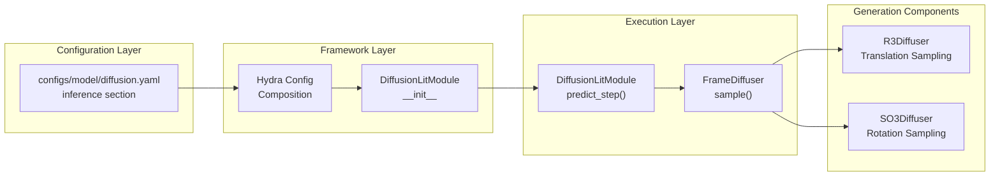
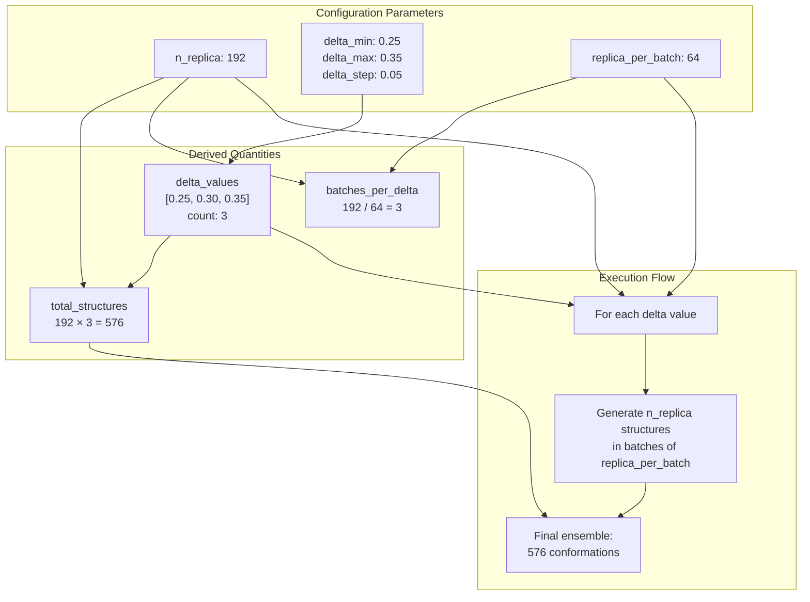
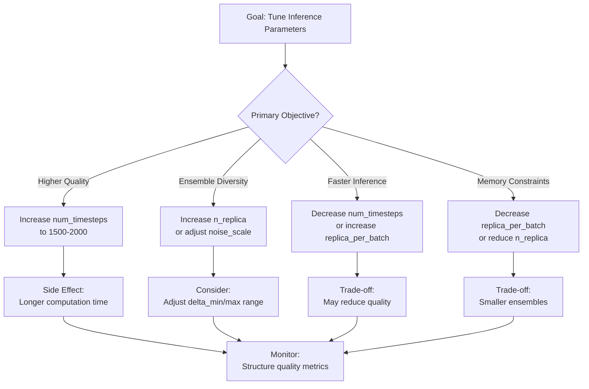
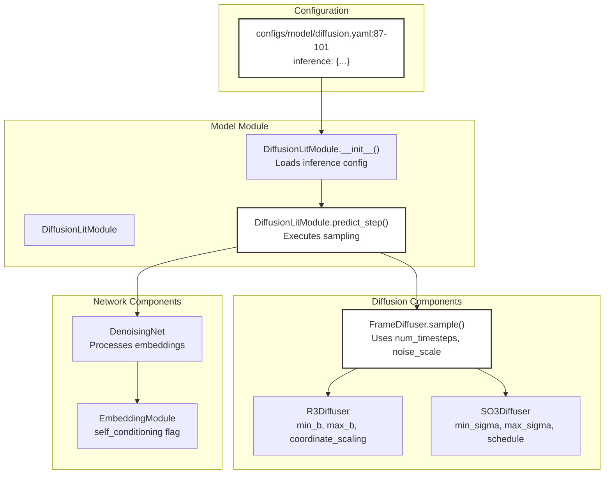

# Inference Parameters

> **Relevant source files**
> * [configs/model/diffusion.yaml](https://github.com/Junjie-Zhu/IDPFold/blob/ba40f40c/configs/model/diffusion.yaml)

## Purpose and Scope

This document provides a detailed technical reference for the inference parameters defined in the IDPFold diffusion model configuration. These parameters control the generation of conformational ensembles during model inference, affecting both the quality and diversity of predicted structures.

The parameters are configured in [configs/model/diffusion.yaml L87-L101](https://github.com/Junjie-Zhu/IDPFold/blob/ba40f40c/configs/model/diffusion.yaml#L87-L101)

 under the `inference` section. For information about the broader model configuration, see [Model Configuration Reference](/Junjie-Zhu/IDPFold/5.2-model-configuration-reference). For details on the self-conditioning technique specifically, see [Self-Conditioning](/Junjie-Zhu/IDPFold/7.4-self-conditioning). For practical usage of these parameters during inference execution, see [Running Inference](/Junjie-Zhu/IDPFold/3.3-running-inference).

---

## Inference Configuration Overview

The inference parameters are loaded by the `DiffusionLitModule` during evaluation mode to control the reverse diffusion sampling process. The configuration specifies how the model denoises protein structures from random conformations through a series of timesteps.

**Configuration Location**

The inference parameters are defined in [configs/model/diffusion.yaml L87-L101](https://github.com/Junjie-Zhu/IDPFold/blob/ba40f40c/configs/model/diffusion.yaml#L87-L101)

 as a nested dictionary under the `inference` key.


Title: Inference Configuration Flow



**Sources:** configs/model/diffusion.yaml:1, configs/model/diffusion.yaml:87-101

---

## Core Diffusion Parameters

### num_timesteps

**Type:** `int`
**Default:** `1000`
**Location:** configs/model/diffusion.yaml:94

The number of discrete denoising steps during reverse diffusion sampling. The model iteratively denoises structures from time `t=T` (pure noise) to `t=0` (predicted structure) through `num_timesteps` intermediate steps.

**Impact:**

* **Higher values** (e.g., 2000): More gradual denoising, potentially higher quality structures, longer inference time
* **Lower values** (e.g., 100): Faster inference, but may produce lower quality structures due to coarser denoising

The timestep schedule is typically uniform: `t_i = i / num_timesteps` for `i ∈ {0, 1, ..., num_timesteps}`.

### noise_scale

**Type:** `float`
**Default:** `1.0`
**Location:** configs/model/diffusion.yaml:95

A multiplicative scaling factor applied to the noise schedule during sampling. This parameter modulates the variance of the noise added at each timestep.

**Impact:**

* **noise_scale = 1.0**: Uses the trained noise schedule without modification
* **noise_scale > 1.0**: Increases noise variance, producing more diverse but potentially less accurate structures
* **noise_scale < 1.0**: Decreases noise variance, producing more conservative predictions closer to the mode

### min_t

**Type:** `float`
**Default:** `1e-2`
**Location:** configs/model/diffusion.yaml:98

The minimum time value used during the diffusion process, effectively truncating the denoising schedule. Instead of denoising all the way to `t=0`, the process stops at `t=min_t`.

**Rationale:** Stopping slightly before `t=0` can improve numerical stability and prevent artifacts that may occur at the final denoising steps where noise variance approaches zero.

**Sources:** configs/model/diffusion.yaml:94-98

---

## Ensemble Generation Parameters

### n_replica

**Type:** `int`
**Default:** `192`
**Location:** configs/model/diffusion.yaml:92

The number of independent structure replicas to generate for each `delta` value in the delta sweep. This parameter directly controls ensemble diversity.

**Total Ensemble Size:**

```
total_structures = n_replica × ((delta_max - delta_min) / delta_step + 1)
```

With default values:

```
total_structures = 192 × ((0.35 - 0.25) / 0.05 + 1) = 192 × 3 = 576 structures
```

**Computational Cost:** Each replica requires a full reverse diffusion process with `num_timesteps` steps, making `n_replica` the primary determinant of inference time.

### replica_per_batch

**Type:** `int`
**Default:** `64`
**Location:** configs/model/diffusion.yaml:93

The batch size used during parallel generation of replicas. Multiple replicas are generated simultaneously on GPU to improve computational efficiency.

**Memory/Speed Trade-off:**

* **Higher values** (e.g., 128): Faster inference due to better GPU utilization, but requires more GPU memory
* **Lower values** (e.g., 32): Lower memory footprint, suitable for smaller GPUs, but slower inference

The total number of batches required: `ceil(n_replica / replica_per_batch)`

### delta_min, delta_max, delta_step

**Type:** `float`
**Default:** `0.25`, `0.35`, `0.05`
**Location:** configs/model/diffusion.yaml:89-91

These parameters define a sweep over `delta` values, which appear to modulate some aspect of the sampling process (likely related to noise scheduling or sampling variance based on the parameter naming).

**Delta Sweep Range:**

```python
delta_values = [0.25, 0.30, 0.35]  # Generated from delta_min, delta_max, delta_step
```

For each delta value, `n_replica` structures are generated, allowing exploration of different sampling regimes.


Title: Ensemble Generation Parameter Relationships



**Sources:** [configs/model/diffusion.yaml L89-L93](https://github.com/Junjie-Zhu/IDPFold/blob/ba40f40c/configs/model/diffusion.yaml#L89-L93)

---

## Advanced Generation Options

### self_conditioning

**Type:** `bool`
**Default:** `true`
**Location:** [configs/model/diffusion.yaml L97](https://github.com/Junjie-Zhu/IDPFold/blob/ba40f40c/configs/model/diffusion.yaml#L97-L97)

Enables self-conditioning during inference, where the model's previous prediction is fed back as an additional input at each denoising step. This technique, also used during training, improves prediction consistency and quality.

**Mechanism:**

1. At timestep `t`, predict structure `x̂_0(t)`
2. At timestep `t-1`, condition the model on both the noisy structure and `x̂_0(t)`
3. This allows the model to refine predictions based on prior context

Self-conditioning is configured in the model's `EmbeddingModule` at [configs/model/diffusion.yaml L26](https://github.com/Junjie-Zhu/IDPFold/blob/ba40f40c/configs/model/diffusion.yaml#L26-L26)

 and must be enabled in both training and inference for consistency. See [Self-Conditioning](/Junjie-Zhu/IDPFold/7.4-self-conditioning) for detailed technical explanation.

### probability_flow

**Type:** `bool`
**Default:** `false`
**Location:** [configs/model/diffusion.yaml L96](https://github.com/Junjie-Zhu/IDPFold/blob/ba40f40c/configs/model/diffusion.yaml#L96-L96)

Determines whether to use the probability flow ODE formulation for sampling instead of the standard SDE (Stochastic Differential Equation) approach.

**SDE vs ODE Sampling:**

* **SDE (probability_flow=false)**: Standard stochastic sampling with random noise injection at each step. Produces diverse ensemble members.
* **ODE (probability_flow=true)**: Deterministic sampling along the probability flow trajectory. Produces single high-quality structures with no stochasticity.

For conformational ensemble generation of IDPs, the SDE approach (default) is preferred to capture structural heterogeneity.

### backward_only

**Type:** `bool`
**Default:** `true`
**Location:** [configs/model/diffusion.yaml L100](https://github.com/Junjie-Zhu/IDPFold/blob/ba40f40c/configs/model/diffusion.yaml#L100-L100)

A flag indicating whether to perform only the backward (denoising) diffusion process during sampling. When `true`, the system generates structures through reverse diffusion from noise to structure without a forward diffusion step.

This is the standard inference mode for generative models. The forward process (adding noise to structures) is only used during training.

**Sources:** [configs/model/diffusion.yaml L96-L100](https://github.com/Junjie-Zhu/IDPFold/blob/ba40f40c/configs/model/diffusion.yaml#L96-L100)

---

## Output Configuration

### output_dir

**Type:** `str`
**Default:** `${paths.output_dir}/samples`
**Location:** [configs/model/diffusion.yaml L99](https://github.com/Junjie-Zhu/IDPFold/blob/ba40f40c/configs/model/diffusion.yaml#L99-L99)

The directory path where generated conformational ensembles are saved. The path uses Hydra variable interpolation, referencing `${paths.output_dir}` defined in the environment configuration (see [Environment Configuration](/Junjie-Zhu/IDPFold/2.3-environment-configuration)).

**Output Structure:**

```
${paths.output_dir}/samples/
├── protein_001_ensemble.pdb
├── protein_002_ensemble.pdb
└── ...
```

Each output file contains all replicas for a given protein sequence, enabling downstream analysis of conformational heterogeneity.

**Sources:** [configs/model/diffusion.yaml L99](https://github.com/Junjie-Zhu/IDPFold/blob/ba40f40c/configs/model/diffusion.yaml#L99-L99)

---

## Parameter Reference Table

| Parameter | Type | Default | Purpose | Range/Constraints |
| --- | --- | --- | --- | --- |
| `num_timesteps` | int | 1000 | Number of denoising steps | Typically 100-2000 |
| `noise_scale` | float | 1.0 | Noise variance scaling factor | > 0, typically 0.5-2.0 |
| `min_t` | float | 1e-2 | Minimum time value | Small positive value, e.g., 1e-3 to 1e-1 |
| `n_replica` | int | 192 | Structures per delta value | Limited by GPU memory × batches |
| `replica_per_batch` | int | 64 | Batch size for generation | Limited by GPU memory |
| `delta_min` | float | 0.25 | Start of delta sweep | Application-specific |
| `delta_max` | float | 0.35 | End of delta sweep | > delta_min |
| `delta_step` | float | 0.05 | Delta increment | Must divide (delta_max - delta_min) |
| `self_conditioning` | bool | true | Enable self-conditioning | Must match training config |
| `probability_flow` | bool | false | Use ODE instead of SDE | false for ensemble generation |
| `backward_only` | bool | true | Reverse diffusion only | true for inference |
| `output_dir` | str | (config path) | Output directory | Valid filesystem path |

**Sources:** [configs/model/diffusion.yaml L87-L101](https://github.com/Junjie-Zhu/IDPFold/blob/ba40f40c/configs/model/diffusion.yaml#L87-L101)

---

## Parameter Tuning Guidelines


Title: Inference Parameter Tuning Decision Tree



### Quality vs Speed Trade-offs

**For Higher Quality Predictions:**

1. Increase `num_timesteps` to 1500-2000 for finer denoising
2. Keep `noise_scale = 1.0` unless exploration is needed
3. Ensure `self_conditioning = true` for consistent predictions

**For Faster Inference:**

1. Decrease `num_timesteps` to 500-750 (acceptable quality loss)
2. Increase `replica_per_batch` to maximize GPU parallelism
3. Reduce `n_replica` if full ensemble size is not required

**For Ensemble Diversity:**

1. Increase `n_replica` to generate more independent samples
2. Experiment with `noise_scale` values in range [0.8, 1.2]
3. Expand `delta_min`/`delta_max` range if delta modulates diversity

**Memory Management:**

* If out-of-memory errors occur, reduce `replica_per_batch`
* Consider generating ensembles sequentially with `replica_per_batch = 1`
* Monitor GPU utilization: aim for 70-90% for optimal efficiency

**Sources:** configs/model/diffusion.yaml:87-101

---

## Code Integration Points


Title: Code Entities Using Inference Parameters



The inference parameters are primarily consumed by:

1. **DiffusionLitModule** [configs/model/diffusion.yaml L1](https://github.com/Junjie-Zhu/IDPFold/blob/ba40f40c/configs/model/diffusion.yaml#L1-L1) : The top-level Lightning module that orchestrates inference
2. **FrameDiffuser** [configs/model/diffusion.yaml L43](https://github.com/Junjie-Zhu/IDPFold/blob/ba40f40c/configs/model/diffusion.yaml#L43-L43) : The diffusion process that uses `num_timesteps`, `noise_scale`, and `min_t`
3. **EmbeddingModule** [configs/model/diffusion.yaml L19](https://github.com/Junjie-Zhu/IDPFold/blob/ba40f40c/configs/model/diffusion.yaml#L19-L19) : Uses the `self_conditioning` flag to determine network architecture
4. **R3Diffuser** and **SO3Diffuser** [configs/model/diffusion.yaml L44-L55](https://github.com/Junjie-Zhu/IDPFold/blob/ba40f40c/configs/model/diffusion.yaml#L44-L55) : Translation and rotation diffusers that implement the noise schedules

**Sources:** [configs/model/diffusion.yaml L1](https://github.com/Junjie-Zhu/IDPFold/blob/ba40f40c/configs/model/diffusion.yaml#L1-L1)

 [configs/model/diffusion.yaml L43-L58](https://github.com/Junjie-Zhu/IDPFold/blob/ba40f40c/configs/model/diffusion.yaml#L43-L58)

 [configs/model/diffusion.yaml L19-L26](https://github.com/Junjie-Zhu/IDPFold/blob/ba40f40c/configs/model/diffusion.yaml#L19-L26)

---

## Relationship to Training Parameters

Several inference parameters must be consistent with training configuration:

| Parameter | Consistency Requirement |
| --- | --- |
| `self_conditioning` | Must match training value for model compatibility |
| `min_t` | Should match training `min_t` [configs/model/diffusion.yaml L58](https://github.com/Junjie-Zhu/IDPFold/blob/ba40f40c/configs/model/diffusion.yaml#L58-L58) |
| `num_timesteps` | Can differ from training, but similar values recommended |
| `noise_scale` | Independent; can be tuned for generation without retraining |

The diffuser parameters (`min_b`, `max_b`, `min_sigma`, `max_sigma`) are defined in [configs/model/diffusion.yaml L44-L55](https://github.com/Junjie-Zhu/IDPFold/blob/ba40f40c/configs/model/diffusion.yaml#L44-L55)

 and used by both training and inference. These define the noise schedule that the model was trained on and should not be modified during inference.

**Sources:** [configs/model/diffusion.yaml L26](https://github.com/Junjie-Zhu/IDPFold/blob/ba40f40c/configs/model/diffusion.yaml#L26-L26)

 [configs/model/diffusion.yaml L42-L58](https://github.com/Junjie-Zhu/IDPFold/blob/ba40f40c/configs/model/diffusion.yaml#L42-L58)

 [configs/model/diffusion.yaml L87-L101](https://github.com/Junjie-Zhu/IDPFold/blob/ba40f40c/configs/model/diffusion.yaml#L87-L101)