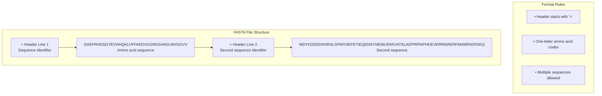
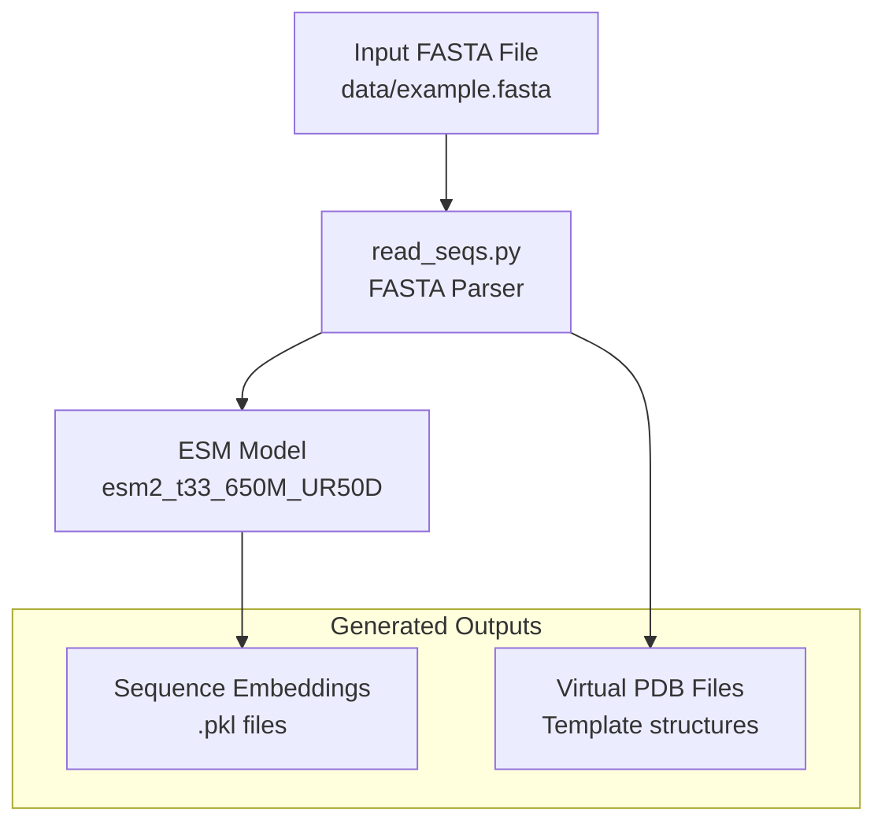
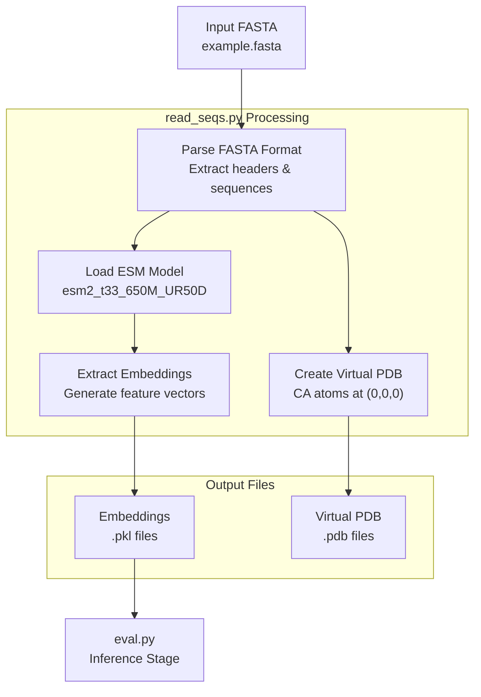

# Input FASTA Format

> **Relevant source files**
> * [README.md](https://github.com/Junjie-Zhu/IDPFold/blob/ba40f40c/README.md?plain=1)
> * [data/example.fasta](https://github.com/Junjie-Zhu/IDPFold/blob/ba40f40c/data/example.fasta)

## Purpose and Scope

This document specifies the expected FASTA file format for input protein sequences to IDPFold. FASTA files serve as the entry point for the preprocessing pipeline, where they are parsed and converted to ESM embeddings. For details about the preprocessing workflow, see [Preprocessing Sequences](/Junjie-Zhu/IDPFold/3.2-preprocessing-sequences). For information about the command-line interface to process FASTA files, see [preprocess_command](/Junjie-Zhu/IDPFold/6.1-preprocess_command). For details about the ESM embedding extraction process, see [ESM Embedding Extraction](/Junjie-Zhu/IDPFold/7.2-esm-embedding-extraction).

**Sources:** [README.md L49](https://github.com/Junjie-Zhu/IDPFold/blob/ba40f40c/README.md?plain=1#L49-L49)

 [data/example.fasta L1-L6](https://github.com/Junjie-Zhu/IDPFold/blob/ba40f40c/data/example.fasta#L1-L6)

---

## Format Specification

IDPFold accepts standard FASTA format files for protein sequence input. The format follows these requirements:

### Header Lines

* Each sequence begins with a header line starting with `>`
* The header may contain a sequence identifier or description
* Whitespace after `>` is optional but common

### Sequence Lines

* Sequence data follows the header line
* Contains single-letter amino acid codes (A, C, D, E, F, G, H, I, K, L, M, N, P, Q, R, S, T, V, W, Y)
* May span multiple lines or be on a single line
* No line length restrictions

### Multiple Sequences

* A single FASTA file may contain one or multiple sequences
* Each sequence is separated by its header line

**Sources:** [README.md L49](https://github.com/Junjie-Zhu/IDPFold/blob/ba40f40c/README.md?plain=1#L49-L49)

 [data/example.fasta L1-L6](https://github.com/Junjie-Zhu/IDPFold/blob/ba40f40c/data/example.fasta#L1-L6)

---

## Format Structure



**Sources:** [data/example.fasta L1-L6](https://github.com/Junjie-Zhu/IDPFold/blob/ba40f40c/data/example.fasta#L1-L6)

---

## Example Files

### Provided Example File

IDPFold includes an example FASTA file at `data/example.fasta` containing three Intrinsically Disordered Protein sequences:

| Sequence ID | Length | Description |
| --- | --- | --- |
| Abeta40 | 42 residues | Amyloid-beta peptide (1-40) |
| PaaA2 | 73 residues | Phenylacetic acid degradation protein |
| p15PAF | 113 residues | p15 protein associated factor |

### File Content

The example file demonstrates the expected format:

```
> Abeta40
DAEFRHDSGYEVHHQKLVFFAEDVGSNKGAIIGLMVGGVV
> PaaA2
MDYKDDDDKNRALSPMVSEFETIEQENSYNEWLRAKVATSLADPRPAIPHDEVERRMAERFAKMRKERSKQ
> p15PAF
VRTKADSVPGTYRKVVAARAPRKVLGSSTSATNSTSVSSRKAENKYAGGNPVCVRPTPKWQKGIGEFFRLSPKDSEKENQIPEEAGSSGLGKAKRKACPLQPDHTNDEKE
```

**Sources:** [data/example.fasta L1-L6](https://github.com/Junjie-Zhu/IDPFold/blob/ba40f40c/data/example.fasta#L1-L6)

 [README.md L49](https://github.com/Junjie-Zhu/IDPFold/blob/ba40f40c/README.md?plain=1#L49-L49)

---

## File Location and Usage

### Input File Location

FASTA files can be located anywhere in the filesystem. The preprocessing script accepts the file path as a command-line argument:

```
python src/read_seqs.py pred_dir='./data/example.fasta'
```

The `pred_dir` parameter specifies the path to the input FASTA file.

### Processing Pipeline



**Sources:** [README.md L54-L55](https://github.com/Junjie-Zhu/IDPFold/blob/ba40f40c/README.md?plain=1#L54-L55)

 [README.md L49](https://github.com/Junjie-Zhu/IDPFold/blob/ba40f40c/README.md?plain=1#L49-L49)

---

## Sequence Requirements

### Supported Amino Acids

IDPFold processes standard amino acid sequences using the following one-letter codes:

| Amino Acid | Code | Amino Acid | Code | Amino Acid | Code |
| --- | --- | --- | --- | --- | --- |
| Alanine | A | Leucine | L | Arginine | R |
| Cysteine | C | Methionine | M | Serine | S |
| Aspartic acid | D | Asparagine | N | Threonine | T |
| Glutamic acid | E | Proline | P | Valine | V |
| Phenylalanine | F | Glutamine | Q | Tryptophan | W |
| Glycine | G | Histidine | H | Tyrosine | Y |
| Isoleucine | I | Lysine | K |  |  |

### Length Considerations

* No explicit minimum or maximum sequence length restrictions are enforced at the FASTA parsing stage
* The example sequences range from 42 to 113 residues
* Very long sequences may impact computational performance during embedding extraction and inference

**Sources:** [data/example.fasta L1-L6](https://github.com/Junjie-Zhu/IDPFold/blob/ba40f40c/data/example.fasta#L1-L6)

---

## Integration with Preprocessing

### read_seqs.py Processing

The preprocessing script `read_seqs.py` performs the following operations on FASTA input:

1. **Parse FASTA file** - Extracts sequence identifiers and amino acid sequences
2. **Load ESM model** - Initializes the `esm2_t33_650M_UR50D` model
3. **Extract embeddings** - Generates high-dimensional feature vectors for each sequence
4. **Create virtual PDB files** - Generates placeholder structure files with CA atoms at origin coordinates
5. **Save outputs** - Writes embeddings as `.pkl` files and virtual structures as `.pdb` files



**Sources:** [README.md L54-L58](https://github.com/Junjie-Zhu/IDPFold/blob/ba40f40c/README.md?plain=1#L54-L58)

---

## Example Usage

### Single Sequence File

```
> MyProtein
MKLLSKQQQSPPPQPLEKASVVSKKPKKKSVDTSSSSSGHSKESAKEPAATASS
```

### Multiple Sequences File

```
> Protein1
MKLLSKQQQSPPPQPLEKASVVSKKPKKKSVDTSSSSSGHSKESAKEPAATASS
> Protein2
GSTSQGPSAGSTQSQGPSAKPASGSASQGPSASQGQSASGTGQSASAKPGQAAQ
> Protein3
AEARKAKEETEAKKAAEAKEREAKAAKEKEAKAAKEEKAKEAKAAKEKDAKAEK
```

### Command-Line Execution

```markdown
# Process example filepython src/read_seqs.py pred_dir='./data/example.fasta' # Process custom filepython src/read_seqs.py pred_dir='/path/to/my_sequences.fasta'
```

**Sources:** [README.md L54-L55](https://github.com/Junjie-Zhu/IDPFold/blob/ba40f40c/README.md?plain=1#L54-L55)

 [data/example.fasta L1-L6](https://github.com/Junjie-Zhu/IDPFold/blob/ba40f40c/data/example.fasta#L1-L6)

---

## Common Issues and Considerations

### Header Format Variations

While the standard format uses `>` followed by an identifier, variations in spacing and special characters in headers are generally tolerated:

* `> Abeta40` (with space)
* `>Abeta40` (without space)
* `>sp|P12345|PROTEIN_NAME` (UniProt style)

All these formats should be processed correctly by the FASTA parser.

### Line Breaks in Sequences

Sequences may be formatted with line breaks for readability. The parser concatenates all lines between headers:

```
> LongProtein
MKLLSKQQQSPPPQPLEKASVVSKKPKKKSVDTSSSSSGHSKESAKEPAATASS
GSTSQGPSAGSTQSQGPSAKPASGSASQGPSASQGQSASGTGQSASAKPGQAAQ
AEARKAKEETEAKKAAEAKEREAKAAKEKEAKAAKEEKAKEAKAAKEKDAKAEK
```

This is equivalent to:

```
> LongProtein
MKLLSKQQQSPPPQPLEKASVVSKKPKKKSVDTSSSSSGHSKESAKEPAATASSGSTSQGPSAGSTQSQGPSAKPASGSASQGPSASQGQSASGTGQSASAKPGQAAQAEARKAKEETEAKKAAEAKEREAKAAKEKEAKAAKEEKAKEAKAAKEKDAKAEK
```

**Sources:** [data/example.fasta L1-L6](https://github.com/Junjie-Zhu/IDPFold/blob/ba40f40c/data/example.fasta#L1-L6)

---

## Related Files

| File Path | Purpose |
| --- | --- |
| `data/example.fasta` | Example input file with 3 IDP sequences |
| `src/read_seqs.py` | Preprocessing script that parses FASTA files |

**Sources:** [README.md L49](https://github.com/Junjie-Zhu/IDPFold/blob/ba40f40c/README.md?plain=1#L49-L49)

 [README.md L54](https://github.com/Junjie-Zhu/IDPFold/blob/ba40f40c/README.md?plain=1#L54-L54)

 [data/example.fasta L1-L6](https://github.com/Junjie-Zhu/IDPFold/blob/ba40f40c/data/example.fasta#L1-L6)