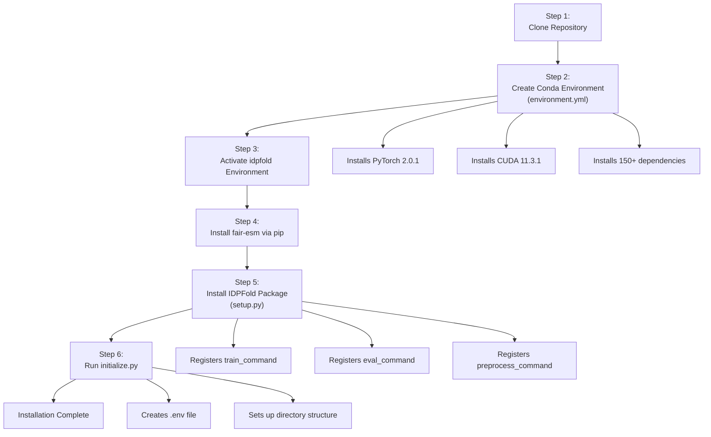
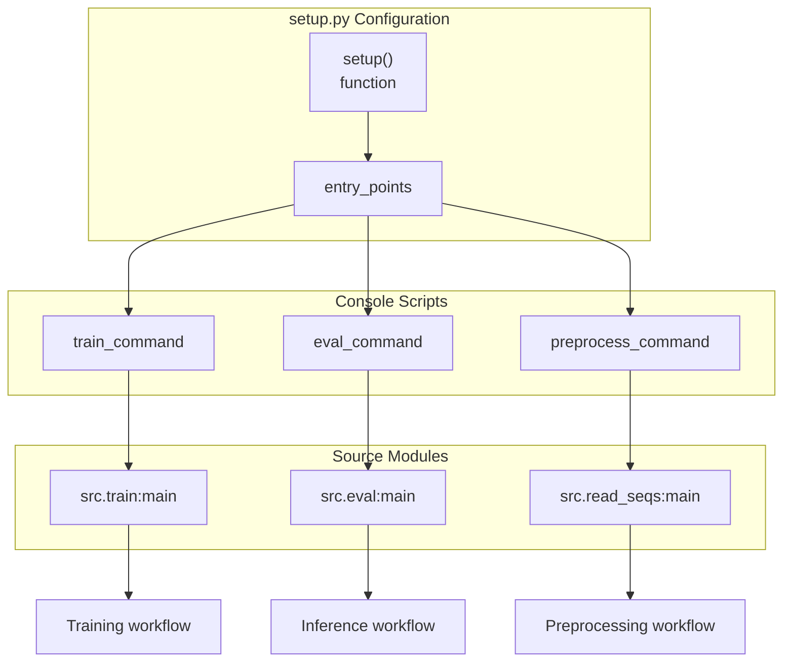
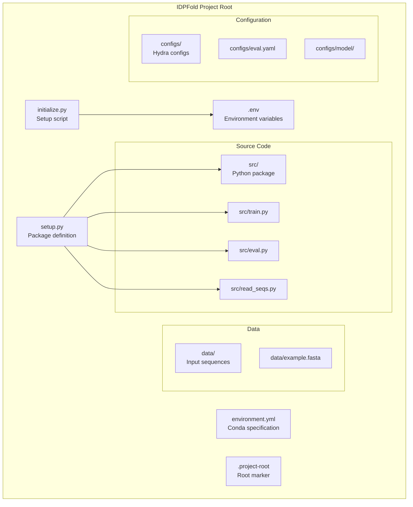
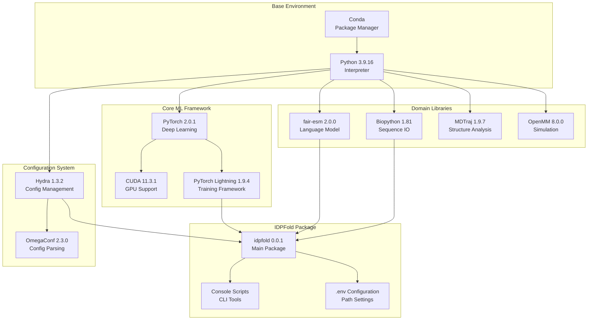

# Installation Steps

> **Relevant source files**
> * [.project-root](https://github.com/Junjie-Zhu/IDPFold/blob/ba40f40c/.project-root)
> * [README.md](https://github.com/Junjie-Zhu/IDPFold/blob/ba40f40c/README.md?plain=1)
> * [data/example.fasta](https://github.com/Junjie-Zhu/IDPFold/blob/ba40f40c/data/example.fasta)
> * [environment.yml](https://github.com/Junjie-Zhu/IDPFold/blob/ba40f40c/environment.yml)
> * [setup.py](https://github.com/Junjie-Zhu/IDPFold/blob/ba40f40c/setup.py)

This page provides detailed step-by-step instructions for installing IDPFold on your system. The installation process involves creating a conda environment, installing dependencies, and setting up the package with its command-line interface. For information about system requirements and dependencies, see [Prerequisites and Dependencies](/Junjie-Zhu/IDPFold/2.1-prerequisites-and-dependencies). For configuration after installation, see [Environment Configuration](/Junjie-Zhu/IDPFold/2.3-environment-configuration).

## Overview of Installation Process

The IDPFold installation follows a sequential workflow that establishes the Python environment, installs dependencies, and registers command-line tools.



**Sources:** [README.md L22-L43](https://github.com/Junjie-Zhu/IDPFold/blob/ba40f40c/README.md?plain=1#L22-L43)

 [setup.py L1-L22](https://github.com/Junjie-Zhu/IDPFold/blob/ba40f40c/setup.py#L1-L22)

 [environment.yml L1-L287](https://github.com/Junjie-Zhu/IDPFold/blob/ba40f40c/environment.yml#L1-L287)

## Step 1: Clone the Repository

Clone the IDPFold repository from GitHub to your local machine:

```
git clone https://github.com/Junjie-Zhu/IDPFold.gitcd IDPFold
```

This creates a local copy of the repository and changes into the project directory. The repository contains all source code, configuration files, and the installation specifications.

**Sources:** [README.md L24-L26](https://github.com/Junjie-Zhu/IDPFold/blob/ba40f40c/README.md?plain=1#L24-L26)

## Step 2: Create Conda Environment

Create a new conda environment using the provided `environment.yml` file:

```sql
conda env create -f environment.yml
```

This command reads [environment.yml L1-L287](https://github.com/Junjie-Zhu/IDPFold/blob/ba40f40c/environment.yml#L1-L287)

 and installs all specified dependencies. The environment is named `idpfold` as defined in [environment.yml L1](https://github.com/Junjie-Zhu/IDPFold/blob/ba40f40c/environment.yml#L1-L1)

### Environment Specification

The `environment.yml` file configures the following key components:

| Component | Version | Purpose |
| --- | --- | --- |
| Python | 3.9.16 | Base interpreter |
| PyTorch | 2.0.1 (via pip) | Deep learning framework |
| PyTorch Lightning | 1.9.4 (via pip) | Training orchestration |
| CUDA Toolkit | 11.3.1 | GPU acceleration |
| Hydra | 1.3.2 (via pip) | Configuration management |
| Biopython | 1.81 | Sequence handling |
| MDTraj | 1.9.7 | Trajectory analysis |
| OpenMM | 8.0.0 | Molecular simulation |

The environment includes approximately 100 conda packages and 130 pip packages, totaling over 230 dependencies.

**Sources:** [environment.yml L1-L287](https://github.com/Junjie-Zhu/IDPFold/blob/ba40f40c/environment.yml#L1-L287)

## Step 3: Activate the Environment

Activate the newly created conda environment:

```
conda activate idpfold
```

This switches your shell to use the `idpfold` environment, making all installed packages available. All subsequent installation commands must be run within this activated environment.

**Sources:** [README.md L30](https://github.com/Junjie-Zhu/IDPFold/blob/ba40f40c/README.md?plain=1#L30-L30)

## Step 4: Install fair-esm

Install the ESM (Evolutionary Scale Modeling) package for protein sequence embeddings:

```
pip install fair-esm
```

The `fair-esm` package provides the `esm2_t33_650M_UR50D` language model used for extracting sequence embeddings during preprocessing. This package is installed separately via pip because it is not available through conda channels.

**Sources:** [README.md L32-L33](https://github.com/Junjie-Zhu/IDPFold/blob/ba40f40c/README.md?plain=1#L32-L33)

 [environment.yml L192](https://github.com/Junjie-Zhu/IDPFold/blob/ba40f40c/environment.yml#L192-L192)

## Step 5: Install IDPFold Package

Install IDPFold as an editable package:

```
pip install -e .
```

This command executes [setup.py L1-L22](https://github.com/Junjie-Zhu/IDPFold/blob/ba40f40c/setup.py#L1-L22)

 in editable mode, which:

1. Installs the `idpfold` package (version 0.0.1)
2. Registers three console scripts as command-line entry points
3. Makes the `src` package and its modules importable

### Console Scripts Registration

The `setup.py` file defines three console scripts that become available system-wide after installation:



**Entry Points Mapping:**

| Console Script | Python Module | Purpose |
| --- | --- | --- |
| `train_command` | `src.train:main` | Execute model training |
| `eval_command` | `src.eval:main` | Run inference and evaluation |
| `preprocess_command` | `src.read_seqs:main` | Extract sequence embeddings |

**Sources:** [setup.py L5-L22](https://github.com/Junjie-Zhu/IDPFold/blob/ba40f40c/setup.py#L5-L22)

 [README.md L36](https://github.com/Junjie-Zhu/IDPFold/blob/ba40f40c/README.md?plain=1#L36-L36)

## Step 6: Initialize Environment Configuration

Run the initialization script to create the `.env` configuration file:

```
python initialize.py
```

The `initialize.py` script performs environment setup tasks including:

* Creating a `.env` file with default path configurations
* Setting up directory structures for datasets and embeddings
* Configuring environment variables for the project

This step is essential for IDPFold to locate data files and know where to store outputs. The `.env` file contains paths that are read by preprocessing and inference scripts.

**Sources:** [README.md L39-L43](https://github.com/Junjie-Zhu/IDPFold/blob/ba40f40c/README.md?plain=1#L39-L43)

## Installation Directory Structure

After successful installation, the IDPFold directory contains the following structure:



**Sources:** [setup.py L1-L22](https://github.com/Junjie-Zhu/IDPFold/blob/ba40f40c/setup.py#L1-L22)

 [README.md L22-L43](https://github.com/Junjie-Zhu/IDPFold/blob/ba40f40c/README.md?plain=1#L22-L43)

 [.project-root L1-L2](https://github.com/Junjie-Zhu/IDPFold/blob/ba40f40c/.project-root#L1-L2)

 [data/example.fasta L1-L6](https://github.com/Junjie-Zhu/IDPFold/blob/ba40f40c/data/example.fasta#L1-L6)

## Verification

After completing all installation steps, verify the installation by checking that the console scripts are available:

```javascript
# Check if commands are registeredwhich train_commandwhich eval_commandwhich preprocess_command # Verify Python can import the packagepython -c "import idpfold; print('IDPFold package imported successfully')"
```

You can also test the preprocessing command with the provided example data:

```
preprocess_command pred_dir='./data/example.fasta'
```

This should execute without errors and generate embedding files and virtual PDB files in the configured output directories.

**Sources:** [setup.py L15-L21](https://github.com/Junjie-Zhu/IDPFold/blob/ba40f40c/setup.py#L15-L21)

 [data/example.fasta L1-L6](https://github.com/Junjie-Zhu/IDPFold/blob/ba40f40c/data/example.fasta#L1-L6)

## Installation Dependency Chain

The following diagram illustrates the dependency relationships between installation components:



**Sources:** [environment.yml L1-L287](https://github.com/Junjie-Zhu/IDPFold/blob/ba40f40c/environment.yml#L1-L287)

 [setup.py L1-L22](https://github.com/Junjie-Zhu/IDPFold/blob/ba40f40c/setup.py#L1-L22)

## Common Issues and Notes

### CUDA Compatibility

The `environment.yml` specifies CUDA Toolkit 11.3.1. Ensure your GPU drivers are compatible with this CUDA version. For GPU support details, see [Prerequisites and Dependencies](/Junjie-Zhu/IDPFold/2.1-prerequisites-and-dependencies).

### Editable Installation

The `-e` flag in `pip install -e .` installs the package in editable/development mode. This means:

* Changes to source code in `src/` are immediately reflected without reinstalling
* The package links to the source directory rather than copying files
* Useful for development and debugging

### Environment Isolation

The conda environment isolates IDPFold dependencies from other Python projects on your system. Always activate the `idpfold` environment before running IDPFold commands:

```
conda activate idpfold
```

### Missing Dependencies

If certain optional dependencies (like `deepspeed`) cause installation issues, they can typically be safely ignored for basic inference workflows. The core functionality requires only PyTorch, Lightning, Hydra, and fair-esm.

**Sources:** [environment.yml L183](https://github.com/Junjie-Zhu/IDPFold/blob/ba40f40c/environment.yml#L183-L183)

 [setup.py L12](https://github.com/Junjie-Zhu/IDPFold/blob/ba40f40c/setup.py#L12-L12)