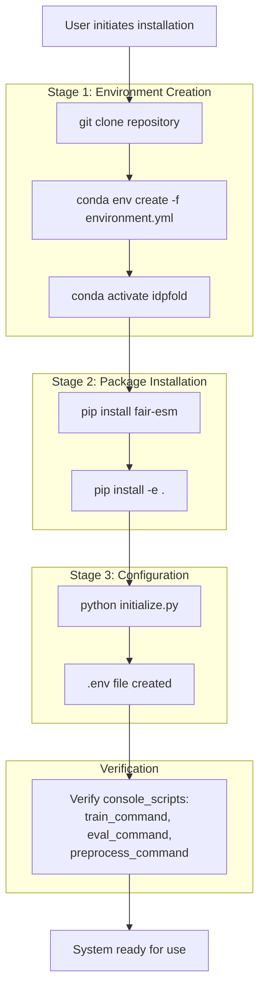
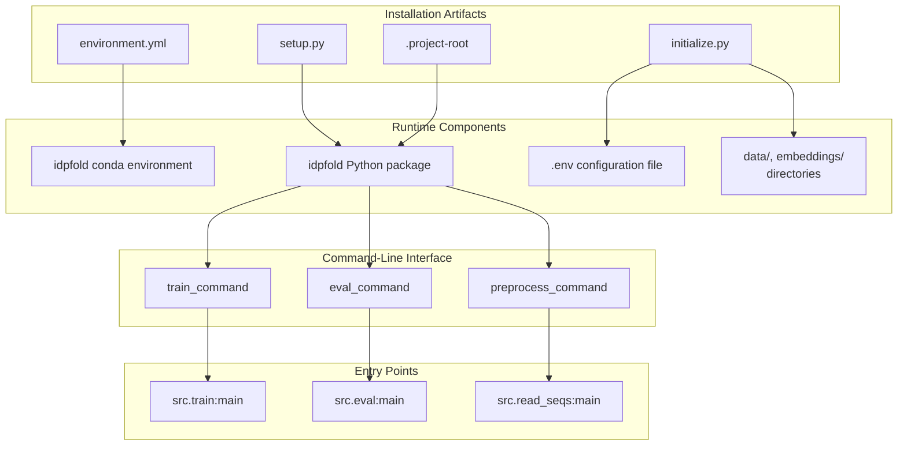
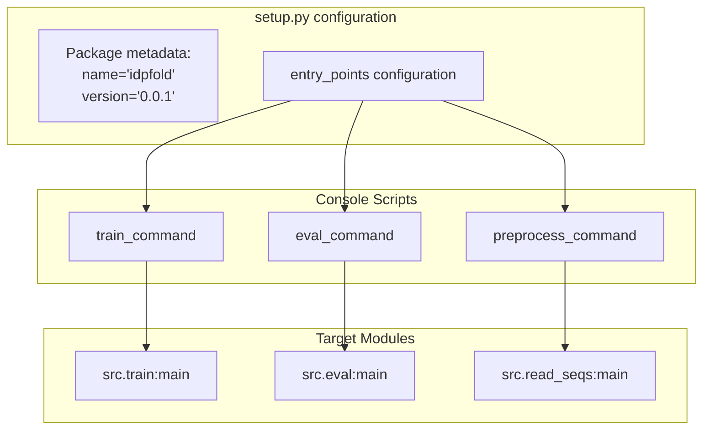
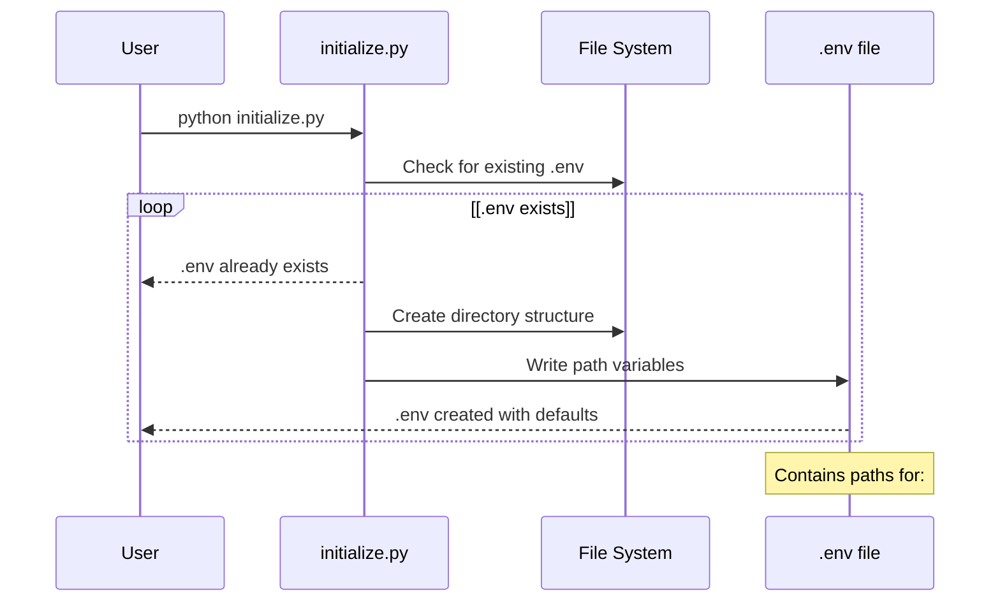

# Installation and Setup

> **Relevant source files**
> * [.project-root](https://github.com/Junjie-Zhu/IDPFold/blob/ba40f40c/.project-root)
> * [README.md](https://github.com/Junjie-Zhu/IDPFold/blob/ba40f40c/README.md?plain=1)
> * [data/example.fasta](https://github.com/Junjie-Zhu/IDPFold/blob/ba40f40c/data/example.fasta)
> * [environment.yml](https://github.com/Junjie-Zhu/IDPFold/blob/ba40f40c/environment.yml)
> * [setup.py](https://github.com/Junjie-Zhu/IDPFold/blob/ba40f40c/setup.py)

**Purpose and Scope**: This document provides step-by-step instructions for installing the IDPFold system and preparing the runtime environment. It covers dependency installation, package setup, and initial configuration required before preprocessing sequences or running inference. This page focuses on the mechanical installation process; for detailed dependency specifications, see [Prerequisites and Dependencies](/Junjie-Zhu/IDPFold/2.1-prerequisites-and-dependencies); for installation procedures, see [Installation Steps](/Junjie-Zhu/IDPFold/2.2-installation-steps); for environment variable configuration, see [Environment Configuration](/Junjie-Zhu/IDPFold/2.3-environment-configuration).

## Overview of Installation Process

The IDPFold installation follows a three-stage sequential workflow: environment creation, package installation, and configuration. Each stage produces artifacts that enable the next stage, creating a robust setup process that can be resumed from any checkpoint.

### Installation Workflow Diagram



Sources: [README.md L22-L43](https://github.com/Junjie-Zhu/IDPFold/blob/ba40f40c/README.md?plain=1#L22-L43)

 [setup.py L5-L22](https://github.com/Junjie-Zhu/IDPFold/blob/ba40f40c/setup.py#L5-L22)

## System Components and Dependencies

The IDPFold installation configures multiple interdependent components. The following diagram maps installation artifacts to their corresponding system components:

### Component Installation Mapping



Sources: [environment.yml L1-L287](https://github.com/Junjie-Zhu/IDPFold/blob/ba40f40c/environment.yml#L1-L287)

 [setup.py L15-L21](https://github.com/Junjie-Zhu/IDPFold/blob/ba40f40c/setup.py#L15-L21)

 [.project-root L1-L2](https://github.com/Junjie-Zhu/IDPFold/blob/ba40f40c/.project-root#L1-L2)

## Installation Steps Summary

The installation process consists of five commands executed sequentially:

| Step | Command | Purpose | Output Artifact |
| --- | --- | --- | --- |
| 1 | `git clone https://github.com/Junjie-Zhu/IDPFold.git` | Clone repository | Local `IDPFold/` directory |
| 2 | `conda env create -f environment.yml` | Create conda environment | `idpfold` conda environment |
| 3 | `conda activate idpfold` | Activate environment | Shell environment variables |
| 4 | `pip install fair-esm` | Install ESM model library | `fair-esm` package in environment |
| 5 | `pip install -e .` | Install IDPFold as editable package | `idpfold` package + console scripts |
| 6 | `python initialize.py` | Generate configuration | `.env` file with path variables |

Sources: [README.md L24-L43](https://github.com/Junjie-Zhu/IDPFold/blob/ba40f40c/README.md?plain=1#L24-L43)

## Package Structure and Entry Points

The `setup.py` file defines the package metadata and three console script entry points that become available after installation:

### Console Scripts Configuration



The `setup()` function in [setup.py L5-L22](https://github.com/Junjie-Zhu/IDPFold/blob/ba40f40c/setup.py#L5-L22)

 registers these console scripts, making them executable from any directory after package installation. The `-e` flag in `pip install -e .` installs the package in editable mode, allowing code modifications without reinstallation.

Sources: [setup.py L5-L22](https://github.com/Junjie-Zhu/IDPFold/blob/ba40f40c/setup.py#L5-L22)

## Configuration Initialization

After package installation, the `initialize.py` script creates the `.env` file containing path configurations. This file is required by preprocessing and evaluation scripts to locate data directories and embedding storage locations.

### Environment Configuration Flow



Sources: [README.md L39-L43](https://github.com/Junjie-Zhu/IDPFold/blob/ba40f40c/README.md?plain=1#L39-L43)

## Dependency Categories

The IDPFold installation includes dependencies across multiple functional categories:

| Category | Key Packages | Purpose |
| --- | --- | --- |
| **Deep Learning Framework** | `pytorch`, `pytorch-lightning`, `lightning` | Core training and inference infrastructure |
| **Configuration Management** | `hydra-core`, `omegaconf`, `python-dotenv` | YAML-based config composition and environment variables |
| **Protein Processing** | `fair-esm`, `biopython`, `mdtraj`, `openmm` | Sequence embeddings and structure manipulation |
| **Scientific Computing** | `numpy`, `scipy`, `pandas`, `scikit-learn` | Numerical operations and data handling |
| **GPU Acceleration** | `cudatoolkit=11.3.1` | CUDA support for GPU computations |
| **Experiment Tracking** | `wandb`, `tensorboard` (via lightning) | Training metrics and visualization |
| **Optimization** | `optuna`, `deepspeed` | Hyperparameter tuning and large model training |

Sources: [environment.yml L1-L287](https://github.com/Junjie-Zhu/IDPFold/blob/ba40f40c/environment.yml#L1-L287)

## Installation Validation

After completing the installation steps, verify the setup by checking the availability of console scripts and the presence of configuration files:

```markdown
# Verify console scripts are registeredwhich train_commandwhich eval_commandwhich preprocess_command # Verify .env file existsls -la .env # Verify project root marker existsls -la .project-root
```

The `.project-root` file at [.project-root L1-L2](https://github.com/Junjie-Zhu/IDPFold/blob/ba40f40c/.project-root#L1-L2)

 is required for inferring the project root directory and should not be deleted. This file enables path resolution utilities to correctly locate project resources regardless of the current working directory.

Sources: [.project-root L1-L2](https://github.com/Junjie-Zhu/IDPFold/blob/ba40f40c/.project-root#L1-L2)

 [setup.py L15-L21](https://github.com/Junjie-Zhu/IDPFold/blob/ba40f40c/setup.py#L15-L21)

## Conda Environment Specification

The `environment.yml` file defines the `idpfold` conda environment with dependencies sourced from multiple channels: `pytorch`, `pyg`, `anaconda`, `conda-forge`, and `defaults`. The environment is configured with:

* **Python Version**: 3.9.16
* **CUDA Toolkit**: 11.3.1
* **PyTorch**: 2.0.1 (installed via pip)
* **PyTorch Lightning**: 1.9.4 (installed via pip)
* **Total Conda Dependencies**: ~160 packages
* **Total Pip Dependencies**: ~127 packages

The environment creation command `conda env create -f environment.yml` resolves all dependency constraints and creates a reproducible environment named `idpfold`.

Sources: [environment.yml L1-L287](https://github.com/Junjie-Zhu/IDPFold/blob/ba40f40c/environment.yml#L1-L287)

## Example Data Verification

The repository includes example data for testing the installation. After setup, the example FASTA file should be accessible:

```markdown
# Verify example data existscat data/example.fasta
```

The example file at [data/example.fasta L1-L6](https://github.com/Junjie-Zhu/IDPFold/blob/ba40f40c/data/example.fasta#L1-L6)

 contains three IDP sequences: Abeta40, PaaA2, and p15PAF, which can be used to test the preprocessing and inference pipeline after installation.

Sources: [data/example.fasta L1-L6](https://github.com/Junjie-Zhu/IDPFold/blob/ba40f40c/data/example.fasta#L1-L6)

 [README.md L49](https://github.com/Junjie-Zhu/IDPFold/blob/ba40f40c/README.md?plain=1#L49-L49)

## Post-Installation Directory Structure

After successful installation and initialization, the IDPFold directory structure includes:

```markdown
IDPFold/
├── .env                    # Created by initialize.py
├── .project-root           # Project root marker
├── environment.yml         # Conda environment specification
├── setup.py               # Package installation configuration
├── initialize.py          # Configuration initialization script
├── data/
│   └── example.fasta      # Example sequences
├── src/                   # Source code directory
│   ├── train.py          # Training entry point
│   ├── eval.py           # Evaluation entry point
│   └── read_seqs.py      # Preprocessing entry point
└── configs/              # Hydra configuration files
```

The installation process does not modify the source tree except for creating the `.env` file and any directories specified during initialization.

Sources: [README.md L22-L43](https://github.com/Junjie-Zhu/IDPFold/blob/ba40f40c/README.md?plain=1#L22-L43)

 [setup.py L5-L22](https://github.com/Junjie-Zhu/IDPFold/blob/ba40f40c/setup.py#L5-L22)