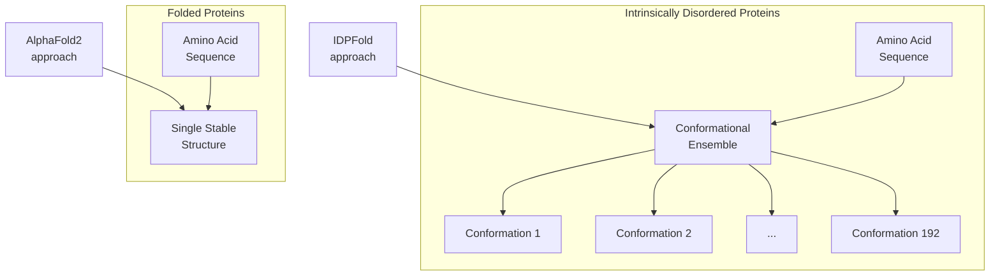
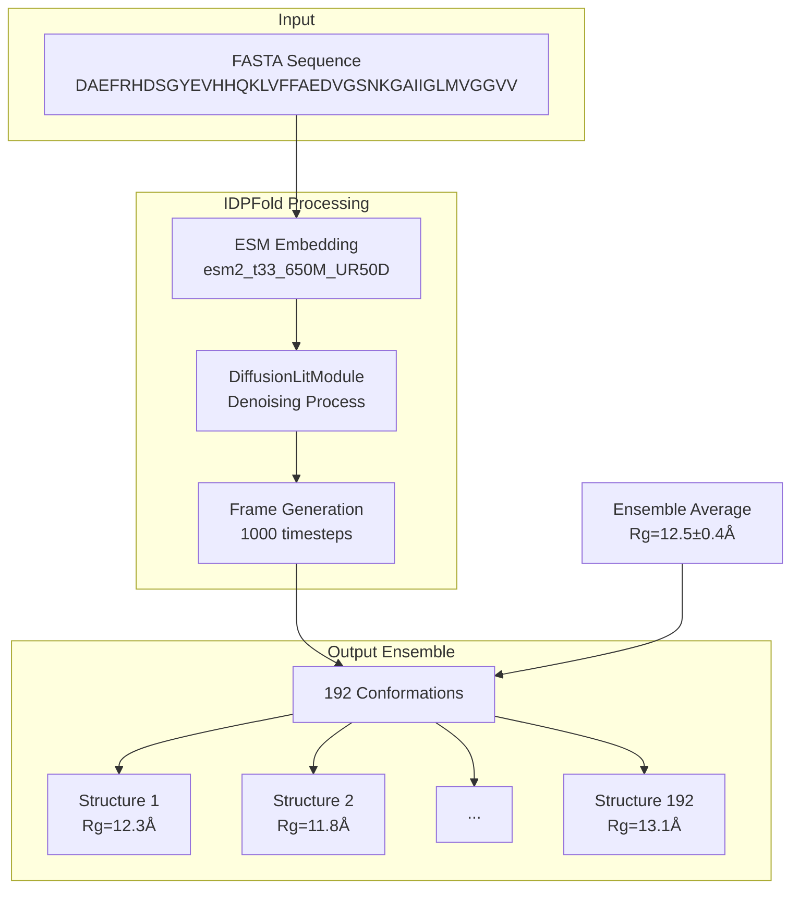
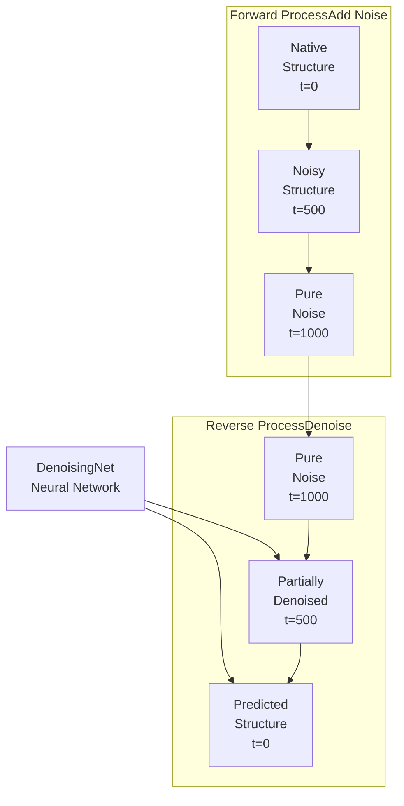
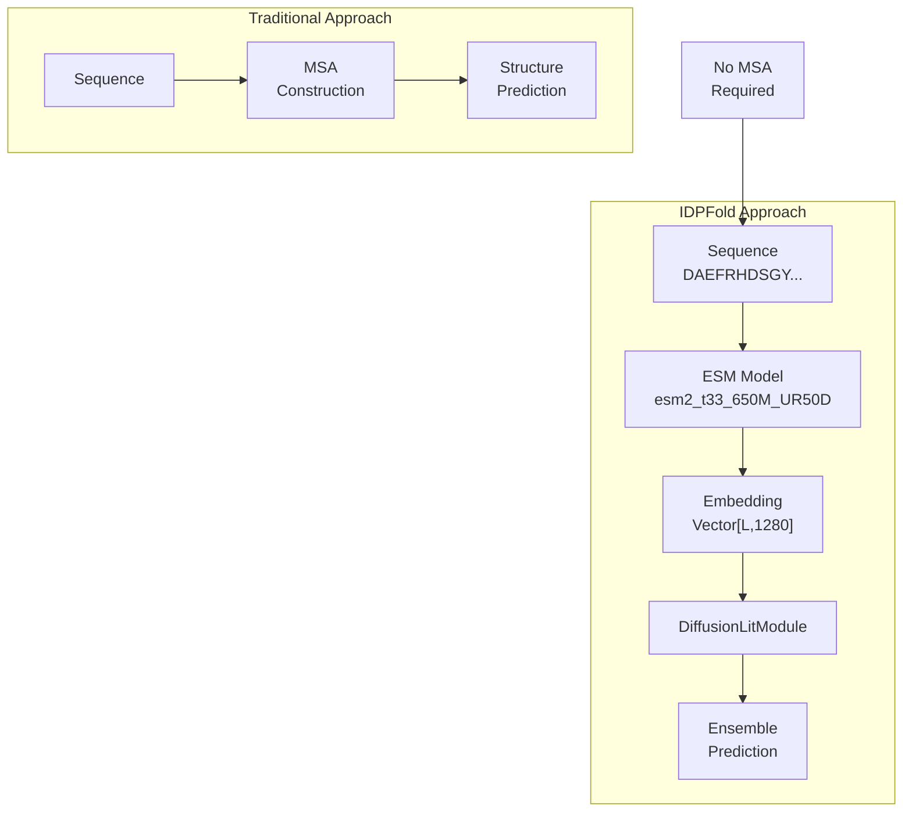
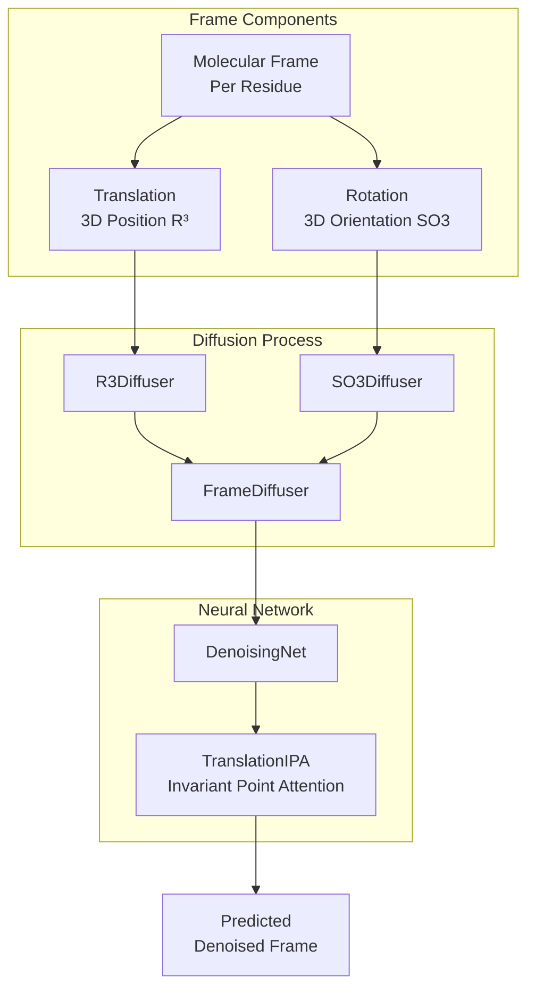
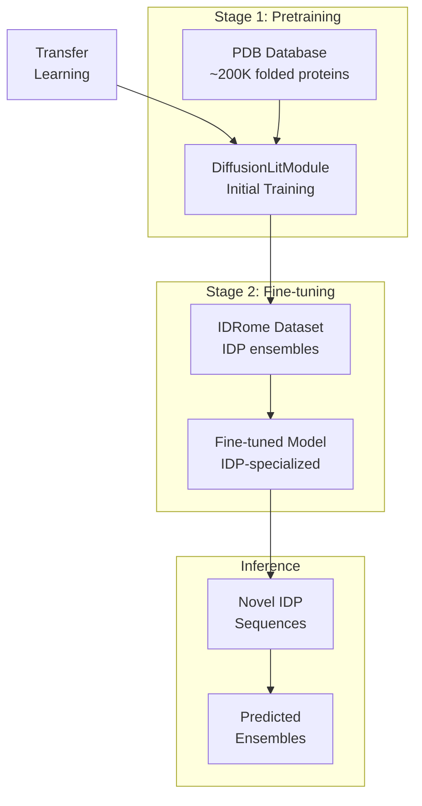
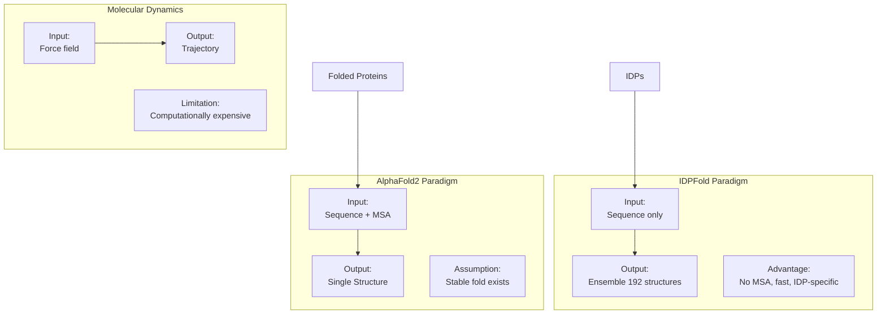

# Key Concepts

> **Relevant source files**
> * [README.md](https://github.com/Junjie-Zhu/IDPFold/blob/ba40f40c/README.md?plain=1)
> * [data/example.fasta](https://github.com/Junjie-Zhu/IDPFold/blob/ba40f40c/data/example.fasta)

## Purpose and Scope

This page defines the fundamental scientific and technical concepts required to understand IDPFold. It explains what Intrinsically Disordered Proteins are, why conformational ensembles matter, how diffusion models work for structure prediction, and how these concepts map to components in the codebase. For system architecture and component interactions, see [System Architecture](/Junjie-Zhu/IDPFold/1.2-system-architecture). For practical usage instructions, see [User Guide](/Junjie-Zhu/IDPFold/3-user-guide).

---

## Intrinsically Disordered Proteins (IDPs)

**Intrinsically Disordered Proteins (IDPs)** are proteins that lack a fixed three-dimensional structure under physiological conditions. Unlike folded proteins (e.g., enzymes, antibodies) that adopt stable conformations, IDPs exist as dynamic ensembles of interconverting structures.

### Characteristics of IDPs

| Property | Folded Proteins | Intrinsically Disordered Proteins |
| --- | --- | --- |
| **Structure** | Single stable 3D conformation | Multiple interconverting conformations |
| **Energy Landscape** | Deep funnel with global minimum | Flat, rugged landscape |
| **Sequence Composition** | Balanced amino acids | Enriched in charged/polar residues, depleted in hydrophobic residues |
| **Prediction Challenge** | Single structure prediction | Ensemble distribution prediction |

### IDPs in IDPFold

IDPFold targets IDPs specifically because conventional structure prediction methods (e.g., AlphaFold2) are designed for folded proteins and assume a single stable structure exists. IDPFold instead predicts **conformational ensembles** that capture the structural heterogeneity of IDPs.

**Sources:** [README.md L10-L16](https://github.com/Junjie-Zhu/IDPFold/blob/ba40f40c/README.md?plain=1#L10-L16)

---

## Conformational Ensembles

A **conformational ensemble** is a collection of structural snapshots representing the different conformations an IDP can adopt. In IDPFold, an ensemble consists of multiple 3D structures (replicas) generated for a single protein sequence.

### Ensemble Properties

IDPFold predictions are evaluated based on how well the generated ensemble matches experimental observables:

* **Radius of Gyration (Rg)**: Measure of structural compactness
* **End-to-End Distance**: Distance between N- and C-termini
* **Secondary Structure Content**: α-helix, β-sheet, coil populations
* **SAXS/SANS Profiles**: Small-angle scattering patterns
* **NMR Chemical Shifts**: Nuclear magnetic resonance measurements

### Ensemble Generation in IDPFold

The system generates `n_replica` conformations per input sequence, default is **192 replicas**. This allows statistical analysis of ensemble properties.

**Sources:** [README.md L10-L14](https://github.com/Junjie-Zhu/IDPFold/blob/ba40f40c/README.md?plain=1#L10-L14)

 Diagram 4 from high-level overview

---

## Diffusion Models for Protein Structure

**Diffusion models** are generative models that learn to reverse a noise-addition process. In IDPFold, diffusion operates on **molecular frames** in SE(3) space (3D translations and rotations).

### Forward and Reverse Process

### Diffusion Components in Code

| Component | Code Entity | Purpose |
| --- | --- | --- |
| **Denoising Network** | `DenoisingNet` | Neural network that predicts noise at each timestep |
| **Translation Diffusion** | `R3Diffuser` | Handles noise schedule for 3D translations |
| **Rotation Diffusion** | `SO3Diffuser` | Handles noise schedule for 3D rotations |
| **Frame Diffuser** | `FrameDiffuser` | Orchestrates both translation and rotation diffusion |
| **Orchestrator** | `DiffusionLitModule` | PyTorch Lightning module managing training and inference |

### Key Parameters

* **num_timesteps**: Number of denoising steps (default: 1000)
* **noise_scale**: Controls amount of noise added (default: 1.0)
* **self_conditioning**: Uses previous prediction to guide current step (see [Self-Conditioning](/Junjie-Zhu/IDPFold/7.4-self-conditioning))

**Sources:** [README.md L10-L16](https://github.com/Junjie-Zhu/IDPFold/blob/ba40f40c/README.md?plain=1#L10-L16)

 Diagram 4 from high-level overview, [configs/model/diffusion.yaml](https://github.com/Junjie-Zhu/IDPFold/blob/ba40f40c/configs/model/diffusion.yaml)

---

## Sequence Embeddings

**Sequence embeddings** are high-dimensional vector representations of protein sequences learned by a language model. IDPFold uses embeddings from **ESM** (Evolutionary Scale Modeling), specifically the `esm2_t33_650M_UR50D` model.

### Why Embeddings Matter

Traditional structure prediction methods rely on **Multiple Sequence Alignments (MSA)** to capture evolutionary constraints. IDPFold bypasses MSA requirements by using pre-trained ESM embeddings that already encode evolutionary and structural information.

### Embedding Extraction Process

The system extracts embeddings using the `read_seqs.py` script:

1. Parse FASTA file containing amino acid sequences
2. Load ESM model `esm2_t33_650M_UR50D`
3. Extract per-residue embeddings (dimension: 1280)
4. Save embeddings to `.pkl` files

### Code Mapping

| Concept | File/Function | Description |
| --- | --- | --- |
| **Embedding Extraction** | `read_seqs.py` | Script that processes FASTA files |
| **ESM Model** | `fair-esm` library | Pre-trained language model |
| **Embedding Input** | `EmbeddingModule` | Neural network component that processes embeddings |
| **Storage Format** | `.pkl` files | Pickle files containing embedding tensors |

**Sources:** [README.md L32-L36](https://github.com/Junjie-Zhu/IDPFold/blob/ba40f40c/README.md?plain=1#L32-L36)

 [README.md L53-L59](https://github.com/Junjie-Zhu/IDPFold/blob/ba40f40c/README.md?plain=1#L53-L59)

 [data/example.fasta](https://github.com/Junjie-Zhu/IDPFold/blob/ba40f40c/data/example.fasta)

 Diagram 2 and Diagram 6 from high-level overview

---

## Molecular Frames and SE(3) Space

IDPFold represents protein structures as **molecular frames** in **SE(3) space** (Special Euclidean group in 3D), which combines translations and rotations.

### Frame Representation

Each residue in a protein is represented by:

* **Translation vector** in R³ (3D Euclidean space): position of Cα atom
* **Rotation matrix** in SO(3) (Special Orthogonal group): orientation of local coordinate frame

### Diffusion in SE(3)

The diffusion process operates separately on translation and rotation:

### Code Entities

| Mathematical Space | Code Class | Location |
| --- | --- | --- |
| **R³ (Translations)** | `R3Diffuser` | Part of `FrameDiffuser` |
| **SO(3) (Rotations)** | `SO3Diffuser` | Part of `FrameDiffuser` |
| **SE(3) (Frames)** | `FrameDiffuser` | Combines R³ and SO(3) |
| **Attention Mechanism** | `TranslationIPA` | Invariant Point Attention layer |

**Sources:** Diagram 4 from high-level overview, [configs/model/diffusion.yaml](https://github.com/Junjie-Zhu/IDPFold/blob/ba40f40c/configs/model/diffusion.yaml)

---

## Training Paradigm: Pretraining and Fine-tuning

IDPFold employs a two-stage training strategy that reflects the scarcity of IDP-specific data.

### Two-Stage Training

### Datasets in Code

| Stage | Dataset | Code Reference | Purpose |
| --- | --- | --- | --- |
| **Pretraining** | PDB | Referenced in README | Learn general protein structure principles |
| **Fine-tuning** | IDRome | GitHub: `KULL-Centre/_2023_Tesei_IDRome` | Specialize to IDP ensemble distributions |
| **Evaluation** | Test IDPs | `data/example.fasta` | Validate predictions on new sequences |

### Why This Approach Works

1. **PDB**: Provides abundant training data (~200K structures) but mostly folded proteins
2. **IDRome**: Provides IDP-specific ensembles but limited data
3. **Transfer Learning**: Model learns general structural grammar from PDB, then adapts to IDP-specific distributions from IDRome

**Sources:** [README.md L12-L16](https://github.com/Junjie-Zhu/IDPFold/blob/ba40f40c/README.md?plain=1#L12-L16)

 Diagram 1 from high-level overview

---

## Key Technical Terms Summary

The following table maps high-level concepts to their technical implementations in IDPFold:

| Scientific Concept | Technical Implementation | Code Entity | File/Location |
| --- | --- | --- | --- |
| **Conformational Ensemble** | Multiple structure samples | `n_replica=192` | `configs/model/diffusion.yaml` |
| **Diffusion Model** | Iterative denoising process | `DiffusionLitModule` | `src/` directory |
| **Sequence Embedding** | ESM-derived vectors | `esm2_t33_650M_UR50D` | `read_seqs.py` |
| **Molecular Frame** | SE(3) representation | `FrameDiffuser` | Within `DiffusionLitModule` |
| **Translation Noise** | R³ diffusion | `R3Diffuser` | Within `FrameDiffuser` |
| **Rotation Noise** | SO(3) diffusion | `SO3Diffuser` | Within `FrameDiffuser` |
| **Denoising Network** | Neural architecture | `DenoisingNet` | Within `DiffusionLitModule` |
| **Attention Mechanism** | Structure refinement | `TranslationIPA` | Within `DenoisingNet` |
| **Self-Conditioning** | Prediction feedback | `self_conditioning=true` | `configs/model/diffusion.yaml` |
| **Timesteps** | Denoising iterations | `num_timesteps=1000` | `configs/model/diffusion.yaml` |

**Sources:** All diagrams from high-level overview, [README.md](https://github.com/Junjie-Zhu/IDPFold/blob/ba40f40c/README.md?plain=1)

 [configs/model/diffusion.yaml](https://github.com/Junjie-Zhu/IDPFold/blob/ba40f40c/configs/model/diffusion.yaml)

---

## Relationship to Existing Methods

IDPFold differs from traditional structure prediction methods in several key ways:

### Key Distinctions

| Method | Input Requirements | Output | Speed | IDP Suitability |
| --- | --- | --- | --- | --- |
| **AlphaFold2** | Sequence + MSA | Single structure | Fast | Low (assumes folded state) |
| **Molecular Dynamics** | Force field + initial structure | Trajectory | Very slow | High (but expensive) |
| **IDPFold** | Sequence only | 192-structure ensemble | Fast | High (designed for IDPs) |

**Sources:** [README.md L10-L16](https://github.com/Junjie-Zhu/IDPFold/blob/ba40f40c/README.md?plain=1#L10-L16)

---

## Summary

Understanding IDPFold requires familiarity with:

1. **IDPs**: Proteins without stable folds requiring ensemble representations
2. **Diffusion Models**: Generative models that iteratively denoise structures in SE(3) space
3. **Sequence Embeddings**: ESM-derived representations that replace MSA requirements
4. **Molecular Frames**: SE(3) representations combining R³ translations and SO(3) rotations
5. **Two-Stage Training**: Pretraining on PDB followed by fine-tuning on IDRome

These concepts form the foundation for understanding the system architecture ([System Architecture](/Junjie-Zhu/IDPFold/1.2-system-architecture)), using the model ([User Guide](/Junjie-Zhu/IDPFold/3-user-guide)), and customizing its behavior ([Configuration System](/Junjie-Zhu/IDPFold/5-configuration-system)).

**Sources:** [README.md](https://github.com/Junjie-Zhu/IDPFold/blob/ba40f40c/README.md?plain=1)

 all high-level diagrams, [data/example.fasta](https://github.com/Junjie-Zhu/IDPFold/blob/ba40f40c/data/example.fasta)