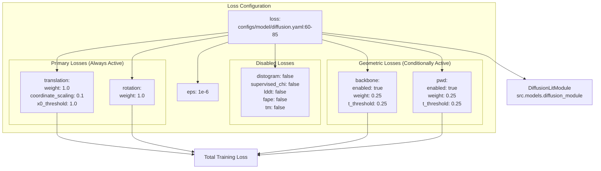
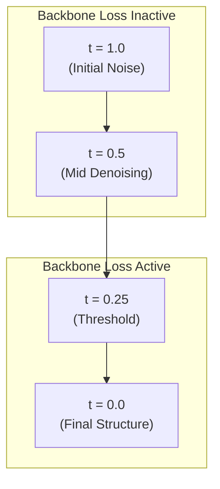
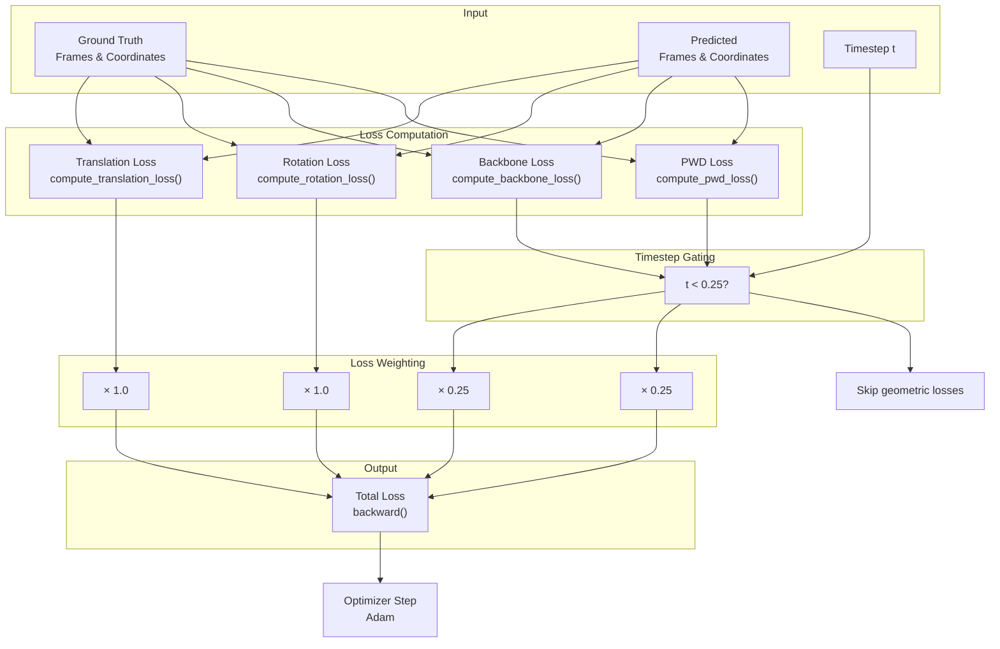
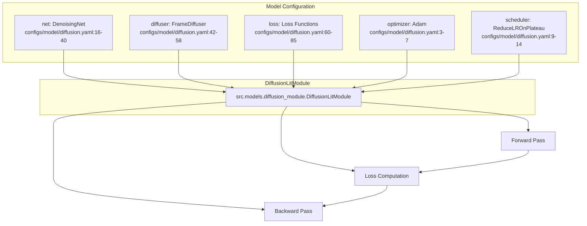

# Loss Functions

> **Relevant source files**
> * [configs/model/diffusion.yaml](https://github.com/Junjie-Zhu/IDPFold/blob/ba40f40c/configs/model/diffusion.yaml)

## Purpose and Scope

This document details the loss functions used to train the IDPFold diffusion model. These loss functions guide the model to learn accurate predictions of protein conformational ensembles by penalizing errors in translations, rotations, and geometric properties. The loss configuration is defined in [configs/model/diffusion.yaml L60-L85](https://github.com/Junjie-Zhu/IDPFold/blob/ba40f40c/configs/model/diffusion.yaml#L60-L85)

 and applied during training within the `DiffusionLitModule`.

For information about the overall model architecture, see [Model Architecture](/Junjie-Zhu/IDPFold/4-model-architecture). For details on the training process and optimizer configuration, see [Optimizer and Scheduler](/Junjie-Zhu/IDPFold/4.5-optimizer-and-scheduler). For model configuration parameters, see [Model Configuration Reference](/Junjie-Zhu/IDPFold/5.2-model-configuration-reference).

---

## Loss Function Categories

IDPFold employs four categories of loss functions during training:

| Category | Loss Functions | Status | Purpose |
| --- | --- | --- | --- |
| **Frame-based** | translation, rotation | Enabled | Penalize errors in predicted 3D frames (position + orientation) |
| **Geometric** | backbone, pwd | Enabled | Enforce structural constraints and pairwise distances |
| **Structural Metrics** | distogram, fape, lddt, tm | Disabled | Alternative/supplementary structural quality metrics |
| **Side Chain** | supervised_chi | Disabled | Torsion angle prediction (not used for IDP backbone modeling) |

The enabled loss functions (translation, rotation, backbone, pwd) focus on the coarse-grained representation of protein structure using alpha-carbon (CA) atom positions and local coordinate frames.

**Sources**: [configs/model/diffusion.yaml L60-L85](https://github.com/Junjie-Zhu/IDPFold/blob/ba40f40c/configs/model/diffusion.yaml#L60-L85)

---

## Loss Configuration Structure



**Sources**: [configs/model/diffusion.yaml L60-L85](https://github.com/Junjie-Zhu/IDPFold/blob/ba40f40c/configs/model/diffusion.yaml#L60-L85)

---

## Translation Loss

The translation loss penalizes errors in predicting the 3D positions of alpha-carbon atoms. This loss operates in the Euclidean space R³.

### Configuration Parameters

| Parameter | Value | Description |
| --- | --- | --- |
| `weight` | 1.0 | Relative weight in the total loss |
| `coordinate_scaling` | 0.1 | Scaling factor applied to coordinates before loss computation |
| `x0_threshold` | 1.0 | Threshold parameter for loss computation |

**Configuration**: [configs/model/diffusion.yaml L61-L64](https://github.com/Junjie-Zhu/IDPFold/blob/ba40f40c/configs/model/diffusion.yaml#L61-L64)

### Relationship to R3Diffuser

The translation loss works in conjunction with the `R3Diffuser` component [configs/model/diffusion.yaml L44-L48](https://github.com/Junjie-Zhu/IDPFold/blob/ba40f40c/configs/model/diffusion.yaml#L44-L48)

 which handles the diffusion process for translations. The `coordinate_scaling` parameter (0.1) is consistent between the loss and the diffuser, ensuring that the model learns in a properly scaled coordinate space.

**Sources**: [configs/model/diffusion.yaml L61-L64](https://github.com/Junjie-Zhu/IDPFold/blob/ba40f40c/configs/model/diffusion.yaml#L61-L64)

 [configs/model/diffusion.yaml L44-L48](https://github.com/Junjie-Zhu/IDPFold/blob/ba40f40c/configs/model/diffusion.yaml#L44-L48)

---

## Rotation Loss

The rotation loss penalizes errors in predicting the orientations of local coordinate frames. This loss operates on the special orthogonal group SO(3), the manifold of 3D rotations.

### Configuration Parameters

| Parameter | Value | Description |
| --- | --- | --- |
| `weight` | 1.0 | Relative weight in the total loss |

**Configuration**: [configs/model/diffusion.yaml L65-L66](https://github.com/Junjie-Zhu/IDPFold/blob/ba40f40c/configs/model/diffusion.yaml#L65-L66)

### Relationship to SO3Diffuser

The rotation loss complements the `SO3Diffuser` component [configs/model/diffusion.yaml L49-L57](https://github.com/Junjie-Zhu/IDPFold/blob/ba40f40c/configs/model/diffusion.yaml#L49-L57)

 which implements the diffusion process on SO(3). The SO3 diffusion uses specialized schedules and parameterizations to handle the non-Euclidean geometry of rotations.

**Sources**: [configs/model/diffusion.yaml L65-L66](https://github.com/Junjie-Zhu/IDPFold/blob/ba40f40c/configs/model/diffusion.yaml#L65-L66)

 [configs/model/diffusion.yaml L49-L57](https://github.com/Junjie-Zhu/IDPFold/blob/ba40f40c/configs/model/diffusion.yaml#L49-L57)

---

## Backbone Loss

The backbone loss enforces geometric constraints on the protein backbone structure. This loss is conditionally active based on the diffusion timestep.

### Configuration Parameters

| Parameter | Value | Description |
| --- | --- | --- |
| `enabled` | true | Whether this loss is active |
| `weight` | 0.25 | Relative weight in the total loss |
| `t_threshold` | 0.25 | Timestep threshold; loss is only applied when t < 0.25 |

**Configuration**: [configs/model/diffusion.yaml L77-L80](https://github.com/Junjie-Zhu/IDPFold/blob/ba40f40c/configs/model/diffusion.yaml#L77-L80)

### Timestep-Dependent Activation

The `t_threshold` parameter means this loss is only applied during the later stages of the denoising process (when timestep t < 0.25). This allows the model to focus on coarse structure early in the diffusion process and refine geometric details later.



**Sources**: [configs/model/diffusion.yaml L77-L80](https://github.com/Junjie-Zhu/IDPFold/blob/ba40f40c/configs/model/diffusion.yaml#L77-L80)

---

## Pairwise Distance Loss (PWD)

The pairwise distance (pwd) loss penalizes errors in the distances between pairs of residues. This loss helps maintain the overall shape and compactness of the predicted structures.

### Configuration Parameters

| Parameter | Value | Description |
| --- | --- | --- |
| `enabled` | true | Whether this loss is active |
| `weight` | 0.25 | Relative weight in the total loss |
| `t_threshold` | 0.25 | Timestep threshold; loss is only applied when t < 0.25 |

**Configuration**: [configs/model/diffusion.yaml L81-L84](https://github.com/Junjie-Zhu/IDPFold/blob/ba40f40c/configs/model/diffusion.yaml#L81-L84)

### Timestep-Dependent Activation

Like the backbone loss, the pwd loss is only active when t < 0.25, applying geometric constraints during the refinement phase of generation.

**Sources**: [configs/model/diffusion.yaml L81-L84](https://github.com/Junjie-Zhu/IDPFold/blob/ba40f40c/configs/model/diffusion.yaml#L81-L84)

---

## Disabled Loss Functions

Several loss functions are available but disabled by default in the IDPFold configuration:

### Distogram Loss

Predicts probability distributions over pairwise distances between residues. This loss is commonly used in structure prediction models but is disabled in IDPFold.

**Configuration**: [configs/model/diffusion.yaml L67-L68](https://github.com/Junjie-Zhu/IDPFold/blob/ba40f40c/configs/model/diffusion.yaml#L67-L68)

### Supervised Chi Loss

Predicts side chain torsion angles. This is disabled because IDPFold focuses on backbone structure using CA atoms only.

**Configuration**: [configs/model/diffusion.yaml L69-L70](https://github.com/Junjie-Zhu/IDPFold/blob/ba40f40c/configs/model/diffusion.yaml#L69-L70)

### LDDT Loss

Local Distance Difference Test metric for structural quality. Disabled in the default configuration.

**Configuration**: [configs/model/diffusion.yaml L71-L72](https://github.com/Junjie-Zhu/IDPFold/blob/ba40f40c/configs/model/diffusion.yaml#L71-L72)

### FAPE Loss

Frame Aligned Point Error, commonly used in AlphaFold2. Disabled in IDPFold.

**Configuration**: [configs/model/diffusion.yaml L73-L74](https://github.com/Junjie-Zhu/IDPFold/blob/ba40f40c/configs/model/diffusion.yaml#L73-L74)

### TM Loss

Template Modeling score-based loss. Disabled in IDPFold.

**Configuration**: [configs/model/diffusion.yaml L75-L76](https://github.com/Junjie-Zhu/IDPFold/blob/ba40f40c/configs/model/diffusion.yaml#L75-L76)

**Sources**: [configs/model/diffusion.yaml L67-L76](https://github.com/Junjie-Zhu/IDPFold/blob/ba40f40c/configs/model/diffusion.yaml#L67-L76)

---

## Total Loss Computation

The total training loss is computed as a weighted sum of the enabled loss components:

```
Total Loss = (translation_weight × Translation Loss) 
           + (rotation_weight × Rotation Loss)
           + (backbone_weight × Backbone Loss)    [if t < t_threshold]
           + (pwd_weight × PWD Loss)               [if t < t_threshold]
           + eps
```

Where:

* `translation_weight` = 1.0
* `rotation_weight` = 1.0
* `backbone_weight` = 0.25 (active when t < 0.25)
* `pwd_weight` = 0.25 (active when t < 0.25)
* `eps` = 1e-6 (numerical stability constant)

### Loss Weighting Strategy

The weighting scheme gives equal importance to the primary frame-based losses (translation and rotation, both with weight 1.0) while applying lighter constraints from geometric losses (backbone and pwd, both with weight 0.25). This allows the model to learn the overall frame structure while being guided by but not overly constrained by geometric priors.

**Sources**: [configs/model/diffusion.yaml L60-L85](https://github.com/Junjie-Zhu/IDPFold/blob/ba40f40c/configs/model/diffusion.yaml#L60-L85)

---

## Loss Function Data Flow



**Sources**: [configs/model/diffusion.yaml L60-L85](https://github.com/Junjie-Zhu/IDPFold/blob/ba40f40c/configs/model/diffusion.yaml#L60-L85)

 [configs/model/diffusion.yaml L3-L7](https://github.com/Junjie-Zhu/IDPFold/blob/ba40f40c/configs/model/diffusion.yaml#L3-L7)

---

## Configuration in Context

The loss configuration works in conjunction with other model components defined in `diffusion.yaml`:



The `DiffusionLitModule` instantiates the network (`DenoisingNet`), the diffuser (`FrameDiffuser`), and applies the configured loss functions during training. The optimizer and scheduler update model parameters based on the computed loss gradients.

**Sources**: [configs/model/diffusion.yaml L1-L103](https://github.com/Junjie-Zhu/IDPFold/blob/ba40f40c/configs/model/diffusion.yaml#L1-L103)

---

## Customizing Loss Functions

To customize the loss configuration, modify [configs/model/diffusion.yaml L60-L85](https://github.com/Junjie-Zhu/IDPFold/blob/ba40f40c/configs/model/diffusion.yaml#L60-L85)

:

### Enabling Disabled Losses

To enable a disabled loss (e.g., FAPE):

```yaml
loss:  # ... existing configuration ...  fape:    enabled: true    weight: 0.5  # Add appropriate weight
```

### Adjusting Loss Weights

To change the relative importance of losses:

```yaml
loss:  translation:    weight: 2.0  # Increase translation loss importance  rotation:    weight: 1.0  backbone:    weight: 0.5  # Increase backbone constraint
```

### Modifying Timestep Thresholds

To apply geometric losses earlier in the diffusion process:

```python
loss:  backbone:    t_threshold: 0.5  # Apply from t < 0.5 instead of t < 0.25  pwd:    t_threshold: 0.5
```

**Sources**: [configs/model/diffusion.yaml L60-L85](https://github.com/Junjie-Zhu/IDPFold/blob/ba40f40c/configs/model/diffusion.yaml#L60-L85)

---

## Related Configuration

The loss configuration parameters interact with other settings in the model configuration:

| Setting | Location | Interaction |
| --- | --- | --- |
| `coordinate_scaling` in R3Diffuser | [configs/model/diffusion.yaml L48](https://github.com/Junjie-Zhu/IDPFold/blob/ba40f40c/configs/model/diffusion.yaml#L48-L48) | Must match translation loss scaling |
| `min_t` in diffuser | [configs/model/diffusion.yaml L58](https://github.com/Junjie-Zhu/IDPFold/blob/ba40f40c/configs/model/diffusion.yaml#L58-L58) | Minimum timestep for loss computation |
| `min_t` in inference | [configs/model/diffusion.yaml L98](https://github.com/Junjie-Zhu/IDPFold/blob/ba40f40c/configs/model/diffusion.yaml#L98-L98) | Should match training min_t |
| Learning rate | [configs/model/diffusion.yaml L6](https://github.com/Junjie-Zhu/IDPFold/blob/ba40f40c/configs/model/diffusion.yaml#L6-L6) | Affects how quickly loss drives optimization |

**Sources**: [configs/model/diffusion.yaml L6](https://github.com/Junjie-Zhu/IDPFold/blob/ba40f40c/configs/model/diffusion.yaml#L6-L6)

 [configs/model/diffusion.yaml L48](https://github.com/Junjie-Zhu/IDPFold/blob/ba40f40c/configs/model/diffusion.yaml#L48-L48)

 [configs/model/diffusion.yaml L58](https://github.com/Junjie-Zhu/IDPFold/blob/ba40f40c/configs/model/diffusion.yaml#L58-L58)

 [configs/model/diffusion.yaml L98](https://github.com/Junjie-Zhu/IDPFold/blob/ba40f40c/configs/model/diffusion.yaml#L98-L98)