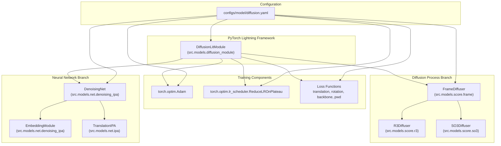
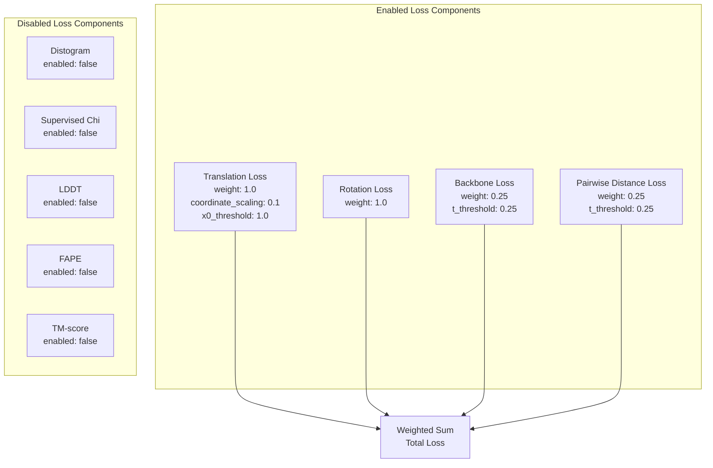
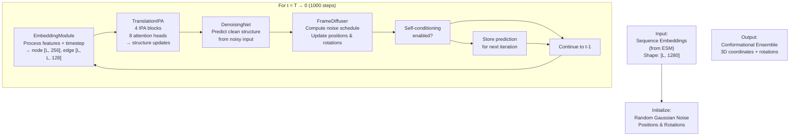

# Model Architecture

> **Relevant source files**
> * [README.md](https://github.com/Junjie-Zhu/IDPFold/blob/ba40f40c/README.md?plain=1)
> * [configs/model/diffusion.yaml](https://github.com/Junjie-Zhu/IDPFold/blob/ba40f40c/configs/model/diffusion.yaml)
> * [data/example.fasta](https://github.com/Junjie-Zhu/IDPFold/blob/ba40f40c/data/example.fasta)

This page provides detailed technical documentation of IDPFold's diffusion model architecture and its components. It covers the structure of `DiffusionLitModule`, the neural network components (`DenoisingNet`, `EmbeddingModule`, `TranslationIPA`), the diffusion process (`FrameDiffuser`, `R3Diffuser`, `SO3Diffuser`), loss functions, and training components.

For information about model configuration parameters, see [Model Configuration Reference](/Junjie-Zhu/IDPFold/5.2-model-configuration-reference). For details about using the model during inference, see [Running Inference](/Junjie-Zhu/IDPFold/3.3-running-inference) and [Inference Parameters](/Junjie-Zhu/IDPFold/7.1-inference-parameters). For training usage, see [Training Models](/Junjie-Zhu/IDPFold/3.4-training-models).

## Overview

IDPFold uses a diffusion-based generative model to predict conformational ensembles of intrinsically disordered proteins. The architecture is built on PyTorch Lightning and consists of two parallel systems: a neural network (`DenoisingNet`) that learns to predict clean structures from noisy inputs, and a diffusion process (`FrameDiffuser`) that defines the noise schedule and sampling procedure.

The model is configured entirely through [configs/model/diffusion.yaml L1-L103](https://github.com/Junjie-Zhu/IDPFold/blob/ba40f40c/configs/model/diffusion.yaml#L1-L103)

 using Hydra's instantiation system, which allows the architecture to be modified without changing code.

## Core Architecture

The following diagram shows how the major components of IDPFold's model architecture relate to each other and maps them to their corresponding code entities:



**Sources:** [configs/model/diffusion.yaml L1-L103](https://github.com/Junjie-Zhu/IDPFold/blob/ba40f40c/configs/model/diffusion.yaml#L1-L103)

## DiffusionLitModule

`DiffusionLitModule` is the top-level PyTorch Lightning module that orchestrates the entire training and inference pipeline. It is instantiated via the `_target_` directive in [configs/model/diffusion.yaml L1](https://github.com/Junjie-Zhu/IDPFold/blob/ba40f40c/configs/model/diffusion.yaml#L1-L1)

The module encapsulates:

* **Network**: A `DenoisingNet` instance that predicts denoised structures
* **Diffuser**: A `FrameDiffuser` instance that manages the diffusion noise schedule
* **Optimizer**: Adam optimizer with learning rate 1e-4 and no weight decay [configs/model/diffusion.yaml L3-L7](https://github.com/Junjie-Zhu/IDPFold/blob/ba40f40c/configs/model/diffusion.yaml#L3-L7)
* **Scheduler**: ReduceLROnPlateau scheduler that reduces learning rate by 0.1 when validation loss plateaus for 10 epochs [configs/model/diffusion.yaml L9-L14](https://github.com/Junjie-Zhu/IDPFold/blob/ba40f40c/configs/model/diffusion.yaml#L9-L14)
* **Loss functions**: Multiple loss components weighted and combined during training [configs/model/diffusion.yaml L60-L85](https://github.com/Junjie-Zhu/IDPFold/blob/ba40f40c/configs/model/diffusion.yaml#L60-L85)

The module follows PyTorch Lightning's standard interface with methods for training, validation, and inference steps, leveraging Lightning's automatic handling of distributed training, gradient accumulation, and checkpointing.

**Sources:** [configs/model/diffusion.yaml L1-L103](https://github.com/Junjie-Zhu/IDPFold/blob/ba40f40c/configs/model/diffusion.yaml#L1-L103)

## Neural Network: DenoisingNet

The `DenoisingNet` [configs/model/diffusion.yaml L16-L40](https://github.com/Junjie-Zhu/IDPFold/blob/ba40f40c/configs/model/diffusion.yaml#L16-L40)

 is the core neural network that learns to denoise protein structures. It consists of two sequential modules:

### EmbeddingModule

The `EmbeddingModule` [configs/model/diffusion.yaml L18-L26](https://github.com/Junjie-Zhu/IDPFold/blob/ba40f40c/configs/model/diffusion.yaml#L18-L26)

 transforms input features into learned representations:

| Parameter | Value | Description |
| --- | --- | --- |
| `init_embed_size` | 32 | Initial embedding dimension |
| `node_embed_size` | 256 | Node (residue) feature dimension |
| `edge_embed_size` | 128 | Edge (pairwise) feature dimension |
| `num_bins` | 22 | Number of distance bins for edge features |
| `min_bin` | 1e-5 | Minimum distance bin value (Angstroms) |
| `max_bin` | 20.0 | Maximum distance bin value (Angstroms) |
| `self_conditioning` | true | Enable self-conditioning during inference |

The embedder processes:

* Sequence embeddings from ESM (input dimension determined by ESM model)
* Timestep information (diffusion time)
* Geometric features (distances, angles) computed from current structure
* Previous prediction (when self-conditioning is enabled)

### TranslationIPA

The `TranslationIPA` [configs/model/diffusion.yaml L27-L40](https://github.com/Junjie-Zhu/IDPFold/blob/ba40f40c/configs/model/diffusion.yaml#L27-L40)

 is an Invariant Point Attention network that processes embedded features to predict structure updates:

| Parameter | Value | Description |
| --- | --- | --- |
| `c_s` | 256 | Single (node) representation dimension |
| `c_z` | 128 | Pair (edge) representation dimension |
| `coordinate_scaling` | 0.1 | Scaling factor for coordinates |
| `no_ipa_blocks` | 4 | Number of IPA blocks |
| `skip_embed_size` | 64 | Skip connection embedding size |
| `transformer_num_heads` | 4 | Number of transformer attention heads |
| `transformer_num_layers` | 2 | Number of transformer layers |
| `c_hidden` | 256 | Hidden dimension |
| `no_heads` | 8 | Number of IPA attention heads |
| `no_qk_points` | 8 | Number of query/key points in IPA |
| `no_v_points` | 12 | Number of value points in IPA |
| `dropout` | 0.0 | Dropout rate (disabled) |

TranslationIPA uses the Invariant Point Attention mechanism, which processes geometric features in a way that respects SE(3) equivariance, making it suitable for predicting protein structures.

**Sources:** [configs/model/diffusion.yaml L16-L40](https://github.com/Junjie-Zhu/IDPFold/blob/ba40f40c/configs/model/diffusion.yaml#L16-L40)

## Diffusion Process: FrameDiffuser

The `FrameDiffuser` [configs/model/diffusion.yaml L42-L58](https://github.com/Junjie-Zhu/IDPFold/blob/ba40f40c/configs/model/diffusion.yaml#L42-L58)

 manages the forward diffusion (adding noise) and reverse diffusion (denoising) processes for protein molecular frames. It treats translation and rotation independently through two specialized diffusers:

### R3Diffuser

The `R3Diffuser` [configs/model/diffusion.yaml L44-L48](https://github.com/Junjie-Zhu/IDPFold/blob/ba40f40c/configs/model/diffusion.yaml#L44-L48)

 handles translational diffusion in 3D Euclidean space:

| Parameter | Value | Description |
| --- | --- | --- |
| `min_b` | 0.1 | Minimum noise schedule parameter β |
| `max_b` | 20.0 | Maximum noise schedule parameter β |
| `coordinate_scaling` | 0.1 | Scaling factor for translation coordinates |

The diffuser implements a variance-preserving stochastic differential equation (SDE) for adding Gaussian noise to 3D positions.

### SO3Diffuser

The `SO3Diffuser` [configs/model/diffusion.yaml L49-L57](https://github.com/Junjie-Zhu/IDPFold/blob/ba40f40c/configs/model/diffusion.yaml#L49-L57)

 handles rotational diffusion on the SO(3) manifold (3D rotation group):

| Parameter | Value | Description |
| --- | --- | --- |
| `num_omega` | 1000 | Number of discretization points for ω |
| `num_sigma` | 1000 | Number of discretization points for σ |
| `min_sigma` | 0.1 | Minimum rotation noise level |
| `max_sigma` | 1.5 | Maximum rotation noise level |
| `schedule` | logarithmic | Noise schedule type |
| `cache_dir` | ${paths.cache_dir} | Directory for caching precomputed scores |
| `use_cached_score` | false | Whether to use cached score computations |

The SO3 diffuser implements diffusion on the rotation manifold, which is necessary because rotations do not form a Euclidean space. The discretization parameters control the precision of score computations.

### Frame-Level Parameters

Additional FrameDiffuser parameters:

| Parameter | Value | Description |
| --- | --- | --- |
| `min_t` | 1e-2 | Minimum diffusion time (avoids numerical instability at t=0) |

**Sources:** [configs/model/diffusion.yaml L42-L58](https://github.com/Junjie-Zhu/IDPFold/blob/ba40f40c/configs/model/diffusion.yaml#L42-L58)

## Loss Functions

The model uses multiple loss functions during training, which can be enabled/disabled and weighted independently. The complete loss configuration is shown below:



### Active Loss Components

The following loss functions are enabled during training:

| Loss Type | Weight | Parameters | Description |
| --- | --- | --- | --- |
| **Translation** | 1.0 | `coordinate_scaling: 0.1``x0_threshold: 1.0` | Measures error in predicted 3D translations |
| **Rotation** | 1.0 | - | Measures error in predicted rotations on SO(3) |
| **Backbone** | 0.25 | `t_threshold: 0.25` | Measures backbone geometry consistency (active only when t ≥ 0.25) |
| **PWD** (Pairwise Distance) | 0.25 | `t_threshold: 0.25` | Measures pairwise distance accuracy (active only when t ≥ 0.25) |

The `t_threshold` parameters indicate that backbone and pairwise distance losses are only applied during later stages of diffusion (when t ≥ 0.25), allowing the model to focus on global structure early in the denoising process and refine local geometry later.

### Disabled Loss Components

The following loss functions are present in the configuration but disabled:

* **Distogram**: Distance distribution prediction
* **Supervised Chi**: Side-chain torsion angle prediction
* **LDDT**: Local Distance Difference Test
* **FAPE**: Frame Aligned Point Error
* **TM-score**: Template Modeling score

These may be legacy components from related codebases or reserved for future extensions.

### Numerical Stability

An epsilon value of `1e-6` [configs/model/diffusion.yaml L85](https://github.com/Junjie-Zhu/IDPFold/blob/ba40f40c/configs/model/diffusion.yaml#L85-L85)

 is used throughout loss computations to prevent division by zero.

**Sources:** [configs/model/diffusion.yaml L60-L85](https://github.com/Junjie-Zhu/IDPFold/blob/ba40f40c/configs/model/diffusion.yaml#L60-L85)

## Optimizer and Scheduler

The model uses standard PyTorch optimization components configured through Hydra:

### Adam Optimizer

Configuration at [configs/model/diffusion.yaml L3-L7](https://github.com/Junjie-Zhu/IDPFold/blob/ba40f40c/configs/model/diffusion.yaml#L3-L7)

:

| Parameter | Value | Description |
| --- | --- | --- |
| `_target_` | `torch.optim.Adam` | Optimizer class |
| `_partial_` | `true` | Hydra partial instantiation (params added later) |
| `lr` | 1e-4 | Learning rate |
| `weight_decay` | 0.0 | L2 regularization weight (disabled) |

The `_partial_` flag indicates that Hydra creates a partial function, allowing PyTorch Lightning to pass the model parameters during instantiation.

### ReduceLROnPlateau Scheduler

Configuration at [configs/model/diffusion.yaml L9-L14](https://github.com/Junjie-Zhu/IDPFold/blob/ba40f40c/configs/model/diffusion.yaml#L9-L14)

:

| Parameter | Value | Description |
| --- | --- | --- |
| `_target_` | `torch.optim.lr_scheduler.ReduceLROnPlateau` | Scheduler class |
| `_partial_` | `true` | Hydra partial instantiation |
| `mode` | `min` | Monitor for decreasing validation loss |
| `factor` | 0.1 | Multiply learning rate by this factor when reducing |
| `patience` | 10 | Number of epochs with no improvement before reducing |

This scheduler automatically reduces the learning rate by 10× when validation loss fails to improve for 10 consecutive epochs, helping the model escape local minima during training.

**Sources:** [configs/model/diffusion.yaml L3-L14](https://github.com/Junjie-Zhu/IDPFold/blob/ba40f40c/configs/model/diffusion.yaml#L3-L14)

## Inference Configuration

The model includes extensive inference parameters that control the sampling process during conformational ensemble generation:

| Parameter | Value | Description |
| --- | --- | --- |
| `delta_min` | 0.25 | Minimum chain length perturbation parameter |
| `delta_max` | 0.35 | Maximum chain length perturbation parameter |
| `delta_step` | 0.05 | Step size for delta sweep |
| `n_replica` | 192 | Number of replicas per delta value |
| `replica_per_batch` | 64 | Batch size for parallel sampling |
| `num_timesteps` | 1000 | Number of discretization steps in reverse diffusion |
| `noise_scale` | 1.0 | Scaling factor for noise during sampling |
| `probability_flow` | false | Use probability flow ODE instead of SDE |
| `self_conditioning` | true | Enable self-conditioning during sampling |
| `min_t` | 1e-2 | Minimum diffusion time |
| `output_dir` | ${paths.output_dir}/samples | Directory for output structures |
| `backward_only` | true | Only perform reverse diffusion (no forward) |

The total number of structures generated is: `n_replica × ((delta_max - delta_min) / delta_step + 1) = 192 × 3 = 576` structures per input sequence.

The delta parameters control a perturbation mechanism that generates structural diversity in the ensemble. Self-conditioning allows the model to iteratively refine predictions by feeding previous outputs back as inputs.

For more details on how these parameters affect inference, see [Inference Parameters](/Junjie-Zhu/IDPFold/7.1-inference-parameters) and [Self-Conditioning](/Junjie-Zhu/IDPFold/7.4-self-conditioning).

**Sources:** [configs/model/diffusion.yaml L88-L100](https://github.com/Junjie-Zhu/IDPFold/blob/ba40f40c/configs/model/diffusion.yaml#L88-L100)

## Model Compilation

The configuration includes a compilation flag:

| Parameter | Value | Description |
| --- | --- | --- |
| `compile` | false | Enable PyTorch 2.0 compilation for faster training |

Setting this to `true` would enable PyTorch 2.0's `torch.compile()` feature, which can significantly accelerate training through JIT compilation. It is currently disabled, likely for debugging or compatibility reasons.

**Sources:** [configs/model/diffusion.yaml L103](https://github.com/Junjie-Zhu/IDPFold/blob/ba40f40c/configs/model/diffusion.yaml#L103-L103)

## Data Flow During Inference

The following diagram illustrates how data flows through the model architecture during inference:



**Sources:** [configs/model/diffusion.yaml L16-L100](https://github.com/Junjie-Zhu/IDPFold/blob/ba40f40c/configs/model/diffusion.yaml#L16-L100)

## Configuration File Structure

The complete model configuration in `configs/model/diffusion.yaml` follows this hierarchical structure:

```yaml
_target_: DiffusionLitModule
├── optimizer:
│   ├── _target_: torch.optim.Adam
│   ├── lr: 1e-4
│   └── weight_decay: 0.0
├── scheduler:
│   ├── _target_: torch.optim.lr_scheduler.ReduceLROnPlateau
│   ├── mode: min
│   ├── factor: 0.1
│   └── patience: 10
├── net:
│   ├── _target_: DenoisingNet
│   ├── embedder:
│   │   ├── _target_: EmbeddingModule
│   │   ├── init_embed_size: 32
│   │   ├── node_embed_size: 256
│   │   ├── edge_embed_size: 128
│   │   └── self_conditioning: true
│   └── translator:
│       ├── _target_: TranslationIPA
│       ├── c_s: 256
│       ├── c_z: 128
│       └── no_ipa_blocks: 4
├── diffuser:
│   ├── _target_: FrameDiffuser
│   ├── trans_diffuser:
│   │   ├── _target_: R3Diffuser
│   │   ├── min_b: 0.1
│   │   └── max_b: 20.0
│   └── rot_diffuser:
│       ├── _target_: SO3Diffuser
│       ├── num_omega: 1000
│       ├── num_sigma: 1000
│       └── schedule: logarithmic
├── loss:
│   ├── translation: {weight: 1.0}
│   ├── rotation: {weight: 1.0}
│   ├── backbone: {weight: 0.25, enabled: true}
│   └── pwd: {weight: 0.25, enabled: true}
├── inference:
│   ├── n_replica: 192
│   ├── num_timesteps: 1000
│   └── self_conditioning: true
└── compile: false
```

This hierarchical structure allows each component to be independently configured, modified, or swapped through configuration changes alone, without requiring code modifications. For detailed parameter descriptions, see [Model Configuration Reference](/Junjie-Zhu/IDPFold/5.2-model-configuration-reference).

**Sources:** [configs/model/diffusion.yaml L1-L103](https://github.com/Junjie-Zhu/IDPFold/blob/ba40f40c/configs/model/diffusion.yaml#L1-L103)