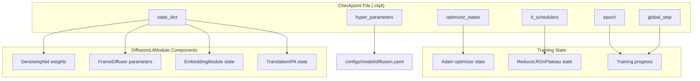
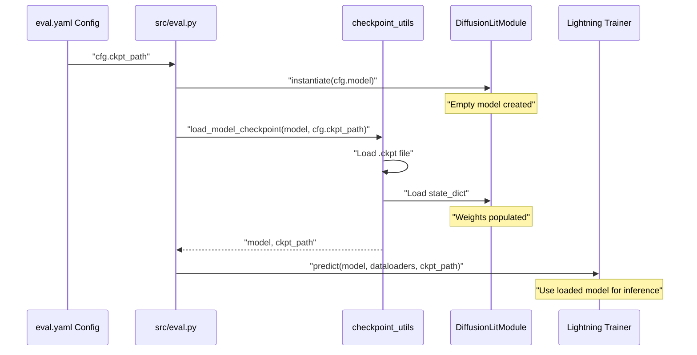
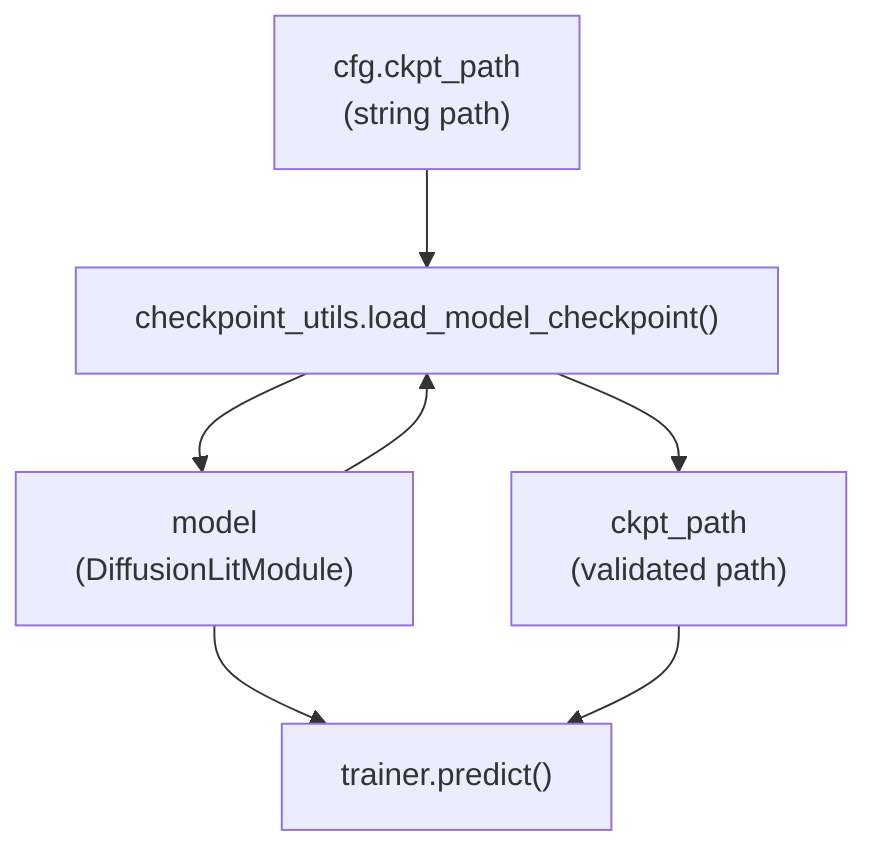
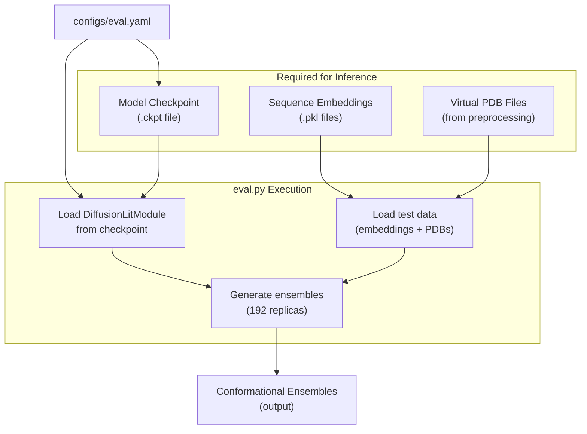
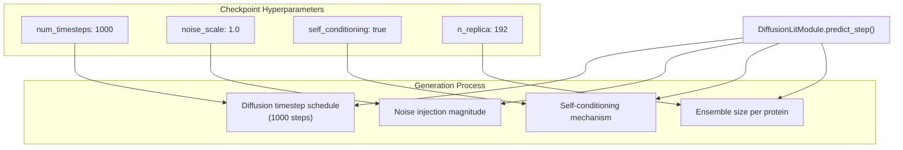
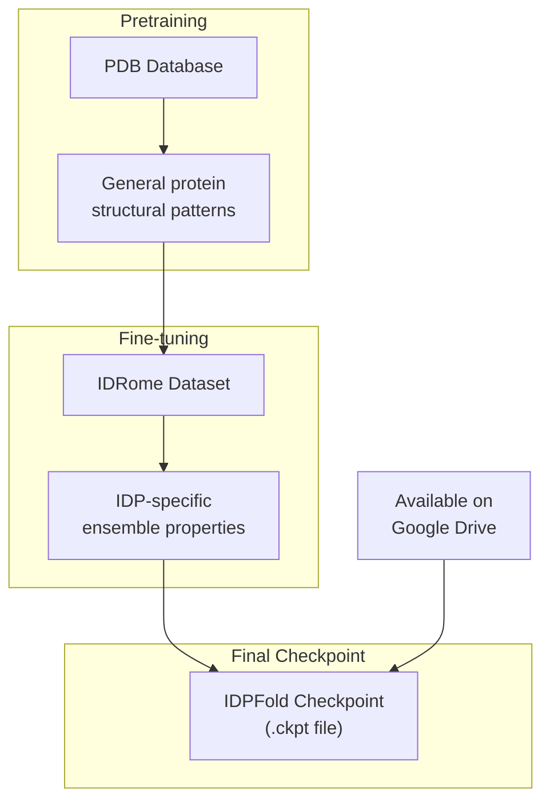
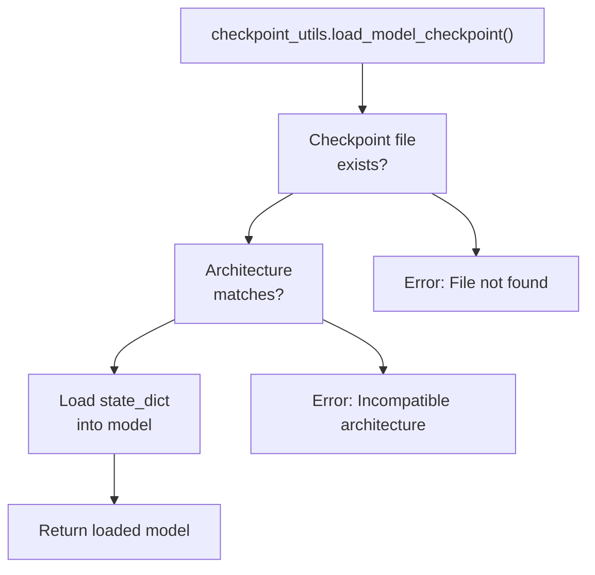
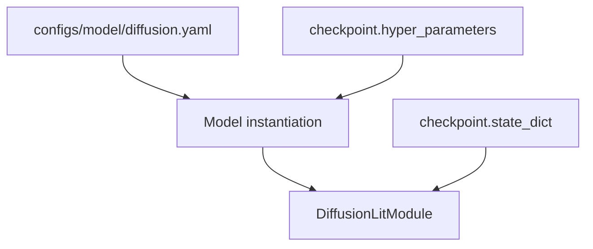

# Model Checkpoints

> **Relevant source files**
> * [README.md](https://github.com/Junjie-Zhu/IDPFold/blob/ba40f40c/README.md?plain=1)
> * [data/example.fasta](https://github.com/Junjie-Zhu/IDPFold/blob/ba40f40c/data/example.fasta)
> * [src/eval.py](https://github.com/Junjie-Zhu/IDPFold/blob/ba40f40c/src/eval.py)

This page documents the structure, location, and usage of IDPFold model checkpoint files. Checkpoints contain trained model weights and are essential for running inference to generate conformational ensembles. For information about the model architecture stored in checkpoints, see [DiffusionLitModule Overview](/Junjie-Zhu/IDPFold/4.1-diffusionlitmodule-overview). For instructions on using checkpoints during inference, see [Running Inference](/Junjie-Zhu/IDPFold/3.3-running-inference).

## Overview

Model checkpoints in IDPFold are PyTorch Lightning checkpoint files (`.ckpt`) that store the complete state of a trained `DiffusionLitModule`. These checkpoints enable inference without retraining and preserve the exact model configuration used during training. IDPFold provides pretrained checkpoints via Google Drive that have been trained on the PDB database and fine-tuned on IDRome conformational ensembles.

**Sources:** [README.md L1-L69](https://github.com/Junjie-Zhu/IDPFold/blob/ba40f40c/README.md?plain=1#L1-L69)

## Checkpoint Availability

### Official Pretrained Checkpoints

IDPFold provides pretrained model checkpoints accessible via Google Drive:

**Location:** [https://drive.google.com/drive/folders/1-5BHexAZKGX1lWyPkYU-JFi1EId88P9i?usp=sharing](https://drive.google.com/drive/folders/1-5BHexAZKGX1lWyPkYU-JFi1EId88P9i?usp=sharing)

These checkpoints represent models that have undergone the following training stages:

| Training Stage | Dataset | Purpose |
| --- | --- | --- |
| Pretraining | PDB database | Learn general protein structural patterns |
| Fine-tuning | IDRome conformational ensembles | Specialize in IDP ensemble generation |

The fine-tuned checkpoints are recommended for IDP structure prediction tasks as they have been optimized specifically for intrinsically disordered proteins.

**Sources:** [README.md L14](https://github.com/Junjie-Zhu/IDPFold/blob/ba40f40c/README.md?plain=1#L14-L14)

 [README.md L50](https://github.com/Junjie-Zhu/IDPFold/blob/ba40f40c/README.md?plain=1#L50-L50)

## Checkpoint File Structure

### PyTorch Lightning Checkpoint Format



**Diagram: Checkpoint File Contents and Structure**

IDPFold checkpoints follow the standard PyTorch Lightning format, containing:

* **`state_dict`**: Complete neural network weights for all model components
* **`hyper_parameters`**: Model configuration parameters (architecture, diffusion settings)
* **`optimizer_states`**: Saved optimizer state for potential training resumption
* **`lr_schedulers`**: Learning rate scheduler state
* **`epoch`** and **`global_step`**: Training progress indicators

**Sources:** [src/eval.py L59-L60](https://github.com/Junjie-Zhu/IDPFold/blob/ba40f40c/src/eval.py#L59-L60)

 [README.md L12-L14](https://github.com/Junjie-Zhu/IDPFold/blob/ba40f40c/README.md?plain=1#L12-L14)

## Checkpoint Loading Process

### Loading Flow in Codebase



**Diagram: Checkpoint Loading Sequence in IDPFold**

The checkpoint loading process follows these steps:

1. **Configuration**: Checkpoint path specified via `cfg.ckpt_path` parameter
2. **Model Instantiation**: Empty `DiffusionLitModule` created from configuration [src/eval.py L59-L60](https://github.com/Junjie-Zhu/IDPFold/blob/ba40f40c/src/eval.py#L59-L60)
3. **Checkpoint Loading**: `checkpoint_utils.load_model_checkpoint()` loads weights [src/eval.py L81](https://github.com/Junjie-Zhu/IDPFold/blob/ba40f40c/src/eval.py#L81-L81)
4. **Inference**: Loaded model passed to `trainer.predict()` [src/eval.py L91](https://github.com/Junjie-Zhu/IDPFold/blob/ba40f40c/src/eval.py#L91-L91)

**Sources:** [src/eval.py L46-L93](https://github.com/Junjie-Zhu/IDPFold/blob/ba40f40c/src/eval.py#L46-L93)

### Code-Level Loading Implementation

The checkpoint loading is handled by the `checkpoint_utils` module:



**Diagram: Checkpoint Loading Function Flow**

Key code reference:

* Checkpoint loading call: [src/eval.py L81](https://github.com/Junjie-Zhu/IDPFold/blob/ba40f40c/src/eval.py#L81-L81)
* Prediction with checkpoint: [src/eval.py L91](https://github.com/Junjie-Zhu/IDPFold/blob/ba40f40c/src/eval.py#L91-L91)

**Sources:** [src/eval.py L81-L91](https://github.com/Junjie-Zhu/IDPFold/blob/ba40f40c/src/eval.py#L81-L91)

## Checkpoint Usage

### Specifying Checkpoint Path

Checkpoints are specified through the Hydra configuration system. There are two methods:

**Method 1: Command-line override**

```
python src/eval.py ckpt_path='/path/to/checkpoint.ckpt'
```

**Method 2: Configuration file**
The checkpoint path can be set in the evaluation configuration (see [Evaluation Configuration Reference](/Junjie-Zhu/IDPFold/5.3-evaluation-configuration-reference) for details).

**Sources:** [README.md L58-L59](https://github.com/Junjie-Zhu/IDPFold/blob/ba40f40c/README.md?plain=1#L58-L59)

### Checkpoint Requirements for Inference



**Diagram: Checkpoint Dependencies During Inference**

For successful inference, the checkpoint must be compatible with:

* The input sequence embeddings generated by ESM (see [ESM Embedding Extraction](/Junjie-Zhu/IDPFold/7.2-esm-embedding-extraction))
* The virtual PDB file format (see [Virtual PDB Files](/Junjie-Zhu/IDPFold/7.3-virtual-pdb-files))
* The model configuration in `configs/model/diffusion.yaml` (see [Model Configuration Reference](/Junjie-Zhu/IDPFold/5.2-model-configuration-reference))

**Sources:** [src/eval.py L46-L93](https://github.com/Junjie-Zhu/IDPFold/blob/ba40f40c/src/eval.py#L46-L93)

 [README.md L47-L59](https://github.com/Junjie-Zhu/IDPFold/blob/ba40f40c/README.md?plain=1#L47-L59)

## Checkpoint Model Components

### Saved Neural Network States

The checkpoint contains the complete state of the following model components:

| Component | Type | Purpose | Configuration Source |
| --- | --- | --- | --- |
| `DenoisingNet` | Neural Network | Processes embeddings and predicts denoised structures | `configs/model/diffusion.yaml` |
| `EmbeddingModule` | Feature Encoder | Embeds sequence features into model space | Model configuration |
| `TranslationIPA` | Attention Module | Invariant point attention for structure refinement | Model configuration |
| `FrameDiffuser` | Diffusion Process | Manages R3 and SO3 diffusion schedules | Model configuration |
| `R3Diffuser` | Translation Diffuser | Handles 3D translation noise | Diffusion parameters |
| `SO3Diffuser` | Rotation Diffuser | Handles SO(3) rotation noise | Diffusion parameters |

All component weights are stored in the checkpoint's `state_dict` field.

**Sources:** [README.md L12-L14](https://github.com/Junjie-Zhu/IDPFold/blob/ba40f40c/README.md?plain=1#L12-L14)

### Inference-Specific Parameters

The checkpoint also preserves inference parameters that affect ensemble generation:



**Diagram: Inference Parameters Stored in Checkpoint**

These parameters can be found in the checkpoint's `hyper_parameters` dictionary. For detailed explanations of these settings, see [Inference Parameters](/Junjie-Zhu/IDPFold/7.1-inference-parameters).

**Sources:** [README.md L12-L14](https://github.com/Junjie-Zhu/IDPFold/blob/ba40f40c/README.md?plain=1#L12-L14)

## Checkpoint Training Provenance

### Training Dataset Lineage



**Diagram: Checkpoint Training Pipeline**

Official IDPFold checkpoints follow a two-stage training process:

1. **Pretraining on PDB**: Model learns general protein structural features from the Protein Data Bank
2. **Fine-tuning on IDRome**: Model specializes in generating conformational ensembles for intrinsically disordered proteins using the IDRome dataset

This training strategy enables the model to leverage both ordered protein knowledge and IDP-specific structural distributions.

**Sources:** [README.md L14](https://github.com/Junjie-Zhu/IDPFold/blob/ba40f40c/README.md?plain=1#L14-L14)

## Working with Checkpoints

### Checkpoint File Naming

While the codebase does not enforce specific naming conventions, a typical organizational pattern is:

```markdown
checkpoints/
├── idpfold_pretrained_pdb.ckpt        # After pretraining
├── idpfold_finetuned_idrome.ckpt     # After fine-tuning
└── idpfold_finetuned_idrome_v2.ckpt  # Version iterations
```

Users should reference the Google Drive folder structure for official checkpoint organization.

**Sources:** [README.md L50](https://github.com/Junjie-Zhu/IDPFold/blob/ba40f40c/README.md?plain=1#L50-L50)

### Checkpoint Validation

The `checkpoint_utils.load_model_checkpoint()` function performs validation when loading:



**Diagram: Checkpoint Loading Validation Flow**

The loading process ensures:

* Checkpoint file exists at specified path
* Model architecture matches checkpoint structure
* State dictionary keys are compatible

**Sources:** [src/eval.py L81](https://github.com/Junjie-Zhu/IDPFold/blob/ba40f40c/src/eval.py#L81-L81)

## Related Components

### Integration with Evaluation Pipeline

The checkpoint is central to the evaluation workflow:

1. **Configuration**: Path specified in `eval.yaml` or command line
2. **Model Setup**: `DiffusionLitModule` instantiated [src/eval.py L59-L60](https://github.com/Junjie-Zhu/IDPFold/blob/ba40f40c/src/eval.py#L59-L60)
3. **Checkpoint Load**: Weights loaded via `checkpoint_utils` [src/eval.py L81](https://github.com/Junjie-Zhu/IDPFold/blob/ba40f40c/src/eval.py#L81-L81)
4. **Data Setup**: Test dataloader prepared [src/eval.py L86-L88](https://github.com/Junjie-Zhu/IDPFold/blob/ba40f40c/src/eval.py#L86-L88)
5. **Prediction**: Ensemble generation using loaded model [src/eval.py L91](https://github.com/Junjie-Zhu/IDPFold/blob/ba40f40c/src/eval.py#L91-L91)

For the complete evaluation workflow, see [Running Inference](/Junjie-Zhu/IDPFold/3.3-running-inference).

**Sources:** [src/eval.py L46-L93](https://github.com/Junjie-Zhu/IDPFold/blob/ba40f40c/src/eval.py#L46-L93)

### Checkpoint and Model Configuration

Checkpoints store hyperparameters that must be compatible with the model configuration. The relationship is:



**Diagram: Checkpoint and Configuration Compatibility**

While the model is instantiated from `diffusion.yaml`, the checkpoint's stored hyperparameters should match to ensure correct behavior. See [Model Configuration Reference](/Junjie-Zhu/IDPFold/5.2-model-configuration-reference) for details on model parameters.

**Sources:** [src/eval.py L59-L60](https://github.com/Junjie-Zhu/IDPFold/blob/ba40f40c/src/eval.py#L59-L60)

 [src/eval.py L81](https://github.com/Junjie-Zhu/IDPFold/blob/ba40f40c/src/eval.py#L81-L81)