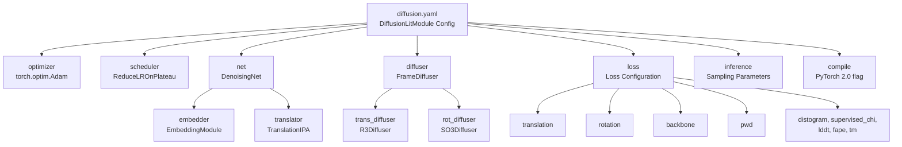
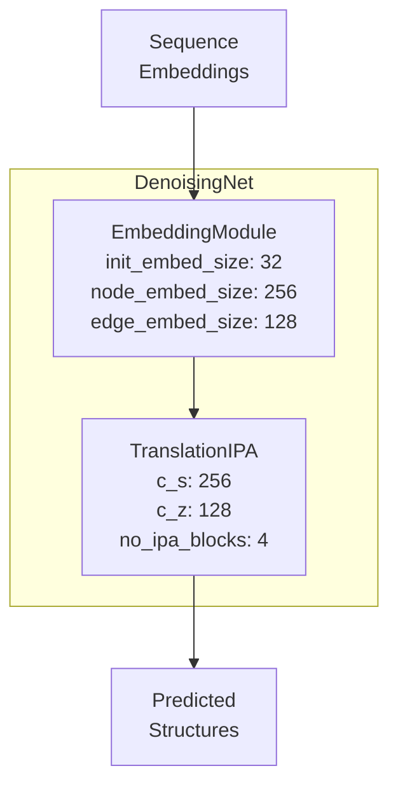
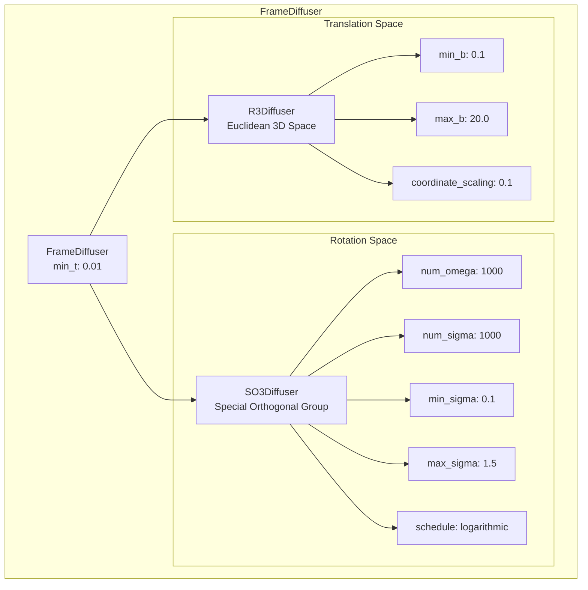
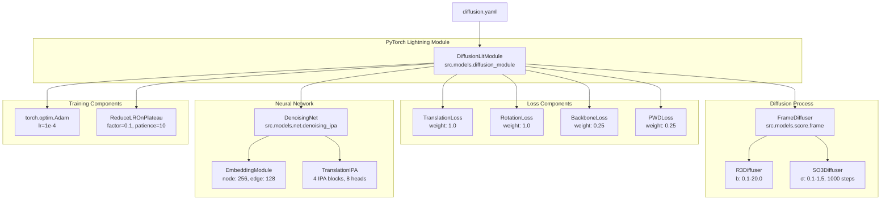

# Model Configuration Reference

> **Relevant source files**
> * [configs/model/diffusion.yaml](https://github.com/Junjie-Zhu/IDPFold/blob/ba40f40c/configs/model/diffusion.yaml)

## Purpose and Scope

This document provides a comprehensive reference for all parameters in the model configuration file located at [configs/model/diffusion.yaml](https://github.com/Junjie-Zhu/IDPFold/blob/ba40f40c/configs/model/diffusion.yaml)

 This configuration defines the complete specification for the `DiffusionLitModule`, including neural network architecture, diffusion process parameters, loss functions, and inference settings.

For general information about the Hydra configuration system, see [Configuration Overview](/Junjie-Zhu/IDPFold/5.1-configuration-overview). For evaluation-specific configuration parameters, see [Evaluation Configuration Reference](/Junjie-Zhu/IDPFold/5.3-evaluation-configuration-reference). For detailed architecture documentation of the instantiated components, see [Model Architecture](/Junjie-Zhu/IDPFold/4-model-architecture).

---

## Configuration File Structure

The `diffusion.yaml` file instantiates a `DiffusionLitModule` and specifies all its components. The configuration is organized into seven major sections:

**Sources:** [configs/model/diffusion.yaml L1-L103](https://github.com/Junjie-Zhu/IDPFold/blob/ba40f40c/configs/model/diffusion.yaml#L1-L103)

---

## Top-Level Target

The configuration instantiates the main PyTorch Lightning module:

| Parameter | Value | Description |
| --- | --- | --- |
| `_target_` | `src.models.diffusion_module.DiffusionLitModule` | Fully qualified class name for Hydra instantiation |

The `_target_` field tells Hydra which class to instantiate when this configuration is loaded. All subsequent sections define constructor parameters for this class.

**Sources:** [configs/model/diffusion.yaml L1](https://github.com/Junjie-Zhu/IDPFold/blob/ba40f40c/configs/model/diffusion.yaml#L1-L1)

---

## Optimizer Configuration

The optimizer section configures the Adam optimizer used for model training:

| Parameter | Value | Description |
| --- | --- | --- |
| `_target_` | `torch.optim.Adam` | Optimizer class |
| `_partial_` | `true` | Returns a partial function (configured later with model parameters) |
| `lr` | `1e-4` | Learning rate (0.0001) |
| `weight_decay` | `0.0` | L2 regularization coefficient (disabled) |

The `_partial_: true` flag means Hydra returns a partially configured callable that will be completed with model parameters during runtime, following PyTorch Lightning's optimizer configuration pattern.

**Sources:** [configs/model/diffusion.yaml L3-L7](https://github.com/Junjie-Zhu/IDPFold/blob/ba40f40c/configs/model/diffusion.yaml#L3-L7)

---

## Scheduler Configuration

The learning rate scheduler uses PyTorch's ReduceLROnPlateau strategy:

| Parameter | Value | Description |
| --- | --- | --- |
| `_target_` | `torch.optim.lr_scheduler.ReduceLROnPlateau` | Scheduler class |
| `_partial_` | `true` | Returns a partial function |
| `mode` | `min` | Monitors for decrease in metric |
| `factor` | `0.1` | Multiply learning rate by 0.1 when triggered |
| `patience` | `10` | Number of epochs with no improvement before reducing LR |

This scheduler reduces the learning rate by 10x after 10 epochs without improvement in the monitored validation metric.

**Sources:** [configs/model/diffusion.yaml L9-L14](https://github.com/Junjie-Zhu/IDPFold/blob/ba40f40c/configs/model/diffusion.yaml#L9-L14)

---

## Network Architecture Configuration

The `net` section defines the `DenoisingNet` architecture, which consists of two main components: an embedder and a translator.

### EmbeddingModule Parameters

The embedder transforms input features into node and edge embeddings:

| Parameter | Value | Description |
| --- | --- | --- |
| `_target_` | `src.models.net.denoising_ipa.EmbeddingModule` | Embedding module class |
| `init_embed_size` | `32` | Initial embedding dimension for residue positions |
| `node_embed_size` | `256` | Dimension of per-residue node embeddings |
| `edge_embed_size` | `128` | Dimension of pairwise edge embeddings |
| `num_bins` | `22` | Number of bins for distance histograms |
| `min_bin` | `1e-5` | Minimum distance for binning (0.00001 Å) |
| `max_bin` | `20.0` | Maximum distance for binning (20.0 Å) |
| `self_conditioning` | `true` | Enable self-conditioning during training |

### TranslationIPA Parameters

The translator processes embeddings through Invariant Point Attention blocks:

| Parameter | Value | Description |
| --- | --- | --- |
| `_target_` | `src.models.net.ipa.TranslationIPA` | IPA-based translation network |
| `c_s` | `256` | Single (node) representation dimension |
| `c_z` | `128` | Pair (edge) representation dimension |
| `coordinate_scaling` | `0.1` | Scale factor for coordinate updates |
| `no_ipa_blocks` | `4` | Number of IPA blocks to stack |
| `skip_embed_size` | `64` | Dimension for skip connections |
| `transformer_num_heads` | `4` | Number of attention heads in transformer layers |
| `transformer_num_layers` | `2` | Number of transformer layers |
| `c_hidden` | `256` | Hidden dimension in feedforward networks |
| `no_heads` | `8` | Number of IPA attention heads |
| `no_qk_points` | `8` | Number of query/key points per head in IPA |
| `no_v_points` | `12` | Number of value points per head in IPA |
| `dropout` | `0.0` | Dropout rate (disabled) |

**Sources:** [configs/model/diffusion.yaml L16-L40](https://github.com/Junjie-Zhu/IDPFold/blob/ba40f40c/configs/model/diffusion.yaml#L16-L40)

---

## Diffuser Configuration

The `diffuser` section configures the `FrameDiffuser`, which handles the diffusion process for molecular coordinate frames by treating translations and rotations separately.

### FrameDiffuser Parameters

| Parameter | Value | Description |
| --- | --- | --- |
| `_target_` | `src.models.score.frame.FrameDiffuser` | Frame diffusion controller |
| `min_t` | `1e-2` | Minimum time value for diffusion process (0.01) |

### R3Diffuser Parameters (Translation)

The translation diffuser operates in Euclidean 3D space:

| Parameter | Value | Description |
| --- | --- | --- |
| `_target_` | `src.models.score.r3.R3Diffuser` | Translation diffusion in R³ |
| `min_b` | `0.1` | Minimum noise variance parameter |
| `max_b` | `20.0` | Maximum noise variance parameter |
| `coordinate_scaling` | `0.1` | Scale factor for translation coordinates |

### SO3Diffuser Parameters (Rotation)

The rotation diffuser operates on the Special Orthogonal group SO(3):

| Parameter | Value | Description |
| --- | --- | --- |
| `_target_` | `src.models.score.so3.SO3Diffuser` | Rotation diffusion on SO(3) |
| `num_omega` | `1000` | Number of discretization points for angular velocity |
| `num_sigma` | `1000` | Number of discretization points for noise level |
| `min_sigma` | `0.1` | Minimum rotation noise level |
| `max_sigma` | `1.5` | Maximum rotation noise level |
| `schedule` | `logarithmic` | Noise schedule type (logarithmic spacing) |
| `cache_dir` | `${paths.cache_dir}` | Directory for caching precomputed score functions |
| `use_cached_score` | `false` | Whether to use cached score computations |

**Sources:** [configs/model/diffusion.yaml L42-L58](https://github.com/Junjie-Zhu/IDPFold/blob/ba40f40c/configs/model/diffusion.yaml#L42-L58)

---

## Loss Configuration

The loss section defines multiple loss components with individual enable flags and weights. The system supports both active and disabled loss terms:

### Active Loss Functions

| Loss Type | Weight | Parameters | Description |
| --- | --- | --- | --- |
| `translation` | `1.0` | `coordinate_scaling: 0.1``x0_threshold: 1.0` | Translation prediction loss with coordinate scaling |
| `rotation` | `1.0` | - | Rotation prediction loss on SO(3) |
| `backbone` | `0.25` | `t_threshold: 0.25` | Backbone structure loss (active when t > 0.25) |
| `pwd` | `0.25` | `t_threshold: 0.25` | Pairwise distance loss (active when t > 0.25) |

### Disabled Loss Functions

The following loss functions are configured but currently disabled:

| Loss Type | Enabled | Description |
| --- | --- | --- |
| `distogram` | `false` | Distance histogram loss |
| `supervised_chi` | `false` | Side-chain torsion angle supervision |
| `lddt` | `false` | Local Distance Difference Test loss |
| `fape` | `false` | Frame Aligned Point Error loss |
| `tm` | `false` | TM-score based loss |

### Global Loss Parameters

| Parameter | Value | Description |
| --- | --- | --- |
| `eps` | `1e-6` | Small epsilon value for numerical stability |

**Note:** The `t_threshold` parameters indicate that backbone and pairwise distance losses are only applied during the early-to-middle stages of the diffusion process (when timestep t > 0.25), not during the final denoising steps.

**Sources:** [configs/model/diffusion.yaml L60-L85](https://github.com/Junjie-Zhu/IDPFold/blob/ba40f40c/configs/model/diffusion.yaml#L60-L85)

---

## Inference Configuration

The inference section defines hyperparameters for sampling conformational ensembles during model evaluation. This configuration controls the ensemble generation process documented in [Running Inference](/Junjie-Zhu/IDPFold/3.3-running-inference).

### Sampling Parameters

| Parameter | Value | Description |
| --- | --- | --- |
| `delta_min` | `0.25` | Minimum delta value for sampling grid |
| `delta_max` | `0.35` | Maximum delta value for sampling grid |
| `delta_step` | `0.05` | Step size for delta grid search |
| `n_replica` | `192` | Number of replicas per delta value |
| `replica_per_batch` | `64` | Batch size for parallel replica generation |

The total number of structures generated per protein is: `n_replica × ((delta_max - delta_min) / delta_step + 1) = 192 × 3 = 576` structures.

### Diffusion Process Parameters

| Parameter | Value | Description |
| --- | --- | --- |
| `num_timesteps` | `1000` | Number of discrete timesteps in reverse diffusion |
| `noise_scale` | `1.0` | Scaling factor for noise magnitude |
| `probability_flow` | `false` | Use probability flow ODE instead of SDE |
| `self_conditioning` | `true` | Enable self-conditioning during inference |
| `min_t` | `1e-2` | Minimum time value (same as diffuser.min_t) |

### Output Configuration

| Parameter | Value | Description |
| --- | --- | --- |
| `output_dir` | `${paths.output_dir}/samples` | Directory for saving generated structures |
| `backward_only` | `true` | Only run backward (denoising) process without forward pass |

**Sources:** [configs/model/diffusion.yaml L87-L100](https://github.com/Junjie-Zhu/IDPFold/blob/ba40f40c/configs/model/diffusion.yaml#L87-L100)

---

## Compilation Settings

| Parameter | Value | Description |
| --- | --- | --- |
| `compile` | `false` | Enable PyTorch 2.0 model compilation for faster training |

When enabled, this uses PyTorch 2.0's `torch.compile()` functionality to optimize the model graph for improved training performance. Currently disabled by default.

**Sources:** [configs/model/diffusion.yaml L102-L103](https://github.com/Junjie-Zhu/IDPFold/blob/ba40f40c/configs/model/diffusion.yaml#L102-L103)

---

## Complete Configuration Hierarchy

The following diagram shows how configuration parameters map to instantiated Python classes:

**Sources:** [configs/model/diffusion.yaml L1-L103](https://github.com/Junjie-Zhu/IDPFold/blob/ba40f40c/configs/model/diffusion.yaml#L1-L103)

---

## Parameter Modification Guidelines

To customize the model configuration:

1. **Modify architecture size:** Adjust `node_embed_size`, `edge_embed_size`, `no_ipa_blocks` for model capacity
2. **Tune learning:** Change `lr`, `patience`, `factor` for convergence behavior
3. **Control diffusion:** Modify `num_timesteps`, `min_sigma`, `max_sigma` for generation quality
4. **Adjust inference:** Set `n_replica`, `num_timesteps`, `noise_scale` for ensemble properties
5. **Enable/disable losses:** Toggle `enabled` flags and adjust `weight` values

**Important:** Coordinate scaling parameters (`coordinate_scaling: 0.1`) appear in multiple locations and must remain consistent across the network, diffuser, and loss configurations.

**Sources:** [configs/model/diffusion.yaml L1-L103](https://github.com/Junjie-Zhu/IDPFold/blob/ba40f40c/configs/model/diffusion.yaml#L1-L103)