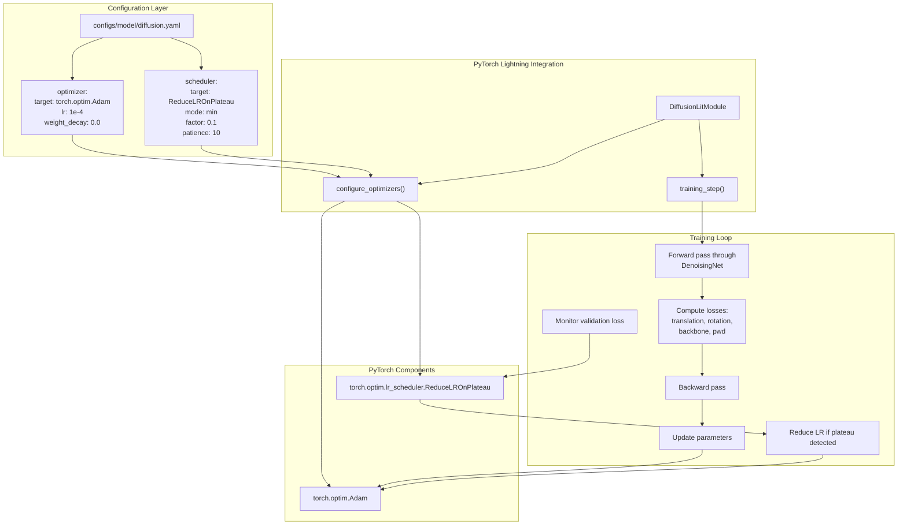
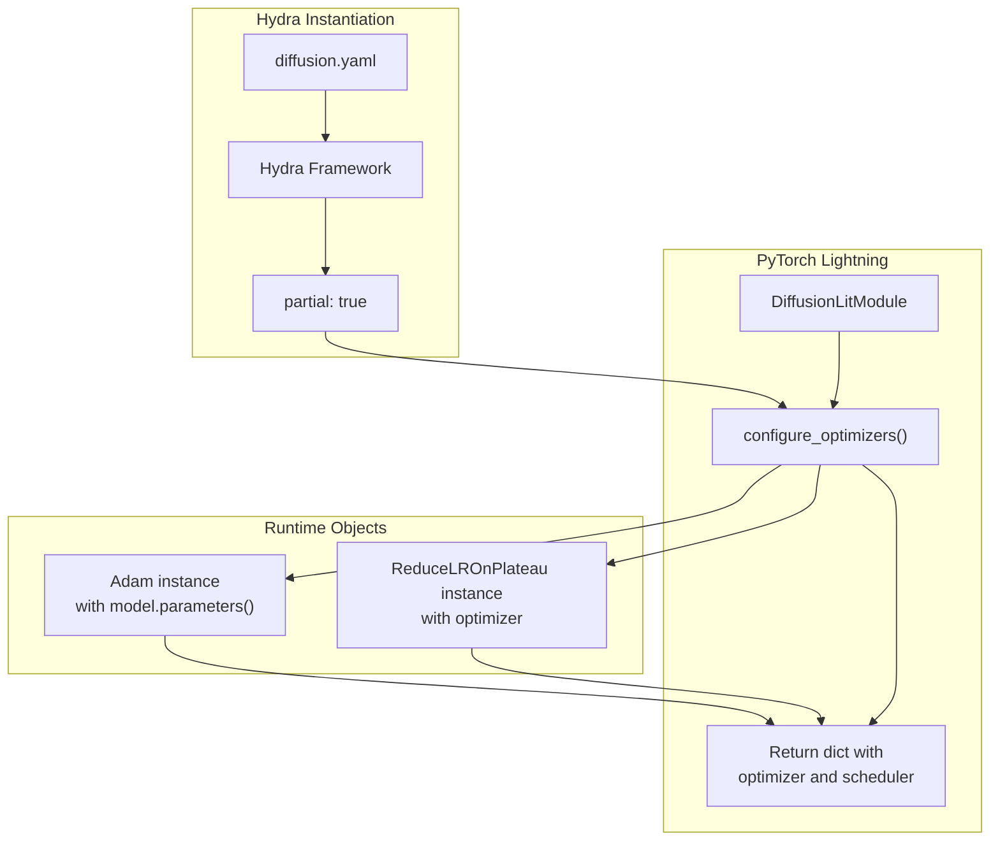

# Optimizer and Scheduler

> **Relevant source files**
> * [configs/model/diffusion.yaml](https://github.com/Junjie-Zhu/IDPFold/blob/ba40f40c/configs/model/diffusion.yaml)

This document describes the optimizer and learning rate scheduler configurations used during training of the IDPFold diffusion model. These components control how model parameters are updated and how the learning rate adapts during training to improve convergence.

For information about the overall model architecture, see [DiffusionLitModule Overview](/Junjie-Zhu/IDPFold/4.1-diffusionlitmodule-overview). For details on the loss functions being optimized, see [Loss Functions](/Junjie-Zhu/IDPFold/4.4-loss-functions). For training workflow documentation, see [Training Models](/Junjie-Zhu/IDPFold/3.4-training-models).

## Overview

IDPFold uses a standard Adam optimizer with a learning rate scheduler that reduces the learning rate when training progress plateaus. This optimization strategy is configured declaratively through Hydra in [configs/model/diffusion.yaml L3-L14](https://github.com/Junjie-Zhu/IDPFold/blob/ba40f40c/configs/model/diffusion.yaml#L3-L14)

 and instantiated by the PyTorch Lightning training framework.

The optimization configuration consists of two components:

* **Optimizer**: `torch.optim.Adam` with fixed hyperparameters
* **Scheduler**: `torch.optim.lr_scheduler.ReduceLROnPlateau` for adaptive learning rate reduction

**Sources**: [configs/model/diffusion.yaml L3-L14](https://github.com/Junjie-Zhu/IDPFold/blob/ba40f40c/configs/model/diffusion.yaml#L3-L14)

## Optimization Strategy Architecture



**Sources**: [configs/model/diffusion.yaml L1-L14](https://github.com/Junjie-Zhu/IDPFold/blob/ba40f40c/configs/model/diffusion.yaml#L1-L14)

## Adam Optimizer Configuration

The optimizer is configured as `torch.optim.Adam` with the following parameters:

| Parameter | Value | Description |
| --- | --- | --- |
| `_target_` | `torch.optim.Adam` | PyTorch optimizer class |
| `_partial_` | `true` | Hydra flag indicating partial instantiation |
| `lr` | `1e-4` (0.0001) | Initial learning rate |
| `weight_decay` | `0.0` | L2 regularization coefficient (disabled) |

The `_partial_: true` flag is a Hydra directive that creates a partial function. This allows PyTorch Lightning's `configure_optimizers()` method to receive a callable that can be invoked with the model parameters, rather than a pre-instantiated optimizer object.

### Why Adam?

Adam (Adaptive Moment Estimation) is chosen for its advantages in training deep neural networks:

* Adaptive learning rates per parameter
* Momentum-based updates for faster convergence
* Works well with sparse gradients (common in attention mechanisms like TranslationIPA)
* Minimal hyperparameter tuning required

### Weight Decay

Weight decay is set to `0.0`, meaning no L2 regularization is applied to the model parameters. This suggests that other regularization techniques (such as dropout in the attention layers) or the inherent regularization from the diffusion process are sufficient.

**Sources**: [configs/model/diffusion.yaml L3-L7](https://github.com/Junjie-Zhu/IDPFold/blob/ba40f40c/configs/model/diffusion.yaml#L3-L7)

## Learning Rate Scheduler Configuration

The learning rate scheduler is configured as `torch.optim.lr_scheduler.ReduceLROnPlateau` with adaptive reduction strategy:

| Parameter | Value | Description |
| --- | --- | --- |
| `_target_` | `torch.optim.lr_scheduler.ReduceLROnPlateau` | PyTorch scheduler class |
| `_partial_` | `true` | Hydra partial instantiation flag |
| `mode` | `min` | Reduce LR when monitored metric stops decreasing |
| `factor` | `0.1` | Multiply LR by 0.1 when reducing |
| `patience` | `10` | Number of epochs with no improvement before reducing |

### Scheduler Behavior

The `ReduceLROnPlateau` scheduler monitors the validation loss and reduces the learning rate when training progress stalls:

1. **Mode: min** - The scheduler tracks when the validation loss stops decreasing
2. **Patience: 10** - After 10 consecutive epochs without improvement, the learning rate is reduced
3. **Factor: 0.1** - The learning rate is multiplied by 0.1 (one order of magnitude reduction)

This creates a staged learning rate schedule:

* Initial: `lr = 1e-4`
* After first plateau: `lr = 1e-5`
* After second plateau: `lr = 1e-6`
* And so on...

**Sources**: [configs/model/diffusion.yaml L9-L14](https://github.com/Junjie-Zhu/IDPFold/blob/ba40f40c/configs/model/diffusion.yaml#L9-L14)

## Learning Rate Adaptation Flow


**Sources**: [configs/model/diffusion.yaml L3-L14](https://github.com/Junjie-Zhu/IDPFold/blob/ba40f40c/configs/model/diffusion.yaml#L3-L14)

## Integration with PyTorch Lightning

The optimizer and scheduler are integrated into `DiffusionLitModule` through PyTorch Lightning's standard interface. While the actual implementation code is in the `DiffusionLitModule` class (referenced at [configs/model/diffusion.yaml L1](https://github.com/Junjie-Zhu/IDPFold/blob/ba40f40c/configs/model/diffusion.yaml#L1-L1)

), the configuration declares how these components should be instantiated.

### Configuration Flow



The `_partial_: true` flag is crucial because:

1. PyTorch Lightning expects `configure_optimizers()` to instantiate the optimizer with the model's parameters
2. Hydra creates a partial function that defers instantiation until the model parameters are available
3. The scheduler is then instantiated with the optimizer as its argument

**Sources**: [configs/model/diffusion.yaml L1-L14](https://github.com/Junjie-Zhu/IDPFold/blob/ba40f40c/configs/model/diffusion.yaml#L1-L14)

## Configuration Parameter Reference

### Optimizer Parameters

The full configuration block for the optimizer:

```yaml
optimizer:  _target_: torch.optim.Adam  _partial_: true  lr: 1e-4  weight_decay: 0.0
```

**Tunable Parameters**:

* `lr`: Controls the step size for parameter updates. Higher values lead to faster but potentially unstable training. Default `1e-4` is conservative for diffusion models.
* `weight_decay`: L2 regularization coefficient. Set to `0.0` to disable. Can be increased (e.g., `1e-5` to `1e-3`) if overfitting occurs.

**Fixed Parameters**:

* `_target_`: Must reference a valid PyTorch optimizer class
* `_partial_`: Must be `true` for PyTorch Lightning integration

### Scheduler Parameters

The full configuration block for the scheduler:

```yaml
scheduler:  _target_: torch.optim.lr_scheduler.ReduceLROnPlateau  _partial_: true  mode: min  factor: 0.1  patience: 10
```

**Tunable Parameters**:

* `patience`: Number of epochs to wait before reducing learning rate. Increase for less aggressive reduction, decrease for faster adaptation.
* `factor`: Learning rate reduction factor. Common values: `0.1` (aggressive), `0.5` (moderate), `0.9` (conservative).
* `mode`: Set to `"min"` for loss minimization or `"max"` for metric maximization.

**Fixed Parameters**:

* `_target_`: Must reference a valid PyTorch learning rate scheduler class
* `_partial_`: Must be `true` for PyTorch Lightning integration

**Sources**: [configs/model/diffusion.yaml L3-L14](https://github.com/Junjie-Zhu/IDPFold/blob/ba40f40c/configs/model/diffusion.yaml#L3-L14)

## Practical Considerations

### When to Modify Optimizer Settings

**Increase learning rate** (`lr > 1e-4`) if:

* Training loss decreases too slowly
* Validation metrics improve very gradually
* GPU utilization is high but convergence is slow

**Decrease learning rate** (`lr < 1e-4`) if:

* Training loss exhibits high variance or oscillations
* Model diverges or produces NaN losses
* Fine-tuning a pretrained checkpoint

**Add weight decay** (`weight_decay > 0.0`) if:

* Validation loss increases while training loss decreases (overfitting)
* Model performance degrades on held-out test sets

### When to Modify Scheduler Settings

**Increase patience** (`patience > 10`) if:

* Training exhibits natural plateaus that resolve after several epochs
* Working with small datasets where validation metrics are noisy

**Decrease patience** (`patience < 10`) if:

* Training time is constrained
* Working with large datasets where validation metrics are stable

**Adjust factor** if:

* `factor = 0.5`: More gradual learning rate reduction for sensitive models
* `factor = 0.01`: More aggressive reduction for faster convergence

**Sources**: [configs/model/diffusion.yaml L3-L14](https://github.com/Junjie-Zhu/IDPFold/blob/ba40f40c/configs/model/diffusion.yaml#L3-L14)