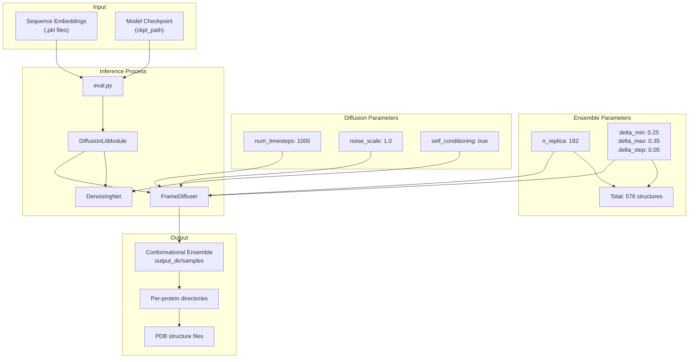
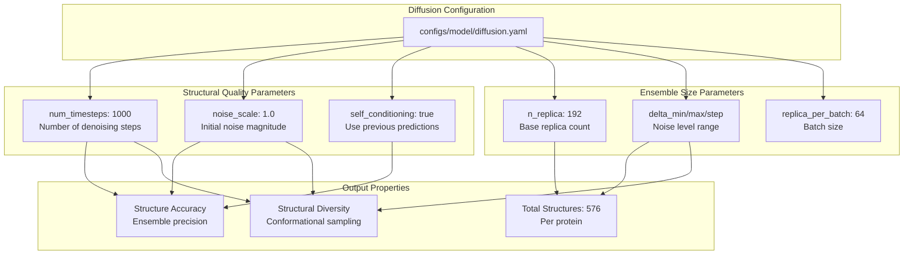
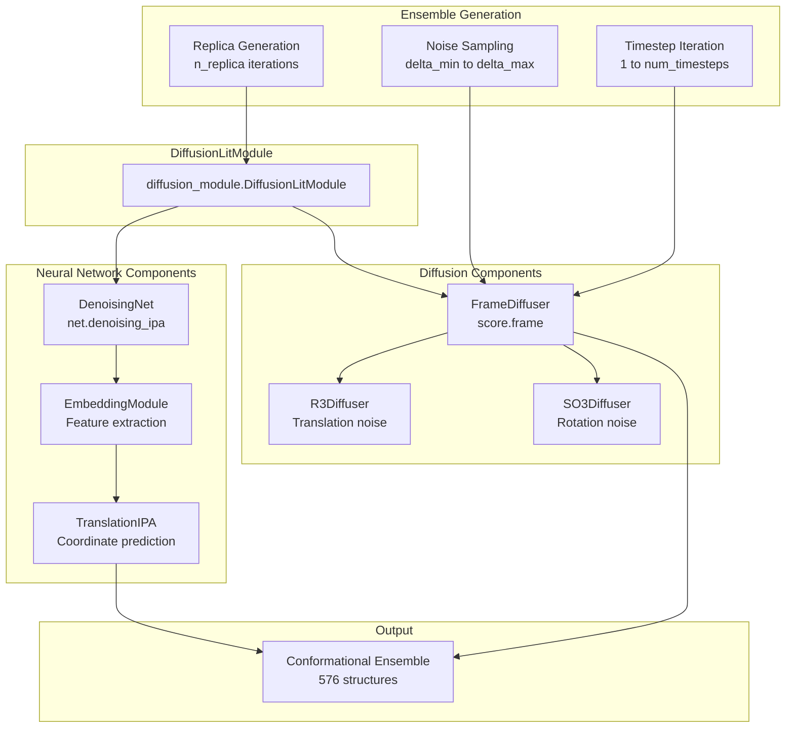

# Output Conformational Ensembles

> **Relevant source files**
> * [README.md](https://github.com/Junjie-Zhu/IDPFold/blob/ba40f40c/README.md?plain=1)
> * [configs/model/diffusion.yaml](https://github.com/Junjie-Zhu/IDPFold/blob/ba40f40c/configs/model/diffusion.yaml)
> * [data/example.fasta](https://github.com/Junjie-Zhu/IDPFold/blob/ba40f40c/data/example.fasta)

## Purpose and Scope

This page documents the format, structure, and interpretation of conformational ensembles generated by IDPFold during inference. It covers the output file organization, ensemble composition, and the relationship between inference parameters and generated structures.

For information about running the inference process that generates these ensembles, see [Running Inference](/Junjie-Zhu/IDPFold/3.3-running-inference). For details on the inference parameters that control ensemble properties, see [Inference Parameters](/Junjie-Zhu/IDPFold/7.1-inference-parameters).

---

## Ensemble Generation Overview

IDPFold generates **conformational ensembles** for each input protein sequence. A conformational ensemble is a collection of multiple 3D structural conformations that represent the heterogeneous structural landscape of intrinsically disordered proteins (IDPs). Unlike folded proteins that adopt a single stable structure, IDPs exist as dynamic ensembles of interconverting conformations.

The diffusion model generates these ensembles by:

1. Starting from random noise in 3D coordinate space
2. Iteratively denoising over `num_timesteps` steps (default: 1000)
3. Producing multiple independent structural replicas
4. Sampling across different noise levels to capture structural diversity

**Sources:** [README.md L12-L14](https://github.com/Junjie-Zhu/IDPFold/blob/ba40f40c/README.md?plain=1#L12-L14)

 [configs/model/diffusion.yaml L87-L101](https://github.com/Junjie-Zhu/IDPFold/blob/ba40f40c/configs/model/diffusion.yaml#L87-L101)

---

## Output Directory Structure

Generated conformational ensembles are saved to the directory specified by the `output_dir` parameter in the inference configuration.

```
${paths.output_dir}/samples/
├── protein_1/
│   ├── ensemble_1.pdb
│   ├── ensemble_2.pdb
│   └── ...
├── protein_2/
│   ├── ensemble_1.pdb
│   ├── ensemble_2.pdb
│   └── ...
└── ...
```

The default output directory is configured as:

```
output_dir: ${paths.output_dir}/samples
```

Each protein sequence from the input generates a separate subdirectory containing its conformational ensemble structures.

**Sources:** [configs/model/diffusion.yaml L99](https://github.com/Junjie-Zhu/IDPFold/blob/ba40f40c/configs/model/diffusion.yaml#L99-L99)

---

## Ensemble Composition

### Structure Count Calculation

The total number of structures generated per protein is determined by the following inference parameters:

| Parameter | Default Value | Description |
| --- | --- | --- |
| `n_replica` | 192 | Base number of structural replicas |
| `delta_min` | 0.25 | Minimum noise level parameter |
| `delta_max` | 0.35 | Maximum noise level parameter |
| `delta_step` | 0.05 | Step size between noise levels |

The total number of structures is calculated as:

```
total_structures = n_replica × ((delta_max - delta_min) / delta_step + 1)
```

With default parameters:

```
total_structures = 192 × ((0.35 - 0.25) / 0.05 + 1)
                 = 192 × (0.1 / 0.05 + 1)
                 = 192 × 3
                 = 576 structures per protein
```

### Replica Batching

Structures are generated in batches to manage memory usage:

* `replica_per_batch`: 64 structures generated simultaneously
* Total batches: 576 / 64 = 9 batches per protein

**Sources:** [configs/model/diffusion.yaml L92-L93](https://github.com/Junjie-Zhu/IDPFold/blob/ba40f40c/configs/model/diffusion.yaml#L92-L93)

---

## Ensemble Generation Pipeline

The following diagram illustrates how conformational ensembles are generated from preprocessed inputs:



**Sources:** [configs/model/diffusion.yaml L87-L101](https://github.com/Junjie-Zhu/IDPFold/blob/ba40f40c/configs/model/diffusion.yaml#L87-L101)

 [README.md L46-L59](https://github.com/Junjie-Zhu/IDPFold/blob/ba40f40c/README.md?plain=1#L46-L59)

---

## Parameter-Ensemble Mapping

The following diagram shows the relationship between configuration parameters and ensemble properties:



**Sources:** [configs/model/diffusion.yaml L87-L101](https://github.com/Junjie-Zhu/IDPFold/blob/ba40f40c/configs/model/diffusion.yaml#L87-L101)

---

## File Format

While the specific output file format is not explicitly documented in the provided source files, based on the system architecture and common practices in structural biology:

### Expected Output Format

* **Format**: PDB (Protein Data Bank) format or similar structural format
* **Coordinates**: 3D Cartesian coordinates for protein backbone atoms
* **Atoms**: Minimally includes Cα (alpha carbon) atoms; may include full backbone (N, Cα, C, O)
* **Metadata**: Header information identifying the protein sequence and structure index

### Structure Organization

Each structure file in the ensemble represents:

* A single conformational snapshot
* Independent sampling from the diffusion model
* The same protein sequence in different spatial arrangements

**Sources:** [README.md L12-L14](https://github.com/Junjie-Zhu/IDPFold/blob/ba40f40c/README.md?plain=1#L12-L14)

 [data/example.fasta L1-L6](https://github.com/Junjie-Zhu/IDPFold/blob/ba40f40c/data/example.fasta#L1-L6)

---

## Inference Configuration Reference

The following table summarizes all inference parameters that control ensemble generation:

| Parameter | Type | Default | Description |
| --- | --- | --- | --- |
| `delta_min` | float | 0.25 | Minimum noise level for sampling |
| `delta_max` | float | 0.35 | Maximum noise level for sampling |
| `delta_step` | float | 0.05 | Step size between noise levels |
| `n_replica` | int | 192 | Number of structural replicas per noise level |
| `replica_per_batch` | int | 64 | Batch size for memory management |
| `num_timesteps` | int | 1000 | Number of diffusion denoising steps |
| `noise_scale` | float | 1.0 | Scaling factor for initial noise |
| `probability_flow` | bool | false | Use probability flow ODE sampling |
| `self_conditioning` | bool | true | Enable self-conditioning during inference |
| `min_t` | float | 1e-2 | Minimum time value for diffusion process |
| `output_dir` | path | `${paths.output_dir}/samples` | Directory for saving ensembles |
| `backward_only` | bool | true | Only perform backward diffusion process |

**Sources:** [configs/model/diffusion.yaml L87-L101](https://github.com/Junjie-Zhu/IDPFold/blob/ba40f40c/configs/model/diffusion.yaml#L87-L101)

---

## Interpreting Ensembles

### Ensemble Properties

The generated conformational ensembles can be analyzed to extract IDP properties:

1. **Structural Heterogeneity**: The diversity of conformations reflects the intrinsic disorder
2. **Radius of Gyration (Rg)**: Computed from the ensemble to characterize compactness
3. **End-to-End Distance**: Distribution across conformations indicates chain extension
4. **Contact Maps**: Pairwise distances reveal transient structural preferences
5. **Secondary Structure Content**: Statistical analysis across the ensemble

### Usage Patterns

The ensembles can be used for:

* Computing ensemble-averaged properties for comparison with experiments (SAXS, FRET, NMR)
* Visualizing conformational space sampling
* Identifying representative structures or clusters
* Input for further molecular dynamics refinement
* Training data for other machine learning models

**Sources:** [README.md L10-L14](https://github.com/Junjie-Zhu/IDPFold/blob/ba40f40c/README.md?plain=1#L10-L14)

---

## Example Workflow

For the example sequences in `data/example.fasta`:

```
> Abeta40
DAEFRHDSGYEVHHQKLVFFAEDVGSNKGAIIGLMVGGVV
> PaaA2
MDYKDDDDKNRALSPMVSEFETIEQENSYNEWLRAKVATSLADPRPAIPHDEVERRMAERFAKMRKERSKQ
> p15PAF
VRTKADSVPGTYRKVVAARAPRKVLGSSTSATNSTSVSSRKAENKYAGGNPVCVRPTPKWQKGIGEFFRLSPKDSEKENQIPEEAGSSGLGKAKRKACPLQPDHTNDEKE
```

After running inference:

```
python src/eval.py ckpt_path='/path/to/ckpt'
```

The output directory structure would be:

```markdown
${paths.output_dir}/samples/
├── Abeta40/
│   ├── structure_001.pdb
│   ├── structure_002.pdb
│   ├── ...
│   └── structure_576.pdb  # 576 structures total
├── PaaA2/
│   ├── structure_001.pdb
│   ├── ...
│   └── structure_576.pdb
└── p15PAF/
    ├── structure_001.pdb
    ├── ...
    └── structure_576.pdb
```

Each protein generates 576 conformations representing its structural ensemble.

**Sources:** [data/example.fasta L1-L6](https://github.com/Junjie-Zhu/IDPFold/blob/ba40f40c/data/example.fasta#L1-L6)

 [README.md L46-L59](https://github.com/Junjie-Zhu/IDPFold/blob/ba40f40c/README.md?plain=1#L46-L59)

---

## Customizing Ensemble Generation

To modify ensemble properties, edit the inference section in the configuration file before running inference:

### Increasing Ensemble Size

To generate more structures per protein:

```yaml
inference:  n_replica: 384  # Double the number of replicas  # Results in 384 × 3 = 1,152 structures per protein
```

### Increasing Structural Diversity

To sample across a wider range of noise levels:

```yaml
inference:  delta_min: 0.2  delta_max: 0.4  delta_step: 0.05  # Results in 192 × 5 = 960 structures per protein
```

### Improving Structure Quality

To increase denoising iterations for potentially higher quality:

```yaml
inference:  num_timesteps: 2000  # More denoising steps  noise_scale: 0.8     # Lower initial noise
```

**Sources:** [configs/model/diffusion.yaml L87-L101](https://github.com/Junjie-Zhu/IDPFold/blob/ba40f40c/configs/model/diffusion.yaml#L87-L101)

---

## Relationship to Model Components

The following diagram shows how model components contribute to ensemble generation:



**Sources:** [configs/model/diffusion.yaml L1-L103](https://github.com/Junjie-Zhu/IDPFold/blob/ba40f40c/configs/model/diffusion.yaml#L1-L103)

---

## Performance Considerations

### Memory Requirements

* Each batch generates `replica_per_batch` structures simultaneously
* GPU memory usage scales with batch size and protein length
* Default batch size (64) balances speed and memory

### Generation Time

Approximate time per protein (GPU-dependent):

* ~1-5 seconds per structure
* ~10-50 minutes for full ensemble of 576 structures
* Scales linearly with protein length and `num_timesteps`

### Storage Requirements

Storage per protein depends on:

* Sequence length (longer proteins have more atoms)
* File format (PDB is text-based, larger than binary formats)
* Number of structures (576 with defaults)

Typical storage: ~10-100 MB per protein ensemble

**Sources:** [configs/model/diffusion.yaml L92-L94](https://github.com/Junjie-Zhu/IDPFold/blob/ba40f40c/configs/model/diffusion.yaml#L92-L94)