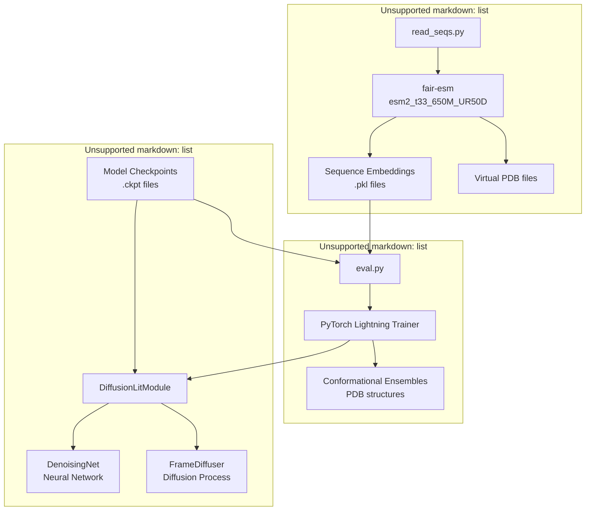
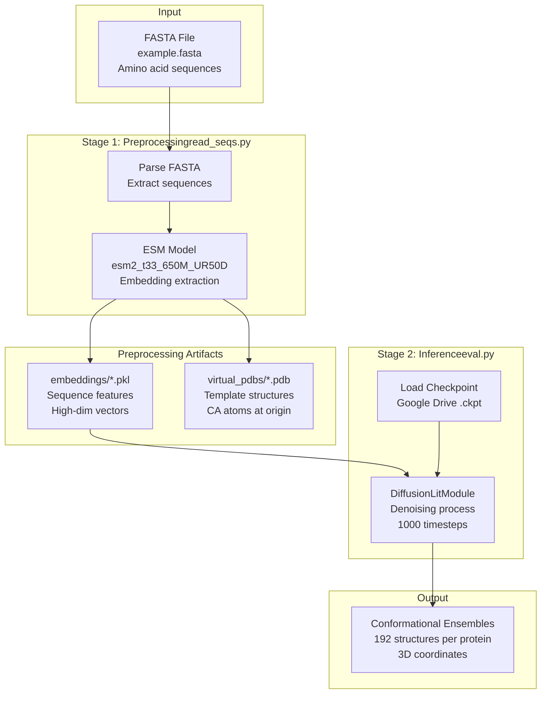
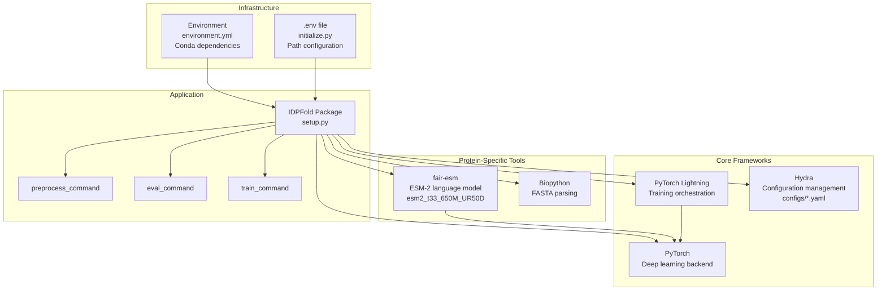
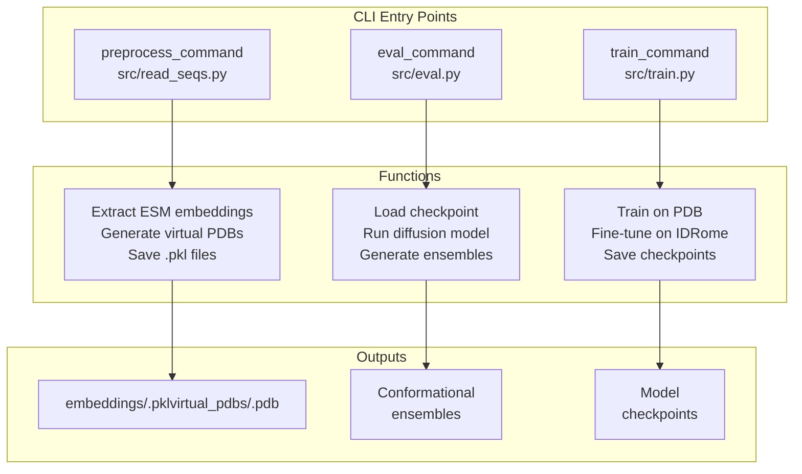
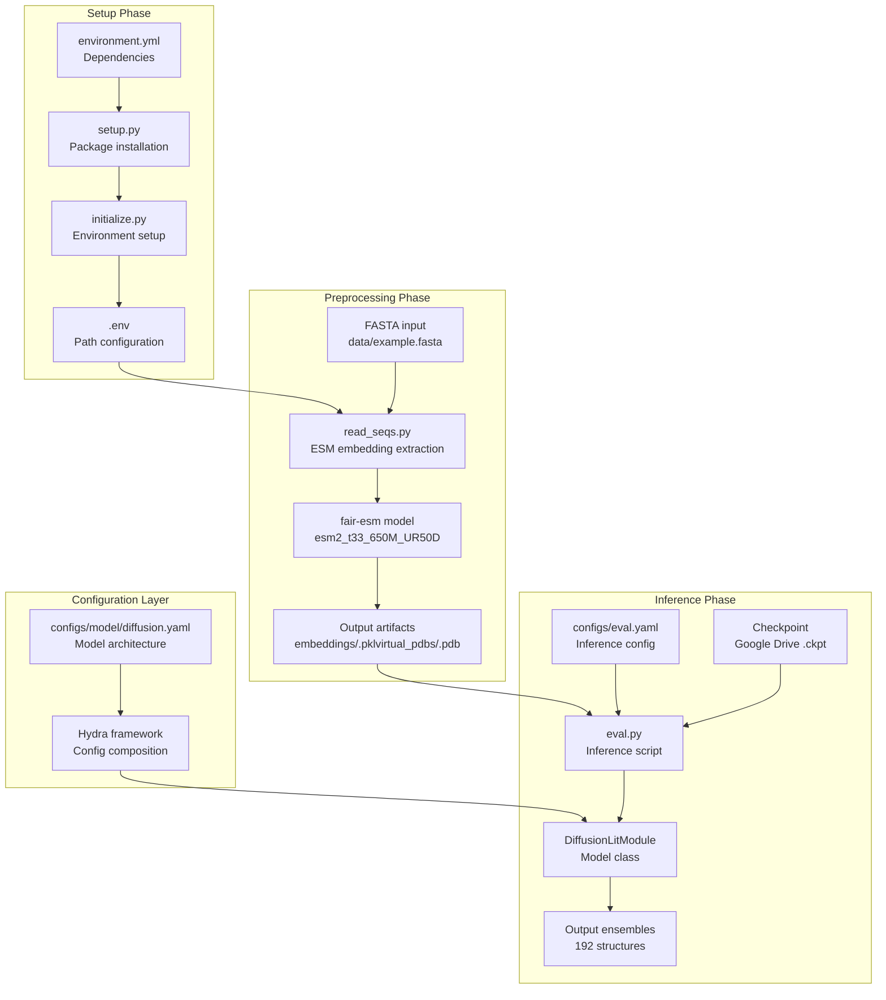

# Overview

> **Relevant source files**
> * [README.md](https://github.com/Junjie-Zhu/IDPFold/blob/ba40f40c/README.md?plain=1)
> * [assets/Overview.png](https://github.com/Junjie-Zhu/IDPFold/blob/ba40f40c/assets/Overview.png)
> * [data/example.fasta](https://github.com/Junjie-Zhu/IDPFold/blob/ba40f40c/data/example.fasta)

This document provides an introduction to IDPFold, a system for predicting conformational ensembles of Intrinsically Disordered Proteins (IDPs) using diffusion models. IDPFold operates directly from protein sequences without requiring Multiple Sequence Alignments (MSA) or experimental data, generating accurate ensemble predictions through a trained diffusion-based neural network.

This overview covers the system's purpose, core components, and high-level workflow. For detailed scientific background on IDPs and diffusion models, see [Key Concepts](/Junjie-Zhu/IDPFold/1.1-key-concepts). For architectural details and component interactions, see [System Architecture](/Junjie-Zhu/IDPFold/1.2-system-architecture). For practical usage instructions, see [User Guide](/Junjie-Zhu/IDPFold/3-user-guide).

**Sources**: [README.md L1-L69](https://github.com/Junjie-Zhu/IDPFold/blob/ba40f40c/README.md?plain=1#L1-L69)

---

## Purpose and Capabilities

IDPFold is a generative deep learning model that predicts IDP conformational ensembles from amino acid sequences. The system addresses the challenge of modeling intrinsically disordered proteins, which lack fixed three-dimensional structures and instead adopt multiple conformations in solution.

**Key Capabilities**:

* **Sequence-to-ensemble generation**: Converts FASTA sequences to 3D conformational ensembles
* **MSA-independent**: Does not require multiple sequence alignments
* **Pre-trained and fine-tuned**: Pre-trained on PDB database, fine-tuned on IDRome dataset
* **Ensemble diversity**: Generates multiple replica structures (default: 192 per sequence)
* **No experimental data required**: Predictions based solely on sequence input

**Sources**: [README.md L10-L14](https://github.com/Junjie-Zhu/IDPFold/blob/ba40f40c/README.md?plain=1#L10-L14)

---

## System Components

IDPFold consists of three primary subsystems that operate sequentially:

### Preprocessing System

The preprocessing system extracts sequence embeddings using the ESM protein language model. The `read_seqs.py` script processes FASTA files and generates two outputs:

* **Sequence embeddings**: High-dimensional feature vectors stored as `.pkl` files
* **Virtual PDB files**: Placeholder structures with dummy coordinates at origin

**Sources**: [README.md L54-L55](https://github.com/Junjie-Zhu/IDPFold/blob/ba40f40c/README.md?plain=1#L54-L55)

 Diagram 1 from system architecture

### Model System

The core diffusion model is implemented in the `DiffusionLitModule` class, which orchestrates:

* **DenoisingNet**: Neural network with embedding layers and attention mechanisms
* **FrameDiffuser**: Diffusion process handling translation (R3) and rotation (SO3) components
* **Checkpoints**: Pre-trained weights available via Google Drive

**Sources**: [README.md L50](https://github.com/Junjie-Zhu/IDPFold/blob/ba40f40c/README.md?plain=1#L50-L50)

 Diagram 4 from system architecture

### Inference System

The `eval.py` script coordinates inference using PyTorch Lightning's Trainer:

* Loads model checkpoints
* Processes sequence embeddings through the diffusion model
* Generates conformational ensembles with configurable replica counts

**Sources**: [README.md L58-L59](https://github.com/Junjie-Zhu/IDPFold/blob/ba40f40c/README.md?plain=1#L58-L59)

 Diagram 2 from system architecture

---

## End-to-End Workflow

The following diagram illustrates the complete data flow from input sequences to output conformational ensembles, showing the specific files and data formats at each stage:

### Workflow Stages

| Stage | Input | Process | Output | CLI Command |
| --- | --- | --- | --- | --- |
| **Preprocessing** | `example.fasta` | Extract ESM embeddings | `*.pkl`, virtual PDB files | `python src/read_seqs.py` |
| **Inference** | Embeddings + checkpoint | Run diffusion model | Conformational ensembles | `python src/eval.py` |

**Key Characteristics**:

* **Decoupled stages**: Each stage can be run independently
* **Reusable embeddings**: Preprocessing results cached for multiple inference runs
* **Checkpoint-based**: System state preserved between stages via file outputs

**Sources**: [README.md L47-L59](https://github.com/Junjie-Zhu/IDPFold/blob/ba40f40c/README.md?plain=1#L47-L59)

 [data/example.fasta L1-L6](https://github.com/Junjie-Zhu/IDPFold/blob/ba40f40c/data/example.fasta#L1-L6)

 Diagram 6 from system architecture

---

## Technology Stack and Dependencies

IDPFold is built on modern deep learning frameworks with specialized tools for protein structure prediction:

### Framework Layer

* **PyTorch Lightning**: Orchestrates training and inference with the `Trainer` API
* **Hydra**: Manages hierarchical configuration from YAML files in `configs/`
* **PyTorch**: Provides the underlying tensor operations and GPU acceleration

### Domain-Specific Layer

* **fair-esm**: Facebook's ESM-2 protein language model for extracting sequence embeddings
* **Biopython**: Handles FASTA file parsing and biological sequence operations

### Configuration Layer

* **environment.yml**: Specifies conda dependencies for reproducible environments
* **initialize.py**: Sets up `.env` file with dataset paths and directory structure
* **.env file**: Contains runtime configuration for data locations

**Sources**: [README.md L22-L43](https://github.com/Junjie-Zhu/IDPFold/blob/ba40f40c/README.md?plain=1#L22-L43)

 Diagram 5 from system architecture

---

## Command-Line Interface

IDPFold provides three console script entry points defined in `setup.py`:

| Command | Purpose | Typical Usage |
| --- | --- | --- |
| `preprocess_command` | Extract sequence embeddings | Process FASTA files before inference |
| `eval_command` | Generate conformational ensembles | Predict structures from sequences |
| `train_command` | Train/fine-tune models | Model development (to be updated) |

For detailed command options and arguments, see [Command-Line Interface](/Junjie-Zhu/IDPFold/6-command-line-interface).

**Sources**: [README.md L54-L59](https://github.com/Junjie-Zhu/IDPFold/blob/ba40f40c/README.md?plain=1#L54-L59)

 Diagram 1 from system architecture

---

## Model Training and Checkpoints

IDPFold employs a two-stage training strategy:

1. **Pre-training**: Model trained on the PDB database to learn general protein structure principles
2. **Fine-tuning**: Model specialized on IDRome dataset to capture IDP-specific conformational properties

Pre-trained model checkpoints are hosted on Google Drive and must be downloaded before running inference. The checkpoint file contains the complete model state including:

* Neural network weights for `DenoisingNet`
* Diffusion process parameters for `FrameDiffuser`
* Optimizer state and training hyperparameters

**Note**: Detailed training procedures are currently being documented. See [Training Models](/Junjie-Zhu/IDPFold/3.4-training-models) for updates.

**Sources**: [README.md L14-L18](https://github.com/Junjie-Zhu/IDPFold/blob/ba40f40c/README.md?plain=1#L14-L18)

 [README.md L50](https://github.com/Junjie-Zhu/IDPFold/blob/ba40f40c/README.md?plain=1#L50-L50)

 [README.md L62-L63](https://github.com/Junjie-Zhu/IDPFold/blob/ba40f40c/README.md?plain=1#L62-L63)

---

## Example Input and Output

IDPFold processes standard FASTA-formatted sequences. The system includes example sequences in `data/example.fasta`:

| Protein | Length | Sequence |
| --- | --- | --- |
| Abeta40 | 42 residues | `DAEFRHDSGYEVHHQKLVFFAEDVGSNKGAIIGLMVGGVV` |
| PaaA2 | 72 residues | `MDYKDDDDKNRALSPM...AKMRKERSKQ` |
| p15PAF | 114 residues | `VRTKADSVPGTYRKVV...HTNDEKE` |

For each input sequence, IDPFold generates:

* A conformational ensemble with 192 replica structures (configurable)
* Each structure represented as 3D coordinates for backbone atoms
* Ensemble captures the heterogeneous nature of IDP conformations

For details on file formats, see [File Formats and Data](/Junjie-Zhu/IDPFold/8-file-formats-and-data).

**Sources**: [data/example.fasta L1-L6](https://github.com/Junjie-Zhu/IDPFold/blob/ba40f40c/data/example.fasta#L1-L6)

 [README.md L49](https://github.com/Junjie-Zhu/IDPFold/blob/ba40f40c/README.md?plain=1#L49-L49)

---

## System Architecture Summary

The following diagram maps the high-level system flow to specific code components:

This architecture follows a clear separation of concerns:

* **Setup**: Environment and configuration initialization
* **Preprocessing**: Sequence-to-embedding transformation (reusable)
* **Inference**: Embedding-to-structure generation (model-dependent)
* **Configuration**: Declarative parameter management via Hydra

For detailed architectural descriptions, see [System Architecture](/Junjie-Zhu/IDPFold/1.2-system-architecture). For model internals, see [Model Architecture](/Junjie-Zhu/IDPFold/4-model-architecture).

**Sources**: [README.md L1-L69](https://github.com/Junjie-Zhu/IDPFold/blob/ba40f40c/README.md?plain=1#L1-L69)

 All diagrams from system architecture