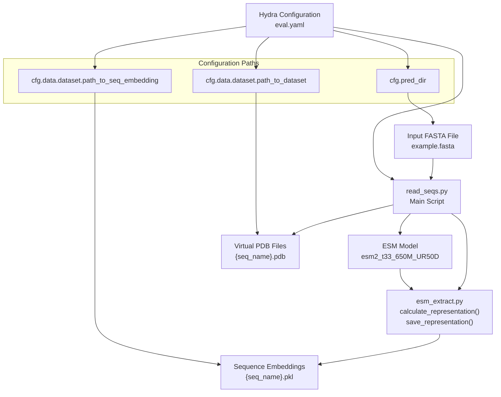
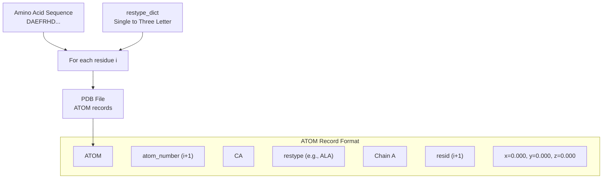
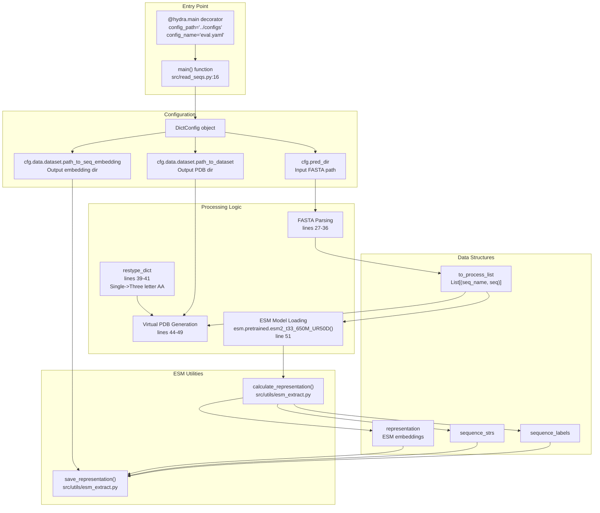

# Preprocessing Sequences

> **Relevant source files**
> * [README.md](https://github.com/Junjie-Zhu/IDPFold/blob/ba40f40c/README.md?plain=1)
> * [data/example.fasta](https://github.com/Junjie-Zhu/IDPFold/blob/ba40f40c/data/example.fasta)
> * [initialize.py](https://github.com/Junjie-Zhu/IDPFold/blob/ba40f40c/initialize.py)
> * [src/read_seqs.py](https://github.com/Junjie-Zhu/IDPFold/blob/ba40f40c/src/read_seqs.py)

## Purpose and Scope

This page documents the preprocessing stage of IDPFold, which converts raw protein sequences in FASTA format into the intermediate representations required for structure prediction. Preprocessing performs two key tasks:

1. **ESM Embedding Extraction**: Generates high-dimensional sequence embeddings using the ESM-2 protein language model
2. **Virtual PDB Generation**: Creates placeholder PDB files with dummy coordinates to satisfy downstream pipeline requirements

For information about running inference with these preprocessed files, see [Running Inference](/Junjie-Zhu/IDPFold/3.3-running-inference). For technical details about the ESM embedding process, see [ESM Embedding Extraction](/Junjie-Zhu/IDPFold/7.2-esm-embedding-extraction). For virtual PDB file format specifics, see [Virtual PDB Files](/Junjie-Zhu/IDPFold/7.3-virtual-pdb-files).

**Sources:** [README.md L45-L59](https://github.com/Junjie-Zhu/IDPFold/blob/ba40f40c/README.md?plain=1#L45-L59)

 [src/read_seqs.py L1-L63](https://github.com/Junjie-Zhu/IDPFold/blob/ba40f40c/src/read_seqs.py#L1-L63)

---

## Overview of the Preprocessing Pipeline

The preprocessing pipeline is implemented in `read_seqs.py` and orchestrated through Hydra configuration. The script processes one or more protein sequences and produces two types of output files for each sequence.

### Preprocessing Data Flow



**Sources:** [src/read_seqs.py L15-L62](https://github.com/Junjie-Zhu/IDPFold/blob/ba40f40c/src/read_seqs.py#L15-L62)

 [README.md L53-L59](https://github.com/Junjie-Zhu/IDPFold/blob/ba40f40c/README.md?plain=1#L53-L59)

---

## Input Requirements

### FASTA File Format

The preprocessing script accepts standard FASTA format files containing one or more protein sequences. Each sequence requires:

* A header line starting with `>` followed by the sequence identifier
* One or more lines containing the amino acid sequence (single-letter codes)

**Example FASTA file** ([data/example.fasta](https://github.com/Junjie-Zhu/IDPFold/blob/ba40f40c/data/example.fasta)

):

```
> Abeta40
DAEFRHDSGYEVHHQKLVFFAEDVGSNKGAIIGLMVGGVV
> PaaA2
MDYKDDDDKNRALSPMVSEFETIEQENSYNEWLRAKVATSLADPRPAIPHDEVERRMAERFAKMRKERSKQ
> p15PAF
VRTKADSVPGTYRKVVAARAPRKVLGSSTSATNSTSVSSRKAENKYAGGNPVCVRPTPKWQKGIGEFFRLSPKDSEKENQIPEEAGSSGLGKAKRKACPLQPDHTNDEKE
```

The script parses this format at [src/read_seqs.py L27-L36](https://github.com/Junjie-Zhu/IDPFold/blob/ba40f40c/src/read_seqs.py#L27-L36)

 extracting sequence names and amino acid strings into a list of tuples.

**Supported Amino Acids**: The script uses a standard 20-amino-acid dictionary defined at [src/read_seqs.py L39-L41](https://github.com/Junjie-Zhu/IDPFold/blob/ba40f40c/src/read_seqs.py#L39-L41)

 Only standard single-letter codes (A, C, D, E, F, G, H, I, K, L, M, N, P, Q, R, S, T, V, W, Y) are supported.

**Sources:** [data/example.fasta L1-L6](https://github.com/Junjie-Zhu/IDPFold/blob/ba40f40c/data/example.fasta#L1-L6)

 [src/read_seqs.py L27-L41](https://github.com/Junjie-Zhu/IDPFold/blob/ba40f40c/src/read_seqs.py#L27-L41)

---

## Running the Preprocessing Command

### Basic Usage

The preprocessing script can be executed in two ways:

**Method 1: Using the console script** (if installed via `pip install -e .`):

```
preprocess_command pred_dir='./data/example.fasta'
```

**Method 2: Direct Python execution**:

```
python src/read_seqs.py pred_dir='./data/example.fasta'
```

Both methods are functionally identical. The `preprocess_command` entry point is defined in [setup.py](https://github.com/Junjie-Zhu/IDPFold/blob/ba40f40c/setup.py)

 as a console script that calls `src.read_seqs:main`.

**Sources:** [README.md L54-L55](https://github.com/Junjie-Zhu/IDPFold/blob/ba40f40c/README.md?plain=1#L54-L55)

### Configuration Parameters

The script uses Hydra configuration management, loading settings from `configs/eval.yaml`. Key parameters can be overridden on the command line:

| Parameter | Config Path | Default | Description |
| --- | --- | --- | --- |
| `pred_dir` | `cfg.pred_dir` | - | Path to input FASTA file (required) |
| `path_to_seq_embedding` | `cfg.data.dataset.path_to_seq_embedding` | From `.env` (`EMBEDDING`) | Output directory for `.pkl` embedding files |
| `path_to_dataset` | `cfg.data.dataset.path_to_dataset` | From `.env` (`TEST_DATA`) | Output directory for `.pdb` virtual files |

The default output paths are configured through the `.env` file created by [initialize.py](https://github.com/Junjie-Zhu/IDPFold/blob/ba40f40c/initialize.py)

 See [Environment Configuration](/Junjie-Zhu/IDPFold/2.3-environment-configuration) for details.

**Example with custom output paths:**

```
python src/read_seqs.py pred_dir='./my_sequences.fasta' \  data.dataset.path_to_seq_embedding='./custom_embeddings' \  data.dataset.path_to_dataset='./custom_pdb'
```

**Sources:** [src/read_seqs.py L15-L24](https://github.com/Junjie-Zhu/IDPFold/blob/ba40f40c/src/read_seqs.py#L15-L24)

 [initialize.py L6-L11](https://github.com/Junjie-Zhu/IDPFold/blob/ba40f40c/initialize.py#L6-L11)

---

## Internal Processing Steps

### Step 1: FASTA Parsing

The script reads the input FASTA file and constructs a list of `(seq_name, seq)` tuples at [src/read_seqs.py L26-L36](https://github.com/Junjie-Zhu/IDPFold/blob/ba40f40c/src/read_seqs.py#L26-L36)

:

```
to_process_list = []with open(input_fasta, 'r') as f:    lines = f.readlines()    seq_name, seq = '', ''    for line in lines:        if line.startswith('>'):            seq_name = line[1:].strip()        else:            seq = line.strip()            to_process_list.append((seq_name, seq))
```

This simple parser assumes each sequence is on a single line following its header. Multi-line sequences are not explicitly handled.

**Sources:** [src/read_seqs.py L26-L36](https://github.com/Junjie-Zhu/IDPFold/blob/ba40f40c/src/read_seqs.py#L26-L36)

### Step 2: Virtual PDB File Generation

Before ESM processing, the script creates virtual PDB files at [src/read_seqs.py L43-L49](https://github.com/Junjie-Zhu/IDPFold/blob/ba40f40c/src/read_seqs.py#L43-L49)

 These files contain only CA (alpha-carbon) atoms with placeholder coordinates at the origin (0, 0, 0).

### Virtual PDB Structure



**Generated PDB format:**

```
ATOM      1  CA  ASP A   1      0.000   0.000   0.000  1.00  0.00           C
ATOM      2  CA  ALA A   2      0.000   0.000   0.000  1.00  0.00           C
ATOM      3  CA  GLU A   3      0.000   0.000   0.000  1.00  0.00           C
```

The purpose of these virtual PDB files is to provide structural templates for downstream processing, even though they contain no actual 3D information. The inference pipeline requires PDB files to initialize data structures. See [Virtual PDB Files](/Junjie-Zhu/IDPFold/7.3-virtual-pdb-files) for more details.

**Sources:** [src/read_seqs.py L39-L49](https://github.com/Junjie-Zhu/IDPFold/blob/ba40f40c/src/read_seqs.py#L39-L49)

### Step 3: ESM Model Loading

The script loads the ESM-2 model at [src/read_seqs.py L51-L52](https://github.com/Junjie-Zhu/IDPFold/blob/ba40f40c/src/read_seqs.py#L51-L52)

:

```
model, alphabet = esm.pretrained.esm2_t33_650M_UR50D()model = model.to(device)
```

| Model Component | Details |
| --- | --- |
| **Model Name** | `esm2_t33_650M_UR50D` |
| **Architecture** | ESM-2 transformer with 33 layers |
| **Parameters** | 650 million parameters |
| **Training Data** | UniRef50 database |
| **Device** | CUDA if available, otherwise CPU |

The model and alphabet objects are used together to tokenize sequences and extract embeddings. Device selection occurs at [src/read_seqs.py L24](https://github.com/Junjie-Zhu/IDPFold/blob/ba40f40c/src/read_seqs.py#L24-L24)

**Sources:** [src/read_seqs.py L24](https://github.com/Junjie-Zhu/IDPFold/blob/ba40f40c/src/read_seqs.py#L24-L24)

 [src/read_seqs.py L51-L52](https://github.com/Junjie-Zhu/IDPFold/blob/ba40f40c/src/read_seqs.py#L51-L52)

### Step 4: Embedding Extraction and Saving

The script calls utility functions from `src/utils/esm_extract.py` to extract and save embeddings at [src/read_seqs.py L55-L58](https://github.com/Junjie-Zhu/IDPFold/blob/ba40f40c/src/read_seqs.py#L55-L58)

:

```mermaid
sequenceDiagram
  participant read_seqs.py
  participant calculate_representation()
  participant ESM Model
  participant save_representation()
  participant File System

  read_seqs.py->>calculate_representation(): Pass model, alphabet, to_process_list
  calculate_representation()->>ESM Model: Tokenize and forward pass
  ESM Model-->>calculate_representation(): Raw embeddings
  calculate_representation()-->>read_seqs.py: sequence_labels, sequence_strs, representation
  loop [For each sequence]
    read_seqs.py->>save_representation(): Pass labels, strs, reps, output_path
    save_representation()->>File System: Write {seq_name}.pkl
  end
```

**Key functions:**

* **`calculate_representation(model, alphabet, to_process_list, device)`**: Processes sequences through ESM model, returning sequence labels, strings, and embeddings
* **`save_representation(labels, strs, reps, output_path)`**: Serializes embeddings to pickle files

The embeddings are saved as `.pkl` files, one per sequence, in the directory specified by `path_to_seq_embedding`.

**Sources:** [src/read_seqs.py L55-L58](https://github.com/Junjie-Zhu/IDPFold/blob/ba40f40c/src/read_seqs.py#L55-L58)

 [src/read_seqs.py L10](https://github.com/Junjie-Zhu/IDPFold/blob/ba40f40c/src/read_seqs.py#L10-L10)

---

## Output Files

The preprocessing stage produces two files for each sequence in the input FASTA file:

### Output File Summary

| Output Type | File Extension | Location | Content | Used By |
| --- | --- | --- | --- | --- |
| **Sequence Embeddings** | `.pkl` | `path_to_seq_embedding` | Serialized ESM embedding tensors | Inference pipeline ([eval.py](/Junjie-Zhu/IDPFold/3.3-running-inference)) |
| **Virtual PDB Files** | `.pdb` | `path_to_dataset` | PDB format with CA atoms at (0,0,0) | Data loading infrastructure |

### File Naming Convention

Both output files use the sequence identifier from the FASTA header:

```yaml
Input:  > Abeta40
        DAEFRHDSGYEVHHQKLVFFAEDVGSNKGAIIGLMVGGVV

Outputs:
        data/embeddings/Abeta40.pkl      (embedding file)
        data/test_pdb/Abeta40.pdb        (virtual PDB file)
```

### Default Output Locations

When using the default configuration created by [initialize.py](https://github.com/Junjie-Zhu/IDPFold/blob/ba40f40c/initialize.py)

:

```markdown
data/
├── embeddings/           # Embedding files (EMBEDDING in .env)
│   ├── Abeta40.pkl
│   ├── PaaA2.pkl
│   └── p15PAF.pkl
└── test_pdb/            # Virtual PDB files (TEST_DATA in .env)
    ├── Abeta40.pdb
    ├── PaaA2.pdb
    └── p15PAF.pdb
```

**Sources:** [src/read_seqs.py L21-L22](https://github.com/Junjie-Zhu/IDPFold/blob/ba40f40c/src/read_seqs.py#L21-L22)

 [src/read_seqs.py L45](https://github.com/Junjie-Zhu/IDPFold/blob/ba40f40c/src/read_seqs.py#L45-L45)

 [src/read_seqs.py L58](https://github.com/Junjie-Zhu/IDPFold/blob/ba40f40c/src/read_seqs.py#L58-L58)

 [initialize.py L7-L11](https://github.com/Junjie-Zhu/IDPFold/blob/ba40f40c/initialize.py#L7-L11)

---

## Preprocessing Component Architecture

This diagram maps the preprocessing components to their code entities:



**Sources:** [src/read_seqs.py L1-L63](https://github.com/Junjie-Zhu/IDPFold/blob/ba40f40c/src/read_seqs.py#L1-L63)

---

## Example Workflow

### Complete Preprocessing Example

Starting from a fresh installation:

```markdown
# 1. Initialize environment (creates .env and directories)python initialize.py # 2. Prepare input FASTA filecat > data/my_protein.fasta << EOF> MyProteinMKTAYIAKQRQISFVKSHFSRQLEERLGLIEVQAPILSRVGDGTQDNLSGAEKAVQVKVKALPDAQFEVVHSLAKWKRQTLGQHDFSAGEGLYTHMKALRPDEDRLSPLHSVYVDQWDWERVMGDGERQFSTLKSTVEAIWAGIKATEAAVSEEFGLAPFLPDQIHFVHSQELLSRYPDLDAKGRERAIAKDLGAVFLVGIGGKLSDGHRHDVRAPDYDDWSTPSELGHAGLNGDILVWNPVLEDAFELSSMGIRVDADTLKHQLALTGDEDRLELEWHQALLRGEMPQTIGGGIGQSRLTMLLLQLPHIGQVQAGVWPAAVRESVPSLLEOF # 3. Run preprocessingpython src/read_seqs.py pred_dir='data/my_protein.fasta' # 4. Verify outputsls data/embeddings/MyProtein.pkl    # Embedding file existsls data/test_pdb/MyProtein.pdb      # Virtual PDB exists # 5. Ready for inferencepython src/eval.py ckpt_path='/path/to/checkpoint.ckpt'
```

### Processing Multiple Sequences

The script processes all sequences in a single FASTA file in one execution:

```markdown
# Input file with 3 sequencespython src/read_seqs.py pred_dir='data/example.fasta' # Results in 6 output files:# data/embeddings/Abeta40.pkl# data/embeddings/PaaA2.pkl# data/embeddings/p15PAF.pkl# data/test_pdb/Abeta40.pdb# data/test_pdb/PaaA2.pdb# data/test_pdb/p15PAF.pdb
```

**Sources:** [README.md L49-L59](https://github.com/Junjie-Zhu/IDPFold/blob/ba40f40c/README.md?plain=1#L49-L59)

 [data/example.fasta L1-L6](https://github.com/Junjie-Zhu/IDPFold/blob/ba40f40c/data/example.fasta#L1-L6)

---

## Technical Notes

### Device Selection

The script automatically detects CUDA availability at [src/read_seqs.py L24](https://github.com/Junjie-Zhu/IDPFold/blob/ba40f40c/src/read_seqs.py#L24-L24)

:

```
device = torch.device('cuda' if torch.cuda.is_available() else 'cpu')
```

ESM embedding extraction is GPU-accelerated when available, significantly improving performance for large proteins or batch processing.

### Memory Considerations

The ESM-2 model with 650M parameters requires substantial GPU memory:

* **Model weights**: ~2.5 GB
* **Activation memory**: Depends on sequence length (scales linearly)
* **Recommended GPU memory**: 8 GB or more for sequences up to 1000 residues

For longer sequences or limited GPU memory, consider processing sequences individually or using CPU mode (slower but no memory constraints).

### Error Handling

The current implementation at [src/read_seqs.py](https://github.com/Junjie-Zhu/IDPFold/blob/ba40f40c/src/read_seqs.py)

 has minimal error handling. Common issues include:

* **Invalid amino acids**: The script does not validate sequence characters. Non-standard amino acids will cause errors during PDB generation.
* **Missing paths**: If output directories don't exist, the script will fail. Ensure [initialize.py](https://github.com/Junjie-Zhu/IDPFold/blob/ba40f40c/initialize.py)  has been run.
* **ESM model download**: First run downloads the model (~2.5 GB) from the ESM repository.

**Sources:** [src/read_seqs.py L24](https://github.com/Junjie-Zhu/IDPFold/blob/ba40f40c/src/read_seqs.py#L24-L24)

 [src/read_seqs.py L51-L52](https://github.com/Junjie-Zhu/IDPFold/blob/ba40f40c/src/read_seqs.py#L51-L52)

---

## Next Steps

After preprocessing:

1. **Verify outputs**: Check that `.pkl` and `.pdb` files exist for all sequences
2. **Download checkpoint**: Obtain a trained model checkpoint from [Google Drive](https://drive.google.com/drive/folders/1-5BHexAZKGX1lWyPkYU-JFi1EId88P9i?usp=sharing)
3. **Run inference**: Use [eval.py](/Junjie-Zhu/IDPFold/3.3-running-inference) to generate conformational ensembles
4. **Analyze results**: Process the generated structural ensembles

For detailed information about the inference process, see [Running Inference](/Junjie-Zhu/IDPFold/3.3-running-inference).

**Sources:** [README.md L45-L59](https://github.com/Junjie-Zhu/IDPFold/blob/ba40f40c/README.md?plain=1#L45-L59)