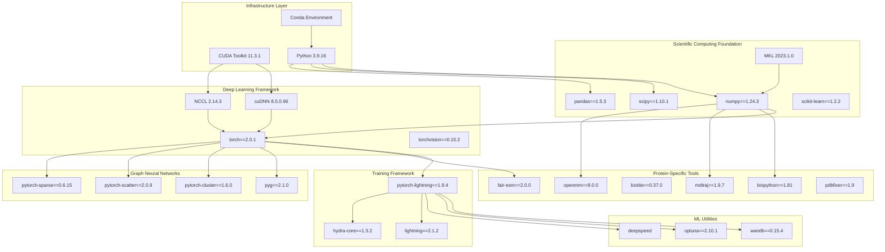
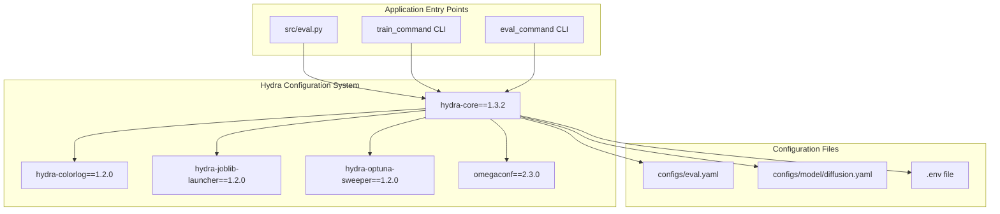
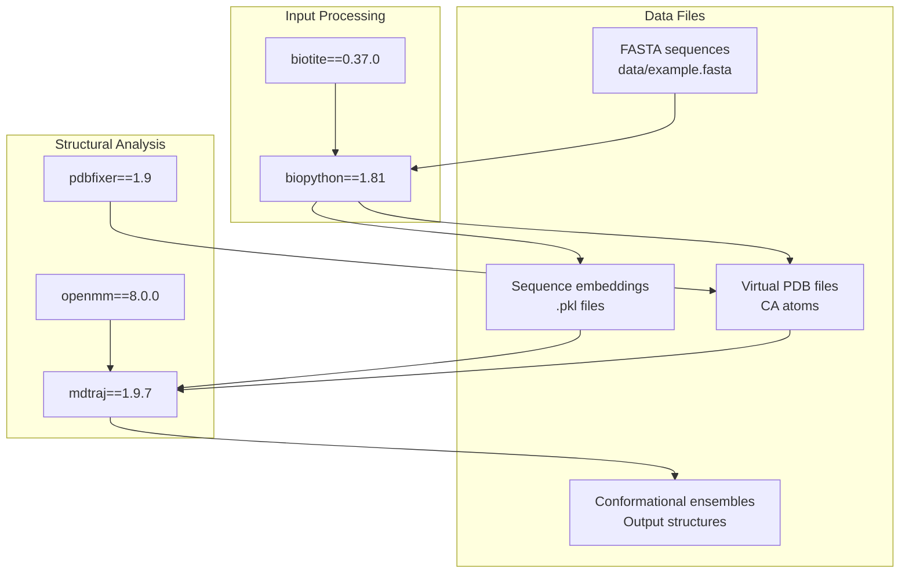
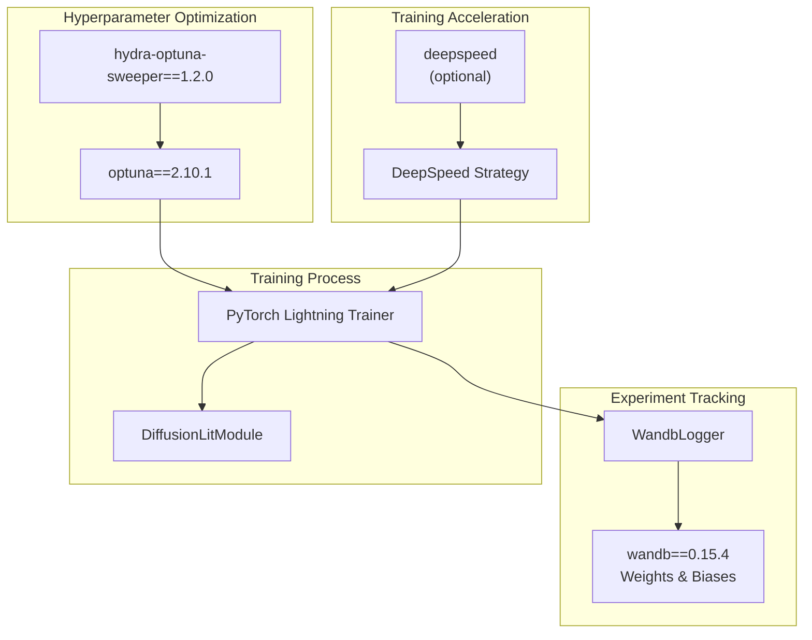
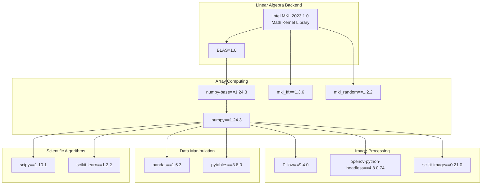
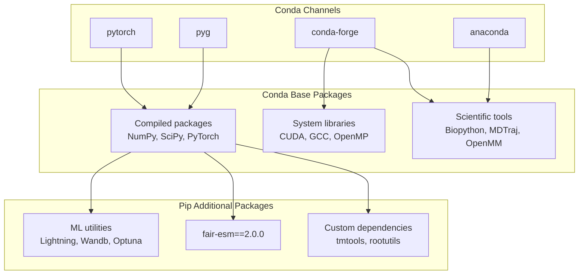

# Prerequisites and Dependencies

> **Relevant source files**
> * [README.md](https://github.com/Junjie-Zhu/IDPFold/blob/ba40f40c/README.md?plain=1)
> * [data/example.fasta](https://github.com/Junjie-Zhu/IDPFold/blob/ba40f40c/data/example.fasta)
> * [environment.yml](https://github.com/Junjie-Zhu/IDPFold/blob/ba40f40c/environment.yml)

This document specifies the complete set of dependencies required to run IDPFold, including Python version requirements, GPU/CUDA requirements, and all software packages. This covers the foundational software environment that must be established before installation. For the actual installation steps, see [Installation Steps](/Junjie-Zhu/IDPFold/2.2-installation-steps). For environment path configuration, see [Environment Configuration](/Junjie-Zhu/IDPFold/2.3-environment-configuration).

---

## System Requirements

### Python Environment

IDPFold requires **Python 3.9.16** as specified in the conda environment. The codebase is built on Python 3.9 and has not been tested with other versions.

| Component | Version | Notes |
| --- | --- | --- |
| Python | 3.9.16 | Exact version specified in environment |
| Python ABI | 3.9 (cp39) | Required for binary compatibility |

Sources: [environment.yml L123](https://github.com/Junjie-Zhu/IDPFold/blob/ba40f40c/environment.yml#L123-L123)

### GPU and CUDA Requirements

IDPFold requires GPU acceleration for practical usage. The system is configured for:

| Component | Version | Purpose |
| --- | --- | --- |
| CUDA Toolkit | 11.3.1 | GPU acceleration for PyTorch |
| cuDNN | 8.5.0.96 | Deep learning primitives |
| CUDA Runtime | 11.7.99 | Runtime libraries |
| NCCL | 2.14.3 | Multi-GPU communication |

The diffusion model inference involves 1000 timesteps and generation of up to 192 replicas per protein, making GPU acceleration essential for reasonable runtime performance.

Sources: [environment.yml L29](https://github.com/Junjie-Zhu/IDPFold/blob/ba40f40c/environment.yml#L29-L29)

 [environment.yml L228-L236](https://github.com/Junjie-Zhu/IDPFold/blob/ba40f40c/environment.yml#L228-L236)

---

## Dependency Architecture

### Dependency Layer Hierarchy



**Diagram: Dependency Layer Hierarchy** - Shows how dependencies are organized in layers from infrastructure through application-specific tools. Each layer builds upon lower layers, with the scientific computing foundation supporting both deep learning and protein-specific tools.

Sources: [environment.yml L1-L159](https://github.com/Junjie-Zhu/IDPFold/blob/ba40f40c/environment.yml#L1-L159)

 [environment.yml L160-L287](https://github.com/Junjie-Zhu/IDPFold/blob/ba40f40c/environment.yml#L160-L287)

---

## Core Framework Dependencies

### PyTorch Ecosystem

IDPFold is built on PyTorch 2.0.1 with CUDA 11.3 support. The core deep learning stack includes:

| Package | Version | Purpose |
| --- | --- | --- |
| `torch` | 2.0.1 | Core tensor operations and neural networks |
| `torchvision` | 0.15.2 | Vision utilities (used by some dependencies) |
| `torchmetrics` | 0.11.4 | Evaluation metrics |
| `pytorch-mutex` | 1.0 | Ensures CUDA build of PyTorch |

The `pytorch-mutex=1.0=cuda` setting ensures that the CUDA-enabled version of PyTorch is installed, not the CPU-only version.

Sources: [environment.yml L127](https://github.com/Junjie-Zhu/IDPFold/blob/ba40f40c/environment.yml#L127-L127)

 [environment.yml L278-L280](https://github.com/Junjie-Zhu/IDPFold/blob/ba40f40c/environment.yml#L278-L280)

### PyTorch Lightning

Training and inference orchestration uses PyTorch Lightning:

| Package | Version | Purpose |
| --- | --- | --- |
| `pytorch-lightning` | 1.9.4 | Legacy version for backward compatibility |
| `lightning` | 2.1.2 | Modern Lightning framework |
| `lightning-utilities` | 0.8.0 | Helper utilities |

The `DiffusionLitModule` class (referenced in configs) extends `pytorch_lightning.LightningModule` for training orchestration.

Sources: [environment.yml L214](https://github.com/Junjie-Zhu/IDPFold/blob/ba40f40c/environment.yml#L214-L214)

 [environment.yml L260](https://github.com/Junjie-Zhu/IDPFold/blob/ba40f40c/environment.yml#L260-L260)

### Hydra Configuration Framework

Configuration management uses Facebook's Hydra:



**Diagram: Hydra Configuration Dependency Graph** - Shows how Hydra plugins and the core framework integrate with IDPFold's configuration files and entry points.

Sources: [environment.yml L202-L205](https://github.com/Junjie-Zhu/IDPFold/blob/ba40f40c/environment.yml#L202-L205)

 [environment.yml L238](https://github.com/Junjie-Zhu/IDPFold/blob/ba40f40c/environment.yml#L238-L238)

---

## Protein-Specific Dependencies

### ESM Language Model

The `fair-esm` package provides pre-trained protein language models for sequence embedding extraction:

| Package | Version | Key Models |
| --- | --- | --- |
| `fair-esm` | 2.0.0 | `esm2_t33_650M_UR50D` (650M parameter model) |

The `src/read_seqs.py` preprocessing script uses ESM to extract embeddings from FASTA sequences. The model `esm2_t33_650M_UR50D` specifically refers to:

* `t33`: 33 transformer layers
* `650M`: 650 million parameters
* `UR50D`: Trained on UniRef50 database

Sources: [environment.yml L192](https://github.com/Junjie-Zhu/IDPFold/blob/ba40f40c/environment.yml#L192-L192)

 [README.md L32-L33](https://github.com/Junjie-Zhu/IDPFold/blob/ba40f40c/README.md?plain=1#L32-L33)

### Structural Biology Tools



**Diagram: Structural Biology Tool Usage** - Illustrates how different structural biology packages are used in the preprocessing and analysis pipeline. Solid lines indicate active usage, dashed lines indicate optional or future integration.

| Package | Version | Purpose in IDPFold |
| --- | --- | --- |
| `biopython` | 1.81 | FASTA parsing, sequence handling |
| `biotite` | 0.37.0 | Alternative structure manipulation |
| `mdtraj` | 1.9.7 | Trajectory analysis and structure processing |
| `openmm` | 8.0.0 | Molecular simulation framework |
| `pdbfixer` | 1.9 | PDB file cleanup and validation |

The presence of OpenMM and MDTraj suggests potential integration with molecular dynamics validation, though current evaluation configs focus on diffusion-based generation.

Sources: [environment.yml L14-L15](https://github.com/Junjie-Zhu/IDPFold/blob/ba40f40c/environment.yml#L14-L15)

 [environment.yml L85](https://github.com/Junjie-Zhu/IDPFold/blob/ba40f40c/environment.yml#L85-L85)

 [environment.yml L104](https://github.com/Junjie-Zhu/IDPFold/blob/ba40f40c/environment.yml#L104-L104)

 [environment.yml L109](https://github.com/Junjie-Zhu/IDPFold/blob/ba40f40c/environment.yml#L109-L109)

---

## Graph Neural Network Dependencies

IDPFold uses PyTorch Geometric (PyG) for graph-based operations on molecular structures:

| Package | Version | Purpose |
| --- | --- | --- |
| `pyg` | 2.1.0 | Core graph neural network library |
| `pytorch-cluster` | 1.6.0 | Clustering algorithms for graphs |
| `pytorch-scatter` | 2.0.9 | Scatter operations on sparse tensors |
| `pytorch-sparse` | 0.6.15 | Sparse tensor operations |

These packages enable efficient processing of protein structures as graphs where atoms are nodes and bonds/spatial relationships are edges. The invariant point attention mechanism in `TranslationIPA` likely leverages these sparse operations.

All PyG packages are built for PyTorch 1.11.0 with CUDA 11.3 compatibility, as indicated by the suffix `py39_torch_1.11.0_cu113`.

Sources: [environment.yml L116](https://github.com/Junjie-Zhu/IDPFold/blob/ba40f40c/environment.yml#L116-L116)

 [environment.yml L126](https://github.com/Junjie-Zhu/IDPFold/blob/ba40f40c/environment.yml#L126-L126)

 [environment.yml L128-L129](https://github.com/Junjie-Zhu/IDPFold/blob/ba40f40c/environment.yml#L128-L129)

---

## ML Utilities and Experiment Tracking

### Experiment Management



**Diagram: ML Utilities Integration** - Shows how experiment tracking, hyperparameter optimization, and training acceleration tools integrate with the PyTorch Lightning training loop. Dashed lines indicate optional features.

| Package | Version | Purpose |
| --- | --- | --- |
| `wandb` | 0.15.4 | Experiment tracking and visualization |
| `optuna` | 2.10.1 | Hyperparameter optimization |
| `deepspeed` | (latest) | Large model optimization and training |

**Note**: DeepSpeed appears in the dependencies but may not be actively used based on current configuration files. It provides memory optimization for large models but requires explicit configuration.

Sources: [environment.yml L183](https://github.com/Junjie-Zhu/IDPFold/blob/ba40f40c/environment.yml#L183-L183)

 [environment.yml L205](https://github.com/Junjie-Zhu/IDPFold/blob/ba40f40c/environment.yml#L205-L205)

 [environment.yml L241](https://github.com/Junjie-Zhu/IDPFold/blob/ba40f40c/environment.yml#L241-L241)

 [environment.yml L283](https://github.com/Junjie-Zhu/IDPFold/blob/ba40f40c/environment.yml#L283-L283)

---

## Scientific Computing Stack

### Numerical Computing Foundation



**Diagram: Scientific Computing Stack Architecture** - Illustrates the layered structure of numerical computing dependencies, from low-level linear algebra through high-level data manipulation and image processing.

| Package | Version | Purpose |
| --- | --- | --- |
| `numpy` | 1.24.3 | Core array operations |
| `scipy` | 1.10.1 | Scientific algorithms (optimization, statistics) |
| `pandas` | 1.5.3 | Dataframe operations |
| `scikit-learn` | 1.2.2 | Machine learning utilities |
| `mkl` | 2023.1.0 | Optimized math operations |

Sources: [environment.yml L16](https://github.com/Junjie-Zhu/IDPFold/blob/ba40f40c/environment.yml#L16-L16)

 [environment.yml L86-L89](https://github.com/Junjie-Zhu/IDPFold/blob/ba40f40c/environment.yml#L86-L89)

 [environment.yml L100-L101](https://github.com/Junjie-Zhu/IDPFold/blob/ba40f40c/environment.yml#L100-L101)

 [environment.yml L107](https://github.com/Junjie-Zhu/IDPFold/blob/ba40f40c/environment.yml#L107-L107)

 [environment.yml L137-L138](https://github.com/Junjie-Zhu/IDPFold/blob/ba40f40c/environment.yml#L137-L138)

---

## Auxiliary Dependencies

### Visualization and Analysis

| Package | Version | Purpose |
| --- | --- | --- |
| `matplotlib` | 3.7.1 | Plotting and visualization |
| `seaborn` | 0.12.2 | Statistical data visualization |
| `tqdm` | 4.65.0 | Progress bars |

Sources: [environment.yml L83-L84](https://github.com/Junjie-Zhu/IDPFold/blob/ba40f40c/environment.yml#L83-L84)

 [environment.yml L139](https://github.com/Junjie-Zhu/IDPFold/blob/ba40f40c/environment.yml#L139-L139)

 [environment.yml L149](https://github.com/Junjie-Zhu/IDPFold/blob/ba40f40c/environment.yml#L149-L149)

### Data Management

| Package | Version | Purpose |
| --- | --- | --- |
| `h5py` (via hdf5) | 1.10.6 | HDF5 file format support |
| `pytables` | 3.8.0 | Hierarchical datasets |
| `lmdb` | 1.4.1 | Memory-mapped database |

Sources: [environment.yml L41](https://github.com/Junjie-Zhu/IDPFold/blob/ba40f40c/environment.yml#L41-L41)

 [environment.yml L122](https://github.com/Junjie-Zhu/IDPFold/blob/ba40f40c/environment.yml#L122-L122)

 [environment.yml L217](https://github.com/Junjie-Zhu/IDPFold/blob/ba40f40c/environment.yml#L217-L217)

### Utility Libraries

| Package | Version | Purpose |
| --- | --- | --- |
| `python-dotenv` | 1.0.0 | `.env` file parsing for environment configuration |
| `rootutils` | 1.0.7 | Root directory utilities |
| `pyyaml` | 6.0 | YAML configuration parsing |
| `einops` | 0.7.0 | Tensor operation rearrangement |

Sources: [environment.yml L131](https://github.com/Junjie-Zhu/IDPFold/blob/ba40f40c/environment.yml#L131-L131)

 [environment.yml L190](https://github.com/Junjie-Zhu/IDPFold/blob/ba40f40c/environment.yml#L190-L190)

 [environment.yml L259](https://github.com/Junjie-Zhu/IDPFold/blob/ba40f40c/environment.yml#L259-L259)

 [environment.yml L263](https://github.com/Junjie-Zhu/IDPFold/blob/ba40f40c/environment.yml#L263-L263)

---

## Installation Method and Package Manager

### Conda Environment Structure

IDPFold uses Conda as the primary package manager with pip for additional Python packages:



**Diagram: Package Manager Hierarchy** - Shows how Conda manages system-level and compiled dependencies while pip handles pure Python packages and recent releases.

The environment file specifies:

* **159 conda packages** from channels: `pytorch`, `pyg`, `conda-forge`, `anaconda`
* **127 pip packages** for Python-only tools and recent versions

This two-tier approach ensures:

1. Binary compatibility for compiled packages (PyTorch, CUDA)
2. Access to latest versions of Python packages
3. Proper dependency resolution across both systems

Sources: [environment.yml L1-L8](https://github.com/Junjie-Zhu/IDPFold/blob/ba40f40c/environment.yml#L1-L8)

 [environment.yml L160-L287](https://github.com/Junjie-Zhu/IDPFold/blob/ba40f40c/environment.yml#L160-L287)

---

## Dependency Installation Commands

### Creating the Environment

The complete environment setup uses these commands:

```python
# Create conda environment from specificationconda env create -f environment.yml # Activate environmentconda activate idpfold # Install ESM for embedding extractionpip install fair-esm # Install IDPFold package in development modepip install -e .
```

The `environment.yml` file automatically installs all dependencies except `fair-esm`, which is installed separately via pip. The `-e` flag for IDPFold installation enables development mode, allowing code changes without reinstallation.

Sources: [README.md L24-L36](https://github.com/Junjie-Zhu/IDPFold/blob/ba40f40c/README.md?plain=1#L24-L36)

---

## Version Pinning Strategy

### Critical Version Constraints

IDPFold uses a **mixed pinning strategy**:

| Category | Pinning Strategy | Rationale |
| --- | --- | --- |
| Python | Exact (3.9.16) | ABI compatibility |
| CUDA | Minor (11.3.x) | Driver compatibility |
| PyTorch | Exact (2.0.1) | Model checkpoint compatibility |
| Lightning | Exact (1.9.4, 2.1.2) | API stability |
| ESM | Exact (2.0.0) | Embedding reproducibility |
| NumPy/SciPy | Minor (1.24.x, 1.10.x) | Numerical stability |
| Utilities | Unpinned (deepspeed) | Optional features |

**Key insight**: The diffusion model checkpoints available on Google Drive are trained with specific PyTorch and ESM versions. Using different versions may cause:

* Checkpoint loading failures
* Numerical precision differences
* Embedding space mismatches

Sources: [environment.yml L123](https://github.com/Junjie-Zhu/IDPFold/blob/ba40f40c/environment.yml#L123-L123)

 [environment.yml L278](https://github.com/Junjie-Zhu/IDPFold/blob/ba40f40c/environment.yml#L278-L278)

 [environment.yml L260](https://github.com/Junjie-Zhu/IDPFold/blob/ba40f40c/environment.yml#L260-L260)

 [environment.yml L192](https://github.com/Junjie-Zhu/IDPFold/blob/ba40f40c/environment.yml#L192-L192)

---

## Summary Table

### Complete Dependency Overview

| Layer | Key Packages | Purpose |
| --- | --- | --- |
| **Infrastructure** | Python 3.9.16, CUDA 11.3.1 | Runtime environment |
| **Deep Learning** | PyTorch 2.0.1, PyTorch Lightning 1.9.4 | Neural network framework |
| **Configuration** | Hydra 1.3.2, OmegaConf 2.3.0 | Config management |
| **Protein Tools** | ESM 2.0.0, Biopython 1.81, MDTraj 1.9.7 | Sequence/structure handling |
| **Graph Ops** | PyG 2.1.0, pytorch-scatter 2.0.9 | Graph neural networks |
| **Scientific** | NumPy 1.24.3, SciPy 1.10.1, Pandas 1.5.3 | Numerical computing |
| **ML Utilities** | Wandb 0.15.4, Optuna 2.10.1 | Experiment tracking |
| **Visualization** | Matplotlib 3.7.1, Seaborn 0.12.2 | Plotting |

Sources: [environment.yml L1-L287](https://github.com/Junjie-Zhu/IDPFold/blob/ba40f40c/environment.yml#L1-L287)