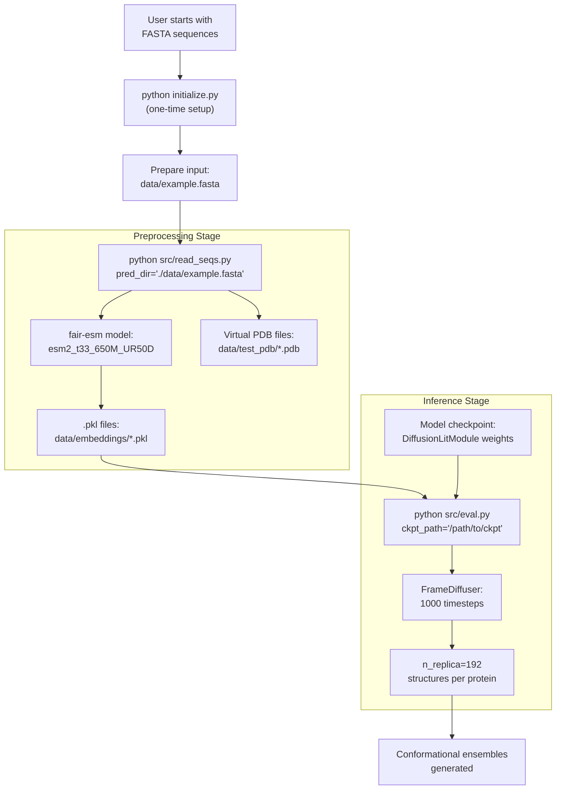
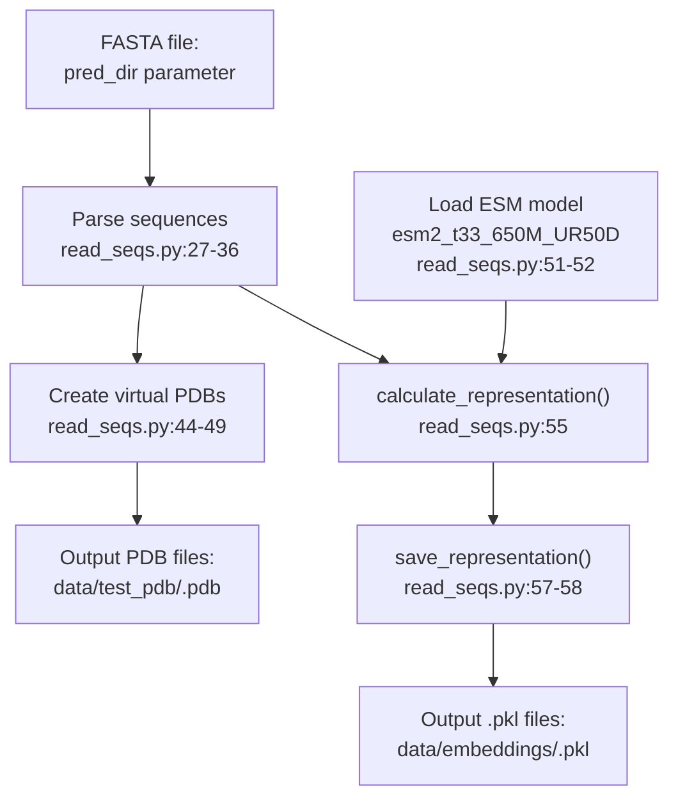
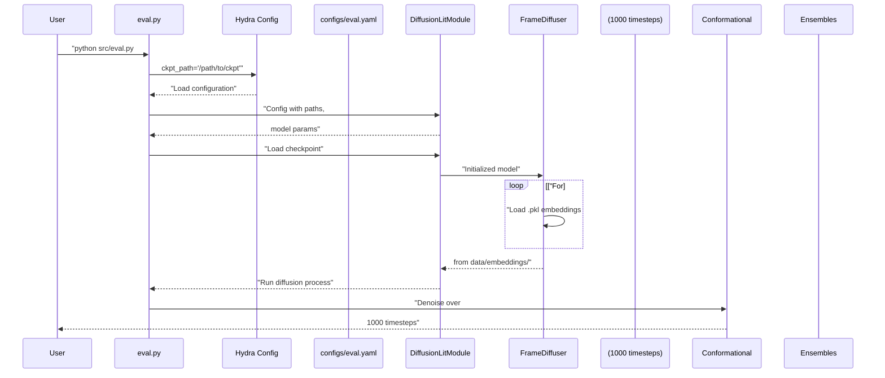
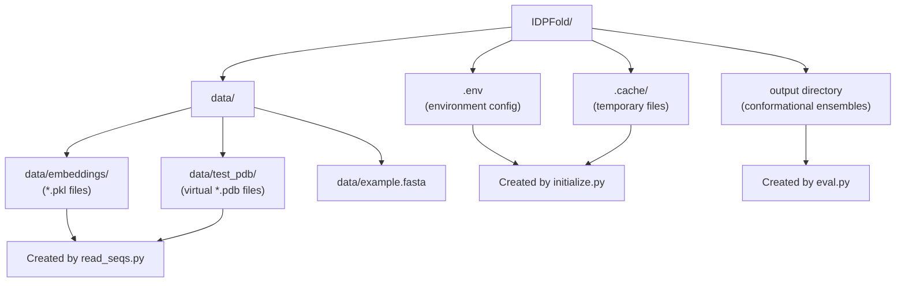

# Quick Start

> **Relevant source files**
> * [README.md](https://github.com/Junjie-Zhu/IDPFold/blob/ba40f40c/README.md?plain=1)
> * [data/example.fasta](https://github.com/Junjie-Zhu/IDPFold/blob/ba40f40c/data/example.fasta)
> * [initialize.py](https://github.com/Junjie-Zhu/IDPFold/blob/ba40f40c/initialize.py)
> * [src/read_seqs.py](https://github.com/Junjie-Zhu/IDPFold/blob/ba40f40c/src/read_seqs.py)

This guide provides a complete end-to-end workflow for generating conformational ensembles from IDP sequences using IDPFold. It covers the essential steps from installation to prediction, with minimal explanation. For detailed information about specific components, refer to the linked pages throughout this document.

For installation details, see [Installation Steps](/Junjie-Zhu/IDPFold/2.2-installation-steps). For in-depth preprocessing documentation, see [Preprocessing Sequences](/Junjie-Zhu/IDPFold/3.2-preprocessing-sequences). For advanced inference options, see [Running Inference](/Junjie-Zhu/IDPFold/3.3-running-inference).

## Prerequisites

Before starting, ensure you have:

* Completed the installation process (see [Installation Steps](/Junjie-Zhu/IDPFold/2.2-installation-steps))
* Conda environment `idpfold` activated
* A GPU with CUDA support (recommended but not required)
* Access to model checkpoints from [Google Drive](https://drive.google.com/drive/folders/1-5BHexAZKGX1lWyPkYU-JFi1EId88P9i?usp=sharing)

**Sources:** [README.md L22-L43](https://github.com/Junjie-Zhu/IDPFold/blob/ba40f40c/README.md?plain=1#L22-L43)

## Complete Workflow Overview

The following diagram shows the complete pipeline from input FASTA file to conformational ensembles:



**Sources:** [README.md L45-L59](https://github.com/Junjie-Zhu/IDPFold/blob/ba40f40c/README.md?plain=1#L45-L59)

 [src/read_seqs.py L1-L63](https://github.com/Junjie-Zhu/IDPFold/blob/ba40f40c/src/read_seqs.py#L1-L63)

## Step-by-Step Walkthrough

### Step 1: Initialize Environment

Run the initialization script once after installation to set up directory structure and create the `.env` configuration file:

```
python initialize.py
```

This script creates the following directories and configures paths:

| Directory | Purpose | Environment Variable |
| --- | --- | --- |
| `.cache` | Cache for temporary files | `CACHE_DIR` |
| `data/pdb` | Training data location | `TRAIN_DATA` |
| `data/embeddings` | Sequence embeddings storage | `EMBEDDING` |
| `data/test_pdb` | Test/inference PDB files | `TEST_DATA` |

The script checks if directories exist and creates them if needed at [initialize.py L16-L19](https://github.com/Junjie-Zhu/IDPFold/blob/ba40f40c/initialize.py#L16-L19)

 The `.env` file is written at [initialize.py L14-L21](https://github.com/Junjie-Zhu/IDPFold/blob/ba40f40c/initialize.py#L14-L21)

 with absolute paths to these directories.

**Sources:** [initialize.py L1-L22](https://github.com/Junjie-Zhu/IDPFold/blob/ba40f40c/initialize.py#L1-L22)

 [README.md L39-L43](https://github.com/Junjie-Zhu/IDPFold/blob/ba40f40c/README.md?plain=1#L39-L43)

### Step 2: Prepare Input FASTA File

Create or use an existing FASTA file with your IDP sequences. The file can contain one or multiple sequences.

**Example format (from `data/example.fasta`):**

```
> Abeta40
DAEFRHDSGYEVHHQKLVFFAEDVGSNKGAIIGLMVGGVV
> PaaA2
MDYKDDDDKNRALSPMVSEFETIEQENSYNEWLRAKVATSLADPRPAIPHDEVERRMAERFAKMRKERSKQ
> p15PAF
VRTKADSVPGTYRKVVAARAPRKVLGSSTSATNSTSVSSRKAENKYAGGNPVCVRPTPKWQKGIGEFFRLSPKDSEKENQIPEEAGSSGLGKAKRKACPLQPDHTNDEKE
```

Each sequence requires:

* A header line starting with `>` followed by the protein name
* One or more lines containing the amino acid sequence (standard one-letter codes)

**Sources:** [data/example.fasta L1-L6](https://github.com/Junjie-Zhu/IDPFold/blob/ba40f40c/data/example.fasta#L1-L6)

 [README.md L49](https://github.com/Junjie-Zhu/IDPFold/blob/ba40f40c/README.md?plain=1#L49-L49)

### Step 3: Extract Sequence Embeddings

Run the preprocessing script to extract ESM embeddings from your FASTA file:

```
python src/read_seqs.py pred_dir='./data/example.fasta'
```

The following diagram shows the data flow through the `read_seqs.py` script:



**What happens during preprocessing:**

| Action | Code Location | Output |
| --- | --- | --- |
| Parse FASTA file | [src/read_seqs.py L27-L36](https://github.com/Junjie-Zhu/IDPFold/blob/ba40f40c/src/read_seqs.py#L27-L36) | `to_process_list` of (name, sequence) tuples |
| Create virtual PDB files | [src/read_seqs.py L44-L49](https://github.com/Junjie-Zhu/IDPFold/blob/ba40f40c/src/read_seqs.py#L44-L49) | PDB files with CA atoms at (0,0,0) in `data/test_pdb/` |
| Load ESM model | [src/read_seqs.py L51-L52](https://github.com/Junjie-Zhu/IDPFold/blob/ba40f40c/src/read_seqs.py#L51-L52) | `esm2_t33_650M_UR50D` model on GPU/CPU |
| Calculate embeddings | [src/read_seqs.py L55](https://github.com/Junjie-Zhu/IDPFold/blob/ba40f40c/src/read_seqs.py#L55-L55) | High-dimensional representation vectors |
| Save embeddings | [src/read_seqs.py L57-L58](https://github.com/Junjie-Zhu/IDPFold/blob/ba40f40c/src/read_seqs.py#L57-L58) | `.pkl` files in `data/embeddings/` |

The virtual PDB files contain placeholder coordinates (0.000, 0.000, 0.000) for each CA atom, as seen in the formatting at [src/read_seqs.py L48-L49](https://github.com/Junjie-Zhu/IDPFold/blob/ba40f40c/src/read_seqs.py#L48-L49)

 These serve as structural templates for the inference stage. For details, see [Virtual PDB Files](/Junjie-Zhu/IDPFold/7.3-virtual-pdb-files).

**Sources:** [src/read_seqs.py L1-L63](https://github.com/Junjie-Zhu/IDPFold/blob/ba40f40c/src/read_seqs.py#L1-L63)

 [README.md L54-L55](https://github.com/Junjie-Zhu/IDPFold/blob/ba40f40c/README.md?plain=1#L54-L55)

### Step 4: Run Inference

Download a model checkpoint from [Google Drive](https://drive.google.com/drive/folders/1-5BHexAZKGX1lWyPkYU-JFi1EId88P9i?usp=sharing) and run inference:

```
python src/eval.py ckpt_path='/path/to/ckpt'
```

Replace `/path/to/ckpt` with the actual path to your downloaded checkpoint file.

The inference process:



The script uses Hydra configuration management at [src/read_seqs.py L15](https://github.com/Junjie-Zhu/IDPFold/blob/ba40f40c/src/read_seqs.py#L15-L15)

 to load settings from `configs/eval.yaml`. The configuration specifies:

* Path to embeddings via `cfg.data.dataset.path_to_seq_embedding` at [src/read_seqs.py L21](https://github.com/Junjie-Zhu/IDPFold/blob/ba40f40c/src/read_seqs.py#L21-L21)
* Path to PDB files via `cfg.data.dataset.path_to_dataset` at [src/read_seqs.py L22](https://github.com/Junjie-Zhu/IDPFold/blob/ba40f40c/src/read_seqs.py#L22-L22)
* Input FASTA file via `cfg.pred_dir` at [src/read_seqs.py L23](https://github.com/Junjie-Zhu/IDPFold/blob/ba40f40c/src/read_seqs.py#L23-L23)

For detailed inference parameters, see [Inference Parameters](/Junjie-Zhu/IDPFold/7.1-inference-parameters). For evaluation configuration options, see [Evaluation Configuration Reference](/Junjie-Zhu/IDPFold/5.3-evaluation-configuration-reference).

**Sources:** [README.md L57-L59](https://github.com/Junjie-Zhu/IDPFold/blob/ba40f40c/README.md?plain=1#L57-L59)

 [src/read_seqs.py L15-L24](https://github.com/Junjie-Zhu/IDPFold/blob/ba40f40c/src/read_seqs.py#L15-L24)

### Step 5: Access Results

After inference completes, conformational ensembles are generated for each input sequence. Each protein receives multiple structural replicas (default: 192 structures per protein) representing the conformational heterogeneity of the IDP.

**Expected outputs:**

| Output Type | Format | Location | Description |
| --- | --- | --- | --- |
| Conformational ensembles | PDB/trajectory | Output directory specified in config | 192 structural replicas per protein |
| Ensemble properties | Metrics | Console/logs | Radius of gyration, end-to-end distance, etc. |

For details on output formats, see [Output Conformational Ensembles](/Junjie-Zhu/IDPFold/8.4-output-conformational-ensembles).

**Sources:** [README.md L11-L14](https://github.com/Junjie-Zhu/IDPFold/blob/ba40f40c/README.md?plain=1#L11-L14)

## Command Reference

The following table summarizes all commands used in this quick start:

| Step | Command | Purpose | Required Once? |
| --- | --- | --- | --- |
| Setup | `conda env create -f environment.yml` | Create conda environment | Yes |
| Setup | `conda activate idpfold` | Activate environment | Every session |
| Setup | `pip install fair-esm` | Install ESM model | Yes |
| Setup | `pip install -e .` | Install IDPFold package | Yes |
| Initialize | `python initialize.py` | Create directories and .env | Yes |
| Preprocess | `python src/read_seqs.py pred_dir='path/to/fasta'` | Extract embeddings | Per FASTA file |
| Inference | `python src/eval.py ckpt_path='path/to/ckpt'` | Generate ensembles | Per prediction run |

**Sources:** [README.md L22-L59](https://github.com/Junjie-Zhu/IDPFold/blob/ba40f40c/README.md?plain=1#L22-L59)

## File System State After Quick Start

After completing the quick start, your directory structure will contain:



**Sources:** [initialize.py L7-L21](https://github.com/Junjie-Zhu/IDPFold/blob/ba40f40c/initialize.py#L7-L21)

 [src/read_seqs.py L21-L58](https://github.com/Junjie-Zhu/IDPFold/blob/ba40f40c/src/read_seqs.py#L21-L58)

## Next Steps

After completing the quick start:

* **Customize preprocessing**: See [Preprocessing Sequences](/Junjie-Zhu/IDPFold/3.2-preprocessing-sequences) for advanced options
* **Adjust inference parameters**: See [Running Inference](/Junjie-Zhu/IDPFold/3.3-running-inference) for controlling `num_timesteps`, `noise_scale`, and `n_replica`
* **Understand the model**: Review [Model Architecture](/Junjie-Zhu/IDPFold/4-model-architecture) for technical details
* **Modify configurations**: See [Configuration System](/Junjie-Zhu/IDPFold/5-configuration-system) to customize model behavior
* **Train your own model**: See [Training Models](/Junjie-Zhu/IDPFold/3.4-training-models) for training instructions

For troubleshooting common issues during setup, refer to [Environment Configuration](/Junjie-Zhu/IDPFold/2.3-environment-configuration).

**Sources:** [README.md L1-L69](https://github.com/Junjie-Zhu/IDPFold/blob/ba40f40c/README.md?plain=1#L1-L69)