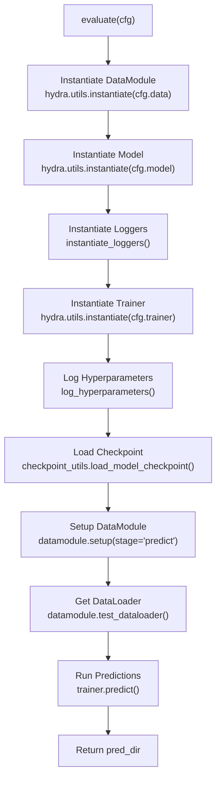
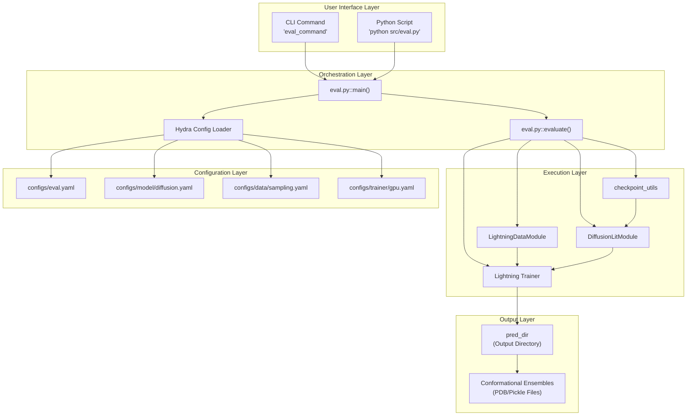

# Running Inference

> **Relevant source files**
> * [README.md](https://github.com/Junjie-Zhu/IDPFold/blob/ba40f40c/README.md?plain=1)
> * [configs/eval.yaml](https://github.com/Junjie-Zhu/IDPFold/blob/ba40f40c/configs/eval.yaml)
> * [data/example.fasta](https://github.com/Junjie-Zhu/IDPFold/blob/ba40f40c/data/example.fasta)
> * [src/eval.py](https://github.com/Junjie-Zhu/IDPFold/blob/ba40f40c/src/eval.py)

This page documents how to run inference with IDPFold to generate conformational ensembles from preprocessed protein sequences. The inference process uses trained model checkpoints to predict multiple 3D structural conformations for intrinsically disordered proteins (IDPs).

For information about preparing input sequences and extracting embeddings, see [Preprocessing Sequences](/Junjie-Zhu/IDPFold/3.2-preprocessing-sequences). For details about training models, see [Training Models](/Junjie-Zhu/IDPFold/3.4-training-models). For a complete end-to-end example, see [Quick Start](/Junjie-Zhu/IDPFold/3.1-quick-start).

## Overview

Inference in IDPFold is a two-stage process:

1. **Preprocessing** (if not already completed): Extract ESM embeddings from FASTA sequences
2. **Prediction**: Generate conformational ensembles using the diffusion model

The inference engine is implemented in [src/eval.py](https://github.com/Junjie-Zhu/IDPFold/blob/ba40f40c/src/eval.py)

 and orchestrated by PyTorch Lightning's `Trainer.predict()` method. The process loads a trained checkpoint, reads preprocessed embeddings, and runs the diffusion model's reverse process to generate structural ensembles.

**Sources**: [README.md L45-L59](https://github.com/Junjie-Zhu/IDPFold/blob/ba40f40c/README.md?plain=1#L45-L59)

 [src/eval.py L1-L111](https://github.com/Junjie-Zhu/IDPFold/blob/ba40f40c/src/eval.py#L1-L111)

## Prerequisites

Before running inference, ensure:

| Requirement | Description | Location |
| --- | --- | --- |
| **Preprocessed Embeddings** | ESM embeddings extracted from sequences | Generated by `read_seqs.py` |
| **Model Checkpoint** | Trained IDPFold weights | [Google Drive](https://drive.google.com/drive/folders/1-5BHexAZKGX1lWyPkYU-JFi1EId88P9i?usp=sharing) |
| **Configuration File** | Hydra config for evaluation | `configs/eval.yaml` |
| **Environment Setup** | Activated conda environment | See [Installation and Setup](/Junjie-Zhu/IDPFold/2-installation-and-setup) |

**Sources**: [README.md L47-L59](https://github.com/Junjie-Zhu/IDPFold/blob/ba40f40c/README.md?plain=1#L47-L59)

 [configs/eval.yaml L1-L20](https://github.com/Junjie-Zhu/IDPFold/blob/ba40f40c/configs/eval.yaml#L1-L20)

## Basic Usage

### Using Python Script

The standard method to run inference is directly executing the evaluation script:

```markdown
# Step 1: Extract embeddings (if not done)python src/read_seqs.py pred_dir='./data/example.fasta' # Step 2: Run inferencepython src/eval.py ckpt_path='/path/to/checkpoint.ckpt'
```

### Using CLI Command

Alternatively, use the installed console script:

```
eval_command ckpt_path='/path/to/checkpoint.ckpt'
```

Both methods invoke the same underlying functionality. The `ckpt_path` parameter is required and must point to a valid PyTorch Lightning checkpoint file.

**Sources**: [README.md L53-L59](https://github.com/Junjie-Zhu/IDPFold/blob/ba40f40c/README.md?plain=1#L53-L59)

 [src/eval.py L96-L110](https://github.com/Junjie-Zhu/IDPFold/blob/ba40f40c/src/eval.py#L96-L110)

## Inference Workflow

The following diagram shows the complete inference execution flow:

```mermaid
sequenceDiagram
  participant User
  participant eval.py
  participant main()
  participant Hydra
  participant Config Loader
  participant evaluate()
  participant Function
  participant LightningDataModule
  participant (sampling)
  participant DiffusionLitModule
  participant checkpoint_utils
  participant Lightning Trainer
  participant trainer.predict()

  User->>eval.py: "python src/eval.py
  eval.py->>Hydra: ckpt_path='/path/to/ckpt'"
  Hydra-->>eval.py: "Load configs/eval.yaml"
  eval.py->>evaluate(): "DictConfig object"
  evaluate()->>LightningDataModule: "evaluate(cfg)"
  LightningDataModule-->>evaluate(): "hydra.utils.instantiate(cfg.data)"
  evaluate()->>DiffusionLitModule: "datamodule instance"
  DiffusionLitModule-->>evaluate(): "hydra.utils.instantiate(cfg.model)"
  evaluate()->>Lightning Trainer: "model instance"
  Lightning Trainer-->>evaluate(): "hydra.utils.instantiate(cfg.trainer)"
  evaluate()->>checkpoint_utils: "trainer instance"
  checkpoint_utils-->>evaluate(): "load_model_checkpoint(model, ckpt_path)"
  evaluate()->>LightningDataModule: "loaded model, ckpt_path"
  LightningDataModule-->>evaluate(): "datamodule.setup(stage='predict')"
  evaluate()->>LightningDataModule: "setup complete"
  LightningDataModule-->>evaluate(): "datamodule.test_dataloader()"
  evaluate()->>Lightning Trainer: "dataloaders"
  Lightning Trainer->>DiffusionLitModule: "trainer.predict(model, dataloaders)"
  DiffusionLitModule->>trainer.predict(): "Multiple prediction steps"
  trainer.predict()-->>Lightning Trainer: "Generate ensembles"
  Lightning Trainer-->>evaluate(): "pred_dir (predictions)"
  evaluate()-->>User: "pred_dir"
```

**Sources**: [src/eval.py L46-L93](https://github.com/Junjie-Zhu/IDPFold/blob/ba40f40c/src/eval.py#L46-L93)

 [src/eval.py L96-L110](https://github.com/Junjie-Zhu/IDPFold/blob/ba40f40c/src/eval.py#L96-L110)

## Code Flow Details

### Main Entry Point

The `main()` function serves as the Hydra-decorated entry point:

```python
@hydra.main(version_base="1.3", config_path="../configs", config_name="eval.yaml")def main(cfg: DictConfig) -> None
```

Located at [src/eval.py L96-L110](https://github.com/Junjie-Zhu/IDPFold/blob/ba40f40c/src/eval.py#L96-L110)

 this function:

* Applies extra utilities via `extras(cfg)` [src/eval.py L104](https://github.com/Junjie-Zhu/IDPFold/blob/ba40f40c/src/eval.py#L104-L104)
* Delegates to the core `evaluate()` function [src/eval.py L106](https://github.com/Junjie-Zhu/IDPFold/blob/ba40f40c/src/eval.py#L106-L106)

### Core Evaluation Logic

The `evaluate()` function [src/eval.py L45-L93](https://github.com/Junjie-Zhu/IDPFold/blob/ba40f40c/src/eval.py#L45-L93)

 orchestrates the inference pipeline:



**Sources**: [src/eval.py L45-L93](https://github.com/Junjie-Zhu/IDPFold/blob/ba40f40c/src/eval.py#L45-L93)

### Component Instantiation

The following components are instantiated via Hydra:

| Component | Config Path | Code Entity | Purpose |
| --- | --- | --- | --- |
| **DataModule** | `cfg.data` | `LightningDataModule` | Loads preprocessed embeddings |
| **Model** | `cfg.model` | `DiffusionLitModule` | Diffusion model for generation |
| **Logger** | `cfg.logger` | `List[Logger]` | Experiment tracking (optional) |
| **Trainer** | `cfg.trainer` | `Trainer` | Orchestrates prediction |

These instantiations occur at [src/eval.py L56-L66](https://github.com/Junjie-Zhu/IDPFold/blob/ba40f40c/src/eval.py#L56-L66)

**Sources**: [src/eval.py L56-L66](https://github.com/Junjie-Zhu/IDPFold/blob/ba40f40c/src/eval.py#L56-L66)

### Checkpoint Loading

The checkpoint loading process at [src/eval.py L81](https://github.com/Junjie-Zhu/IDPFold/blob/ba40f40c/src/eval.py#L81-L81)

 uses a custom utility:

```
model, ckpt_path = checkpoint_utils.load_model_checkpoint(model, cfg.ckpt_path)
```

This function:

* Loads the specified checkpoint file
* Restores model weights
* Returns both the loaded model and the checkpoint path
* Ensures compatibility with PyTorch Lightning's checkpoint format

**Sources**: [src/eval.py L81](https://github.com/Junjie-Zhu/IDPFold/blob/ba40f40c/src/eval.py#L81-L81)

### Prediction Execution

The actual prediction happens at [src/eval.py L90-L91](https://github.com/Junjie-Zhu/IDPFold/blob/ba40f40c/src/eval.py#L90-L91)

:

```
datamodule.setup(stage="predict")dataloaders = datamodule.test_dataloader()pred_dir = trainer.predict(model=model, dataloaders=dataloaders, ckpt_path=ckpt_path)[-1]
```

The `trainer.predict()` method:

* Iterates through the test dataloader
* Calls `model.predict_step()` for each batch
* Generates `n_replica` conformational structures per protein (default: 192)
* Returns predictions including the output directory path

**Sources**: [src/eval.py L86-L91](https://github.com/Junjie-Zhu/IDPFold/blob/ba40f40c/src/eval.py#L86-L91)

## Configuration

### Default Configuration

The default inference configuration is defined in [configs/eval.yaml](https://github.com/Junjie-Zhu/IDPFold/blob/ba40f40c/configs/eval.yaml)

:

```yaml
defaults:  - data: sampling          # Use sampling datamodule  - model: diffusion        # Use diffusion model  - logger: null           # No logging by default  - trainer: gpu           # GPU trainer  - paths: env             # Environment paths
```

**Sources**: [configs/eval.yaml L3-L11](https://github.com/Junjie-Zhu/IDPFold/blob/ba40f40c/configs/eval.yaml#L3-L11)

### Required Parameters

The following parameter must be provided:

* **`ckpt_path`**: Path to the model checkpoint file [configs/eval.yaml L18](https://github.com/Junjie-Zhu/IDPFold/blob/ba40f40c/configs/eval.yaml#L18-L18)

Example:

```
python src/eval.py ckpt_path='/path/to/model.ckpt'
```

### Optional Parameters

* **`pred_dir`**: Override default prediction output directory [configs/eval.yaml L19](https://github.com/Junjie-Zhu/IDPFold/blob/ba40f40c/configs/eval.yaml#L19-L19)
* **`tags`**: Experiment tags for tracking [configs/eval.yaml L15](https://github.com/Junjie-Zhu/IDPFold/blob/ba40f40c/configs/eval.yaml#L15-L15)

**Sources**: [configs/eval.yaml L13-L20](https://github.com/Junjie-Zhu/IDPFold/blob/ba40f40c/configs/eval.yaml#L13-L20)

### Overriding Configuration

Hydra allows overriding any configuration parameter from the command line:

```markdown
# Change number of generated replicaspython src/eval.py ckpt_path='/path/to/ckpt' model.n_replica=384 # Use different datamodulepython src/eval.py ckpt_path='/path/to/ckpt' data=custom_sampling # Change diffusion parameterspython src/eval.py ckpt_path='/path/to/ckpt' model.num_timesteps=500 model.noise_scale=0.8
```

For detailed model configuration parameters, see [Model Configuration Reference](/Junjie-Zhu/IDPFold/5.2-model-configuration-reference). For inference-specific parameters, see [Inference Parameters](/Junjie-Zhu/IDPFold/7.1-inference-parameters).

**Sources**: [configs/eval.yaml L1-L20](https://github.com/Junjie-Zhu/IDPFold/blob/ba40f40c/configs/eval.yaml#L1-L20)

## Component Relationships

The following diagram maps high-level concepts to specific code entities:



**Sources**: [src/eval.py L1-L111](https://github.com/Junjie-Zhu/IDPFold/blob/ba40f40c/src/eval.py#L1-L111)

 [configs/eval.yaml L1-L20](https://github.com/Junjie-Zhu/IDPFold/blob/ba40f40c/configs/eval.yaml#L1-L20)

## Output

### Prediction Directory

The inference process generates output in a prediction directory. The exact location depends on:

* The `pred_dir` configuration parameter
* The default paths specified in the environment configuration
* The timestamp and experiment name

The returned value from `trainer.predict()` includes the path to this directory [src/eval.py L91](https://github.com/Junjie-Zhu/IDPFold/blob/ba40f40c/src/eval.py#L91-L91)

### Generated Files

For each input protein sequence, the system generates:

* **Conformational Ensemble**: Multiple 3D structures (default: 192 replicas)
* **Coordinate Files**: Atomic coordinates in standard formats
* **Metadata**: Information about generation parameters

For details about output file formats, see [Output Conformational Ensembles](/Junjie-Zhu/IDPFold/8.4-output-conformational-ensembles).

**Sources**: [src/eval.py L90-L92](https://github.com/Junjie-Zhu/IDPFold/blob/ba40f40c/src/eval.py#L90-L92)

## Advanced Usage

### Batch Prediction

To predict multiple proteins in a single run, ensure your preprocessed data includes all sequences:

```markdown
# Preprocess multiple sequencespython src/read_seqs.py pred_dir='./data/multiple_proteins.fasta' # Run batch inferencepython src/eval.py ckpt_path='/path/to/ckpt'
```

The dataloader will automatically handle batching based on the datamodule configuration.

### Custom Sampling Parameters

Control the diffusion sampling process by overriding model parameters:

```
python src/eval.py \    ckpt_path='/path/to/ckpt' \    model.num_timesteps=1000 \    model.noise_scale=1.0 \    model.self_conditioning=true \    model.n_replica=192
```

For detailed explanations of these parameters, see [Inference Parameters](/Junjie-Zhu/IDPFold/7.1-inference-parameters) and [Self-Conditioning](/Junjie-Zhu/IDPFold/7.4-self-conditioning).

### Using Different Checkpoints

IDPFold provides different checkpoint files for different training stages:

```markdown
# Use pretrained checkpoint (PDB only)python src/eval.py ckpt_path='/path/to/pretrained_pdb.ckpt' # Use fine-tuned checkpoint (PDB + IDRome)python src/eval.py ckpt_path='/path/to/finetuned_idrome.ckpt'
```

Download checkpoints from [Google Drive](https://drive.google.com/drive/folders/1-5BHexAZKGX1lWyPkYU-JFi1EId88P9i?usp=sharing).

**Sources**: [README.md L50](https://github.com/Junjie-Zhu/IDPFold/blob/ba40f40c/README.md?plain=1#L50-L50)

### Programmatic Usage

For integration into custom pipelines, import and use the evaluation function directly:

```javascript
from omegaconf import DictConfig, OmegaConffrom src.eval import evaluate # Load or create configurationcfg = OmegaConf.load('configs/eval.yaml')cfg.ckpt_path = '/path/to/checkpoint.ckpt' # Run evaluationmetrics, objects = evaluate(cfg) # Access componentsmodel = objects['model']datamodule = objects['datamodule']trainer = objects['trainer']
```

This approach provides programmatic access to all instantiated components.

**Sources**: [src/eval.py L45-L93](https://github.com/Junjie-Zhu/IDPFold/blob/ba40f40c/src/eval.py#L45-L93)

## Troubleshooting

### Common Issues

| Issue | Likely Cause | Solution |
| --- | --- | --- |
| `FileNotFoundError` for checkpoint | Invalid `ckpt_path` | Verify checkpoint file exists and path is correct |
| `RuntimeError` during model loading | Checkpoint incompatible with model config | Ensure model configuration matches training configuration |
| Missing embeddings | Preprocessing not completed | Run `read_seqs.py` before inference |
| CUDA out of memory | Batch size or `n_replica` too large | Reduce `model.n_replica` or use smaller batches |

### Verification

To verify the inference setup before running:

1. Check that preprocessing outputs exist
2. Confirm checkpoint file is accessible
3. Review configuration with: `python src/eval.py --cfg job`
4. Test with a single small sequence first

**Sources**: [src/eval.py L1-L111](https://github.com/Junjie-Zhu/IDPFold/blob/ba40f40c/src/eval.py#L1-L111)

 [configs/eval.yaml L1-L20](https://github.com/Junjie-Zhu/IDPFold/blob/ba40f40c/configs/eval.yaml#L1-L20)

## Related Pages

* [Preprocessing Sequences](/Junjie-Zhu/IDPFold/3.2-preprocessing-sequences) - How to prepare input embeddings
* [Quick Start](/Junjie-Zhu/IDPFold/3.1-quick-start) - Complete end-to-end workflow
* [Evaluation Configuration Reference](/Junjie-Zhu/IDPFold/5.3-evaluation-configuration-reference) - Detailed config parameters
* [Inference Parameters](/Junjie-Zhu/IDPFold/7.1-inference-parameters) - Advanced sampling settings
* [Model Checkpoints](/Junjie-Zhu/IDPFold/8.3-model-checkpoints) - Checkpoint file formats and locations
* [Output Conformational Ensembles](/Junjie-Zhu/IDPFold/8.4-output-conformational-ensembles) - Understanding inference outputs

**Sources**: [README.md L45-L64](https://github.com/Junjie-Zhu/IDPFold/blob/ba40f40c/README.md?plain=1#L45-L64)

 [src/eval.py L1-L111](https://github.com/Junjie-Zhu/IDPFold/blob/ba40f40c/src/eval.py#L1-L111)

 [configs/eval.yaml L1-L20](https://github.com/Junjie-Zhu/IDPFold/blob/ba40f40c/configs/eval.yaml#L1-L20)